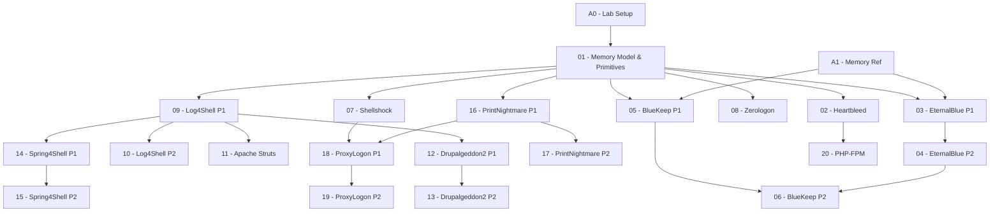

> **Topic**: Landmark CVEs — Deep Dive Security Series
> **Domain**: Security (Pwn / Web / Crypto hybrid)
> **Level**: Advanced
> **Background**: C memory model, Python, TCP/IP networking, Linux cơ bản
> **Tools**: Python + pwntools, Python + requests/scapy, GDB + pwndbg, Wireshark/tcpdump
> **Sources**: exploit-db, NVD, OWASP, PortSwigger, CheckPoint Research, worawit/MS17-010

---

## Cấu trúc Series

Series áp dụng mô hình **hybrid**: CVE đơn giản giữ 1 lesson dài; CVE phức tạp tách 2 lessons — bài 1 cover background & root cause, bài 2 cover exploit chain & PoC đầy đủ.

| # | Title | CVE(s) | Class | Cấu trúc | Khó |
|---|-------|--------|-------|----------|-----|
| 01 | Memory Model & Exploit Primitives | — | Foundation | 1 lesson | ★★★☆☆ |
| 02 | Heartbleed — Buffer Over-Read | CVE-2014-0160 | Memory | 1 lesson | ★★★☆☆ |
| 03 | EternalBlue Part 1 — SMB Protocol & Root Cause | CVE-2017-0144 | Memory | 2 lessons | ★★★★☆ |
| 04 | EternalBlue Part 2 — Kernel Pool Grooming & PoC | CVE-2017-0144 | Memory | | ★★★★★ |
| 05 | BlueKeep Part 1 — RDP Protocol & Use-After-Free | CVE-2019-0708 | Memory | 2 lessons | ★★★★☆ |
| 06 | BlueKeep Part 2 — Heap Spray & Exploit Chain | CVE-2019-0708 | Memory | | ★★★★★ |
| 07 | Shellshock — Bash Environment Injection | CVE-2014-6271 | Injection | 1 lesson | ★★★☆☆ |
| 08 | Zerologon — AES-CFB8 IV=0 Cryptographic Attack | CVE-2020-1472 | Crypto | 1 lesson | ★★★★☆ |
| 09 | Log4Shell Part 1 — JNDI/LDAP Chain & Root Cause | CVE-2021-44228 | Deserial/RCE | 2 lessons | ★★★★☆ |
| 10 | Log4Shell Part 2 — WAF Bypass & Full PoC | CVE-2021-44228 | Deserial/RCE | | ★★★★★ |
| 11 | Apache Struts — OGNL Expression Injection | CVE-2017-5638 | Injection | 1 lesson | ★★★☆☆ |
| 12 | Drupalgeddon2 Part 1 — Form API & Vulnerability Class | CVE-2018-7600 | Deserial/RCE | 2 lessons | ★★★★☆ |
| 13 | Drupalgeddon2 Part 2 — Exploit Chain & Bypass | CVE-2018-7600 | Deserial/RCE | | ★★★★☆ |
| 14 | Spring4Shell Part 1 — ClassLoader Theory & Root Cause | CVE-2022-22965 | Deserial/RCE | 2 lessons | ★★★★☆ |
| 15 | Spring4Shell Part 2 — Exploit & Webshell Delivery | CVE-2022-22965 | Deserial/RCE | | ★★★★☆ |
| 16 | PrintNightmare Part 1 — Spooler Architecture & LPE Theory | CVE-2021-34527 | Auth/LPE | 2 lessons | ★★★★☆ |
| 17 | PrintNightmare Part 2 — Exploit & Privilege Escalation PoC | CVE-2021-34527 | Auth/LPE | | ★★★★☆ |
| 18 | ProxyLogon Part 1 — SSRF & Auth Bypass Root Cause | CVE-2021-26855 | Auth/SSRF | 2 lessons | ★★★★★ |
| 19 | ProxyLogon Part 2 — Webshell Chain & APT Attribution | CVE-2021-26855 | Auth/SSRF | | ★★★★★ |
| 20 | PHP-FPM — Nginx Interaction Buffer Underflow | CVE-2019-11043 | Memory/Protocol | 1 lesson | ★★★★☆ |

## Appendices

| ID | Title | Liên quan | Nội dung |
|----|-------|-----------|----------|
| A0 | Lab Setup Guide | Tất cả | Docker targets, GDB-pwndbg, Metasploit, pwntools, Wireshark, môi trường lab an toàn |
| A1 | Memory Layout Deep Reference | 01–06, 20 | Linux process memory, glibc heap internals, Windows kernel pool anatomy, heap spray patterns |
| A2 | CVE Research Methodology | Tất cả | Đọc advisory, tìm PoC, reproduce trong lab, viết bug report chuyên nghiệp |

---

## Dependency Graph

---

## Session Plan

| Session | Files | Nội dung |
|---------|-------|---------|
| **1 — hiện tại** | index, roadmap, A0, 01, 02 | Foundation + Heartbleed |
| 2 | 03, 04 | EternalBlue P1 + P2 |
| 3 | 05, 06 | BlueKeep P1 + P2 |
| 4 | 07, 08, A1 | Shellshock + Zerologon + Memory ref |
| 5 | 09, 10 | Log4Shell P1 + P2 |
| 6 | 11, 12 | Struts + Drupalgeddon2 P1 |
| 7 | 13, 14 | Drupalgeddon2 P2 + Spring4Shell P1 |
| 8 | 15, 16 | Spring4Shell P2 + PrintNightmare P1 |
| 9 | 17, 18 | PrintNightmare P2 + ProxyLogon P1 |
| 10 | 19, 20, A2 | ProxyLogon P2 + PHP-FPM + Research ref |

---

## Progress Tracker

- [ ] [[00-roadmap|00. Roadmap]]
- [ ] [[a0-lab-setup|A0. Lab Setup Guide]]
- [ ] [[01-memory-model-exploit-primitives|01. Memory Model & Exploit Primitives]]
- [ ] [[02-heartbleed|02. Heartbleed — Buffer Over-Read]]
- [ ] [[03-eternalblue-smb-root-cause|03. EternalBlue Part 1 — SMB Protocol & Root Cause]]
- [ ] [[04-eternalblue-kernel-pool-exploit|04. EternalBlue Part 2 — Kernel Pool Grooming & PoC]]
- [ ] [[05-blueKeep-rdp-uaf-theory|05. BlueKeep Part 1 — RDP Protocol & Use-After-Free]]
- [ ] [[06-bluekeep-heap-spray-exploit|06. BlueKeep Part 2 — Heap Spray & Exploit Chain]]
- [ ] [[07-shellshock|07. Shellshock — Bash Environment Injection]]
- [ ] [[08-zerologon|08. Zerologon — AES-CFB8 IV=0]]
- [ ] [[09-log4shell-root-cause|09. Log4Shell Part 1 — JNDI/LDAP Chain & Root Cause]]
- [ ] [[10-log4shell-bypass-poc|10. Log4Shell Part 2 — WAF Bypass & Full PoC]]
- [ ] [[11-apache-struts-ognl|11. Apache Struts — OGNL Expression Injection]]
- [ ] [[12-drupalgeddon2-form-api|12. Drupalgeddon2 Part 1 — Form API & Vulnerability Class]]
- [ ] [[13-drupalgeddon2-exploit-chain|13. Drupalgeddon2 Part 2 — Exploit Chain & Bypass]]
- [ ] [[14-spring4shell-classloader|14. Spring4Shell Part 1 — ClassLoader Theory & Root Cause]]
- [ ] [[15-spring4shell-exploit|15. Spring4Shell Part 2 — Exploit & Webshell Delivery]]
- [ ] [[16-printnightmare-spooler-theory|16. PrintNightmare Part 1 — Spooler Architecture & LPE Theory]]
- [ ] [[17-printnightmare-exploit|17. PrintNightmare Part 2 — Exploit & Privilege Escalation PoC]]
- [ ] [[18-proxylogon-ssrf-auth-bypass|18. ProxyLogon Part 1 — SSRF & Auth Bypass Root Cause]]
- [ ] [[19-proxylogon-webshell-chain|19. ProxyLogon Part 2 — Webshell Chain & APT Attribution]]
- [ ] [[20-php-fpm-nginx-underflow|20. PHP-FPM — Nginx Interaction Buffer Underflow]]
- [ ] [[a1-memory-layout-reference|A1. Memory Layout Deep Reference]]
- [ ] [[a2-cve-research-methodology|A2. CVE Research Methodology]]
