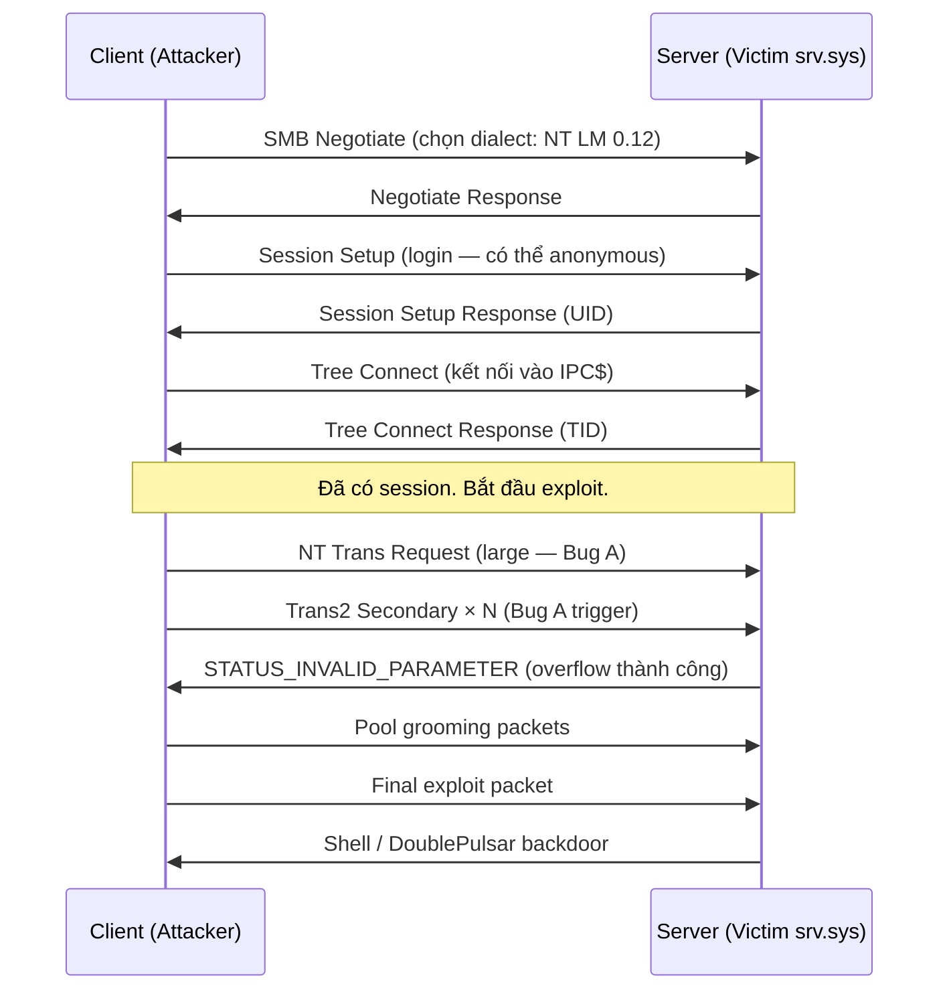
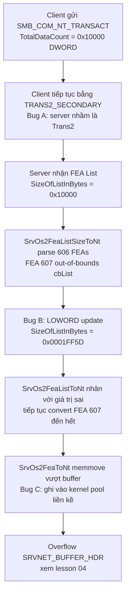

> **Prerequisites**: [[01-memory-model-exploit-primitives|01. Memory Model & Exploit Primitives]], kiến thức TCP/IP cơ bản, khái niệm integer overflow
> **Objectives**:
> - Hiểu kiến trúc SMBv1 và các loại transaction liên quan đến exploit
> - Phân tích ba bug (A, B, C) mà EternalBlue khai thác — đặt tên theo CheckPoint Research
> - Giải phẫu bug B: lỗi DWORD→WORD truncation trong `SrvOs2FeaListSizeToNt`
> - Hiểu cách ba bug chain lại để tạo ra điều kiện overflow kernel pool
> - Đọc được pseudo-code của `srv.sys` disassembly và nhận ra root cause
> - Hiểu tại sao WannaCry có thể worm — không cần user interaction, không cần auth

---

## Bối cảnh: NSA, Shadow Brokers, và Vụ Leak Thế kỷ

EternalBlue không phải lỗi được researcher tìm ra một cách bình thường. Đây là **vũ khí tấn công** do NSA (Cục An ninh Quốc gia Mỹ) phát triển trong nhiều năm, nằm trong bộ công cụ mật mang tên **FuzzBunch**. NSA đã biết về lỗ hổng này và giữ bí mật để tự dùng — thay vì báo cho Microsoft để vá.

Tháng 4 năm 2017, nhóm hacker ẩn danh **Shadow Brokers** leak toàn bộ FuzzBunch toolkit lên internet. Một tháng sau, WannaCry ransomware dùng EternalBlue để lây lan sang hơn 300.000 máy tính tại 150 quốc gia trong 24 giờ — gây thiệt hại ước tính 4–8 tỷ USD.

Điều đáng chú ý: Microsoft đã phát hành patch (MS17-010) vào ngày 14 tháng 3 năm 2017 — **một tháng trước** khi Shadow Brokers leak. Có thuyết cho rằng ai đó đã báo cho Microsoft ngay trước khi leak xảy ra. Tuy nhiên, hàng trăm nghìn tổ chức không kịp patch.

> [!definition] Definition 3.1 — CVE Family trong MS17-010
> MS17-010 là một security bulletin chứa **nhiều CVE**:
> - **CVE-2017-0144**: Buffer overflow trong `srv!SrvOs2FeaToNt` — đây là EternalBlue chính
> - **CVE-2017-0143**: EternalRomance — SMBv1 write-what-where primitive
> - **CVE-2017-0145**: EternalChampion — race condition trong transaction handling
> - **CVE-2017-0146**: EternalSynergy — variant của EternalRomance cho Windows 8+
> - **CVE-2017-0147**: Thông tin leak qua SMBv1 (dùng để bypass ASLR)
> - **CVE-2017-0148**: EternalRomance/Champion/Synergy trên Windows Vista+
>
> EternalBlue exploit **chain CVE-2017-0144 + CVE-2017-0147** để đạt RCE đáng tin cậy.

---

## SMBv1 Protocol Architecture

### Tổng quan SMB

SMB (Server Message Block) là giao thức tầng application cho phép chia sẻ file, printer, và IPC (Inter-Process Communication) trên mạng Windows. SMBv1 được thiết kế thập niên 1980 khi mạng LAN nhỏ, tin tưởng nhau hoàn toàn — không có encryption, không có integrity check thực sự.

Cấu trúc tổng quát một SMB packet:

```text
SMBv1 Packet:
┌─────────────────────────────────────────────────────┐
│ NetBIOS Session Service Header (4 bytes)            │
│   [0x00 | length (3 bytes)]                        │
├─────────────────────────────────────────────────────┤
│ SMB Header (32 bytes)                               │
│   Protocol: \xFFSMB                                │
│   Command: 1 byte (ví dụ 0x25 = SMB_COM_TRANSACTION2)│
│   Status: 4 bytes (NT Status code)                 │
│   Flags/Flags2: 3 bytes                            │
│   PID, UID, MID, TID: 2 bytes each                 │
├─────────────────────────────────────────────────────┤
│ Parameters (variable, command-specific)             │
├─────────────────────────────────────────────────────┤
│ Data / Payload (variable)                           │
└─────────────────────────────────────────────────────┘
```

Kết nối SMB điển hình:



### Hai loại Transaction liên quan

EternalBlue dùng hai loại SMB transaction có cấu trúc **gần giống nhau nhưng khác một trường quan trọng**:

**SMB_COM_TRANSACTION2 (0x25)**:

```text
Parameters:
  TotalParameterCount: WORD (2 bytes)
  TotalDataCount:      WORD (2 bytes)   ← tối đa 65535 bytes
  MaxParameterCount:   WORD
  MaxDataCount:        WORD
  ...
  SetupCount:          BYTE
  Setup[]:             WORD[]
```

**SMB_COM_NT_TRANSACT (0xA0)**:

```text
Parameters:
  TotalParameterCount: DWORD (4 bytes)
  TotalDataCount:      DWORD (4 bytes)  ← tối đa 4GB
  MaxParameterCount:   DWORD
  MaxDataCount:        DWORD
  ...
  Function:            WORD
  SetupCount:          BYTE
  Setup[]:             DWORD[]
```

Điểm mấu chốt: `TotalDataCount` trong Trans2 là **WORD** (16-bit, tối đa 65535), còn trong NT_TRANSACT là **DWORD** (32-bit, tối đa ~4GB). EternalBlue lợi dụng sự khác biệt này.

---

## Ba Bug của EternalBlue

CheckPoint Research đặt tên ba bug là A, B, C. Chúng chain lại theo thứ tự này:

```text
Bug A (Transaction Type Confusion)
    ↓ cho phép gửi TotalDataCount dạng DWORD > 65535
Bug B (DWORD→WORD Truncation trong SrvOs2FeaListSizeToNt)
    ↓ cấp phát buffer nhỏ hơn thực tế cần
Bug C (Out-of-Bounds Write trong SrvOs2FeaToNt)
    ↓ memmove ghi vượt buffer → overflow kernel pool
```

### Bug A — Transaction Type Confusion

**Nguyên lý**: SMBv1 cho phép gửi payload lớn bằng cách chia thành nhiều packet. Nếu data > MaxBufferSize, ta gửi packet "primary" trước, rồi tiếp tục bằng "_SECONDARY" packets.

```text
SMB_COM_NT_TRANSACT → có thể theo sau bằng SMB_COM_NT_TRANSACT_SECONDARY
SMB_COM_TRANSACTION2 → có thể theo sau bằng SMB_COM_TRANSACTION2_SECONDARY
```

**Bug**: `srv.sys` xác định loại transaction dựa trên **SMB Command của packet cuối cùng** nhận được, không phải packet đầu. Kẻ tấn công gửi:

```text
Packet 1: SMB_COM_NT_TRANSACT   (TotalDataCount = DWORD = ví dụ 0x10000 = 65536)
Packet 2: SMB_COM_TRANSACTION2_SECONDARY  ← type sai! nhưng srv.sys chấp nhận
Packet 3: SMB_COM_TRANSACTION2_SECONDARY
...
Packet N: SMB_COM_TRANSACTION2_SECONDARY  ← packet cuối
```

`srv.sys` nhìn thấy `TRANSACTION2_SECONDARY` ở packet cuối → kết luận toàn bộ là một Trans2 transaction. Nhưng `TotalDataCount` đã được set từ packet NT_TRANSACT đầu tiên với giá trị DWORD = **65536 bytes** — vượt qua giới hạn 65535 của Trans2.

> [!definition] Definition 3.2 — Bug A: Transaction Type Confusion
> `srv.sys` không kiểm tra tính nhất quán của SMB Command type giữa primary packet và secondary packets. Kẻ tấn công có thể khởi tạo transaction với `SMB_COM_NT_TRANSACT` (cho phép `TotalDataCount` là DWORD 32-bit) rồi tiếp tục bằng `SMB_COM_TRANSACTION2_SECONDARY`, khiến server chấp nhận payload lớn hơn 65535 bytes trong ngữ cảnh Trans2.

**Tại sao quan trọng**: Bug A là điều kiện cần để kích hoạt Bug B. Nếu không có Bug A, kẻ tấn công không thể gửi FEA list có `SizeOfListInBytes` vượt quá WORD limit, và Bug B không bao giờ trigger.

### Bug B — DWORD→WORD Truncation (Root Cause chính)

Đây là bug gây ra buffer overflow thực sự. Nó nằm trong hàm `SrvOs2FeaListSizeToNt` trong `srv.sys`.

**Bối cảnh: FEA List (File Extended Attributes)**

Khi client gửi Trans2 OPEN2 request, payload có thể chứa một **FEA List** — danh sách các extended attributes của file theo định dạng OS/2. Server phải chuyển đổi chúng sang định dạng NT. Cấu trúc:

```c
OS2_FEA_LIST:
┌─────────────────────────────────────────────────┐
│ SizeOfListInBytes: DWORD (4 bytes)              │  ← tổng kích thước list
├─────────────────────────────────────────────────┤
│ FEA[0]:                                         │
│   Flags:       BYTE                             │
│   NameLength:  BYTE                             │
│   ValueLength: WORD                             │
│   Name[]:      UCHAR[NameLength+1] (null-term)  │
│   Value[]:     UCHAR[ValueLength]               │
├─────────────────────────────────────────────────┤
│ FEA[1]: ...                                     │
│ ...                                             │
└─────────────────────────────────────────────────┘

NT_FEA (sau khi chuyển đổi):
┌─────────────────────────────────────────────────┐
│ NextEntryOffset: DWORD                          │  ← field này KHÔNG có trong OS2
│ Flags:           BYTE                           │
│ NameLength:      BYTE                           │
│ ValueLength:     WORD                           │
│ Name[]:          UCHAR[NameLength+1]            │
│ Value[]:         UCHAR[ValueLength]             │
│ Padding:         align to 4 bytes               │  ← cũng không có trong OS2
└─────────────────────────────────────────────────┘
```

Vì NT_FEA có thêm `NextEntryOffset` (4 bytes) và padding 4-byte alignment, nên **NT_FEA luôn lớn hơn OS2_FEA tương ứng**.

**Hàm `SrvOs2FeaListSizeToNt` — pseudo-code từ disassembly:**

```c
ULONG SrvOs2FeaListSizeToNt(PFEALIST Os2FeaList)
{
    ULONG   ntSize = sizeof(ULONG);   // bắt đầu với 4 bytes cho header NT list
    PFEA    fea    = Os2FeaList->List; // trỏ đến phần tử đầu tiên
    ULONG   cbList = Os2FeaList->SizeOfListInBytes - sizeof(ULONG); // tổng bytes còn lại

    while (cbList > 0)
    {
        ULONG feaSize = sizeof(FEA) + fea->cbName + 1 + fea->cbValue;

        if (feaSize > cbList)
        {
            /* FEA này vượt ra ngoài cbList — shrink và dừng */

            /* BUG Ở ĐÂY:
             * Os2FeaList->SizeOfListInBytes là DWORD (4 bytes).
             * Nhưng dòng sau chỉ cập nhật LOWORD (2 bytes thấp):
             *
             *     LOWORD(Os2FeaList->SizeOfListInBytes) -= (WORD)cbList;
             *
             * Đây là lỗi type cast: cbList (DWORD) bị ép thành WORD,
             * rồi chỉ ghi vào 2 bytes thấp của SizeOfListInBytes.
             * 2 bytes cao vẫn giữ nguyên giá trị cũ.
             */
            LOWORD(Os2FeaList->SizeOfListInBytes) -= (WORD)cbList;  // BUG
            break;
        }

        /* Tính size tương đương trong NT format (có thêm NextEntryOffset + padding) */
        ULONG ntFeaSize = sizeof(NT_FEA)
                        + ALIGN_UP_4(fea->cbName + 1 + fea->cbValue);
        ntSize += ntFeaSize;

        cbList -= feaSize;
        fea     = (PFEA)((PUCHAR)fea + feaSize);
    }

    return ntSize;  // ← size để malloc buffer cho NT list
}
```

**Cơ chế lỗi — Ví dụ số cụ thể:**

Giả sử `SizeOfListInBytes = 0x10000` (65536 bytes — chỉ gửi được nhờ Bug A).

Hàm duyệt qua các FEA records. Sau khi parse 606 records, giả sử offset hiện tại đã tiêu tốn `0xFF59` bytes. FEA thứ 607 có `feaSize = 0xAD` bytes.

```text
cbList = SizeOfListInBytes - sizeof(ULONG) - offset_so_far
       = 0x10000 - 4 - 0xFF59 = 0xA3 bytes còn lại trong cbList

feaSize = 0xAD   (FEA thứ 607)
feaSize (0xAD) > cbList (0xA3) → trigger shrink path
```text

Tính toán shrink bình thường:

```text
SizeOfListInBytes -= cbList
0x10000 - 0xA3 = 0xFF5D  ← đây là giá trị ĐÚNG mà hàm NÊN ghi
```text

Nhưng code dùng `LOWORD(SizeOfListInBytes) -= (WORD)cbList`:

```text
LOWORD(0x10000) = 0x0000
WORD(cbList)    = WORD(0xA3) = 0x00A3

0x0000 - 0x00A3 = 0xFF5D  (underflow mod 2^16 → kết quả đúng bằng số nhưng sai về ý nghĩa)

Nhưng HIWORD(SizeOfListInBytes) vẫn là 0x0001 (không thay đổi)!
→ SizeOfListInBytes sau shrink = 0x0001_FF5D
```text

Hàm trả về `ntSize` — kích thước buffer cần malloc để chứa NT list.

Cùng lúc đó, hàm `SrvOs2FeaListToNt` sẽ **thực sự parse** FEA list dựa trên `SizeOfListInBytes` giờ bằng `0x0001_FF5D` — một giá trị **cực lớn** so với buffer được malloc. Kết quả: `memmove` trong `SrvOs2FeaToNt` ghi vượt ra ngoài buffer.

> [!definition] Definition 3.3 — Bug B: DWORD→WORD Integer Truncation
> `SrvOs2FeaListSizeToNt` cập nhật `Os2FeaList->SizeOfListInBytes` (DWORD, 4 bytes) chỉ ở 2 bytes thấp (LOWORD). 2 bytes cao giữ nguyên giá trị ban đầu. Kết quả: `SizeOfListInBytes` sau shrink mang giá trị **lớn hơn nhiều** so với ý định, khiến bước chuyển đổi NT sau đó parse và copy nhiều bytes hơn buffer cho phép.
>
> **CWE**: CWE-197 (Numeric Truncation Error) → CWE-131 (Incorrect Calculation of Buffer Size) → CWE-122 (Heap-based Buffer Overflow).

### Bug C — Out-of-Bounds Write trong `SrvOs2FeaToNt`

Bug C là hệ quả trực tiếp của Bug B. Hàm `SrvOs2FeaListToNt` gọi `SrvOs2FeaToNt` để copy từng FEA record từ OS2 sang NT format. Nó loop cho đến khi đã copy đủ bytes theo `SizeOfListInBytes`.

Vì Bug B đã làm `SizeOfListInBytes` = `0x0001FF5D` thay vì `0xFF5D`, vòng loop sẽ tiếp tục copy **thêm `0x10000` bytes** (65536 bytes) sau khi đáng ra đã dừng. Phép copy này dùng `memmove`:

```c
void SrvOs2FeaToNt(PFILE_FULL_EA_INFORMATION NtFea, PFEA Os2Fea)
{
    NtFea->NextEntryOffset = 0;
    NtFea->Flags           = Os2Fea->fEA;
    NtFea->EaNameLength    = Os2Fea->cbName;
    NtFea->EaValueLength   = Os2Fea->cbValue;

    memmove(NtFea->EaName,
            Os2Fea->szName,
            Os2Fea->cbName + 1 + Os2Fea->cbValue);
}
```c

Vì NT buffer được malloc đúng kích thước cho 606 records (đủ để chứa phần hợp lệ), việc tiếp tục copy 607 record trở đi sẽ ghi ra ngoài buffer — vào **vùng nhớ kernel pool liền kề**.

> [!definition] Definition 3.4 — Bug C: Out-of-Bounds Write (Heap-based Buffer Overflow trong Kernel Pool)
> `SrvOs2FeaToNt` thực hiện `memmove` dựa trên số bytes còn lại theo `SizeOfListInBytes` — giá trị đã bị Bug B làm sai. Kết quả: ghi vượt ra ngoài buffer NT FEA vào vùng kernel pool liền kề. **Đây là primitive overflow thực sự.**

---

## Chuỗi Khai Thác — Từ Packet đến Overflow

Ghép lại ba bug, EternalBlue gây overflow theo luồng sau:



**Tóm tắt bằng số:**

| Bước | Giá trị | Ý nghĩa |
|------|---------|---------|
| FEA list gốc | `SizeOfListInBytes = 0x10000` | 65536 bytes — gửi được nhờ Bug A |
| Sau khi parse 606 FEAs | `cbList = 0xA3` còn lại | FEA 607 size `0xAD > 0xA3` |
| Bug B result | `SizeOfListInBytes = 0x0001FF5D` | Tăng thêm `0x10000` so với đúng |
| Buffer malloc cho NT | `ntSize ≈ 0x10FE8` | Đủ cho 606 FEAs hợp lệ |
| Bytes bị overflow | `≈ 0xB1 bytes` | Ghi vào kernel pool liền kề |

---

## SMBv1 Packet Capture — Nhận Dạng EternalBlue

Khi chạy exploit, Wireshark thấy pattern đặc trưng:

```text
Frame 1:  SMB Negotiate Request
Frame 2:  SMB Negotiate Response
Frame 3:  SMB Session Setup (Anonymous login)
Frame 4:  SMB Session Setup Response
Frame 5:  SMB Tree Connect (IPC$)
Frame 6:  SMB Tree Connect Response

Frame 7:  SMB NT Trans Request
          TotalDataCount: 0x10000  ← DWORD, vượt Trans2 limit

Frame 8:  SMB Trans2 Secondary Request   ← Bug A: type mismatch
Frame 9:  SMB Trans2 Secondary Request
...
Frame N:  SMB Trans2 Secondary Request   ← packet cuối với FEA list

Frame N+1: SMB Response: STATUS_INVALID_PARAMETER (0xC000000D)
           ← Đây là dấu hiệu overflow ĐÃ THÀNH CÔNG
           ← Server trả STATUS_INVALID_PARAMETER khi FEA conversion thất bại
```

Filter Wireshark cho EternalBlue:

```text
smb.cmd == 0xa0 || smb.cmd == 0x33
```

Dấu hiệu chẩn đoán:
- `SMB_COM_NT_TRANSACT` (0xA0) ngay sau session setup
- Theo sau bởi `SMB_COM_TRANSACTION2_SECONDARY` (0x33) — **type mismatch**
- Response `STATUS_INVALID_PARAMETER` sau packet cuối = overflow đã xảy ra

---

## Kiểm Tra Vulnerability

### Nmap script

```bash
nmap -p 445 --script smb-vuln-ms17-010 <target>
```

Output nếu vulnerable:

```text
Host script results:
| smb-vuln-ms17-010:
|   VULNERABLE:
|   Remote Code Execution vulnerability in Microsoft SMBv1 servers (ms17-010)
|     State: VULNERABLE
|     IDs:  CVE:CVE-2017-0143
|     Risk factor: HIGH
|     A critical remote code execution vulnerability exists in Microsoft SMBv1
|       servers (ms17-010).
|_    References: https://cve.mitre.org/cgi-bin/cvename.cgi?name=CVE-2017-0143
```

### Python check với impacket

```python
from impacket import smb, nmb
from impacket.smbconnection import SMBConnection
import sys

def check_ms17010(target):
    try:
        conn = SMBConnection(target, target, timeout=3)
        conn.login('', '')

        dialect = conn.getDialect()
        server_os = conn.getServerOS()
        server_name = conn.getServerName()

        print(f"[*] Target: {target}")
        print(f"[*] Server OS: {server_os}")
        print(f"[*] Server Name: {server_name}")
        print(f"[*] SMB Dialect: {dialect}")

        if dialect == smb.SMB_DIALECT:
            print("[*] SMBv1 detected — potential MS17-010 target")

            smb_conn = conn.getSMBServer()
            tid = smb_conn.tree_connect_andx(f'\\\\{target}\\IPC$')

            pkt = smb.NewSMBPacket()
            pkt['Flags1'] = smb.SMB.FLAGS1_PATHCASELESS
            pkt['Flags2'] = smb.SMB.FLAGS2_EXTENDED_SECURITY | smb.SMB.FLAGS2_NT_STATUS | smb.SMB.FLAGS2_LONG_NAMES
            pkt['TreeID'] = tid

            trans_params = b'\x00' * 4
            trans_data = b'\x00' * 4

            trans_cmd = smb.SMBCommand(smb.SMB.SMB_COM_TRANSACTION2)
            trans_cmd['Parameters'] = smb.SMBTransaction2_Parameters()
            trans_cmd['Parameters']['TotalParameterCount'] = len(trans_params)
            trans_cmd['Parameters']['TotalDataCount'] = len(trans_data)
            trans_cmd['Parameters']['MaxParameterCount'] = 0xFFFF
            trans_cmd['Parameters']['MaxDataCount'] = 0
            trans_cmd['Parameters']['MaxSetupCount'] = 0
            trans_cmd['Parameters']['Flags'] = 0
            trans_cmd['Parameters']['Timeout'] = 0xFFFFFFFF
            trans_cmd['Parameters']['ParameterCount'] = len(trans_params)
            trans_cmd['Parameters']['ParameterOffset'] = 66
            trans_cmd['Parameters']['DataCount'] = len(trans_data)
            trans_cmd['Parameters']['DataOffset'] = 70
            trans_cmd['Parameters']['SetupCount'] = 1
            trans_cmd['Parameters']['Setup'] = b'\x00\x0e'

            pkt.addCommand(trans_cmd)
            smb_conn.sendSMB(pkt)
            recv = smb_conn.recvSMB()

            nt_status = recv.getNTStatus()
            print(f"[*] NT Status: 0x{nt_status:08x}")

            if nt_status == 0xC0000205:
                print("[+] Response indicates MS17-010 is PRESENT (not patched)")
            elif nt_status == 0x00000000 or nt_status == 0xC0000022:
                print("[+] Response indicates MS17-010 is PATCHED")
            else:
                print(f"[?] Unexpected status — manual verification needed")
        else:
            print("[+] SMBv2/v3 detected — not vulnerable to EternalBlue directly")

        conn.logoff()

    except Exception as e:
        print(f"[-] Error: {e}")

if __name__ == '__main__':
    target = sys.argv[1] if len(sys.argv) > 1 else '192.168.1.100'
    check_ms17010(target)
```

---

## MS17-010 Patch Analysis

Microsoft patch thêm bounds checking trong `SrvOs2FeaListSizeToNt`. Thay vì:

```c
LOWORD(Os2FeaList->SizeOfListInBytes) -= (WORD)cbList;
```

Patch dùng phép trừ đúng type:

```c
Os2FeaList->SizeOfListInBytes -= cbList;   // DWORD -= DWORD, không truncate
```

Và thêm kiểm tra bổ sung trong `SrvOs2FeaListToNt`: validate rằng `SizeOfListInBytes` sau khi shrink không vượt quá kích thước ban đầu của packet.

Ngoài ra, patch cũng fix transaction type checking để ngăn Bug A — server bây giờ reject nếu primary transaction type và secondary type không khớp.

---

## Tại sao WannaCry Wormable?

EternalBlue cho phép **unauthenticated RCE** — không cần username, không cần password, chỉ cần port 445/TCP mở. WannaCry exploit điều này để:

1. Scan ngẫu nhiên internet và LAN tìm port 445 mở
2. Thử EternalBlue trên mọi host tìm được
3. Nếu thành công: inject DoublePulsar backdoor, rồi upload và chạy WannaCry payload
4. WannaCry từ máy mới bị lây nhiễm tiếp tục scan — **tự propagate**

Không cần phishing, không cần click email, không cần admin rights từ user. Chỉ cần kết nối mạng.

---

## Summary

- EternalBlue khai thác **ba bug chain** trong `srv.sys` của Windows SMBv1
- **Bug A** (Transaction Type Confusion): gửi NT_TRANSACT rồi tiếp tục bằng TRANS2_SECONDARY → bypass giới hạn 65535 bytes của Trans2, cho phép `TotalDataCount` = DWORD > 65535
- **Bug B** (DWORD→WORD Truncation trong `SrvOs2FeaListSizeToNt`): cập nhật `SizeOfListInBytes` chỉ ở 2 bytes thấp → giá trị kết quả lớn hơn `0x10000` bytes so với ý định
- **Bug C** (OOB Write trong `SrvOs2FeaToNt`): `memmove` dựa trên `SizeOfListInBytes` sai → ghi ~0xB1 bytes vào kernel pool liền kề
- Dấu hiệu exploit thành công: `STATUS_INVALID_PARAMETER` response sau Trans2 Secondary packet
- Patch: thay `LOWORD(x) -= (WORD)y` bằng `x -= y` đúng type + kiểm tra transaction type consistency
- WannaCry worm được vì exploit không cần auth và không cần user interaction

---

## References

- CheckPoint Research — "EternalBlue: Everything There Is To Know": https://research.checkpoint.com/2017/eternalblue-everything-know/
- Virus Bulletin — "EternalBlue: a prominent threat actor of 2017-2018": https://www.virusbulletin.com/virusbulletin/2018/06/eternalblue-prominent-threat-actor-20172018/
- worawit/MS17-010 GitHub (original Python PoC): https://github.com/worawit/MS17-010
- Mandiant/FireEye — "SMB Exploited: WannaCry Use of EternalBlue": https://cloud.google.com/blog/topics/threat-intelligence/smb-exploited-wannacry-use-of-eternalblue/
- h3xduck blog — EternalBlue Series (6 parts): https://h3xduck.github.io/vulns/2021/08/22/eternalblue-part6.html
- exploit-db #42031 (worawit Windows 7 PoC): https://www.exploit-db.com/exploits/42031
