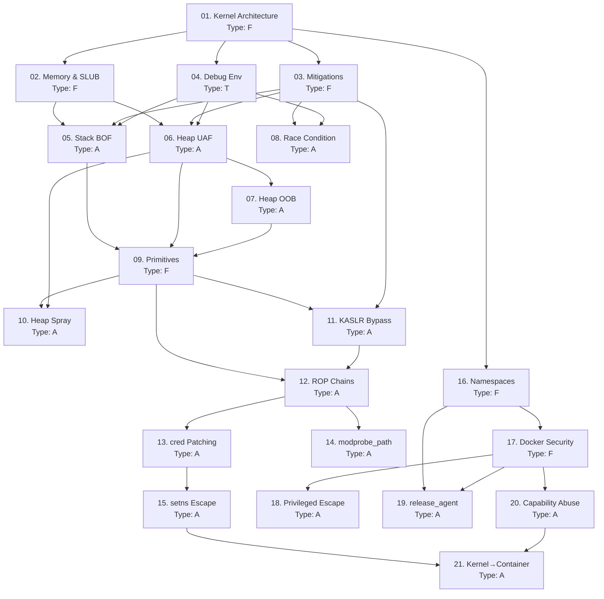

> **Course**: Linux Kernel Exploitation & Container Escape
> **Scope**: Toàn bộ attack chain — từ kernel internals, viết exploit kernel, đến container escape (Docker, LXC) và landmark CVEs
> **Depth**: Advanced — hiểu kernel internals sâu, tự viết exploit
> **Lab**: HackTheBox (HTB) + Local VMs (QEMU/KVM/Docker)
> **Estimated sessions**: 3 sessions × ~8 lessons
>
---

## SVG Assets Plan

| SVG File | Lesson | Mô tả | Priority |
|----------|--------|-------|---------|
| `assets/img-01-kernel-arch.svg` | [[01-kernel-architecture\|01. Kernel Architecture]] | Ring model, syscall path, kernel/user boundary | H |
| `assets/img-02-slub-allocator.svg` | [[02-kernel-memory-management\|02. Kernel Memory]] | SLUB slab layout, kmalloc cache structure | H |
| `assets/img-03-mitigations-map.svg` | [[03-kernel-security-mitigations\|03. Mitigations]] | KASLR / SMEP / SMAP / KPTI — map kỹ thuật bypass | H |
| `assets/img-06-uaf-mechanism.svg` | [[06-heap-uaf-double-free\|06. Heap UAF]] | UAF dangling pointer + heap spray timeline | H |
| `assets/img-10-heap-spray-objects.svg` | [[10-heap-spray-objects\|10. Heap Spray Objects]] | tty_struct / msg_msg / pipe_buffer layout | H |
| `assets/img-12-rop-kpti-trampoline.svg` | [[12-rop-chains-kernel\|12. ROP Chains]] | Stack pivot → ROP chain → KPTI trampoline flow | H |
| `assets/img-16-namespaces-cgroups.svg` | [[16-namespaces-cgroups\|16. Namespaces & cgroups]] | Linux namespace isolation layers | H |
| `assets/img-17-docker-security-arch.svg` | [[17-docker-lxc-security\|17. Docker & LXC Security]] | Docker security stack: capabilities, seccomp, AppArmor | H |

**Priority**: H = Cần thiết cho hiểu cơ chế · M = Tăng clarity · L = Nice-to-have

---

## Lesson Map

| # | Tên Lesson | Type | Phụ thuộc | Part |
|---|-----------|------|----------|------|
| 01 | [[01-kernel-architecture\|01. Kernel Architecture & Attack Surface]] | F | — | Part 1 |
| 02 | [[02-kernel-memory-management\|02. Kernel Memory Management & SLUB]] | F | 01 | Part 1 |
| 03 | [[03-kernel-security-mitigations\|03. Kernel Security Mitigations]] | F | 01, 02 | Part 1 |
| 04 | [[04-kernel-debug-environment\|04. Kernel Debug Environment]] | T | 01 | Part 1 |
| 05 | [[05-stack-bof-kernel\|05. Stack Buffer Overflow in Kernel Modules]] | A | 02, 03, 04 | Part 2 |
| 06 | [[06-heap-uaf-double-free\|06. Heap UAF & Double Free]] | A | 02, 03, 04 | Part 2 |
| 07 | [[07-heap-oob-read-write\|07. Heap OOB Read/Write]] | A | 02, 06 | Part 2 |
| 08 | [[08-race-condition-toctou\|08. Race Condition & TOCTOU]] | A | 03, 04 | Part 2 |
| 09 | [[09-exploit-primitives\|09. Exploit Primitives — AAR/AAW & RIP Control]] | F | 05, 06, 07 | Part 3 |
| 10 | [[10-heap-spray-objects\|10. Heap Spray Objects]] | A | 02, 06, 09 | Part 3 |
| 11 | [[11-kaslr-bypass\|11. KASLR Bypass & Kernel Address Leaks]] | A | 03, 09 | Part 3 |
| 12 | [[12-rop-chains-kernel\|12. ROP Chains in Kernel]] | A | 09, 11 | Part 3 |
| 13 | [[13-struct-cred-patching\|13. PrivEsc via struct cred Patching]] | A | 09, 12 | Part 4 |
| 14 | [[14-modprobe-path-overwrite\|14. modprobe_path Overwrite]] | A | 09, 12 | Part 4 |
| 15 | [[15-namespace-escape-setns\|15. Namespace Escape via setns()]] | A | 13, 14 | Part 4 |
| 16 | [[16-namespaces-cgroups\|16. Linux Namespaces & cgroups Deep Dive]] | F | 01 | Part 5 |
| 17 | [[17-docker-lxc-security\|17. Docker & LXC Security Architecture]] | F | 16 | Part 5 |
| 18 | [[18-privileged-container-escape\|18. Privileged Container & Docker Socket Escape]] | A | 17 | Part 5 |
| 19 | [[19-cgroup-release-agent-escape\|19. cgroup release_agent Container Escape]] | A | 16, 17 | Part 5 |
| 20 | [[20-capability-abuse-escape\|20. Capability Abuse — CAP_SYS_ADMIN, eBPF]] | A | 17, 19 | Part 5 |
| 21 | [[21-kernel-exploit-container-escape\|21. Kernel Exploit Container Escape via nsenter]] | A | 15, 20 | Part 5 |
| 22 | [[22-dirty-cow\|22. Dirty COW — CVE-2016-5195]] | A | 08 | Part 6 |
| 23 | [[23-gameoverlay-overlayfs\|23. GameOver(lay) — CVE-2023-2640/CVE-2023-32629]] | A | 03 | Part 6 |
| 24 | [[24-runc-cve-2024-21626\|24. runc Container Escape — CVE-2024-21626]] | A | 17 | Part 6 |
| 25 | [[25-io-uring-uaf\|25. io_uring UAF — CVE-2024-0582]] | A | 06, 09 | Part 6 |
| FM | [[fm-field-manual\|Field Manual]] | Ref | Tích lũy | — |

**Type legend**: F = Foundation · A = Attack · T = Tool

---

## Dependency Graph

---

## Phase Breakdown

### Part 1 — Kernel Internals & Lab Setup (Lessons 01–04)
**Mục tiêu**: Xây dựng mental model về kernel — memory layout, mitigations, debug workflow  
**Lab**: Local QEMU VM — không cần remote machine

### Part 2 — Kernel Vulnerability Classes (Lessons 05–08)
**Mục tiêu**: Hiểu từng vulnerability class, viết PoC exploit đầu tiên  
**Lab**: pawnyable.cafe VMs (Holstein v1–v4), Local QEMU

### Part 3 — Exploit Primitives & Bypass (Lessons 09–12)
**Mục tiêu**: Build exploit primitives, bypass KASLR, construct ROP chains  
**Lab**: pawnyable.cafe, HTB Hospital (CVE-2023-35001)

### Part 4 — Post-Exploitation (Lessons 13–15)
**Mục tiêu**: Escalate từ arbitrary write đến root shell  
**Lab**: HTB Hospital, Local kernel module challenges

### Part 5 — Container Escape (Lessons 16–21)
**Mục tiêu**: Escape từ Docker/LXC container lên host  
**Lab**: HTB Carpediem (CVE-2022-0492), HTB Giveback (runc), Local Docker lab

### Part 6 — Landmark CVEs (Lessons 22–25)
**Mục tiêu**: Phân tích và reproduce real-world CVEs  
**Lab**: HTB Hospital (GameOverlay), Local vulnerable kernels

---

## Progress Tracker

- [ ] 01. Kernel Architecture & Attack Surface
- [ ] 02. Kernel Memory Management & SLUB
- [ ] 03. Kernel Security Mitigations
- [ ] 04. Kernel Debug Environment
- [ ] 05. Stack Buffer Overflow in Kernel Modules
- [ ] 06. Heap UAF & Double Free
- [ ] 07. Heap OOB Read/Write
- [ ] 08. Race Condition & TOCTOU
- [ ] 09. Exploit Primitives — AAR/AAW & RIP Control
- [ ] 10. Heap Spray Objects
- [ ] 11. KASLR Bypass & Kernel Address Leaks
- [ ] 12. ROP Chains in Kernel
- [ ] 13. PrivEsc via struct cred Patching
- [ ] 14. modprobe_path Overwrite
- [ ] 15. Namespace Escape via setns()
- [ ] 16. Linux Namespaces & cgroups Deep Dive
- [ ] 17. Docker & LXC Security Architecture
- [ ] 18. Privileged Container & Docker Socket Escape
- [ ] 19. cgroup release_agent Container Escape
- [ ] 20. Capability Abuse
- [ ] 21. Kernel Exploit Container Escape
- [ ] 22. Dirty COW — CVE-2016-5195
- [ ] 23. GameOver(lay) — CVE-2023-2640/32629
- [ ] 24. runc Escape — CVE-2024-21626
- [ ] 25. io_uring UAF — CVE-2024-0582
- [ ] Field Manual complete

---

## Appendices

| File | Nội dung |
|------|---------|
| [[fm-field-manual\|Field Manual]] | Tài liệu tra cứu thực chiến — tích lũy từ tất cả lessons |
