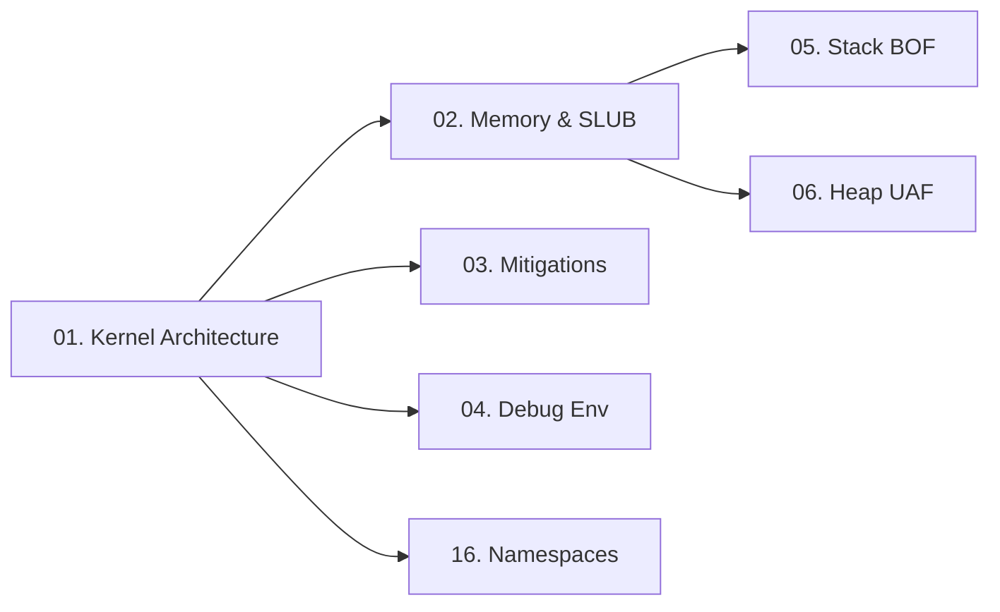

> **Prerequisites**: Kiến thức cơ bản về C, Linux userspace, hệ điều hành
> **Objectives**:
> - Nắm vững mô hình ring privilege và ranh giới kernel/user
> - Hiểu syscall interface là gì và tại sao nó là attack surface chính
> - Xác định các thành phần kernel là điểm vào của attacker
> - Chuẩn bị mental model trước khi học exploit techniques
>
---

## Động lực

Kernel exploitation là đỉnh cao của privilege escalation. Khi khai thác thành công một lỗ hổng trong kernel, attacker nhảy thẳng vào Ring 0 — không có sandbox nào, không có permission check nào cản lại. Từ đó có thể: vô hiệu hóa mọi kiểm tra bảo mật, thoát khỏi container, patch credential của process, hoặc cài rootkit permanent.

Để viết kernel exploit, phải hiểu **kernel nghĩ gì** — nó quản lý memory như thế nào, nó tin tưởng ai, và ranh giới giữa "safe" và "unsafe" nằm ở đâu.

---

## Kiến trúc & Cơ chế

### Mô hình Ring Privilege (CPU Protection Rings)

![[img-01-kernel-arch.svg]]
*Hình 1: Linux privilege rings — user space (Ring 3) và kernel space (Ring 0) với syscall boundary*

CPU x86-64 chia quyền thực thi thành 4 ring. Linux chỉ dùng 2:

| Ring | Tên | Quyền | Ai chạy ở đây |
|------|-----|-------|---------------|
| **Ring 0** | Kernel Mode | Toàn quyền — đọc/ghi mọi memory, execute privileged instructions | Kernel, drivers, kernel modules |
| **Ring 3** | User Mode | Bị hạn chế — không thể trực tiếp access hardware hay kernel memory | Tất cả userspace processes |

> [!info] Tại sao separation này quan trọng?
> Process của user không thể đọc memory của process khác, không thể thay đổi page tables, không thể disable interrupts. Nếu attacker phá vỡ được ranh giới này → full system compromise.
>
### Syscall Interface — Cửa vào Kernel

Userspace program không thể gọi kernel functions trực tiếp. Thay vào đó, nó dùng **syscall instruction** (x86-64: `syscall` opcode) để yêu cầu kernel thực hiện hành động thay mình.

Luồng syscall:

```text
User App (Ring 3)
    │
    │  glibc wrapper (ví dụ: read(), write(), open())
    │       │
    │       │  mov rax, <syscall_number>
    │       │  mov rdi, arg1
    │       │  mov rsi, arg2
    │       │  syscall           ← CPU trap vào Ring 0
    │
    ▼
Kernel (Ring 0)
    │
    │  sys_call_table[rax] → kernel function handler
    │  ví dụ: sys_read() → copy data từ file descriptor về userspace buffer
    │
    │  iretq                 ← trở về Ring 3
    ▼
User App tiếp tục
```

> [!warning] Điểm yếu then chốt — syscall parameter validation
> Kernel nhận parameters từ user (pointers, sizes, flags). Nếu validation yếu hoặc sai, attacker có thể:
> - Cung cấp kernel pointer thay vì user pointer → arbitrary kernel read/write
> - Cung cấp size lớn hơn buffer → overflow kernel heap/stack
> - Race condition trong quá trình validate → TOCTOU
>
### Cấu trúc Kernel — Các thành phần chính

```text
┌─────────────────────────────────────────────────────┐
│                  Linux Kernel                        │
│                                                      │
│  ┌──────────────┐  ┌──────────────┐                 │
│  │ Process Mgmt │  │ Memory Mgmt  │                 │
│  │ scheduler    │  │ page tables  │                 │
│  │ task_struct  │  │ vmalloc/kmalloc│               │
│  └──────────────┘  └──────────────┘                 │
│                                                      │
│  ┌──────────────┐  ┌──────────────┐                 │
│  │ VFS Layer    │  │ Network Stack│                 │
│  │ ext4, tmpfs  │  │ TCP/IP, sock │                 │
│  └──────────────┘  └──────────────┘                 │
│                                                      │
│  ┌──────────────────────────────────────┐           │
│  │  Loadable Kernel Modules (LKM)       │           │
│  │  drivers, filesystems, security mods │           │
│  └──────────────────────────────────────┘           │
└─────────────────────────────────────────────────────┘
```

**Kernel modules** (LKM — Loadable Kernel Modules) là attack surface đặc biệt nguy hiểm vì:
- Chạy trực tiếp trong Ring 0
- Có thể được load bởi user có đủ privilege
- CTF challenges và nhiều CVEs liên quan đến bugs trong custom kernel modules

### Cấu trúc dữ liệu quan trọng

| Struct | Ý nghĩa | Tại sao attacker quan tâm |
|--------|---------|--------------------------|
| `task_struct` | Đại diện một process/thread trong kernel | Chứa `cred` pointer → patch để leo quyền |
| `cred` | Credential của process (UID, GID, capabilities) | Overwrite thành root creds → privilege escalation |
| `file` | Đại diện open file descriptor | Có function pointers → giả mạo để control RIP |
| `tty_struct` | Terminal device structure | Classic heap spray target — có `ops` vtable pointer |
| `sk_buff` | Network packet buffer | Heap spray với controlled data |

---

## Góc nhìn kẻ tấn công

### Các bề mặt tấn công chính

```text
Attack Surface Hierarchy:
─────────────────────────────────────────────
1. Syscall interface          ← WIDE — hàng trăm syscalls, nhiều validation bugs
2. Kernel modules / drivers   ← COMMON — CTF, embedded devices, custom drivers
3. Filesystem code            ← e.g., OverlayFS bugs (GameOverlay CVE)
4. Network subsystem          ← e.g., io_uring, TCP stack bugs
5. Kernel helper daemons      ← runc, containerd — container escape path
─────────────────────────────────────────────
```

### Exploit Goal trong Kernel Context

Hầu hết kernel exploits đều nhắm đến một trong ba mục tiêu:

1. **Privilege escalation** — Thay đổi `cred` struct của process → trở thành root (uid=0)
2. **Container escape** — Thay đổi namespace của process → nhảy sang host namespace
3. **Code execution** — Redirect RIP sang shellcode/ROP chain → thực thi arbitrary kernel code

---

## Pentest Checklist

Khi tiếp cận một target có khả năng kernel exploit:

```bash
□ Xác định kernel version: uname -r
□ Xác định distribution và kernel config: cat /proc/version, cat /boot/config-$(uname -r)
□ Kiểm tra loaded modules: lsmod | head -20
□ Kiểm tra /dev entries lạ — dấu hiệu custom driver: ls /dev/
□ Kiểm tra kernel compile flags (mitigations): grep -E "SMEP|SMAP|KASLR" /boot/config-$(uname -r)
□ Kiểm tra ASLR status: cat /proc/sys/kernel/randomize_va_space
□ Tìm CVEs cho kernel version: searchsploit linux kernel <version>
□ Kiểm tra có thể load module không: cat /proc/sys/kernel/modules_disabled
```

---

## Kết nối

Lesson này là foundation cho toàn bộ series:


