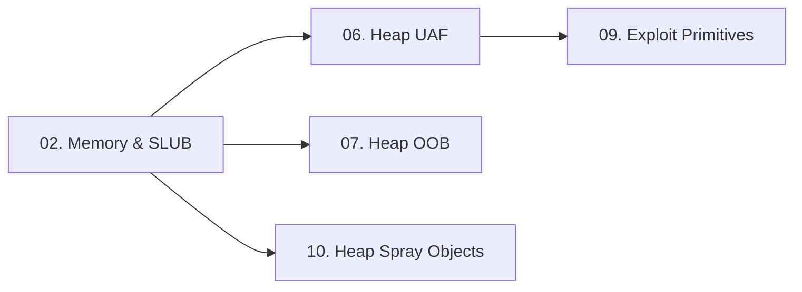

> **Prerequisites**: [[01-kernel-architecture|01. Kernel Architecture & Attack Surface]]
> **Objectives**:
> - Hiểu kernel virtual address space layout (KVAS)
> - Nắm vững SLUB allocator — cách kernel quản lý heap
> - Biết tại sao `kmalloc-N` caches là mục tiêu của heap exploitation
> - Phân biệt GFP flags và ảnh hưởng đến exploit strategy
>
---

## Động lực

Phần lớn kernel vulnerability liên quan đến memory corruption trên kernel heap. Để exploit được, attacker cần biết: object được allocate vào cache nào, cache đó có những object nào khác, và làm thế nào để đặt controlled data vào đúng vị trí. Không hiểu SLUB = không thể heap spray, không thể UAF, không thể cross-cache attack.

---

## Kiến trúc & Cơ chế

### Kernel Virtual Address Space (x86-64)

Trên hệ thống 64-bit, không gian địa chỉ kernel có dạng:

```text
Virtual Address Space (x86-64, 128TB per half)
──────────────────────────────────────────────────────────
0xffff888000000000  direct mapping of all physical memory
                    (physmap — toàn bộ RAM được map ở đây)

0xffffc90000000000  vmalloc() area — virtual contiguous alloc
                    (không đảm bảo physically contiguous)

0xffffffffc0000000  kernel modules (loadable)

0xffffffff80000000  kernel text (.text, .data, .rodata)
──────────────────────────────────────────────────────────
```

> [!info] Physmap — vũ khí của attacker
> Direct mapping tại `0xffff888000000000` nghĩa là: với bất kỳ vật lý address `PA`, kernel có virtual address `0xffff888000000000 + PA`. Attacker với KASLR bypass có thể tính vị trí của mọi kernel object từ physical address.
>
### SLUB Allocator — Kernel Heap

Linux dùng **SLUB** (Simplified Slab) làm allocator mặc định cho kernel heap. SLUB tổ chức memory theo **caches** — mỗi cache phục vụ objects cùng kích thước.

![[img-02-slub-allocator.svg]]
*Hình 2: SLUB allocator — kmem_cache chứa slab pages, mỗi slab page chứa nhiều objects cùng size*

**Hai loại cache:**

**1. Generic caches — `kmalloc-N`**

```c
// Kernel code: allocate 96 bytes
void *ptr = kmalloc(96, GFP_KERNEL);
// → Đi vào kmalloc-96 cache
```

| Cache name | Object size | Ví dụ object dùng cache này |
|-----------|-------------|----------------------------|
| kmalloc-32 | 32 bytes | iovec, các struct nhỏ |
| kmalloc-64 | 64 bytes | file_lock, nsproxy |
| kmalloc-96 | 96 bytes | virtio_vsock_sock, msg_msg nhỏ |
| kmalloc-128 | 128 bytes | dentry, nhiều syscall data |
| kmalloc-192 | 192 bytes | sock struct (nhỏ) |
| kmalloc-256 | 256 bytes | various |
| kmalloc-512 | 512 bytes | various |
| kmalloc-1024 | 1024 bytes | pipe_buffer |
| kmalloc-2048 | 2048 bytes | sk_buff |
| kmalloc-4096 | 4096 bytes | page-size allocs |

**2. Dedicated caches** — cho objects có kích thước cố định, được dùng nhiều:

```c
tty_struct        ~ 1152 bytes  (dedicated cache)
task_struct       ~ 9920 bytes  (dedicated cache)
cred              ~ 192 bytes   (dedicated cache)
```

### Cách SLUB alloc/free hoạt động

**Allocation (`kmalloc`):**

```text
1. Tìm kmem_cache phù hợp với size
2. Lấy object từ per-CPU freelist (FAST PATH — lock-free)
   ↳ Nếu freelist rỗng → lấy slab page mới từ buddy allocator
3. Return pointer đến object
```

**Freeing (`kfree`):**

```text
1. Xác định slab page chứa ptr (từ page struct)
2. Đưa object vào per-CPU freelist
   ↳ Nếu slab hoàn toàn free → return slab về buddy allocator
```

> [!warning] Per-CPU cache — ảnh hưởng đến exploit reliability
> SLUB dùng per-CPU freelists để tránh lock contention. Object được free trên CPU-A sẽ nằm trong freelist của CPU-A. Nếu allocation xảy ra trên CPU-B khác, sẽ không lấy được object đó. **Giải pháp**: Pin thread lên một CPU bằng `sched_setaffinity()` trước khi spray.
>
### GFP Flags — Ảnh hưởng đến cache

GFP (Get Free Pages) flags xác định loại allocation và cache sẽ dùng:

| Flag | Ý nghĩa | Cache | Attacker có thể dùng? |
|------|---------|-------|----------------------|
| `GFP_KERNEL` | Normal kernel alloc, có thể sleep | `kmalloc-N` | **Có** — qua nhiều syscalls |
| `GFP_KERNEL_ACCOUNT` | Accountable to process (cgroups) | `kmalloc-cg-N` (riêng biệt) | **Có** — nhưng cần ACCOUNT path |
| `GFP_ATOMIC` | Interrupt context, không sleep | `kmalloc-N` | **Không** — chỉ từ interrupt |
| `GFP_USER` | User-initiated alloc | Tương tự KERNEL | **Có** |

> [!warning] CONFIG_RANDOM_KMALLOC_CACHES (Linux 6.1+)
> Trên kernel mới, `GFP_KERNEL` không còn đi thẳng vào một cache duy nhất — kernel tạo nhiều bản sao của mỗi cache và random chọn. Điều này làm spray kém tin cậy hơn. Giải pháp: dùng objects với `GFP_KERNEL_ACCOUNT` (chỉ có một cache), hoặc dùng cross-cache attack.
>
### Hardening mới — CONFIG_SLAB_BUCKETS (Ubuntu 22.04+)

```text
CONFIG_SLAB_BUCKETS=y → tách riêng cache cho
  allocations có user-controlled data (via copy_from_user)
  vs allocations hoàn toàn từ kernel code
```

Ảnh hưởng: Không thể spray `tty_struct` vào cùng cache với user-controlled buffer như trước. Cần cross-cache techniques.

---

## Góc nhìn kẻ tấn công

### Exploit Workflow dựa trên SLUB

```text
Bước 1: Xác định size của vulnerable object
          → kmalloc(N, flags) → cache nào?

Bước 2: Tìm spray objects cùng size và cùng cache
          → Cần cùng GFP flags, cùng size class

Bước 3: Heap grooming
          → Massage heap để đưa spray object
            vào vị trí liền kề hoặc sau vulnerable object

Bước 4: Trigger vulnerability
          → Corrupt spray object hoặc
            chiếm slot của freed object

Bước 5: Abuse corrupted object
          → Fake vtable, AAR/AAW primitives, RIP control
```

### Phân tích cache target phổ biến

```c
// msg_msg — user-controlled data, GFP_KERNEL
// Size: min 48 bytes header + variable body
// Tạo bằng: msgsnd(msqid, &msg, size, 0)
// Dùng để: KASLR leak (list pointers), controlled data spray

// pipe_buffer — GFP_KERNEL, 1024 bytes
// Tạo bằng: pipe(fds) → write(fds[1], data, size)
// Dùng để: page pointer manipulation, controlled data

// tty_struct — dedicated cache, ~1152 bytes
// Tạo bằng: open("/dev/ptmx", O_RDWR)
// Dùng để: function pointer (ops vtable) → RIP control
```

---

## Pentest Checklist

```bash
□ Xác định kernel version và SLUB config:
    cat /boot/config-$(uname -r) | grep -E "SLUB|SLAB_BUCKET|RANDOM_KMALLOC"
□ Kiểm tra object size của vulnerable struct (đọc kernel source)
□ Tìm spray candidates cùng size trên exploit-db, pawnyable.cafe
□ Xác định GFP flags của vulnerable alloc (GFP_KERNEL vs ACCOUNT)
□ Kiểm tra kernel version có CONFIG_RANDOM_KMALLOC_CACHES không (>= 6.1)
```

---

## Kết nối


