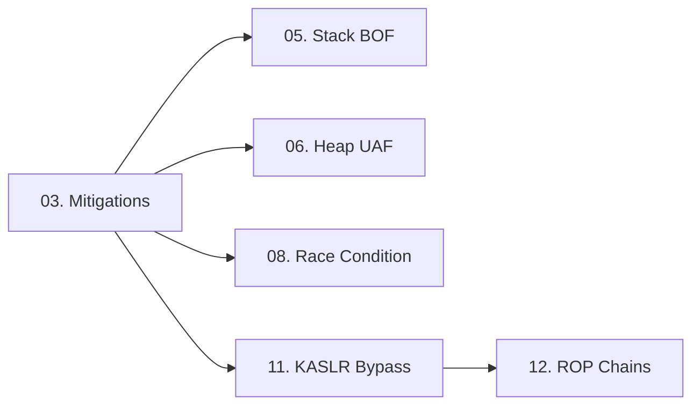

> **Prerequisites**: [[01-kernel-architecture|01. Kernel Architecture]] · [[02-kernel-memory-management|02. Kernel Memory Management]]
> **Objectives**:
> - Nắm rõ từng mitigation, cơ chế hoạt động, và điều kiện bypass
> - Hiểu cách kiểm tra mitigation status trên target
> - Biết kết hợp nhiều bypass techniques khi gặp full-mitigations kernel
>
---

## Động lực

Kernel exploit hiện đại phải đối mặt với 5–6 lớp phòng thủ đồng thời. Viết exploit thành công đòi hỏi biết chính xác: mitigation nào đang active, bypass nào khả thi, và thứ tự nào phải vượt qua trước. Lesson này là bản đồ chiến trường.

---

## Kiến trúc & Cơ chế

![[img-03-mitigations-map.svg]]
*Hình 3: Kernel mitigations — từng lớp bảo vệ, điều gì nó chặn, và kỹ thuật bypass tương ứng*

### KASLR — Kernel Address Space Layout Randomization

**Cơ chế**: Khi boot, kernel được load vào địa chỉ ngẫu nhiên. Base thay đổi mỗi lần boot.

```text
Without KASLR:     kernel _text luôn tại 0xffffffff81000000
With KASLR:        kernel _text tại 0xffffffff81000000 + random_offset
                   random_offset ~ 1GB range, aligned 2MB
                   Ví dụ: 0xffffffff98400000 (sau một lần boot)
                          0xffffffff82c00000 (sau lần boot khác)
```

**Kiểm tra**:

```bash
# Kiểm tra KASLR có bật không
grep CONFIG_RANDOMIZE_BASE /boot/config-$(uname -r)
# CONFIG_RANDOMIZE_BASE=y  → KASLR on

# Nếu có đặc quyền (root/dmesg):
dmesg | grep "KASLR"
# Hoặc đọc /proc/kallsyms (cần privileges)
sudo cat /proc/kallsyms | grep " T _text"
# → ffffffff98400000 T _text  (với random base)
```

**Tại sao bypass được**:
- Nhiều kernel objects lưu pointers đến nhau → leak một địa chỉ = tính được base
- `msg_msg.list.next` và `.prev` trỏ đến vùng kernel heap → leak physmap offset
- `/proc/kallsyms` readable với một số config
- Side-channel attacks (ít phổ biến trong CTF)

### SMEP — Supervisor Mode Execution Prevention

**Cơ chế**: CPU feature (bit 20 trong CR4 register). Khi set, CPU sẽ raise fault nếu kernel cố execute code tại user-space pages (page có `U/S` bit set).

```text
CR4 register:
 bit 20 = 1  → SMEP enabled
 bit 20 = 0  → SMEP disabled (cần CAP_SYS_RAWIO hoặc exploit)
```

**Classic attack nó chặn — ret2usr**:

```c
// TRƯỚC KHI CÓ SMEP:
// 1. Đặt shellcode vào userspace buffer
char shellcode[] = "\x48\xc7\xc7\x00\x00\x00\x00"  // mov rdi, 0
                   "\xff\xd0";                         // call rax (prepare_kernel_cred)
// 2. Overwrite kernel return address → nhảy vào userspace shellcode
// → SMEP block → Page Fault → kernel panic
```

**Bypass**: Chỉ dùng ROP gadgets nằm trong kernel text. Không cần execute userspace code.

### SMAP — Supervisor Mode Access Prevention

**Cơ chế**: CPU feature (bit 21 trong CR4). Khi set, kernel không thể đọc/ghi user-space memory trừ khi dùng `copy_from_user()` / `copy_to_user()` (các hàm này tạm thời clear SMAP bằng `stac`/`clac` instructions).

**Tại sao quan trọng với exploit**:
- Nếu attacker fake một struct ở userspace và trick kernel dereference pointer đến đó → SMAP fault
- Buộc attacker phải spray fake objects vào **kernel heap**, không phải userspace

**Bypass**: Spray controlled data vào kernel heap thông qua syscalls như `msgsnd()`, `write()` trên pipes, `sendmsg()`.

### KPTI — Kernel Page Table Isolation

**Cơ chế**: Mỗi process có hai page tables: một cho userspace code và một cho kernel code. Khi CPU ở user mode, kernel text **không được map** → Spectre/Meltdown protection. Khi switch sang kernel mode (syscall/interrupt), CPU switch CR3 sang kernel page table.

**Ảnh hưởng đến exploit**: Sau khi ROP chain hoàn tất trong kernel, cần return về userspace. Lệnh `iretq` đơn giản sẽ crash vì page table chưa được swap lại.

**Bypass — KPTI Trampoline**:

```c
// Trong kernel, có sẵn một gadget đặc biệt:
// swapgs_restore_regs_and_return_to_usermode

// Tìm địa chỉ:
// objdump -d vmlinux | grep -A5 "swapgs_restore"

// Dùng trong ROP chain:
// Thay vì: ... → iretq
// Dùng:    ... → swapgs_restore_regs_and_return_to_usermode + 22
//                (offset +22 để skip initial register pops)

// Stack layout cho trampoline:
// [trampoline_addr + 22]
// [0]               ← padding
// [0]               ← padding
// [user_rip]        ← địa chỉ về userspace sau exploit
// [user_cs]         ← saved CS
// [user_rflags]     ← saved RFLAGS
// [user_rsp]        ← saved RSP
// [user_ss]         ← saved SS
```

### Stack Canary (SSP — Stack Smashing Protector)

**Cơ chế**: Compiler đặt một random value (canary) ngay trước saved return address trên stack. Trước khi function return, kernel kiểm tra canary còn intact không. Nếu bị overwrite → `__stack_chk_fail()` → kernel panic.

```c
void vulnerable_func(...) {
    char buf[64];
    // Stack layout:
    // [buf        ] ← 64 bytes
    // [canary     ] ← 8 bytes random (kiểm tra khi return)
    // [saved rbp  ] ← 8 bytes
    // [return addr] ← 8 bytes ← muốn overwrite cái này
}
```

**Bypass techniques**:
- **Leak canary** bằng AAR primitive trước → ghi đúng canary value khi overflow
- **Dùng heap exploit** thay vì stack overflow → không đụng đến stack canary
- **Overwrite function pointer** trong heap struct → không cần đi qua stack

### Kiểm tra nhanh mitigations trên target

```bash
# Tất cả trong một lệnh
uname -r && \
grep -E "CONFIG_RANDOMIZE_BASE|CONFIG_PAGE_TABLE_ISOLATION|CONFIG_STACKPROTECTOR" \
    /boot/config-$(uname -r) 2>/dev/null || \
cat /proc/cmdline | grep -oE "nokaslr|nopti|nosmap|nosmep"

# Check CPU features
grep -E "smep|smap" /proc/cpuinfo | head -1

# Check ASLR level (userspace + pointer)
cat /proc/sys/kernel/randomize_va_space
# 0 = disabled, 1 = partial, 2 = full

# Nếu có root: check CR4 trực tiếp
# (trong GDB kernel debugging)
# (gdb) p $cr4
# 0x350ef0 → bit 20 (SMEP) và bit 21 (SMAP) đều set
```

---

## Góc nhìn kẻ tấn công

### Exploit planning theo mitigation stack

```text
Target: Ubuntu 22.04 LTS, kernel 5.15, full mitigations

Bước 1: KASLR bypass
    → Cần leak một kernel address
    → Dùng msg_msg OOB read để leak heap address → tính kernel base

Bước 2: Stack Canary
    → Nếu exploit stack bug: leak canary trước
    → Nếu exploit heap bug: skip entirely

Bước 3: SMEP + SMAP bypass
    → Dùng ROP gadgets từ kernel text
    → Spray fake objects vào kernel heap (không phải userspace)

Bước 4: KPTI bypass
    → Cuối ROP chain: dùng swapgs_restore_regs_and_return_to_usermode trampoline
    → Save/restore user registers (CS, SS, RFLAGS, RSP) trước khi exploit
```

### Checklist mitigation bypass

| Mitigation | Bypass cần gì | Lesson chi tiết |
|-----------|--------------|----------------|
| KASLR | Kernel address leak | [[11-kaslr-bypass\|11. KASLR Bypass]] |
| SMEP | Kernel ROP gadgets only | [[12-rop-chains-kernel\|12. ROP Chains]] |
| SMAP | Spray objects vào kernel heap | [[10-heap-spray-objects\|10. Heap Spray]] |
| KPTI | KPTI trampoline gadget | [[12-rop-chains-kernel\|12. ROP Chains]] |
| Stack Canary | AAR leak hoặc heap exploit | [[09-exploit-primitives\|09. Primitives]] |

---

## Pentest Checklist

```bash
□ Kiểm tra kernel version: uname -r
□ Check mitigations status: grep CONFIG_RANDOMIZE_BASE /boot/config-$(uname -r)
□ Xác định có SMEP/SMAP không: grep "smep\|smap" /proc/cpuinfo
□ Check KPTI: grep CONFIG_PAGE_TABLE_ISOLATION /boot/config-$(uname -r)
□ Lập kế hoạch bypass theo thứ tự: KASLR → Canary → SMEP/SMAP → KPTI
□ Xác nhận kernel có KASAN không (debug build): dmesg | grep "KASAN"
```

---

## Kết nối


