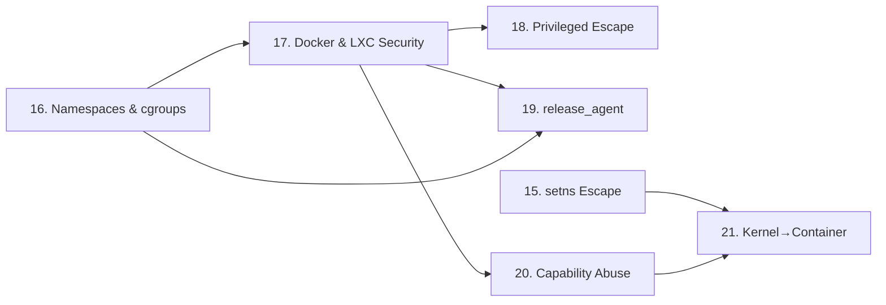

> **Prerequisites**: [[01-kernel-architecture|01. Kernel Architecture]]
> **Objectives**:
> - Nắm vững 8 loại namespace và cách chúng tạo nên container boundary
> - Hiểu cgroups v1 và v2 — resource limiting và release_agent mechanism
> - Biết cách xác định đang trong container và loại isolation nào đang active
> - Xây dựng mental model cho toàn bộ Part 5 (container escape)
>
---

## Động lực

Container không phải virtualization — không có VM, không có hypervisor, không có separate kernel. Container là **một tập hợp Linux kernel features** được dùng để tạo ra ảo giác isolation. Hiểu từng feature này = hiểu tại sao và làm thế nào chúng có thể bị bypass.

---

## Kiến trúc & Cơ chế

![[img-16-namespaces-cgroups.svg]]
*Hình 16: Linux namespaces và cgroups — các lớp isolation của container, và các attack vectors tương ứng*

### 8 Loại Linux Namespace

**1. Mount namespace (`mnt`, `CLONE_NEWNS`)**

Mỗi mount namespace có một independent filesystem tree. Container trong mount namespace riêng thấy OverlayFS root của nó, không thấy host filesystem.

```bash
# Tạo mới mount namespace:
unshare --mount bash
# Giờ các mount operations chỉ ảnh hưởng đến namespace này

# Container escape qua mnt namespace:
# Nếu container join host mnt namespace → thấy host filesystem
# → đọc /etc/shadow, /root/, private keys
```

**2. PID namespace (`pid`, `CLONE_NEWPID`)**

Processes trong container có PID riêng, bắt đầu từ 1. Host thấy PID thực (ví dụ 12345). Container thấy PID=1 (init của container).

```bash
# Confirm container PID isolation:
cat /proc/self/status | grep NSpid
# NSpid: 12345  1
#        ↑       ↑
#        host    container

# Trong container: ps aux chỉ hiện processes của container
# Trên host: ps aux hiện tất cả processes kể cả container
```

**3. Network namespace (`net`, `CLONE_NEWNET`)**

Network namespace riêng = network interfaces riêng, routing table riêng, iptables riêng. Container thường có `veth` pair kết nối với host bridge (`docker0`).

```bash
# Trong container:
ip addr    # → chỉ thấy lo + eth0 (veth inside container)
ip route   # → routing table của container

# Trên host:
ip addr    # → thấy docker0, veth0abc123, eth0, lo
```

**4. UTS namespace (`uts`, `CLONE_NEWUTS`)**

Cho phép container có hostname và domainname riêng. Thay đổi hostname trong container không ảnh hưởng host.

```bash
hostname         # → "web-container-1" (trong container)
                 # → "prod-server" (trên host)
```

**5. IPC namespace (`ipc`, `CLONE_NEWIPC`)**

SysV IPC (semaphores, message queues, shared memory) được isolate. Processes trong container không thể communicate qua IPC với host processes.

**6. User namespace (`user`, `CLONE_NEWUSER`)**

Quan trọng nhất cho security! Mapping UID/GID giữa container và host:
- Container UID 0 (root) → Host UID 100000 (unprivileged user)
- Container UID 1000 → Host UID 101000

```bash
# Kiểm tra user namespace mapping:
cat /proc/self/uid_map
# 0   100000   65536
# ↑   ↑        ↑
# container_uid  host_uid_start  count
```

**7. Cgroup namespace (`cgroup`, `CLONE_NEWCGROUP`)**

Container thấy root cgroup của nó tại `/`, không biết về parent cgroup hierarchy trên host.

**8. Time namespace (`time`, `CLONE_NEWTIME`)**

Cho phép container có system clock offset riêng. Ít được dùng trong container runtimes hiện tại.

### Detect Container từ Bên Trong

```bash
# Phương pháp 1: /proc/1/cgroup
cat /proc/1/cgroup
# Trong container Docker:
# 12:devices:/docker/abc123def456...
# 11:memory:/docker/abc123def456...
# → "docker" hoặc "kubepods" trong path → đang trong container

# Phương pháp 2: /.dockerenv hoặc /.dockerinit
ls /.dockerenv && echo "Docker container" || echo "Not Docker"

# Phương pháp 3: Namespace inode so sánh
stat -c %i /proc/1/ns/mnt    # host init mount ns inode
stat -c %i /proc/self/ns/mnt # current mount ns inode
# Khác nhau → isolated mount namespace → container

# Phương pháp 4: /proc/self/mountinfo
cat /proc/self/mountinfo | grep "overlay"
# overlay filesystem → Docker/Podman container

# Phương pháp 5: hostname khác với host
hostname   # nếu random hex string → Docker default hostname
```

### cgroups — Resource Control

cgroups (control groups) không tạo isolation về visibility, mà giới hạn **resources**:

**cgroup v1 (legacy, vẫn phổ biến):**

```text
/sys/fs/cgroup/
├── cpu/
│   └── docker/<container_id>/    ← CPU quota cho container
├── memory/
│   └── docker/<container_id>/    ← Memory limit
│       ├── memory.limit_in_bytes
│       └── memory.usage_in_bytes
├── devices/
│   └── docker/<container_id>/    ← Allowed devices
│       └── devices.list
└── */release_agent               ← ⚠ ATTACK SURFACE (Lesson 19)
```

**cgroup v2 (modern, unified hierarchy):**

```text
/sys/fs/cgroup/
└── docker/
    └── <container_id>/
        ├── cpu.max           ← "quota period" format
        ├── memory.max        ← bytes limit
        ├── io.max            ← I/O bandwidth limit
        └── cgroup.events     ← thay release_agent (safe)
```

> [!warning] cgroup v1 release_agent — Attack Surface
> cgroup v1 có file `release_agent` trong thư mục root của mỗi cgroup controller. Khi tất cả processes trong cgroup thoát, kernel chạy binary chỉ định trong `release_agent` với **host root privileges**. Đây là basis của CVE-2022-0492 và classic container escape technique (Lesson 19).
>
### Capabilities — Fine-grained Privileges

Linux chia root privileges thành ~40 capabilities riêng biệt:

| Capability | Ý nghĩa | Container escape risk |
|-----------|---------|----------------------|
| `CAP_SYS_ADMIN` | Rất nhiều thứ — mount, ioctl, ptrace... | **CRITICAL** — nhiều escapes |
| `CAP_NET_ADMIN` | Tạo network interfaces, iptables | **HIGH** — eBPF abuse |
| `CAP_SYS_PTRACE` | ptrace processes | **HIGH** — attach to host process |
| `CAP_DAC_READ_SEARCH` | Đọc bất kỳ file | **MEDIUM** |
| `CAP_SYS_MODULE` | Load/unload kernel modules | **CRITICAL** |
| `CAP_NET_RAW` | Raw socket operations | **MEDIUM** |

```bash
# Kiểm tra capabilities của process hiện tại:
cat /proc/self/status | grep Cap
# CapPrm: 00000000a80425fb  ← permitted caps (hex bitmask)
# CapEff: 00000000a80425fb  ← effective caps

# Decode bitmask (nếu có capsh):
capsh --decode=00000000a80425fb

# Kiểm tra nhanh có CAP_SYS_ADMIN không:
grep "CapEff" /proc/self/status | awk '{print $2}' | \
    python3 -c "import sys; v=int(sys.stdin.read(),16); print('CAP_SYS_ADMIN' if v&(1<<21) else 'no CAP_SYS_ADMIN')"
```

---

## Góc nhìn kẻ tấn công

### Enumeration khi đã vào container

```bash
# ===== Container Recon Checklist =====

# 1. Xác định container runtime
cat /proc/1/cgroup | head -5
ls /.dockerenv /.containerenv 2>/dev/null

# 2. Kiểm tra capabilities
cat /proc/self/status | grep -E "CapPrm|CapEff|CapBnd"
capsh --print 2>/dev/null || cat /proc/self/status | grep Cap

# 3. Kiểm tra seccomp
cat /proc/self/status | grep Seccomp
# 0 = disabled, 1 = strict, 2 = filter

# 4. Kiểm tra privileged container
# (privileged = có tất cả caps + access toàn bộ host devices)
ls /dev/ | wc -l   # > 50 → likely privileged
cat /proc/self/status | grep CapEff
# 0000003fffffffff → tất cả caps → privileged

# 5. Kiểm tra sensitive mounts
mount | grep -E "docker.sock|/proc|/sys|/etc|/root"
findmnt | grep -E "bind|overlay"

# 6. Kiểm tra cgroup version
stat -fc %T /sys/fs/cgroup/
# tmpfs → cgroup v1
# cgroup2fs → cgroup v2

# 7. Kernel version (để tìm CVEs)
uname -r

# 8. Kiểm tra có thể load module không
cat /proc/sys/kernel/modules_disabled
```

---

## Pentest Checklist

```bash
□ Detect container type: Docker / LXC / containerd / Kubernetes Pod
□ Kiểm tra Seccomp: /proc/self/status | grep Seccomp (0=off, 2=filter)
□ Kiểm tra capabilities: capsh --print hoặc decode CapEff hex
□ Có CAP_SYS_ADMIN? → cgroup release_agent escape (Lesson 19)
□ Privileged container? → mount host /dev → nhiều options (Lesson 18)
□ Docker socket mounted? → control host Docker daemon (Lesson 18)
□ cgroup v1 hay v2? → v1 có release_agent attack vector
□ Kernel version? → searchsploit + check CVE database
□ Sensitive mounts: /etc, /proc/sysrq-trigger, /sys/kernel/debug?
```

---

## Kết nối


