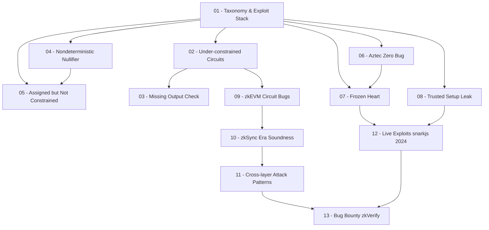

> **Topic**: Notable ZK Exploits & CVEs
> **Domain**: ZK Security / CVE Case Studies
> **Level**: Advanced
> **Background**: ZK proof systems (Groth16, PLONK, STARKs), Circom circuit model, finite fields, R1CS constraints
> **Tools / Code**: Python (PoC scripts, field arithmetic), Circom (minh họa circuit snippets)
> **Sources**: 0xPARC ZK Bug Tracker, SoK USENIX 2024, ChainLight reports, zkSecurity blog, Zcash security disclosures

---

## Lessons

| # | Tiêu đề | Lỗ hổng cốt lõi | Dự án thực tế | Độ khó |
|---|---------|----------------|---------------|--------|
| 01 | Taxonomy & Cách đọc ZK Exploit Reports | Tổng quan 8 lớp lỗ hổng ZK, mô hình stack | 0xPARC Bug Tracker, SoK 2024 | ★★☆☆☆ |
| 02 | Under-constrained Circuits: Dark Forest & BigInt ECDSA | Missing bit length check, overflow qua field boundary | Dark Forest v0.3, circom-ecdsa | ★★★☆☆ |
| 03 | Missing Output Check: Circom-Pairing (Succinct Labs) | Output signal không constrained → bypass range check | Succinct Labs bridge | ★★★☆☆ |
| 04 | Nondeterministic Nullifier: Aztec 2.0 & StealthDrop | Nullifier có nhiều witness hợp lệ → double-spend | Aztec 2.0, 0xPARC StealthDrop | ★★★☆☆ |
| 05 | Assigned but Not Constrained: TornadoCash MiMC & MACI | `=` thay vì `<==` → prover tự do gán giá trị | TornadoCash, MACI 1.0 | ★★★☆☆ |
| 06 | Aztec PlonK Verifier — The Zero Bug | Verifier chấp nhận bất kỳ proof khi scalar = 0 | Aztec PlonK Verifier | ★★★★☆ |
| 07 | Frozen Heart: Bulletproofs & PlonK | Fiat-Shamir challenge có thể bị ép = 0 | Bulletproofs, PlonK | ★★★★☆ |
| 08 | Trusted Setup Leak: Zcash Counterfeiting Bug (2018) | Toxic waste bị lộ → forge proof tạo ZEC vô hạn | Zcash Sprout | ★★★★☆ |
| 09 | zkEVM Circuit Bugs: PSE/Scroll & Polygon zkEVM | Missing overflow/modulo/PIL constraints trong zkEVM | PSE Scroll, Polygon zkEVM | ★★★★☆ |
| 10 | zkSync Era Soundness Bug (~$1.9B at risk) | Soundness break trong storage proof của zkEVM prover | zkSync Era (ChainLight 2023) | ★★★★★ |
| 11 | Cross-layer Attack Patterns & Nova Folding Bug | Underconstrained folding step → forged IVC proof | Microsoft Nova, ZK Email | ★★★★★ |
| 12 | Live Exploits: Groth16 snarkjs Incomplete Setup (2024) | Verifier không check subgroup → $1.5M bị drain | snarkjs Groth16, hai protocol | ★★★★★ |
| 13 | Từ CVE đến Bug Bounty: Áp dụng vào zkVerify | Mapping exploit patterns → attack surface zkVerify | zkVerify (Immunefi) | ★★★★☆ |

## Appendix Candidates

| ID | Nội dung | Lesson liên quan | Ghi chú |
|----|---------|-----------------|---------|
| A0 | ZK Circuit Security Tools | 02–05 | ECNE, Picus, Veridise, circom-coq, Halmos |
| A1 | ZK Audit Checklist — Đầy đủ theo Stack | 01–12 | Checklist theo từng lớp: circuit, prover, verifier, contract |
| A2 | Full PoC Scripts — End-to-End Exploits | 02, 05, 06, 07, 12 | Python PoC hoàn chỉnh cho từng exploit class |

---

## Dependency Graph

---

## Progress Tracker

- [ ] [[00-roadmap|00. Roadmap]]
- [ ] [[01-intro-taxonomy-zk-exploits|01. Taxonomy & Cách đọc ZK Exploit Reports]]
- [ ] [[02-under-constrained-dark-forest-bigint|02. Under-constrained Circuits: Dark Forest & BigInt ECDSA]]
- [ ] [[03-missing-output-check-circom-pairing|03. Missing Output Check: Circom-Pairing]]
- [ ] [[04-nondeterministic-nullifier-aztec-stealthdrop|04. Nondeterministic Nullifier: Aztec 2.0 & StealthDrop]]
- [ ] [[05-assigned-not-constrained-tornadocash-maci|05. Assigned but Not Constrained: TornadoCash MiMC & MACI]]
- [ ] [[06-aztec-plonk-verifier-zero-bug|06. Aztec PlonK Verifier — The Zero Bug]]
- [ ] [[07-frozen-heart-bulletproofs-plonk|07. Frozen Heart: Bulletproofs & PlonK]]
- [ ] [[08-trusted-setup-leak-zcash|08. Trusted Setup Leak: Zcash Counterfeiting Bug]]
- [ ] [[09-zkevm-circuit-bugs-pse-polygon|09. zkEVM Circuit Bugs: PSE/Scroll & Polygon zkEVM]]
- [ ] [[10-zksync-era-soundness-bug|10. zkSync Era Soundness Bug]]
- [ ] [[11-cross-layer-attack-patterns-nova|11. Cross-layer Attack Patterns & Nova Folding Bug]]
- [ ] [[12-live-exploits-groth16-snarkjs-2024|12. Live Exploits: Groth16 snarkjs Incomplete Setup]]
- [ ] [[13-bug-bounty-zkverify-application|13. Từ CVE đến Bug Bounty: Áp dụng vào zkVerify]]
- [ ] [[a0-zk-circuit-security-tools|A0. ZK Circuit Security Tools]]
- [ ] [[a1-zk-audit-checklist|A1. ZK Audit Checklist]]
- [ ] [[a2-full-poc-scripts|A2. Full PoC Scripts]]
