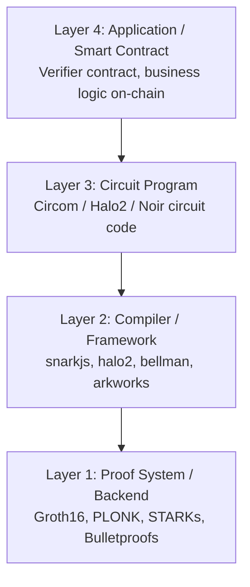
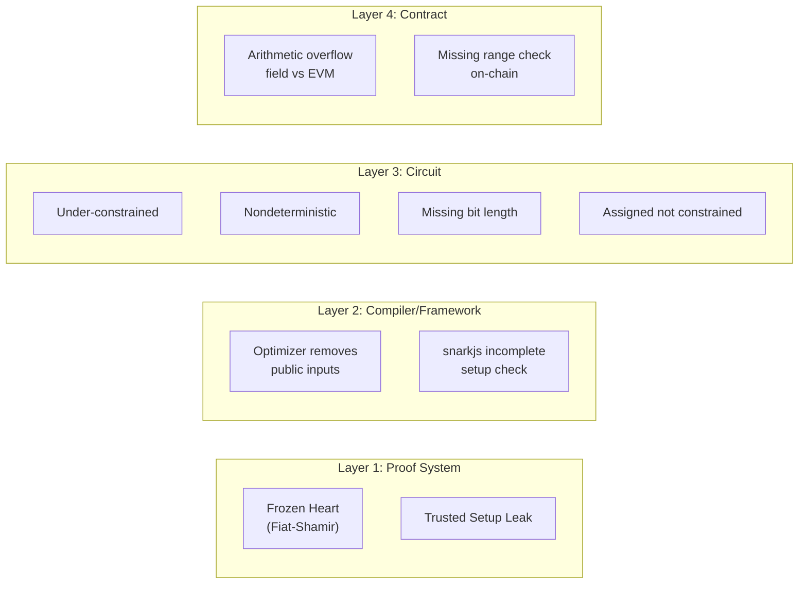

> **Prerequisites**: ZK proof systems cơ bản (Groth16, PLONK), R1CS constraint model, Circom syntax cơ bản
> **Objectives**:
> - Hiểu mô hình 4 lớp stack của hệ thống SNARK và vị trí của từng loại lỗ hổng
> - Nắm vững 8 danh mục lỗ hổng ZK theo 0xPARC Bug Tracker và SoK USENIX 2024
> - Phân biệt **soundness bug** vs **completeness bug** và tại sao soundness mới nguy hiểm
> - Biết cách đọc một ZK audit report và định vị root cause vào đúng danh mục

---

## Tại sao ZK Security khác với Security thông thường

Bảo mật phần mềm truyền thống tập trung vào: buffer overflow, SQL injection, logic bugs trong runtime. ZK security có một chiều kích hoàn toàn khác: **lỗi xảy ra ở tầng toán học** — trong cách viết constraints, trong cách setup tham số, trong cách verifier kiểm tra proof.

Điều đặc biệt nguy hiểm: một circuit Circom bị under-constrained **vẫn compile bình thường, vẫn tạo proof được, vẫn pass verifier** — nhưng prover có thể dùng witness giả để chứng minh một statement sai là đúng. Không có runtime exception, không có error message, không có stack trace. Chỉ có proof được chấp nhận.

Đây là lý do tại sao ZK security đòi hỏi một loại tư duy khác.

---

## Mô hình 4 lớp Stack của SNARK

Một hệ thống SNARK trong thực tế bao gồm 4 lớp:



Mỗi lớp có thể chứa lỗ hổng độc lập. Một lỗi ở lớp dưới (proof system) có thể vô hiệu hóa toàn bộ bảo mật dù các lớp trên được viết đúng. Ngược lại, lớp circuit có thể sai dù proof system hoàn toàn chính xác.

> [!definition] Definition 1.1 — Soundness Bug vs Completeness Bug
> **Soundness bug**: Circuit chấp nhận proof cho một statement **sai** — đây là loại lỗ hổng nguy hiểm nhất, cho phép prover gian lận.
>
> **Completeness bug**: Circuit từ chối proof cho một statement **đúng** — gây ra denial-of-service nhưng không cho phép gian lận.
>
> Toàn bộ series này tập trung vào **soundness bugs** — vì đây là loại có thể bị khai thác để lấy tiền, forge token, hoặc bypass verification.

---

## 8 Danh mục Lỗ hổng ZK (0xPARC Taxonomy)

### 1. Under-constrained Circuits

Circuit có **ít constraint hơn cần thiết**, dẫn đến nhiều witness khác nhau đều có thể tạo ra một proof hợp lệ cho cùng một public output.

> [!danger] Vulnerability Pattern 1.1 — Under-constrained
> Khi một signal trong Circom được gán giá trị (`<--`) nhưng không được ràng buộc bởi constraint, prover có thể tự do đặt nó thành bất kỳ giá trị nào mà vẫn pass verifier.
>
> **Ví dụ**: `out <-- a * b` (assign only) thay vì `out <== a * b` (assign + constrain).
>
> **Impact**: Prover chứng minh được statement sai. Tùy context có thể dẫn đến giả mạo proof, rút tiền nhiều lần, bypass access control.

**Bài trong series**: [[02-under-constrained-dark-forest-bigint|02]], [[03-missing-output-check-circom-pairing|03]]

### 2. Nondeterministic Circuits

Một dạng đặc biệt của under-constrained: circuit có **nhiều cách tạo witness hợp lệ** cho cùng public input. Thường xuất hiện ở nullifier generation — một nullifier được tạo nên phải là duy nhất, nhưng nếu circuit nondeterministic thì cùng một claim có thể tạo ra nhiều nullifier khác nhau.

**Bài trong series**: [[04-nondeterministic-nullifier-aztec-stealthdrop|04]]

### 3. Arithmetic Over/Under Flows

Circom làm việc trong trường $\mathbb{F}_p$ với $p = p_{\text{BN254}} \approx 2^{254}$. Tuy nhiên Ethereum VM (EVM) làm việc với số 256-bit không dấu. Khoảng cách giữa hai field order này tạo ra vùng số:

$$
p_{\text{BN254}} < x < 2^{256}
$$

Nếu một smart contract nhận nullifier từ ZK proof và lưu trong `uint256`, thì số $x$ trong khoảng trên sẽ **không tồn tại trong trường BN254** nhưng **hợp lệ trong EVM**. Kẻ tấn công có thể submit hai nullifier khác nhau mà circuit coi là cùng một giá trị (vì $x \equiv x - p \pmod{p}$), nhưng contract lại lưu chúng khác nhau.

**Bài trong series**: [[04-nondeterministic-nullifier-aztec-stealthdrop|04]], [[09-zkevm-circuit-bugs-pse-polygon|09]]

### 4. Mismatching Bit Lengths

Khi dùng các component như `LessThan(n)` từ circomlib, tham số `n` chỉ là *gợi ý* về số bit tối đa — **không phải constraint**. Nếu input không được độc lập constrain về số bit, component có thể trả về kết quả sai với input lớn hơn mong đợi.

**Bài trong series**: [[02-under-constrained-dark-forest-bigint|02]]

### 5. Unused Public Inputs Optimized Out

Khi một public input không tham gia vào bất kỳ non-linear constraint nào, compiler R1CS có thể **tối ưu hóa bỏ nó hoàn toàn**. Verifier khi đó không thực sự kiểm tra public input đó — bất kỳ giá trị nào cũng pass.

> [!warning] Pattern 1.2 — Optimizer Bug
> TornadoCash và Semaphore đã gặp dạng lỗi này. Fix: thêm non-linear constraint nhân tự thân: `signalHashSquared <== signalHash * signalHash`.

### 6. Frozen Heart — Forging of Zero Knowledge Proofs

Khi triển khai Fiat-Shamir transformation, nếu prover có thể kiểm soát giá trị của challenge $e$ (đặc biệt nếu $e = 0$), thì phần lớn các Sigma protocol đều bị phá vỡ.

> [!danger] Vulnerability Pattern 1.3 — Frozen Heart
> Với challenge $e = 0$, phương trình $z = r + e \cdot x$ trở thành $z = r$ — prover không cần biết secret $x$. Mọi proof đều hợp lệ.
>
> **Root cause**: Hash transcript không bao gồm toàn bộ context cần thiết, hoặc không validate $e \neq 0$.

**Bài trong series**: [[07-frozen-heart-bulletproofs-plonk|07]]

### 7. Trusted Setup Leak

Groth16 và một số proof system khác cần **trusted setup** tạo ra các tham số $(pk, vk)$. Trong quá trình này, một số giá trị trung gian ("toxic waste") phải được xóa hoàn toàn. Nếu toxic waste bị lộ, bất kỳ ai có nó đều có thể forge proof cho bất kỳ statement nào.

**Bài trong series**: [[08-trusted-setup-leak-zcash|08]]

### 8. Assigned but Not Constrained

Trong Circom, toán tử `=` và `<--` chỉ **gán giá trị** trong witness generation — chúng **không tạo R1CS constraint**. Prover có thể gán bất kỳ giá trị nào vào signal đó mà không vi phạm constraint nào.

> [!danger] Vulnerability Pattern 1.4 — Assigned but Not Constrained
> ```
> // WRONG — chỉ gán, không constrain:
> out[0] = S[nInputs - 1].xL_out
>
> // CORRECT — gán VÀ constrain:
> out[0] <== S[nInputs - 1].xL_out
> ```
> Lỗi này xuất hiện trong TornadoCash MiMC hash circuit.

**Bài trong series**: [[05-assigned-not-constrained-tornadocash-maci|05]]

---

## Bảng Tóm tắt: Lớp Stack ↔ Danh mục Lỗ hổng



---

## Cách Đọc một ZK Audit Report

Khi gặp một audit finding, câu hỏi đầu tiên không phải là "lỗi này là gì?" mà là:

**Bước 1 — Xác định layer**: Lỗi nằm ở circuit, compiler, proof system, hay smart contract?

**Bước 2 — Xác định danh mục**: Trong 8 danh mục trên, nó thuộc loại nào? (Thường có thể overlap nhiều loại)

**Bước 3 — Xác định attack vector**: Kẻ tấn công cần làm gì để khai thác? Họ cần quyền gì? Input gì?

**Bước 4 — Đánh giá impact**: Soundness bị vi phạm nghĩa là gì trong context ứng dụng? Token bị giả mạo? Merkle root bị fake? Access control bị bypass?

**Bước 5 — Phân tích fix**: Fix ở layer nào? Tại sao fix đó là đủ? Có side effect không?

> [!example] Example 1.5 — Đọc một Finding Thực tế
> **Finding**: "PSE & Scroll zkEVM: Missing Overflow Constraint trong modulo gadget"
>
> **Bước 1 — Layer**: Layer 3 (Circuit) — gadget trong zkEVM Halo2
>
> **Bước 2 — Danh mục**: Under-constrained circuit + Arithmetic overflow
>
> **Bước 3 — Attack vector**: Malicious prover tạo witness với modulo sai nhưng vẫn satisfy constraints → tạo proof cho wrong state transition
>
> **Bước 4 — Impact**: Prover có thể convince verifier về state update sai trong zkEVM rollup
>
> **Bước 5 — Fix**: Thêm range constraint đảm bảo remainder < divisor

---

## Phân loại theo Impact

Để ưu tiên khi bug bounty hunting, hãy nghĩ theo impact:

| Impact | Danh mục lỗ hổng | Ví dụ thực tế |
|--------|----------------|---------------|
| **Critical** — Forge token / infinite mint | Trusted Setup Leak, Frozen Heart | Zcash 2018, Bulletproofs |
| **Critical** — Drain funds | Under-constrained nullifier | Aztec 2.0, snarkjs 2024 |
| **Critical** — Fake state transition | zkEVM circuit bugs | Polygon zkEVM, PSE Scroll |
| **High** — Double-claim | Nondeterministic nullifier | ZkDrops, StealthDrop |
| **High** — Bypass range proof | Missing bit length | Dark Forest, BigInt |
| **Medium** — Verify wrong public input | Optimizer removes public inputs | TornadoCash |

---

## Summary / Key Takeaways

- ZK systems có **4 lớp** có thể chứa lỗ hổng — từ proof system toán học đến smart contract on-chain.
- **Soundness bug** là nguy hiểm nhất: prover tạo proof cho statement sai, verifier chấp nhận.
- **8 danh mục** của 0xPARC Bug Tracker bao phủ hầu hết các dạng lỗi đã biết: under-constrained, nondeterministic, overflow, mismatching bit length, unused public inputs, Frozen Heart, trusted setup leak, assigned-not-constrained.
- Khi đọc audit report: xác định layer → danh mục → attack vector → impact → fix.
- Mọi bài trong series sẽ đi sâu vào từng lỗ hổng theo cấu trúc: **Vulnerability Background → Root Cause → Exploit Mechanics → PoC → Patch → Bug Bounty Lesson**.

---

## References

- 0xPARC ZK Bug Tracker — https://github.com/0xPARC/zk-bug-tracker
- SoK: What don't we know? Understanding Security Vulnerabilities in SNARKs (USENIX 2024) — https://arxiv.org/abs/2402.15293
- zkSecurity Blog — https://blog.zksecurity.xyz
- Veridise ZK Auditing — https://veridise.com
