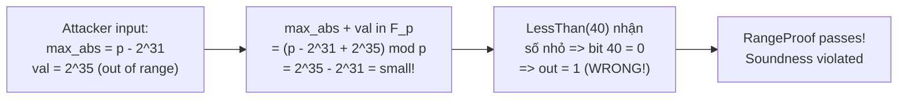
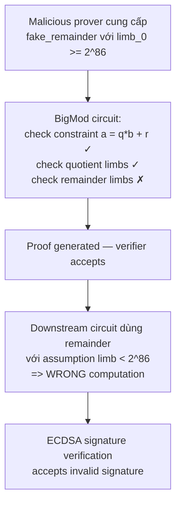

> **Prerequisites**: [[01-intro-taxonomy-zk-exploits|01. Taxonomy]], Circom circuit model, R1CS constraints, BN254 field arithmetic
> **Objectives**:
> - Hiểu tại sao `LessThan(n)` trong circomlib **không** tự đảm bảo inputs có đúng `n` bits
> - Phân tích hai case study thực tế: Dark Forest v0.3 và circom-ecdsa BigMod
> - Tự mình trace qua attack vector: field wrap-around và oversized remainder
> - Viết được PoC Python minh họa cơ chế bypass
> - Biết cách fix và nhận diện pattern này khi audit

---

## Bối cảnh: Under-constrained Circuit là gì?

Trong một Circom circuit, **constraint** là phương trình R1CS mà *tất cả* các witness hợp lệ đều phải thỏa mãn. Khi circuit **under-constrained** (thiếu constraint), tồn tại nhiều witness $w$ khác nhau đều pass verifier cho cùng một public input $x$.

> [!definition] Definition 2.1 — Under-constrained Circuit (Formal)
> Một circuit $\mathcal{C}$ là under-constrained nếu tồn tại public input $x$ và hai witness phân biệt $w_1 \neq w_2$ sao cho:
>
> $$\mathcal{C}(x, w_1) = 1 \quad \text{và} \quad \mathcal{C}(x, w_2) = 1$$
>
> Trong đó $w_1$ là witness *hợp lệ theo logic ứng dụng* còn $w_2$ là *witness giả mạo* của kẻ tấn công.
>
> Hậu quả: kẻ tấn công có thể forge một proof cho statement sai.

Điều tinh tế cần nhớ: Circom compiler **không phát hiện** under-constrained circuits — nó chỉ kiểm tra syntax, không kiểm tra correctness của constraint system. Circuit vẫn compile thành công, proof vẫn được tạo ra và pass verifier.

---

## Case Study 1: Dark Forest v0.3 — Missing Bit Length Check

### Bối cảnh

Dark Forest là một game chiến lược phi tập trung trên blockchain. Mỗi khi player di chuyển, họ phải tạo ZK proof chứng minh:

1. Tọa độ `(x, y)` của hành tinh nguồn là hợp lệ (hash đúng, trong phạm vi bản đồ)
2. Khoảng cách di chuyển không vượt quá giới hạn

Để ngăn tràn số (overflow/underflow), circuit trong v0.3 dùng một `RangeProof` template:

```circom
template RangeProof(bits, max_abs_value) {
    signal input in;

    component lowerBound = LessThan(bits);
    component upperBound = LessThan(bits);

    lowerBound.in[0] <== max_abs_value + in;
    lowerBound.in[1] <== 0;
    lowerBound.out === 0

    upperBound.in[0] <== 2 * max_abs_value;
    upperBound.in[1] <== max_abs_value + in;
    upperBound.out === 0
}
```

Mục đích: chứng minh `-max_abs_value <= in <= max_abs_value`. Trong game, `bits=40`, `max_abs_value = 2^32`.

### Root Cause: LessThan(n) không phải range check!

Hãy xem implementation của `LessThan` trong circomlib:

```circom
template LessThan(n) {
    assert(n <= 252);
    signal input in[2];
    signal output out;

    component n2b = Num2Bits(n+1);
    n2b.in <== in[0] + (1<<n) - in[1];

    out <== 1 - n2b.out[n];
}
```

Cách hoạt động khi inputs đúng: nếu `in[0] < in[1]`, thì `in[0] + 2^n - in[1]` nằm trong `[0, 2^n)`, do đó bit thứ `n` = 0, `out = 1`. Nếu `in[0] >= in[1]`, kết quả `>= 2^n`, bit `n` = 1, `out = 0`.

> [!warning] Warning 2.2 — Giả định ẩn của LessThan(n)
> `LessThan(n)` **giả định** rằng cả hai inputs đều fit trong `n` bits, tức `in[0], in[1] < 2^n`. Tham số `n` chỉ là **convention**, không phải constraint được enforce.
>
> Nếu inputs vượt `n` bits, phép tính `in[0] + 2^n - in[1]` trong trường $\mathbb{F}_p$ có thể **wrap quanh** (do field arithmetic modulo $p \approx 2^{254}$), khiến `Num2Bits(n+1)` nhận một giá trị không dự đoán được và circuit trả về kết quả sai.

### Exploit Mechanics: Field Wrap-around

Trong `RangeProof`, `max_abs_value` là **input signal** — nó có thể được prover tự chọn. Circuit không constrain `max_abs_value` phải nhỏ hơn `2^bits`.

Kẻ tấn công có thể cung cấp:
- `max_abs_value ≈ p` (gần field order $p_{\text{BN254}}$)
- `in` = giá trị ngoài range thật sự (ví dụ `2^50`)

Khi đó `max_abs_value + in` tính trong $\mathbb{F}_p$ sẽ **wrap quanh thành một số rất nhỏ**, và `LessThan(bits)` sẽ đánh giá trên số nhỏ đó thay vì tổng thật sự.



### PoC Python — Minh họa Field Wrap

```python
p = 21888242871839275222246405745257275088548364400416034343698204186575808495617

def circom_less_than_sim(a, b, n, p):
    """
    Mô phỏng LessThan(n) trong field F_p.
    Tính diff = a + 2^n - b (mod p), rồi xem bit thứ n.
    """
    diff = (a + (1 << n) - b) % p
    bit_n = (diff >> n) & 1
    return 1 - bit_n

bits = 40
max_abs = 2**32

# Trường hợp bình thường: val=1000 hợp lệ
val_ok = 1000
lower = circom_less_than_sim(max_abs + val_ok, 0, bits, p)
upper = circom_less_than_sim(2 * max_abs, max_abs + val_ok, bits, p)
print(f"val=1000: lower={lower}, upper={upper}, pass={lower==0 and upper==0}")
# Output: val=1000: lower=0, upper=0, pass=True

# Trường hợp bình thường: val=2^33 bị reject
val_bad = 2**33
lower = circom_less_than_sim(max_abs + val_bad, 0, bits, p)
upper = circom_less_than_sim(2 * max_abs, max_abs + val_bad, bits, p)
print(f"val=2^33: lower={lower}, upper={upper}, pass={lower==0 and upper==0}")
# Output: val=2^33: lower=0, upper=1, pass=False  <-- đúng

# Field wrap attack: evil_max gần p, evil_val vượt max thật
evil_max = p - 2**31
evil_val = 2**35
sum_fp = (evil_max + evil_val) % p
print(f"evil_max + evil_val (mod p) = {sum_fp}")
print(f"Wrapped to small value => LessThan sẽ đánh giá sai")
# Prover có thể craft Num2Bits witness cho giá trị nhỏ này
```

### Fix: Thêm Explicit Bit Length Constraint

```circom
template RangeProof(bits) {
    signal input in;
    signal input max_abs_value;

    // EXPLICITLY constrain inputs về số bits — đây là fix chính
    component n2b1 = Num2Bits(bits+1);
    n2b1.in <== in + (1 << bits);     // forces: -2^bits <= in < 2^bits
    component n2b2 = Num2Bits(bits);
    n2b2.in <== max_abs_value;         // forces: 0 <= max_abs_value < 2^bits

    component lowerBound = LessThan(bits+1);
    component upperBound = LessThan(bits+1);
    lowerBound.in[0] <== max_abs_value + in;
    lowerBound.in[1] <== 0;
    lowerBound.out === 0
    upperBound.in[0] <== 2 * max_abs_value;
    upperBound.in[1] <== max_abs_value + in;
    upperBound.out === 0
}
```

Sau fix: `Num2Bits(bits+1)` trên input sẽ tạo một constraint R1CS yêu cầu input phải fit trong `bits+1` bits. Nếu prover cố dùng oversized input, constraint này sẽ unsatisfied → proof generation fail.

---

## Case Study 2: circom-ecdsa — BigMod Missing Remainder Constraint

### Bối cảnh

ECDSA (Elliptic Curve Digital Signature Algorithm) trên secp256k1 (Bitcoin/Ethereum) dùng số 256-bit. Nhưng BN254 scalar field chỉ có 254 bits. Để làm arithmetic với số 256-bit, circom-ecdsa dùng **BigInt representation**: số lớn được chia thành `k` limbs, mỗi limb `n` bits.

```text
BigInt(256-bit) = [limb_0, limb_1, limb_2]  với n = 86 bits/limb
Giá trị = limb_0 + limb_1 * 2^86 + limb_2 * 2^172
```

**Proper representation**: mỗi limb phải nằm trong `[0, 2^n)`.

Circuit `BigMod` tính `a % b` (modulo của hai BigInt). Nó dùng helper function `long_div` để tính quotient và remainder:

```circom
var longdiv[2][100] = long_div(n, k, k, a, b);
for (var i = 0; i < k; i++) {
    div[i] <-- longdiv[0][i];   // quotient limbs
    mod[i] <-- longdiv[1][i];   // remainder limbs
}
div[k] <-- longdiv[0][k];
```

Sau đó circuit thêm range check cho **quotient** nhưng **không** thêm cho remainder:

```circom
// Chỉ check quotient — THIẾU check cho remainder!
component range_checks[k + 1];
for (var i = 0; i <= k; i++) {
    range_checks[i] = Num2Bits(n);
    range_checks[i].in <== div[i];   // quotient constrained
}
// mod[] không có range check tương ứng!
```

### Root Cause

> [!danger] Vulnerability 2.3 — BigMod Missing Remainder Constraint
> `BigMod` circuit constrain quotient limbs vào `[0, 2^n)` nhưng **không** constrain remainder limbs. Điều này có nghĩa:
>
> Kẻ tấn công có thể cung cấp `mod_i >= 2^n` cho một hoặc nhiều limb của remainder, miễn là:
>
> $$\sum_i \text{div}_i \cdot 2^{ni} \cdot b + \sum_i \text{mod}_i \cdot 2^{ni} \equiv a \pmod{p}$$
>
> Witness giả mạo vẫn thỏa mãn constraint chính của circuit!

### Exploit Mechanics: Oversized Remainder Limb

```python
LIMB_BITS = 86
LIMB_BASE = 2**LIMB_BITS

# Giả sử a = 5*b + 3 (remainder=3)
quotient = 5
b_val = LIMB_BASE - 10   # divisor gần LIMB_BASE
remainder = 3
a_val = quotient * b_val + remainder

# Fake witness hợp lệ: quotient' = 4, remainder' = remainder + b_val
fake_q = quotient - 1
fake_r = remainder + b_val  # fake_r >= LIMB_BASE!

# Verify constraint a = fake_q * b + fake_r satisfied:
assert fake_q * b_val + fake_r == a_val  # True!

# fake_r >= b_val => violates "remainder < divisor" invariant
# Nhưng circuit không enforce điều này!
# Circuit WITHOUT remainder range check: ACCEPTS fake_r
# Downstream code nhận remainder "quá lớn" => undefined behavior
```

**Hậu quả thực tế**: Các circuit downstream nhận output của `BigMod` và giả định remainder ở proper representation. Nếu remainder có limb oversized, phép tính tiếp theo (nhân, cộng, so sánh) trên BigInt sẽ cho kết quả sai. Trong context ECDSA verification, điều này có thể dẫn đến accept chữ ký giả.

### Exploit vector cụ thể



### Fix: Thêm Range Check cho Remainder

```circom
// FIX: Thêm Num2Bits check cho tất cả remainder limbs
component mod_range_checks[k];
for (var i = 0; i < k; i++) {
    mod_range_checks[i] = Num2Bits(n);
    mod_range_checks[i].in <== mod[i];   // THÊM constraint này!
}
```

Sau fix, mỗi limb của remainder được constrain vào `[0, 2^n)`. Fake witness với oversized limb sẽ fail `Num2Bits` constraint.

---

## So sánh Hai Case Study

| | Dark Forest v0.3 | circom-ecdsa BigMod |
|-|-----------------|---------------------|
| **Missing constraint** | Bit length của input vào `LessThan` | Bit length của remainder output |
| **Vuln class** | Under-constrained + Mismatching bit length | Under-constrained |
| **Attack mechanism** | Field wrap-around bypass `RangeProof` | Oversized limb bypass proper representation |
| **Impact** | Player di chuyển ra ngoài bản đồ | ECDSA signature verification accept chữ ký giả |
| **Identifier** | Daira Hopwood | Andrew He + Veridise Team |
| **Fix** | Thêm `Num2Bits` check trước `LessThan` | Thêm `Num2Bits` check cho remainder limbs |

---

## Pattern Nhận Diện khi Audit

> [!tip] Audit Pattern 2.4 — Dấu hiệu Under-constrained Bit Length
> Khi audit một Circom circuit, tìm những nơi:
>
> 1. **Dùng `LessThan(n)`, `LessThan(n)`, `GreaterThan(n)` từ circomlib** — luôn hỏi: inputs có được độc lập constrain về số bits không?
> 2. **Helper functions** (`long_div`, `sqrt`, các witness generation functions) — outputs của chúng có bao giờ đi qua `Num2Bits` constraint không?
> 3. **BigInt arithmetic** — tất cả limbs của kết quả (không chỉ quotient) đều phải có range check?
> 4. **Intermediate signals được gán bằng `<--`** — signal đó có bao giờ được ràng buộc sau đó không?

---

## Bug Bounty Takeaway — Áp dụng vào zkVerify

Khi hunting trên zkVerify, tìm các điểm sau:

**Trong verifier circuits của zkVerify**:
- Bất kỳ circuit nào implement comparisons: `IsEqual`, `LessThan`, range checks — check xem inputs có được explicit bit-constrained không.
- BigInt operations trong proof verification (ví dụ: pairing computation, scalar multiplication): tất cả intermediate values phải ở proper representation.

**Câu hỏi kiểm tra nhanh**:
1. Với mỗi `LessThan(n)`: có `Num2Bits(n)` hoặc `Num2Bits(n+1)` riêng trên input không?
2. Với mỗi division/modulo circuit: cả quotient **và** remainder đều được range-checked không?
3. Tool: chạy **ECNE** (0xPARC) hoặc **Picus** (Veridise) để tự động phát hiện under-constrained signals.

---

## Summary / Key Takeaways

- `LessThan(n)` trong circomlib **không tự constrain** rằng inputs có đúng `n` bits — đây là trách nhiệm của circuit sử dụng nó.
- Khi inputs vượt quá `n` bits, **field arithmetic modulo $p$** có thể wrap quanh và làm `LessThan` trả về kết quả sai.
- **Dark Forest v0.3**: `RangeProof` dùng `LessThan` nhưng không constrain `max_abs_value` và `in` — attacker có thể bypass range check với oversized inputs.
- **BigMod circom-ecdsa**: circuit constrain quotient limbs nhưng không constrain remainder limbs — attacker cung cấp fake remainder vượt proper representation mà vẫn satisfy constraint chính.
- **Fix pattern chung**: luôn thêm `component n2b = Num2Bits(n); n2b.in <== signal_to_check;` cho mọi signal cần có bit length constraint.
- Tool tự động: **ECNE** và **Picus** có thể phát hiện nhiều under-constrained bugs tương tự.

---

## References

- 0xPARC ZK Bug Tracker — #1 Dark Forest, #2 BigInt — https://github.com/0xPARC/zk-bug-tracker
- ZKPs for Engineers: Dark Forest — https://blog.zkga.me/df-init-circuit
- circom-ecdsa BigMod fix — https://github.com/0xPARC/circom-ecdsa/pull/10
- BigInt representation in circom — https://hackmd.io/hIfysDw4TtC_6RR4gzdjBw
- Veridise ZK Audit — https://veridise.com
