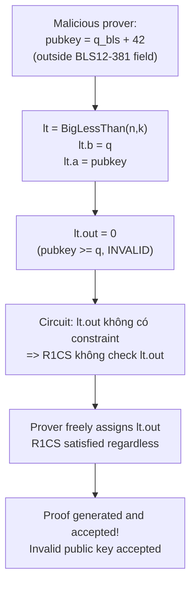

> **Prerequisites**: [[02-under-constrained-dark-forest-bigint|02. Under-constrained Circuits]], BLS12-381 curve sơ bộ, khái niệm elliptic curve pairing
> **Objectives**:
> - Hiểu lỗ hổng "missing output check" — component được khởi tạo nhưng output signal không được constrain
> - Phân tích `CoreVerifyPubkeyG1` trong circom-pairing và tại sao việc bỏ `lt[i].out === 1` là critical
> - Trace qua exploit: prover cung cấp public key nằm ngoài BLS12-381 field nhưng proof vẫn được accept
> - Nhận diện pattern này trong các audit khác và trong zkVerify

---

## Bối cảnh: Circom-Pairing và Succinct Labs Bridge

`circom-pairing` là thư viện Circom triển khai elliptic curve pairing cho BLS12-381 — một curve được dùng rộng rãi trong các hệ thống ZK proof (Ethereum PoS, Filecoin, Zcash Sapling). Succinct Labs dùng circom-pairing trong một **ZK light client bridge** để verify BLS12-381 chữ ký từ Ethereum consensus layer và relay sang chain khác.

Nếu chữ ký có thể bị forge, kẻ tấn công có thể relay các tin nhắn giả từ Ethereum sang bridge destination — có thể mint token vô hạn hoặc drain bridge funds.

Veridise phát hiện lỗ hổng trong quá trình audit, ngăn chặn thiệt hại tiềm tàng lên đến **nhiều triệu USD**.

---

## Background: Tại sao BLS12-381 dùng BigInt?

BLS12-381 định nghĩa trên trường $\mathbb{F}_q$ với:

$$q = \texttt{0x1a0111ea...aaab} \quad (381 \text{ bits})$$

Nhưng BN254 scalar field — nền tảng của Circom — chỉ có 254 bits. Do đó circom-pairing phải **mô phỏng arithmetic trên $\mathbb{F}_q$** bằng cách biểu diễn số 381-bit dưới dạng BigInt với $k$ limbs, mỗi limb $n$ bits.

> [!definition] Definition 3.1 — BigInt Representation trong circom-pairing
> Một phần tử $x \in \mathbb{F}_q$ được biểu diễn thành $k$ limbs $(x_0, x_1, \ldots, x_{k-1})$ với:
>
> $$x = x_0 + x_1 \cdot 2^n + x_2 \cdot 2^{2n} + \cdots + x_{k-1} \cdot 2^{(k-1)n}$$
>
> và điều kiện **proper representation**: $0 \leq x_i < 2^n$ cho mọi $i$, và $x < q$ (nằm trong field).
>
> Để kiểm tra $x < q$, circom-pairing cung cấp template `BigLessThan(n, k)` trả về 1 nếu $a < b$, 0 nếu ngược lại.

---

## Root Cause: Output Signal Không Được Constrain

### Circuit `CoreVerifyPubkeyG1`

Circuit này verify chữ ký BLS12-381 cho một public key. Một phần quan trọng là **validate inputs** — đảm bảo tất cả input field elements (public key, message, signature) đều nằm trong $\mathbb{F}_q$ (tức $< q$).

```circom
template CoreVerifyPubkeyG1(n, k) {
    signal input pubkey[2][k];   // public key: điểm trên BLS12-381
    signal input signature[2][k];
    signal input hash[2][k];
    // ... nhiều inputs khác

    var q[50] = get_BLS12_381_prime(n, k);  // lấy limbs của q

    // Tạo BigLessThan components để check inputs < q
    component lt[10];
    for (var i = 0; i < 10; i++) {
        lt[i] = BigLessThan(n, k);
        for (var idx = 0; idx < k; idx++)
            lt[i].b[idx] <== q[idx];    // b = q (BLS12-381 prime)
    }

    // Gán inputs vào lt[i].a
    for (var idx = 0; idx < k; idx++) {
        lt[0].a[idx] <== pubkey[0][idx];
        lt[1].a[idx] <== pubkey[1][idx];
        lt[2].a[idx] <== signature[0][idx];
        lt[3].a[idx] <== signature[1][idx];
        // ... các inputs khác
    }
    // BUG: lt[i].out CHƯA BAO GIỜ được constrain!
}
```

> [!danger] Vulnerability 3.2 — Missing Output Constraint
> `lt[i]` được tạo ra và inputs được gán vào, nhưng **`lt[i].out` không bao giờ xuất hiện trong bất kỳ constraint nào**. Cụ thể, dòng:
>
> ```circom
> lt[i].out === 1
> ```
>
> **hoàn toàn vắng mặt** trong circuit.
>
> Trong Circom, một signal output của component chỉ trở thành constraint khi nó được sử dụng trong một phương trình constraint (`===`, `<==`). Nếu không được sử dụng, output signal đó **không tạo ra bất kỳ R1CS constraint nào**.

### Hệ quả

Prover có thể cung cấp `pubkey[i][idx] = q + 42` (hoặc bất kỳ giá trị nào $\geq q$) mà circuit không phản đối. `BigLessThan` sẽ tính đúng (`lt.out = 0`, nghĩa là input $\geq q$), nhưng vì `lt.out` không được check, verifier không biết điều này.



---

## Exploit Mechanics: Signature Forgery qua Invalid Public Key

### Tại sao public key $\geq q$ nguy hiểm?

Pairing trên BLS12-381 được định nghĩa trên $\mathbb{F}_q$ với $q$ là prime order. Khi tính pairing $e(pk, H(m))$, mọi intermediate computation giả định $pk$ là một điểm hợp lệ trên curve — nghĩa là tọa độ của nó thuộc $\mathbb{F}_q$.

Nếu $pk$ có tọa độ $x \geq q$ (không hợp lệ), arithmetic modulo $q$ sẽ "wrap" $x$ thành một giá trị khác. Kẻ tấn công có thể tính toán trước: với $x' = x \bmod q$, tìm điểm trên curve có $x$-coordinate là $x'$ — đây là một public key *hợp lệ* mà kẻ tấn công không nhất thiết biết private key.

### PoC Python — Minh họa Missing Output Check

```python
q_bls = 0x1a0111ea397fe69a4b1ba7b6434bacd764774b84f38512bf6730d2a0f6b0f6241eabfffeb153ffffb9feffffffffaaab

def big_less_than(a, b):
    """Mô phỏng BigLessThan: trả về 1 nếu a < b"""
    return 1 if a < b else 0

def core_verify_pubkey_vulnerable(pubkey_x):
    """
    VULNERABLE circuit: tạo BigLessThan nhưng không check output.
    """
    lt_out = big_less_than(pubkey_x, q_bls)
    # lt_out được tính ĐÚNG nhưng...
    # KHÔNG có constraint: lt_out === 1
    # => prover bỏ qua kết quả này hoàn toàn
    print(f"  BigLessThan output = {lt_out} (1=valid, 0=invalid)")
    print(f"  BUT: output not constrained => IGNORED by verifier")
    return True  # proof always accepted!

def core_verify_pubkey_fixed(pubkey_x):
    """
    FIXED circuit: check lt.out === 1 explicitly.
    """
    lt_out = big_less_than(pubkey_x, q_bls)
    if lt_out != 1:
        return False  # constraint violation => proof rejected
    return True

# Test với input hợp lệ
x_valid = q_bls - 100
print(f"--- Valid pubkey (x = q - 100) ---")
print(f"Vulnerable: {core_verify_pubkey_vulnerable(x_valid)}")
print(f"Fixed:      {core_verify_pubkey_fixed(x_valid)}")

# Test với input không hợp lệ
x_evil = q_bls + 42
print(f"\n--- INVALID pubkey (x = q + 42, outside field) ---")
print(f"Vulnerable: {core_verify_pubkey_vulnerable(x_evil)}")
print(f"Fixed:      {core_verify_pubkey_fixed(x_evil)}")
```

**Output:**
```text
--- Valid pubkey (x = q - 100) ---
  BigLessThan output = 1 (1=valid, 0=invalid)
  BUT: output not constrained => IGNORED by verifier
Vulnerable: True
Fixed:      True

--- INVALID pubkey (x = q + 42, outside field) ---
  BigLessThan output = 0 (1=valid, 0=invalid)
  BUT: output not constrained => IGNORED by verifier
Vulnerable: True   <-- BUG: accepts invalid pubkey!
Fixed:      False  <-- CORRECT: rejects invalid pubkey
```

---

## Fix: Thêm `lt[i].out === 1`

```circom
// FIXED CoreVerifyPubkeyG1
template CoreVerifyPubkeyG1(n, k) {
    // ... (same setup)

    component lt[10];
    for (var i = 0; i < 10; i++) {
        lt[i] = BigLessThan(n, k);
        for (var idx = 0; idx < k; idx++)
            lt[i].b[idx] <== q[idx];
    }
    for (var idx = 0; idx < k; idx++) {
        lt[0].a[idx] <== pubkey[0][idx];
        // ... (same assignments)
    }

    // FIX: Constrain tất cả outputs === 1
    for (var i = 0; i < 10; i++) {
        lt[i].out === 1;   // THÊM DÒNG NÀY
    }
}
```

Mỗi `lt[i].out === 1` tạo một R1CS constraint buộc `BigLessThan` phải trả về 1. Nếu prover cung cấp input $\geq q$, constraint này sẽ unsatisfied và proof generation sẽ thất bại.

---

## Pattern Tổng quát: Instantiate But Forget to Use Output

Đây là một trong những pattern lỗi phổ biến nhất trong Circom. Nguyên nhân thường là:

1. **Component được dùng như "assertion"** — developer nghĩ rằng chỉ cần tạo component là đủ, không để ý rằng output signal cần phải được explicitly constrain.
2. **Copy-paste từ code khác** — thêm validation checks nhưng quên wire output.
3. **Refactoring** — ban đầu có constraint nhưng bị xóa trong quá trình tối ưu.

> [!tip] Audit Pattern 3.3 — Unconstrained Output Detection
> Khi review Circom circuit, tìm tất cả component instantiation:
>
> ```circom
> component foo = SomeTemplate(params);
> foo.input1 <== val1;
> foo.input2 <== val2;
> // Câu hỏi: foo.out xuất hiện ở đâu sau đây?
> // Nếu foo.out không bao giờ xuất hiện trong === hay <== => BUG!
> ```
>
> **Tool tự động**: `Circomspect` (Trail of Bits) có pass phát hiện unconstrainted output signals. Nó đã phát hiện lại bug circom-pairing trong quá trình test.

---

## Design Decision: Tại sao Circom-Pairing Bỏ Validation?

Một điểm thú vị: circom-pairing có **chủ đích** bỏ một số validation để giảm số lượng constraints (vì pairing BLS12-381 đã cần hàng triệu constraints). Tài liệu ghi:

> "Several core circuits in circom-pairing assume their inputs are properly formatted big integers that fall in a certain range. Users of such circuits **must also** use the `BigLessThan` template to perform appropriate data validation."

Nghĩa là trách nhiệm validation được **delegate** cho caller. `CoreVerifyPubkeyG1` là caller — nó đã đúng khi tạo `BigLessThan` instances, nhưng sai khi không wire output.

Đây là bài học quan trọng: **implicit contract giữa circuit library và caller** rất dễ bị vi phạm. Caller phải đọc kỹ documentation và đảm bảo tất cả "required usage patterns" được implement.

---

## So sánh với Lesson 02

| | BigMod (Lesson 02) | Circom-Pairing (Lesson 03) |
|-|-------------------|--------------------------|
| **Lỗi** | Output signal `mod[]` không có range check | Output signal `lt[i].out` không được constrain |
| **Root cause** | Thiếu `Num2Bits` cho remainder | Thiếu `lt[i].out === 1` |
| **Impact** | Downstream nhận BigInt sai | BLS12-381 signature forgery |
| **Pattern** | Missing constraint trên output value | Missing constraint trên output của component |
| **Phát hiện bởi** | Andrew He + Veridise | Veridise (audit Succinct Labs) |

---

## Bug Bounty Takeaway — Áp dụng vào zkVerify

zkVerify verify nhiều loại proof, trong đó có các proof dùng BLS12-381 pairing (ví dụ: Groth16 với BLS12-381 backend). Khi review:

1. **Tìm tất cả component instantiation** — đặc biệt là `BigLessThan`, `IsEqual`, `IsZero` và các comparison circuits. Xem output của chúng có được constrain không.
2. **Đọc documentation của circuit library** — xem có "required usage patterns" nào bị bỏ qua không.
3. **Dùng Circomspect** hoặc `grep` pattern `component foo = ...` rồi check xem `foo.out` có xuất hiện sau `===` không.

---

## Summary / Key Takeaways

- Trong Circom, instantiate một component **không tự động tạo constraint** trên output của nó — output phải được explicitly sử dụng trong `===` hoặc `<==`.
- `CoreVerifyPubkeyG1` trong circom-pairing tạo `BigLessThan` để check `pubkey < q` nhưng không constrain `lt.out === 1` — prover có thể cung cấp public key nằm ngoài $\mathbb{F}_q$.
- Design decision của circom-pairing (delegate validation cho caller) là một trade-off hợp lý về performance, nhưng tạo ra implicit contract dễ bị vi phạm.
- **Fix**: thêm `lt[i].out === 1` cho tất cả validation checks.
- Tool phát hiện: **Circomspect** (Trail of Bits), `ECNE`, manual code review theo pattern "instantiate without using output".

---

## References

- Veridise: "Circom-Pairing: A Million-Dollar ZK Bug Caught Early" — https://medium.com/veridise/circom-pairing-a-million-dollar-zk-bug-caught-early-c5624b278f25
- 0xPARC ZK Bug Tracker — #3 Circom-Pairing — https://github.com/0xPARC/zk-bug-tracker
- Circomspect (Trail of Bits) — https://blog.trailofbits.com/2023/03/21/circomspect-static-analyzer-circom-more-passes/
- circom-pairing repo — https://github.com/yi-sun/circom-pairing
