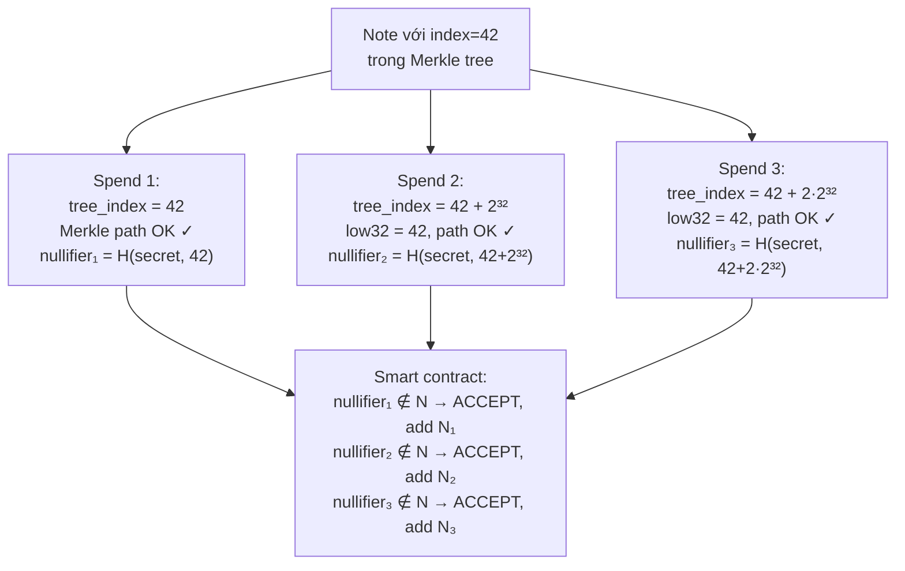
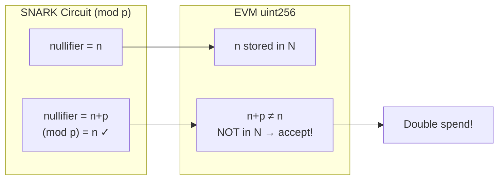

> **Prerequisites**: [[01-intro-taxonomy-zk-exploits|01. Taxonomy]], [[02-under-constrained-dark-forest-bigint|02. Under-constrained Circuits]], khái niệm Merkle tree, ECDSA signature sơ bộ
> **Objectives**:
> - Hiểu vai trò của nullifier trong ZK privacy protocols và tại sao nullifier phải deterministic
> - Phân tích ba case study thực tế: Aztec 2.0, StealthDrop, ZkDrops — ba root cause khác nhau dẫn đến cùng kết quả double-spend
> - Nắm vững lỗ hổng field boundary (EVM 256-bit vs SNARK 254-bit) và cách exploit
> - Biết cách viết và review nullifier generation circuits để tránh nondeterminism

---

## Nullifier là gì và tại sao phải Deterministic?

Trong ZK privacy protocols (ví dụ: Zcash, Aztec, TornadoCash), người dùng sở hữu "notes" — các commitment mã hóa biểu diễn tài sản. Để **chi tiêu** một note, user tạo ZK proof và đồng thời post một **nullifier** lên on-chain.

> [!definition] Definition 4.1 — Nullifier Pattern
> **Nullifier** là một giá trị duy nhất gắn với mỗi note. Hệ thống lưu set $\mathcal{N}$ các nullifier đã dùng. Khi chi tiêu:
>
> 1. User tạo proof: "Tôi biết secret của note $C$, và nullifier $N = f(\text{secret}, \text{index})$"
> 2. Smart contract kiểm tra: $N \notin \mathcal{N}$ (chưa dùng)
> 3. Nếu hợp lệ: ghi $N$ vào $\mathcal{N}$, thực hiện transfer
>
> **Yêu cầu**: $f$ phải **deterministic** — cùng secret + index luôn cho cùng $N$. Nếu $f$ nondeterministic, cùng note có thể tạo ra nhiều $N$ khác nhau, mỗi $N$ đều hợp lệ → double-spend.

Ba case study trong bài này có cùng hậu quả (double-spend) nhưng ba root cause hoàn toàn khác nhau.

---

## Case Study 1: Aztec 2.0 — Missing Bit Length Check trên Tree Index

### Bối cảnh

Aztec 2.0 là private rollup trên Ethereum sử dụng TurboPlonK. Mỗi "note commitment" được lưu trong một Merkle tree on-chain. Nullifier được tính từ note secret và **vị trí (index)** của note trong cây.

### Root Cause

Circuit Aztec 2.0 dùng `tree_index` (vị trí note trong Merkle tree) làm một trong các inputs của nullifier hash. Code giả định `tree_index` là số 32-bit, nhưng **không có constraint nào enforce điều này**:

```text
// Pseudocode minh họa logic Aztec 2.0 buggy
nullifier = PedersenHash(note_secret, tree_index)

// Merkle path proof check:
// circuit kiểm tra note tồn tại tại vị trí tree_index[31:0]
// nhưng tree_index chưa được constrain về 32 bits!
```

> [!danger] Vulnerability 4.2 — Aztec 2.0 Nondeterministic Nullifier
> `tree_index` là field element (254-bit). Circuit chỉ check 32 bits thấp cho Merkle path, nhưng nullifier hash dùng **toàn bộ field element**. Kẻ tấn công có thể dùng:
>
> - `tree_index₁ = 42` → nullifier₁
> - `tree_index₂ = 42 + 2³²` → nullifier₂ ≠ nullifier₁ (nhưng Merkle path vẫn valid!)
> - `tree_index₃ = 42 + 2·2³²` → nullifier₃ ≠ nullifier₁, nullifier₂
>
> Ba nullifier khác nhau, tất cả valid → chi tiêu cùng note 3 lần.

### Attack Flow



### PoC Python

```python
p = 21888242871839275222246405745257275088548364400416034343698204186575808495617

def nullifier_buggy(secret, tree_index_full):
    """Hash dùng toàn bộ field element — BUGGY"""
    return (secret * 31337 + tree_index_full) % p

note_secret = 0xABCDEF
correct_index = 42

nullifiers = set()
for extra in range(4):
    evil_index = correct_index + (extra << 32)
    low32 = evil_index & 0xFFFFFFFF
    assert low32 == correct_index   # Merkle path vẫn valid!
    nf = nullifier_buggy(note_secret, evil_index)
    print(f"index={hex(evil_index)}: nullifier={hex(nf)}, new={nf not in nullifiers}")
    nullifiers.add(nf)

# Output: 4 nullifiers khác nhau => spend 4 lần!
```

### Fix

```text
// FIX: Constrain tree_index là số 32-bit
component n2b = Num2Bits(32);
n2b.in <== tree_index;    // tạo constraint: tree_index < 2^32

nullifier = PedersenHash(note_secret, tree_index)
```

Sau fix, `tree_index` bị constrain chặt vào $[0, 2^{32})$. Mọi attempt dùng `tree_index > 2^{32}` sẽ fail constraint.

---

## Case Study 2: 0xPARC StealthDrop — ECDSA Nondeterminism

### Bối cảnh

StealthDrop là một airdrop protocol dùng ZK proof để cho phép người có địa chỉ Ethereum nhận token một cách private. Người nhận phải prove rằng mình nằm trong whitelist mà không lộ địa chỉ.

### Thiết kế Nullifier

Để ngăn nhận airdrop nhiều lần, StealthDrop dùng **ECDSA signature** làm nullifier:

```text
nullifier = keccak256(r, s)   // (r, s) là ECDSA signature
```

Circuit chứng minh `(r, s)` là chữ ký hợp lệ của địa chỉ Ethereum trên một message cụ thể.

### Root Cause: ECDSA là Nondeterministic

> [!danger] Vulnerability 4.3 — ECDSA Nondeterministic Nullifier
> ECDSA **không** là deterministic theo mặc định. Với cùng private key $d$ và message $m$:
>
> $$s = k^{-1}(H(m) + r \cdot d) \bmod n$$
>
> Mỗi lần chọn một nonce $k$ ngẫu nhiên khác nhau sẽ cho $r = x(k \cdot G)$ và $s$ khác nhau. Tất cả đều là **chữ ký hợp lệ** cho cùng $m$ và $d$.
>
> Kẻ tấn công tạo 100 chữ ký hợp lệ với 100 nonces khác nhau → 100 nullifiers khác nhau → 100 airdrop claims.

### Attack Flow

```text
Attacker có private key d, địa chỉ addr = d*G mod n (trong whitelist)

Lần 1: chọn nonce k₁ → (r₁, s₁) → nullifier₁ = hash(r₁,s₁) → claim airdrop
Lần 2: chọn nonce k₂ → (r₂, s₂) → nullifier₂ = hash(r₂,s₂) ≠ nullifier₁ → claim again
Lần N: chọn nonce kₙ → (rₙ, sₙ) → nullifierₙ → claim Nth time
```

### Fix: Dùng Deterministic Nullifier

Thay vì dùng signature làm nullifier, dùng **hash của private key và message**:

```text
nullifier = PoseidonHash(privkey, message)
```

Nhưng điều này đòi hỏi `privkey` phải là **private input** của circuit — điều StealthDrop muốn tránh ban đầu. Tuy nhiên đây là trade-off bắt buộc: để nullifier deterministic, cần có một secret không đổi liên kết với danh tính.

> [!warning] Lesson 4.4 — Nullifier Design Principles
> Một nullifier đúng đắn phải:
>
> 1. **Deterministic**: cùng inputs luôn cho cùng output
> 2. **Unique**: mỗi "spend action" có nullifier khác nhau
> 3. **Collision-resistant**: khó tìm hai inputs khác nhau cho cùng nullifier
> 4. **One-way** (nếu privacy cần thiết): không thể recover inputs từ nullifier
>
> ECDSA signature vi phạm điều kiện **1** (nondeterministic).

---

## Case Study 3: a16z ZkDrops — EVM vs SNARK Field Boundary

### Bối cảnh

ZkDrops là protocol tương tự StealthDrop của a16z. Nullifier được tính deterministically trong circuit, nhưng smart contract **không validate** rằng nullifier nằm trong SNARK scalar field trước khi lưu.

### Root Cause: Arithmetic Field Boundary Mismatch

> [!definition] Definition 4.5 — EVM vs SNARK Field Mismatch
> **SNARK scalar field** (BN254): $p = 21888242871839275222246405745257275088548364400416034343698204186575808495617 \approx 2^{254}$
>
> **EVM uint256**: $2^{256}$ — lớn hơn $p$.
>
> Trong SNARK circuit, mọi phép tính đều modulo $p$. Vì vậy $n$ và $n + p$ là **cùng một giá trị** trong circuit:
>
> $$(n + p) \bmod p = n$$
>
> Nhưng trong EVM, $n$ và $n + p$ là **hai giá trị uint256 khác nhau** (miễn là $n + p < 2^{256}$).

### Exploit

Giả sử nullifier hợp lệ là $n$ (với $n < p$):

- Smart contract check: $n \notin \mathcal{N}$ → OK, add $n$ → spend
- Tấn công tiếp: post $n' = n + p$ on-chain
  - Circuit: $(n + p) \bmod p = n$ → circuit verify nullifier $= n$ → proof hợp lệ
  - Smart contract: $n' = n + p \notin \mathcal{N}$ (khác với $n$) → OK, add $n'$ → **spend again!**



### PoC Python

```python
p = 21888242871839275222246405745257275088548364400416034343698204186575808495617

# Nullifier hợp lệ từ circuit
n = 12345678901234567890

# Bước 1: spend bình thường
nullifier_set = set()
nullifier_set.add(n)
print(f"Spend 1: nullifier={n} → added to set")

# Bước 2: tấn công với n + p
n_evil = n + p
circuit_sees = n_evil % p   # circuit reduce mod p
evm_sees = n_evil           # EVM stores as uint256

print(f"\nAttack: post nullifier = n + p = {n_evil}")
print(f"Circuit sees: {circuit_sees} (= n, proof valid!)")
print(f"EVM sees:     {evm_sees}")
print(f"In nullifier_set: {n_evil in nullifier_set}")   # False!
print(f"=> EVM accepts, double-spend succeeds!")

# Fix
def safe_accept_nullifier(nullifier, nullifier_set, p):
    """Fixed: check nullifier < p trước khi accept"""
    if nullifier >= p:
        print(f"REJECTED: nullifier {nullifier} >= p")
        return False
    if nullifier in nullifier_set:
        print(f"REJECTED: nullifier already used")
        return False
    nullifier_set.add(nullifier)
    return True

print(f"\nWith fix:")
new_set = set()
print(f"n     accepted: {safe_accept_nullifier(n, new_set, p)}")
print(f"n+p   accepted: {safe_accept_nullifier(n_evil, new_set, p)}")
```

### Fix trong Smart Contract

```solidity
// VULNERABLE
function withdraw(uint256 nullifier, ...) external {
    require(!usedNullifiers[nullifier], "Already used");
    usedNullifiers[nullifier] = true;
    // ...
}

// FIXED: kiểm tra nullifier < field order
uint256 constant SNARK_FIELD = 21888242871839275222246405745257275088548364400416034343698204186575808495617;

function withdraw(uint256 nullifier, ...) external {
    require(nullifier < SNARK_FIELD, "Nullifier out of field");
    require(!usedNullifiers[nullifier], "Already used");
    usedNullifiers[nullifier] = true;
    // ...
}
```

---

## So sánh Ba Case Study

| | Aztec 2.0 | StealthDrop | ZkDrops |
|-|-----------|-------------|---------|
| **Root cause** | tree_index không constrained về 32 bits | ECDSA là nondeterministic | EVM uint256 vs SNARK F_p boundary |
| **Vuln layer** | Circuit (Layer 3) | Circuit design (Layer 3) | Smart contract (Layer 4) |
| **Null. nguồn** | PedersenHash(secret, index) | ECDSA signature (r,s) | Hash trong circuit |
| **Attack** | Thêm high bits vào index | Dùng nonce khác cho ECDSA | Post n+p on-chain |
| **Fix** | `Num2Bits(32)` trên tree_index | Đổi nullifier = PoseidonHash(privkey, msg) | Check `nullifier < p` on-chain |
| **Discovered** | Aztec internal (Kevaundray W.) | 0xPARC internal | 0xPARC Bug Tracker |

---

## Pattern Nhận Diện khi Audit

> [!tip] Audit Pattern 4.6 — Nullifier Security Checklist
>
> **Trong circuit**:
> 1. Tất cả inputs của nullifier hash có được constrained về số bits không?
> 2. Có component nào trong nullifier computation là nondeterministic không? (ECDSA, random nonces)
> 3. Nullifier hash function có phải là collision-resistant ZK-friendly hash không? (Poseidon, MiMC, Pedersen)
>
> **Trong smart contract**:
> 4. Contract có check `nullifier < SNARK_FIELD_ORDER` trước khi store không?
> 5. Nullifier được store trong `mapping(uint256 => bool)` hay structure khác — cẩn thận với collision trong key encoding.
>
> **Cross-layer**:
> 6. Có mismatch nào giữa cách circuit và contract interpret cùng một giá trị không?

---

## Bug Bounty Takeaway — Áp dụng vào zkVerify

zkVerify nhận proof từ nhiều proof system và verify chúng. Khi audit:

1. **Nullifier/commitment handling**: nếu zkVerify có bất kỳ cơ chế nào track "đã dùng" (replay protection), check xem field boundary được handle đúng không.
2. **Cross-layer data flow**: khi giá trị đi từ circuit output sang Rust/Solidity on-chain code, có xảy ra field boundary mismatch không?
3. **Input validation trong circuit**: với bất kỳ index hay counter nào được dùng làm nullifier input, check xem nó có được constrain về số bits không.

---

## Summary / Key Takeaways

- **Nullifier phải deterministic**: cùng note phải cho cùng nullifier. Nếu có nhiều valid witness cho cùng public input dẫn đến nullifier khác nhau → double-spend.
- **Aztec 2.0**: `tree_index` không constrained → prover dùng nhiều field elements khác nhau có cùng 32 bits thấp → nhiều nullifiers.
- **StealthDrop**: ECDSA nondeterministic by design → nhiều valid signatures → nhiều nullifiers. Fix: đổi sang deterministic nullifier (Poseidon hash với private key).
- **ZkDrops**: EVM uint256 ≠ SNARK field $\mathbb{F}_p$ → $n$ và $n+p$ là cùng một giá trị trong circuit nhưng khác nhau trong EVM → double-spend qua field overflow. Fix: contract check `nullifier < p`.
- Pattern chung: bất cứ khi nào giá trị **cross ranh giới từ circuit sang on-chain code**, cần đảm bảo hai side agree về cách interpret cùng một bit pattern.

---

## References

- Aztec 2.0 vulnerability disclosure — https://aztec.network/blog/vulnerabilities-patched-in-aztec-2-0
- Aztec detailed HackMD disclosure — https://hackmd.io/@aztec-network/disclosure-of-recent-vulnerabilities
- 0xPARC ZK Bug Tracker — #6 Aztec 2.0, #8 StealthDrop, #9 ZkDrops — https://github.com/0xPARC/zk-bug-tracker
- EY Nightfall missing nullifier range check (similar EVM vs SNARK bug) — 0xPARC Bug Tracker #18
