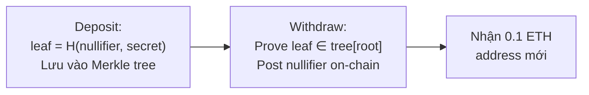
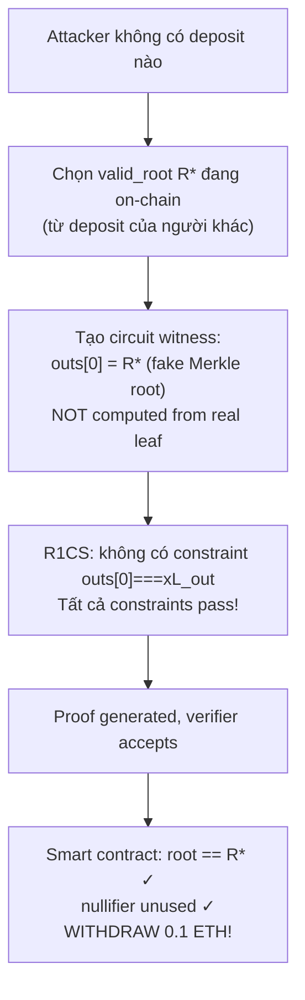

> **Prerequisites**: [[01-intro-taxonomy-zk-exploits|01. Taxonomy]], Circom operator semantics (`<==`, `<--`, `===`), TornadoCash protocol overview
> **Objectives**:
> - Nắm rõ sự khác biệt giữa *assignment* và *constraint* trong Circom
> - Phân tích MiMC hash bug trong circomlib: một ký tự `=` thay vì `<==` → drain contract
> - Hiểu attack path hoàn chỉnh: fake Merkle root → withdraw không có deposit
> - Nhận diện pattern tương tự trong MACI 1.0 và các codebase khác

---

## Circom Operators: Assignment vs Constraint

Trong Circom, có sự phân tách căn bản giữa hai phase:

- **Witness generation (computation)**: Prover tính toán giá trị cho tất cả signals
- **Constraint check (verification)**: Verifier xác nhận witness thỏa mãn tất cả phương trình R1CS

> [!definition] Definition 5.1 — Circom Operator Semantics
>
> | Operator | Ý nghĩa | An toàn? |
> |----------|---------|---------|
> | `<==` | Assign **VÀ** constrain (R1CS) | ✅ Dùng cho mọi signal assignment |
> | `===` | Constrain only | ✅ Dùng sau `<--` |
> | `<--` | Assign only — **không constraint** | ⚠️ Chỉ cho non-quadratic hints |
> | `=` | Variable assignment (var, không signal) | ❌ **Không dùng cho signals** |
>
> **Quy tắc vàng**: Mọi signal output phải được constrain. Nếu chỉ dùng `<--` hoặc nhầm `=`, prover tự do gán bất kỳ giá trị.

Cái bẫy: trong phiên bản cũ Circom, dùng `=` trên signal **không gây compile error** — nó hoàn toàn im lặng.

---

## Case Study: MiMC Hash trong circomlib

### Bối cảnh TornadoCash

TornadoCash là privacy mixer: deposit 0.1 ETH, nhận note bí mật, sau đó withdraw từ address mới mà không ai biết link.



Hàm $H$ dùng **MiMC** — ZK-friendly hash function trong circomlib, tính:

$$x_{i+1} = (x_i + k + c_i)^3 \pmod{p}$$

### Root Cause: `=` thay vì `<==`

Trong `MiMCSponge` (phiên bản buggy), sau khi tất cả rounds được tính:

```circom
template MiMCSponge(nInputs, nRounds, nOutputs) {
    signal input ins[nInputs];
    signal input k;
    signal output outs[nOutputs];

    component S[nRounds * nInputs];
    // ... (tính xL_out qua các rounds)

    // ============ BUG: = thay vì <== ============
    outs[0] = S[nInputs - 1].xL_out;
    //      ^--- chỉ ASSIGN trong witness gen, KHÔNG tạo R1CS constraint!
}
```

> [!danger] Vulnerability 5.2 — MiMC Assigned but Not Constrained
> `outs[0] = S[...].xL_out` chỉ gán giá trị trong witness generation. **Không có constraint** buộc `outs[0] === xL_out` trong R1CS.
>
> Prover có thể gán `outs[0]` = bất kỳ giá trị nào mà không vi phạm bất kỳ constraint nào.

### Exploit Path



### PoC Python

```python
p = 21888242871839275222246405745257275088548364400416034343698204186575808495617

def mimc_correct(x, k, rounds, p):
    for r in range(rounds):
        c = (r * r + 42) % p
        x = pow(x + k + c, 3, p)
    return x

# Root hợp lệ on-chain từ deposit của người khác
valid_root = mimc_correct(12345, 0, rounds=10, p=p)
print(f"Valid root on-chain: {hex(valid_root)[:20]}...")

# Kẻ tấn công không có deposit: leaf = 99999 không tồn tại trong cây
computed_root = mimc_correct(99999, 0, rounds=10, p=p)
print(f"Attacker computed root: {hex(computed_root)[:20]}...")
print(f"Matches valid_root? {computed_root == valid_root}")  # False

# Với bug: attacker override outs[0] = valid_root trong witness
print(f"\nWith bug: manually set outs[0] = valid_root")
print(f"R1CS has NO constraint: outs[0] === xL_out")
print(f"Verifier: valid_root == valid_root => PASSES!")
print(f"=> Withdraw 0.1 ETH without any deposit!")
```

> [!example] Example 5.3 — TornadoCash Self-Exploit (October 2019)
> Khi phát hiện bug, team TornadoCash đã tự exploit contract của mình trước kẻ tấn công:
>
> Tạo 100 proof giả → withdraw toàn bộ ETH → deploy contract mới → hoàn trả toàn bộ cho depositors.
>
> Toàn bộ user funds được bảo vệ. Anonymity không bị ảnh hưởng.

### Fix

```circom
// FIXED: thay = bằng <==
outs[0] <== S[nInputs - 1].xL_out;
//        ^^^
// Tạo constraint trong R1CS: outs[0] - xL_out === 0
// Prover không thể gán outs[0] khác xL_out
```

---

## Case Study: MACI 1.0 — Cùng Pattern, Context Voting

MACI (Minimal Anti-Collusion Infrastructure) là hệ thống voting chống collusion: users vote bí mật, coordinator tally kết quả và tạo ZK proof chứng minh tally đúng.

Bug: trong circuit xử lý batch messages, một intermediate state root được computed nhưng không được constrained:

```circom
template ProcessMessages(...) {
    signal input currentStateRoot;   // public
    signal output newStateRoot;      // public

    component hasher = Poseidon(nInputs);
    hasher.inputs <== processed_data;

    // BUG: assign without constraint
    newStateRoot <-- hasher.out;
    // MISSING: newStateRoot === hasher.out
}
```

> [!danger] Vulnerability 5.4 — MACI Vote Manipulation
> Coordinator (người chạy proof generation) có thể set `newStateRoot` thành bất kỳ state root nào — kể cả state tương ứng với kết quả vote giả. ZK proof vẫn valid vì không có constraint.
>
> **Impact**: Kết quả bầu cử bị manipulate mà không ai phát hiện được từ proof.

---

## Tại sao Lỗi Này Phổ Biến?

Có bốn nguyên nhân chính:

**Syntax gần giống nhau**: `=` và `<==` cách nhau hai ký tự, rất dễ typo, khó nhìn ra khi review nhanh.

**Compiler cũ im lặng**: Circom < 2.0 không báo lỗi khi dùng `=` cho signal — lỗi chỉ xuất hiện lúc runtime (proof pass verifier sai).

**Non-quadratic expressions**: R1CS chỉ cho phép constraints bậc ≤ 2. Khi cần tính bậc 3 trở lên, developer phải dùng `<--` rồi thêm `===` riêng — và đôi khi quên bước thứ hai.

**Copy-paste without understanding**: đặc biệt nguy hiểm với circuit libraries — developer dùng template mà không hiểu implicit contract.

> [!tip] Audit Pattern 5.5 — Phát hiện Assigned-Not-Constrained
>
> 1. **Circomspect** (Trail of Bits): `circomspect circuit.circom` — flag mọi `<--` và `=` trên signals.
> 2. **Manual search**: `grep -n "<--" *.circom` — mỗi kết quả cần review để đảm bảo có `===` sau đó.
> 3. **ECNE / Picus**: formal verification, phát hiện underconstrained signals tự động.
> 4. **Đặc biệt**: kiểm tra `outs[i]` của mọi hash component — đây là nơi hay bị bỏ constraint nhất.

---

## So sánh Với Lesson 03: Hai Mặt Của Cùng Vấn Đề

| | Circom-Pairing (Lesson 03) | MiMC TornadoCash (Lesson 05) |
|-|---------------------------|------------------------------|
| **Bug** | `lt.out` không được constrain | `outs[0]` dùng `=` thay vì `<==` |
| **Prover freedom** | Cung cấp input ngoài range | Set hash output thành giá trị tùy ý |
| **Impact** | Signature forgery | Drain contract |
| **Pattern** | Missing `===` trên output | Dùng `=` thay vì `<==` |

Cả hai đều là biểu hiện của cùng một root cause: **signal không bị constrain đúng cách**.

---

## Bug Bounty Takeaway — Áp dụng vào zkVerify

Khi review zkVerify circuits và verifier code:

1. **Grep mọi `<--` trong circuit code** — mỗi occurrence cần manual verification rằng có `===` tương ứng.
2. **Hash function outputs** (Poseidon, MiMC, Pedersen): đây là những điểm hay bị bỏ constraint nhất.
3. **Boundary giữa các sub-circuits**: khi kết quả component A truyền sang B, đảm bảo có constraint linking.
4. **Dùng Circomspect tự động** trước khi review thủ công — nó đã catch cả TornadoCash bug.

---

## Summary / Key Takeaways

- **Assignment ≠ Constraint**: `<--` và `=` chỉ gán giá trị trong witness generation, không tạo R1CS constraint nào.
- **MiMC bug**: một ký tự `=` thay vì `<==` trong circomlib → prover tự do set hash output → fake Merkle root → drain TornadoCash.
- **MACI 1.0**: cùng pattern → coordinator manipulate vote results.
- **Fix**: đổi `=` thành `<==` hoặc thêm `=== ` constraint riêng.
- **Công cụ**: Circomspect là lớp phòng thủ đầu tiên cho loại bug này.

---

## References

- TornadoCash self-exploit post — https://tornado-cash.medium.com/tornado-cash-got-hacked-by-us-b1e012a3c9a8
- 0xPARC ZK Bug Tracker — #14 MiMC Hash — https://github.com/0xPARC/zk-bug-tracker
- Circomspect — https://blog.trailofbits.com/2022/09/15/it-pays-to-be-circomspect/
- Veridise: ZK Vulnerabilities Sharp Rocks — https://medium.com/veridise/zk-vulnerabilities-sharp-rocks-hidden-in-deep-water-7cad8d4c2dfa
