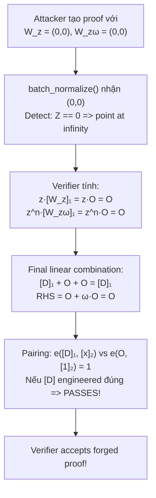

> **Prerequisites**: [[01-intro-taxonomy-zk-exploits|01. Taxonomy]], PLONK verification protocol (tổng quan), elliptic curve points và pairing cơ bản, khái niệm "point at infinity"
> **Objectives**:
> - Hiểu vai trò của $[W_z]_1$ và $[W_{z\omega}]_1$ trong PLONK final verification
> - Phân tích tại sao setting proof elements = $(0,0)$ làm pairing check trivially pass
> - Trace qua bug trong C++ `batch_normalize()` của Aztec và cách nó hiểu $(0,0)$ sai
> - Nhận diện class lỗi "invalid curve point không bị reject" trong verifier implementations
> - Biết cách viết và kiểm tra point validation trong verifier code

---

## Bối cảnh: PLONK Final Verification Step

PLONK là một trong những proof system quan trọng nhất — nền tảng của UltraPlonK, Halo2, và nhiều zkEVM. Bài này phân tích một lỗ hổng trong **verifier C++** của Aztec, layer 2 của Ethereum dùng PLONK.

Người phát hiện là **Nguyen Thoi Minh Quan**, nhận bounty $15,000. Bug thuộc loại hiếm gặp: không nằm ở circuit hay constraint system, mà nằm ở **verifier implementation** — tầng xử lý elliptic curve arithmetic.

### PLONK Verification Protocol (tóm tắt)

Sau khi trao đổi các round, PLONK verifier thực hiện **final check** dưới dạng một pairing equation. Về bản chất, verifier cần xác nhận rằng nhiều polynomial openings — được commit bằng KZG — đều hợp lệ tại các evaluation points.

Final check có dạng:

$$e\!\left(\sum_i \alpha^i [W_i]_1 + [D]_1,\; [x]_2\right) = e\!\left([E]_1,\; [1]_2\right)$$

Trong đó $[W_z]_1$ và $[W_{z\omega}]_1$ là các **opening proofs** của KZG tại challenge points $z$ và $z\omega$. Đây là hai group elements trong $\mathbb{G}_1$ do prover cung cấp như một phần của proof.

---

## The Zero Bug: Point at Infinity Mishandling

### Điểm Vô Cực trên Elliptic Curve

> [!definition] Definition 6.1 — Point at Infinity
> Trên elliptic curve $E$, **điểm vô cực** $\mathcal{O}$ là phần tử trung tính (identity element) của group:
>
> $$\mathcal{O} + P = P \quad \forall P \in E$$
>
> Trong projective coordinates, $\mathcal{O} = (0:1:0)$. Trong affine coordinates, $\mathcal{O}$ thường được biểu diễn bằng một **special flag** hoặc agreed-upon sentinel value.
>
> **Crucial property cho pairing**: $e(\mathcal{O}, Q) = 1_{G_T}$ vì pairing là bilinear và $\mathcal{O} = 0 \cdot P$:
>
> $$e(\mathcal{O}, Q) = e(0 \cdot P, Q) = e(P, Q)^0 = 1$$

### Root Cause trong C++ Implementation

Aztec's verifier được viết bằng C++ và dùng `batch_normalize()` để chuyển đổi nhiều G1 points từ **projective** sang **affine** coordinates. Hàm này dùng Montgomery batch inversion để hiệu quả.

> [!danger] Vulnerability 6.2 — Faulty Point at Infinity Detection
> Hàm `batch_normalize()` kiểm tra xem một điểm có phải $\mathcal{O}$ không bằng cách check `Z == 0` trong projective coordinates. Khi prover submit proof với một element là $(0, 0)$ trong affine coordinates, `batch_normalize()` sẽ:
>
> 1. Tính $Z = 0$ (vì affine $(0,0)$ map sang projective $(0:0:0)$, không phải $(0:1:0)$)
> 2. Phát hiện `Z == 0` → kết luận "đây là điểm vô cực"
> 3. Trả về point at infinity $\mathcal{O}$ cho element đó
>
> Nhưng $(0, 0)$ trong affine **không phải** điểm vô cực — nó là điểm giả không nằm trên curve! Tuy nhiên verifier không validate điều này trước.

### Chuỗi Bug: Từ $(0,0)$ đến Proof Forgery



### Tại sao điều này cho phép Proof Forgery?

Xem xét verification equation dạng đơn giản:

$$e([W_z]_1 + [W_{z\omega}]_1,\; [x - z]_2) \cdot e(-[D]_1,\; [1]_2) = 1$$

Nếu $[W_z]_1 = [W_{z\omega}]_1 = \mathcal{O}$:

$$e(\mathcal{O},\; [x - z]_2) \cdot e(-[D]_1,\; [1]_2) = 1 \cdot e(-[D]_1,\; [1]_2)$$

Equation trở thành:

$$e(-[D]_1,\; [1]_2) = 1$$

Điều này tương đương $-[D]_1 = \mathcal{O}$, tức $[D]_1 = \mathcal{O}$.

Nếu attacker also set $[D]_1 = \mathcal{O}$ (hoặc các elements khác đúng vị trí), toàn bộ equation trivially holds — **verifier accepts proof cho statement bất kỳ**.

### PoC Python — Minh họa Pairing với Point at Infinity

```python
# Mô phỏng abstract: tại sao e(O, Q) = 1 làm verification trivial

def mock_pairing(P, Q):
    """Mô phỏng pairing: trả về 1 nếu P là point at infinity"""
    if P == "infinity":
        return 1  # bilinear property: e(0*G, Q) = 1
    return f"e({P},{Q})"  # normal pairing (non-trivial)

def plonk_verify_buggy(D, W_z, W_zomega, x_srs, public_inputs):
    """
    BUGGY verifier: không validate rằng W_z, W_zomega là valid curve points.
    (0,0) được treat như point at infinity.
    """
    # batch_normalize misidentifies (0,0) as infinity
    if W_z == (0, 0):
        W_z = "infinity"
    if W_zomega == (0, 0):
        W_zomega = "infinity"

    z = 42  # challenge
    omega = 7

    LHS_point = f"[{D}] + {z}*{W_z} + {z**2}*{W_zomega}"
    RHS_point = f"{W_z} + {omega}*{W_zomega}"

    lhs = mock_pairing(W_z, f"[x-{z}]")   # simplified
    rhs = mock_pairing(W_zomega, "[1]")

    if W_z == "infinity" and W_zomega == "infinity":
        print("  W_z and W_zomega both = O (infinity)")
        print("  e(O, ...) = 1 trivially")
        print("  Verification equation collapses to trivial check")
        return True  # BUG: always passes!

    return lhs == rhs

def plonk_verify_fixed(D, W_z, W_zomega, x_srs, public_inputs):
    """FIXED: validate proof elements before processing"""
    # Check: proof points must be valid non-infinity curve points
    for name, point in [("W_z", W_z), ("W_zomega", W_zomega)]:
        if point == (0, 0):
            print(f"  REJECTED: {name} = (0,0) is not a valid curve point")
            return False
        # Also: on_curve() check would go here
    return True  # proceed with actual verification

# Honest proof: W_z và W_zomega là valid G1 points
print("--- Honest proof ---")
result = plonk_verify_buggy("D_honest", (123, 456), (789, 101), "srs", [])
print(f"Verify: {result}")

# Forged proof: set W_z = W_zomega = (0,0)
print("\n--- FORGED proof: W_z = W_zomega = (0,0) ---")
result = plonk_verify_buggy("D_anything", (0, 0), (0, 0), "srs", [42])
print(f"Buggy verifier accepts forged proof: {result}")

print("\n--- Fixed verifier ---")
result = plonk_verify_fixed("D_anything", (0, 0), (0, 0), "srs", [42])
print(f"Fixed verifier accepts forged proof: {result}")
```

---

## Tại sao Bug Này Khó Thấy?

Lỗi này tinh tế vì nhiều lý do:

**1. "Happy path" hoạt động đúng**: Với proof hợp lệ từ honest prover, tất cả points đều là valid curve elements (không bao giờ là $(0,0)$). Verifier test cases bình thường không bao giờ kích hoạt bug.

**2. Math đúng, implementation sai**: PLONK protocol về mặt toán học là sound. Bug nằm ở **implementation detail** của `batch_normalize()` — một hàm tối ưu hiệu suất.

**3. Edge case hiếm gặp**: $(0,0)$ không phải là điểm trên curve BN254 thực tế (có thể verify bằng substitution vào curve equation $y^2 = x^3 + b$). Developer không có lý do để kiểm tra input này.

> [!warning] Warning 6.3 — Implementation Gap
> Đây là ví dụ điển hình của **implementation gap**: proof system đúng về toán học, nhưng implementation thiếu validation cho edge cases mà "về lý thuyết không thể xảy ra" trong honest execution.
>
> **Lesson**: Verifier LUÔN phải validate rằng proof elements là valid group members, ngay cả khi điều đó "hiển nhiên" từ góc độ protocol.

---

## Comparison: Zero Bug vs Frozen Heart

Lesson tiếp theo (07) sẽ nói về Frozen Heart. Có sự tương đồng thú vị:

| | Aztec Zero Bug | Frozen Heart (Lesson 07) |
|-|---------------|--------------------------|
| **Layer** | Verifier implementation (Layer 2) | Proof system (Layer 1) |
| **Attack** | Set proof elements = $(0,0)$ | Ép Fiat-Shamir challenge = 0 |
| **Mechanism** | $e(\mathcal{O}, Q) = 1$ | $z = r + 0 \cdot x = r$ |
| **Root cause** | Missing point validation | Incomplete Fiat-Shamir transcript |
| **Impact** | Forge proof cho any statement | Forge proof không biết secret |
| **Fix** | Validate $P \neq \mathcal{O}$ before verify | Include all public inputs in hash |

Cả hai đều khai thác việc **số 0 có properties đặc biệt** phá vỡ bảo mật.

---

## Audit Pattern: Verifier Input Validation

> [!tip] Audit Pattern 6.4 — Proof Element Validation Checklist
> Khi audit bất kỳ PLONK/Groth16/STARKs verifier nào:
>
> **G1/G2 elements trong proof**:
> 1. Check `x == 0 && y == 0` → reject (không phải điểm hợp lệ)
> 2. Check điểm có nằm trên curve: $y^2 \equiv x^3 + ax + b \pmod{p}$
> 3. Check điểm thuộc đúng subgroup (prime order subgroup check)
>
> **Scalars/field elements trong proof**:
> 4. Check $0 \leq \text{scalar} < r$ (scalar field order)
>
> **Đặc biệt cẩn thận với**:
> - Batch inversion / `batch_normalize()` — thường có edge case với 0
> - Any function mapping projective → affine — phải handle infinity đúng
> - Precompiled contracts on EVM (e.g., `ecAdd`, `ecMul`) — có own edge cases

---

## Kiểm tra trong Solidity / EVM Context

Khi zkVerify deploy verifier contracts trên-chain, similar bugs có thể xuất hiện trong Solidity:

```solidity
// VULNERABLE: không check point validity
function verify(uint[2] memory W_z, ...) public returns (bool) {
    // Nếu W_z = (0,0), Solidity ecMul precompile trả về (0,0)
    // và toàn bộ final pairing có thể collapse
    uint[3] memory input = [W_z[0], W_z[1], challenge_z];
    bool success;
    assembly { success := staticcall(gas(), 7, input, 0x60, result, 0x40) }
    // Tiếp tục với result = (0,0) mà không check!
}

// FIXED: validate trước khi dùng
function isValidG1Point(uint x, uint y) internal pure returns (bool) {
    if (x == 0 && y == 0) return false;
    // Check on_curve: y^2 = x^3 + 3 (for BN254)
    uint lhs = mulmod(y, y, P);
    uint rhs = addmod(mulmod(mulmod(x, x, P), x, P), 3, P);
    return lhs == rhs;
}
```

---

## Bug Bounty Takeaway — Áp dụng vào zkVerify

zkVerify nhận và verifies nhiều proof types. Khi audit verifier code:

1. **Tìm tất cả vị trí** code đọc proof elements (G1 points, scalars) — có validation không?
2. **Đặc biệt focus vào batch operations**: `batch_normalize`, batch inversion, multi-scalar multiplication — edge cases với 0.
3. **Test với forged inputs**: submit proof với elements = $(0,0)$, $(0, 1)$ (không trên curve), hoặc các points không thuộc correct subgroup.
4. **Cross-check với spec**: PLONK spec, Groth16 spec đều yêu cầu verify proof elements là valid group members — implementation có enforce không?

---

## Summary / Key Takeaways

- PLONK verifier final check dùng pairing: $e(\mathcal{O}, Q) = 1_{G_T}$ — nếu proof elements là $\mathcal{O}$, một phần verification equation trivially satisfied.
- Aztec C++ `batch_normalize()` misidentifies $(0,0)$ trong affine coordinates là point at infinity do check `Z == 0` trên projective representation không đúng.
- Attacker set $[W_z]_1 = [W_{z\omega}]_1 = (0,0)$ → verifier treats chúng như $\mathcal{O}$ → final pairing equation collapses → proof forgery.
- **Fix**: validate tất cả proof G1 elements trước khi xử lý: check $(x,y) \neq (0,0)$ và điểm nằm trên curve.
- Pattern tổng quát: **verifier phải reject bất kỳ proof element nào không phải valid group element** — ngay cả "impossible" edge cases.
- Discoverer: Nguyen Thoi Minh Quan — bounty $15,000.

---

## References

- Nguyen Thoi Minh Quan: "Using Zero to Attack ZKP PLONK C++" — https://github.com/cryptosubtlety/00
- 0xPARC ZK Bug Tracker — #7 Aztec PlonK Verifier — https://github.com/0xPARC/zk-bug-tracker
- HackMD: PlonK related vulnerabilities — https://hackmd.io/@daminha/Hy9z2LPbkg
- PLONK paper — Gabizon, Williamson, Ciobotaru (2019) — https://eprint.iacr.org/2019/953
