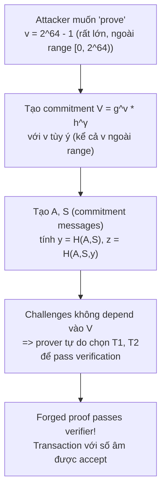
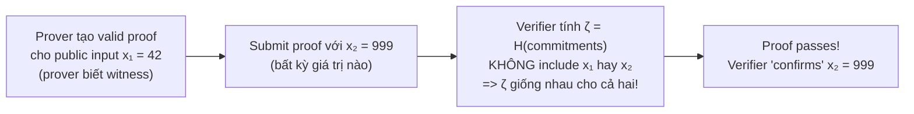

> **Prerequisites**: [[01-intro-taxonomy-zk-exploits|01. Taxonomy]], [[06-aztec-plonk-verifier-zero-bug|06. Aztec PlonK Zero Bug]], Fiat-Shamir transformation cơ bản, Sigma protocols, Pedersen commitment
> **Objectives**:
> - Hiểu tại sao Fiat-Shamir transformation phải bao gồm **toàn bộ** public context
> - Phân tích cơ chế forgery khi challenge không bind với public statement
> - Trace qua hai case study thực tế: Bulletproofs (lỗi trong paper gốc) và PlonK (Dusk Network, SnarkJS, gnark)
> - Viết được PoC Python minh họa Frozen Heart trên Sigma protocol đơn giản
> - Nhận diện và audit Fiat-Shamir implementations

---

## Nền tảng: Fiat-Shamir Transformation

Hầu hết ZK proof systems được thiết kế dưới dạng **interactive protocol**:

1. **Prover** tạo commitment ngẫu nhiên $A = g^r$
2. **Verifier** gửi challenge ngẫu nhiên $e \xleftarrow{\$} \mathbb{Z}_q$
3. **Prover** trả lời response $z = r + e \cdot x$

Tính bảo mật đến từ chỗ prover **không thể dự đoán** $e$ trước khi commit $A$. Nếu prover biết $e$ trước, họ có thể chọn $A$ và $z$ tùy ý để pass verification mà không cần biết secret $x$.

**Fiat-Shamir transformation** biến protocol interactive thành non-interactive bằng cách thay verifier bằng một **random oracle** (hash function):

$$e = H(\text{transcript})$$

> [!definition] Definition 7.1 — Secure Fiat-Shamir Rule
> Để Fiat-Shamir an toàn, hash transcript **phải bao gồm**:
>
> 1. **Tất cả public values của statement** được chứng minh (generators, public keys, commitments, public inputs)
> 2. **Tất cả commitment values** do prover tạo ra ở các bước trước
>
> Nếu bất kỳ public value nào bị bỏ qua, prover có thể **lợi dụng sự tự do đó** để forge proof.

---

## Frozen Heart: Cơ chế Tấn công Tổng quát

**Frozen Heart** (viết tắt: **F**o**R**ging **O**f **ZE**ro k**N**owledge proofs) là tên gọi Trail of Bits đặt cho lớp lỗ hổng này (công bố April 2022).

> [!danger] Vulnerability 7.2 — Frozen Heart Generic Attack
> Giả sử protocol Sigma: prove knowledge of $x$ s.t. $Y = g^x$.
>
> **Transcript đúng**: $e = H(g,\, Y,\, A)$
> **Transcript sai (bỏ $Y$)**: $e = H(g,\, A)$
>
> Khi $Y$ bị bỏ khỏi hash, kẻ tấn công có thể:
>
> 1. Chọn ngẫu nhiên $z$ và $A$
> 2. Tính $e = H(g, A)$ (challenge phụ thuộc hoàn toàn vào $A$)
> 3. Tính $A = g^z \cdot Y^{-e}$ — **reverse-engineer** commitment để verification pass
>
> Verification check: $g^z \stackrel{?}{=} A \cdot Y^e$
>
> Thay vào: $g^z = g^z \cdot Y^{-e} \cdot Y^e = g^z$ ✓ — **luôn pass!**

### PoC Python — Sigma Protocol với Frozen Heart

```python
import hashlib, random

q = 23   # group order (nhỏ để demo)
g = 2    # generator

def modexp(b, e, m): return pow(b, e, m)
def modinv(a, m):    return pow(a, -1, m)

def H_vuln(g, A, q):
    """Vulnerable: hash không bao gồm public key Y"""
    data = f"{g}{A}".encode()
    return int(hashlib.sha256(data).hexdigest(), 16) % (q-1) + 1

# Public key của victim
x_real = 7
Y = modexp(g, x_real, q)   # Y = 13

print(f"Forging proof for Y = {Y} without knowing x...")
for _ in range(10000):
    z_try = random.randint(1, q-2)
    e_try = random.randint(1, q-2)
    # A phải thỏa: A = g^z * Y^{-e}
    A_try = (modexp(g, z_try, q) * modinv(modexp(Y, e_try, q), q)) % q
    e_computed = H_vuln(g, A_try, q)
    if e_computed == e_try:
        lhs = modexp(g, z_try, q)
        rhs = (A_try * modexp(Y, e_try, q)) % q
        print(f"  Forged! z={z_try}, e={e_try}, A={A_try}")
        print(f"  g^z = {lhs}, A*Y^e = {rhs}")
        print(f"  Verification passes: {lhs == rhs}")
        break

# Fix: include Y in hash
def H_secure(g, Y, A, q):
    data = f"{g}{Y}{A}".encode()
    return int(hashlib.sha256(data).hexdigest(), 16) % (q-1) + 1
```

---

## Case Study 1: Bulletproofs — Lỗi trong Paper Gốc

### Bối cảnh

Bulletproofs là range proof system cho phép prove $v \in [0, 2^n)$ với Pedersen commitment $V = g^v \cdot h^\gamma$, không cần trusted setup. Được dùng rộng rãi trong Monero, Grin, và nhiều confidential transaction systems.

### Vấn đề trong Paper Gốc

Bulletproofs protocol tạo ba Fiat-Shamir challenges $y, z, x$ như sau (trong paper gốc):

$$y = H(A, S)$$
$$z = H(A, S, y)$$
$$x = H(A, S, y, z, T_1, T_2)$$

> [!danger] Vulnerability 7.3 — Bulletproofs: V not in Transcript
> **Không có challenge nào bao gồm $V$** — Pedersen commitment chứa giá trị $v$ cần được proven.
>
> Hậu quả: challenges $y, z, x$ không "bind" với $V$. Prover có thể commit tới một $V$ bất kỳ (kể cả $V$ tương ứng với $v \gg 2^n$, tức ngoài range), sau đó forged proof bằng cách reverse-engineer phần còn lại của transcript.
>
> **Tại sao nguy hiểm**: Bulletproofs thường dùng để prove số tiền trong transaction là non-negative (confidential transactions). Nếu forged, prover có thể "prove" một số âm là dương, dẫn đến integer overflow trong balance.

### Attack Flow



### Implementations bị ảnh hưởng

ING Bank's `zkrp`, SECBIT Labs' `ckb-zkp`, và Adjoint Inc.'s `bulletproofs` đều bị ảnh hưởng — tất cả follow paper gốc.

### Fix: Thêm $V$ vào mọi challenge

```python
# INSECURE (theo paper gốc):
y = H(A, S)
z = H(A, S, y)
x = H(A, S, y, z, T1, T2)

# SECURE:
y = H(g, h, V, n, A, S)        # thêm V, g, h, n
z = H(g, h, V, n, A, S, y)     # thêm V, g, h, n
x = H(g, h, V, n, A, S, y, z, T1, T2)  # thêm V, g, h, n
```

---

## Case Study 2: PlonK — Missing Public Inputs

### Bối cảnh

PlonK có 5 rounds, mỗi round tạo một Fiat-Shamir challenge. Challenge quan trọng nhất là $\zeta$ (zeta) ở Round 4 — dùng để evaluate tất cả polynomials.

### Vấn đề

> [!danger] Vulnerability 7.4 — PlonK: Public Inputs Missing from Challenge
> Trong các implementations bị ảnh hưởng (Dusk Network's `plonk`, Iden3's `snarkjs`, ConsenSys' `gnark`), challenge $\zeta$ được tính **không bao gồm public inputs** của circuit:
>
> ```python
> # VULNERABLE:
> zeta = H(commitment_a, commitment_b, commitment_c,
>          commitment_z, ...)   # public_inputs bị bỏ!
>
> # SECURE (theo PLONK spec):
> zeta = H(public_inputs, circuit_vk,
>          commitment_a, commitment_b, ...)
> ```
>
> Khi `public_inputs` không được bind vào $\zeta$, prover có thể tạo proof cho một public input, sau đó submit cùng proof đó với một public input **khác** — và verifier sẽ accept.

### Attack: Proof Swapping



**Ví dụ tấn công**: trong một ZK payment system dùng PlonK, public input là "số tiền được gửi = 1 ETH". Prover tạo proof cho 1 ETH, rồi resubmit với public input "số tiền = 1000 ETH". Verifier accept.

### Các implementations bị ảnh hưởng

| Implementation | Trạng thái | CVE/Issue |
|----------------|-----------|-----------|
| Dusk Network `plonk` | Fixed | Disclosed Apr 2022 |
| Iden3 `snarkjs` | Fixed | Disclosed Apr 2022 |
| ConsenSys `gnark` | Fixed | Disclosed Apr 2022 |

---

## Quy tắc Vàng: Fiat-Shamir Transcript Checklist

> [!tip] Audit Pattern 7.5 — Fiat-Shamir Security Checklist
>
> Khi review một Fiat-Shamir implementation, verify rằng **mỗi** challenge value bao gồm:
>
> **Layer 1 — Public statement**: generators $g, h$; public keys $Y, V$; bound ($n$ trong range proof)
>
> **Layer 2 — Circuit/protocol constants**: circuit verification key, trusted setup elements, field order
>
> **Layer 3 — Public inputs**: tất cả public witness values của circuit
>
> **Layer 4 — Prior commitments**: tất cả commitment values đã được tạo ra ở các bước trước trong cùng protocol
>
> Nếu **bất kỳ** element nào trong danh sách trên bị thiếu, đó là potential Frozen Heart.

### Pattern Nhận Diện Nhanh

```python
# RED FLAG: challenge được tính từ một tập nhỏ values
e = H(A, S)                          # SUSPICIOUS - thiếu public statement
zeta = H(comm_a, comm_b, comm_c)     # SUSPICIOUS - thiếu public inputs

# OK:
e = H(g, h, V, n, A, S)             # includes full public context
zeta = H(vk, pub_inputs, comm_a, comm_b, comm_c)  # includes public inputs
```

---

## So sánh: Bulletproofs vs PlonK Frozen Heart

| | Bulletproofs | PlonK |
|-|-------------|-------|
| **Missing element** | $V$ (Pedersen commitment) trong $y, z, x$ | Public inputs trong $\zeta$ |
| **Exploit** | Prove out-of-range value | Reuse proof cho public input khác |
| **Nguồn gốc** | Lỗi trong paper gốc (authors admit) | Lỗi trong implementation |
| **Severity** | Range proof bypass | Proof reuse cho arbitrary public input |
| **Affected** | ING zkrp, SECBIT ckb-zkp, Adjoint bulletproofs | Dusk, SnarkJS, gnark |
| **Fix** | Thêm $g, h, V, n$ vào tất cả challenges | Thêm public inputs và vk vào $\zeta$ |

---

## Bug Bounty Takeaway — Áp dụng vào zkVerify

zkVerify verify proof từ nhiều proof systems, tất cả đều có Fiat-Shamir implementations. Khi audit:

1. **Tìm mọi nơi tạo challenge**: `H(...)`, `sha256(...)`, `poseidon(...)` trong prover/verifier code.
2. **Liệt kê public context**: với mỗi challenge, liệt kê tất cả values mà prover biết khi commit — tất cả phải có trong hash.
3. **Đặc biệt chú ý**: public inputs của circuit, verification key, generators, và các commitment từ bước trước.
4. **Test với "transcript manipulation"**: tạo proof với public input A, submit với public input B — verifier có reject không?
5. **Rust code trong zkVerify**: tìm các struct `Transcript`, `Challenge`, hoặc `FiatShamir` — đảm bảo `append_message` được gọi với đầy đủ context trước `challenge_scalar`.

---

## Summary / Key Takeaways

- **Frozen Heart** là lỗ hổng khi Fiat-Shamir hash transcript thiếu một hoặc nhiều public values, cho phép prover forge proof mà không cần biết witness.
- **Rule**: transcript phải bind với **tất cả** public statement values, circuit constants, public inputs, và prior commitments.
- **Bulletproofs paper**: thiếu $V$ trong challenges $y, z, x$ → prover prove out-of-range values; ba libraries thực tế bị ảnh hưởng.
- **PlonK**: thiếu public inputs trong challenge $\zeta$ → prover reuse proof cho public input tùy ý; Dusk Network, SnarkJS, gnark bị ảnh hưởng.
- **Detection**: review mọi `H(...)` call, liệt kê arguments, so sánh với full public context list.
- **FROZEN** = **F**o**R**ging **O**f **ZE**ro k**N**owledge proofs.

---

## References

- Trail of Bits: Frozen Heart coordinated disclosure (April 2022) — https://blog.trailofbits.com/2022/04/13/part-1-coordinated-disclosure-of-vulnerabilities-affecting-girault-bulletproofs-and-plonk/
- Trail of Bits: Frozen Heart in Bulletproofs — https://blog.trailofbits.com/2022/04/15/the-frozen-heart-vulnerability-in-bulletproofs/
- Trail of Bits: Frozen Heart in PlonK — https://blog.trailofbits.com/2022/04/18/the-frozen-heart-vulnerability-in-plonk/
- 0xPARC ZK Bug Tracker — #11 Bulletproofs, #12 PlonK — https://github.com/0xPARC/zk-bug-tracker
- ZKDocs — Fiat-Shamir — https://www.zkdocs.com/docs/zkdocs/protocol-primitives/fiat-shamir/
