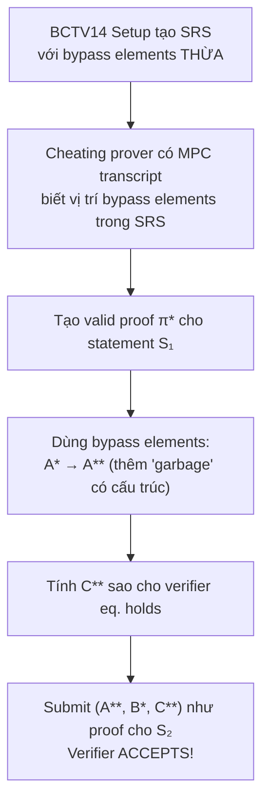

> **Prerequisites**: [[01-intro-taxonomy-zk-exploits|01. Taxonomy]], [[07-frozen-heart-bulletproofs-plonk|07. Frozen Heart]], Groth16 trusted setup sơ bộ, pairing-based SNARKs
> **Objectives**:
> - Hiểu cấu trúc và mục đích của trusted setup trong Groth16/BCTV14
> - Phân tích lỗ hổng "bypass elements" trong BCTV14 Appendix B — tại sao extra parameters vi phạm soundness
> - Trace qua timeline Zcash: phát hiện bí mật, fix âm thầm, public disclosure
> - Phân biệt hai loại trusted setup failures: toxic waste leak vs faulty setup algorithm
> - Hiểu các defense mechanisms: turnstile, ceremony design, và chuyển sang trustless systems

---

## Background: Trusted Setup là gì?

Proof systems như Groth16 cần một **Structured Reference String (SRS)** — bộ tham số public được tạo trước, chứa các powers of a secret trapdoor $\tau$:

$$\text{SRS} = \left([\tau]_1, [\tau^2]_1, \ldots, [\tau^n]_1,\; [\tau]_2, [\tau^2]_2, \ldots\right)$$

Trong đó $[\tau^i]_1 = \tau^i \cdot G_1$ là scalar multiplication trên curve.

> [!definition] Definition 8.1 — Toxic Waste
> **Toxic waste** là giá trị trapdoor $\tau$ (và các giá trị trung gian) trong trusted setup. Nếu $\tau$ bị tiết lộ, bất kỳ ai biết $\tau$ có thể tính $[\tau^i]_1$ cho mọi $i$ và forge proof cho **bất kỳ statement nào**.
>
> MPC ceremony: nhiều participants mỗi người đóng góp randomness, cuối cùng ai cũng bỏ phần của mình. Setup an toàn **miễn là ít nhất một participant honest** và xóa toxic waste.

### Hai loại Trusted Setup Failure

| Loại | Mô tả | Ví dụ |
|------|-------|-------|
| **Toxic waste leak** | $\tau$ bị lộ ra ngoài | Nếu tất cả participants thông đồng |
| **Faulty setup algorithm** | Setup tạo ra extra parameters vi phạm soundness | **BCTV14 bug — Zcash CVE-2019-7167** |

Zcash gặp **loại 2** — toxic waste **không bị lộ**, nhưng bản thân thuật toán setup có lỗi.

---

## Bối cảnh: Zcash Sprout và BCTV14

Zcash ra mắt tháng 10/2016 với **Sprout shielded pool** — giao dịch ẩn danh dùng zk-SNARKs. Proof system: **BCTV14** (Bitansky, Chiesa, Tromer, Virza 2014), một variant của Pinocchio cho asymmetric pairing.

MPC ceremony Sprout (tháng 10/2016) có 6 participants, mỗi người xóa hardware sau khi done (Peter Todd đốt máy bằng khò lửa, Zooko Wilcox phá hardware trước nhà báo...).

Toàn bộ MPC transcript được publish công khai ngay sau launch — đây là một điểm quan trọng.

---

## Root Cause: BCTV14 Appendix B — Extra Bypass Elements

### Cấu trúc Verification trong Groth16/Pinocchio

Trong Pinocchio-family SNARKs, proof gồm $(A, B, C)$ và verifier check:

$$e(A, B) = e(\alpha, \beta) \cdot e(C, \delta)$$

**Consistency check** đảm bảo $A$, $B$, $C$ sử dụng **cùng một tập witness values**:

$$A = \sum_i a_i \cdot [u_i(\tau)]_1, \quad B = \sum_i a_i \cdot [v_i(\tau)]_2, \quad C = \sum_i a_i \cdot [w_i(\tau)]_1$$

Chỉ prover với witness hợp lệ mới tạo được $A, B, C$ đúng.

### Bug: BCTV14 Tạo Thêm Parameters Không Cần Thiết

BCTV14 (Appendix B) — khi adapt Pinocchio cho asymmetric pairing — tạo thêm các elements trong SRS dạng:

$$\left[\delta^{-1} \cdot u_i(\tau)\right]_1 \quad \text{cho } i \in I_{\text{shifted}}$$

> [!danger] Vulnerability 8.2 — BCTV14 Bypass Elements
> Những "bypass elements" này **không cần thiết** cho proof generation đúng và **không nên có trong SRS**. Chúng vô tình để lộ thông tin về cấu trúc nội bộ của consistency check.
>
> Với những elements này, một cheating prover có thể:
>
> 1. Tạo proof $\pi^* = (A^*, B^*, C^*)$ cho một statement $S_1$ hợp lệ
> 2. Dùng bypass elements để "graft" thêm contribution vào $A^*$, tạo $A^{**}$
> 3. $A^{**}$ vẫn pass consistency check (vì bypass elements được thiết kế để compatible với check)
> 4. Nhưng $A^{**}$ giờ "đại diện" cho một statement $S_2$ khác
>
> Kết quả: forged proof $\pi^{**} = (A^{**}, B^*, C^{**})$ cho statement $S_2$ được verifier accept.

### Analogy Trực quan

Hình dung consistency check như một "seal" trên phong bì. Pinocchio/Groth16 đúng cách đặt seal sao cho không thể mở ra và thay nội dung. BCTV14 vô tình để lại một cái "khe hở" trong seal — bypass elements cho phép chèn nội dung mới mà seal vẫn intact.



---

## Timeline: Bí mật, Patch, và Disclosure

> [!example] Example 8.3 — Zcash Security Operation (2018-2019)
>
> **1 March 2018**: Ariel Gabizon phát hiện bug đêm trước talk tại Financial Cryptography conference. Liên hệ ngay với Sean Bowe.
>
> **Early March 2018**: Nhóm 4 người (Gabizon, Bowe, Zooko Wilcox, Nathan Wilcox) biết về bug. Quyết định giữ bí mật hoàn toàn.
>
> **March-October 2018**: Team develop fix (chuyển sang Groth16) trong khi giả vờ transcript bị "accidental deletion". Transcript thực sự được xóa ngay khi phát hiện bug.
>
> **28 October 2018**: Sapling upgrade activate — fix được deploy âm thầm vào Zcash mainnet mà không ai ngoài nhóm 4 người biết lý do thật.
>
> **Mid-November 2018**: Horizen và Komodo được thông báo bí mật và fix.
>
> **5 February 2019**: Public disclosure sau khi Sapling đã active ổn định. CVE-2019-7167 được assign.

---

## Điều kiện Khai thác

Để exploit, kẻ tấn công cần **đồng thời**:

1. **MPC ceremony transcript** — file chứa intermediate values từ setup (đã được publish và xóa)
2. **Cryptographic sophistication cao** — hiểu sâu pairing math, BCTV14 internals
3. **Không cần toxic waste** — $\tau$ vẫn bí mật, nhưng bypass elements trong SRS là đủ

Zcash đánh giá: rất ít người có đủ cả hai điều kiện, và transcript không được tải rộng rãi. Không có bằng chứng counterfeiting nào xảy ra (pool balance không tăng bất thường).

---

## Fix: Sapling và Groth16

### Immediate Fix

```text
BCTV14 SRS (có bypass elements):
  { [u_i(τ)]₁, [v_i(τ)]₂, [w_i(τ)]₁,
    [δ⁻¹·u_i(τ)]₁  <-- BYPASS ELEMENTS, should not exist! }

Groth16 SRS (clean):
  { [τⁱ]₁, [α·τⁱ]₁, [β·τⁱ]₁, [δ⁻¹·...correct elements...]₁,
    [τⁱ]₂, [γ]₂, [δ]₂ }  -- no extra bypass elements
```

Groth16 (Jens Groth 2016) được proved formally sound — không có bypass elements.

### Sapling Turnstile

Sapling không thể "fix" Sprout pool (vì Sprout params vĩnh viễn compromised). Thay vào đó, Zcash dùng **turnstile mechanism**:

- Không cho phép direct transfer Sprout → Sapling
- Funds phải đi qua transparent address trước
- Nếu attacker đã counterfeit ZEC trong Sprout, chúng bị locked trong Sprout pool
- Supply của transparent pool không bị ảnh hưởng

### Long-term Fix: Trustless Setup

Halo2 (NU5 upgrade, April 2022) loại bỏ hoàn toàn trusted setup cho Orchard pool — dùng IPA commitment thay vì KZG. Không còn toxic waste, không còn ceremony.

---

## Bài học: Trusted Setup Security

> [!tip] Lesson 8.4 — Trusted Setup Security Principles
>
> **Nguyên tắc 1**: Trusted setup ceremony transcript phải được giữ bí mật hoặc **không publish**. Zcash publish transcript để transparency — điều này tốt cho verifiability nhưng làm lộ bypass elements.
>
> **Nguyên tắc 2**: Proof system specification phải được **formally verified** — không chỉ implementation, mà cả algorithm trong paper. BCTV14 bug ở trong paper, không phải code.
>
> **Nguyên tắc 3**: **Prefer trustless systems** khi có thể (STARKs, Bulletproofs, Halo2 IPA). Nếu phải dùng trusted setup, dùng Groth16 với multi-party ceremony.
>
> **Nguyên tắc 4**: Khi phát hiện critical vulnerability: **patch trước, disclose sau**. Zcash xử lý responsibly — fix âm thầm, notify affected parties, rồi disclose khi safe.

---

## So sánh Hai Loại Trusted Setup Failure

| | Toxic Waste Leak | BCTV14 Bypass Elements |
|-|-----------------|----------------------|
| **Nguyên nhân** | τ bị tiết lộ (honest majority fail) | Faulty setup algorithm tạo extra params |
| **Cần biết τ?** | Có | **Không** |
| **Cần gì?** | τ (trapdoor) | MPC transcript + deep knowledge |
| **Detection** | Khó (vô hình) | Cũng khó — cần formal verification |
| **Defense** | MPC với nhiều participants | Dùng Groth16 (no bypass elements); formal verification |
| **Example** | Hypothetical | Zcash Sprout CVE-2019-7167 |

---

## Bug Bounty Takeaway — Áp dụng vào zkVerify

zkVerify verify Groth16, PLONK, và các proof systems khác. Khi review:

1. **Trusted setup parameters**: zkVerify dùng SRS từ đâu? Ceremony nào? Có verification key hash không?
2. **Groth16 verification key**: đảm bảo không có extra elements bất thường trong vk.
3. **Ceremony transcript**: nếu có transcript, xem xét các bypass elements (dành cho advanced research).
4. **Proof system version**: BCTV14 (Pinocchio) bị ảnh hưởng; Groth16 an toàn. zkVerify dùng gì?
5. **Subversion resistance**: Groth16 không subversion-resistant theo design — một participant dishonest đủ để break. Tham khảo: updatable SRS (PLONK) cho phép ceremony updates.

---

## Summary / Key Takeaways

- **CVE-2019-7167** là trusted setup vulnerability trong BCTV14 — không phải toxic waste leak mà là **faulty setup algorithm** tạo extra "bypass elements".
- Bypass elements trong SRS cho phép cheating prover forge proof cho bất kỳ statement nào, không cần biết τ.
- Zcash fix âm thầm qua Sapling upgrade (Oct 2018), disclose public Feb 2019 sau khi safe.
- **Không có bằng chứng** counterfeiting nào xảy ra — nhờ transcript không được download rộng rãi.
- Fix: chuyển sang **Groth16** (formally proved sound, no bypass elements) và dùng **Sapling turnstile**.
- Long-term: Halo2 (NU5) loại bỏ hoàn toàn trusted setup cho Orchard pool.
- Bài học quan trọng: formal verification phải cover cả **algorithm trong paper**, không chỉ implementation.

---

## References

- Zcash counterfeiting vulnerability disclosure — https://electriccoin.co/blog/zcash-counterfeiting-vulnerability-successfully-remediated/
- CVE-2019-7167 — https://cve.mitre.org/cgi-bin/cvename.cgi?name=CVE-2019-7167
- 0xPARC ZK Bug Tracker — #13 Zcash Trusted Setup — https://github.com/0xPARC/zk-bug-tracker
- BCTV14 paper — https://eprint.iacr.org/2013/879
- Groth16 paper (no bypass elements) — https://eprint.iacr.org/2016/260
- Zcash Sapling ceremony — https://z.cash/blog/completion-of-the-sapling-mpc/
