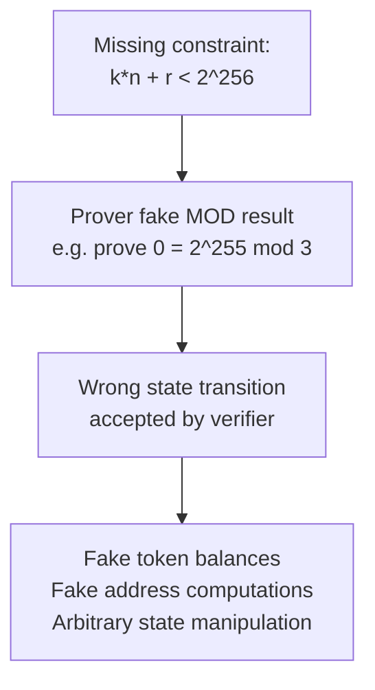
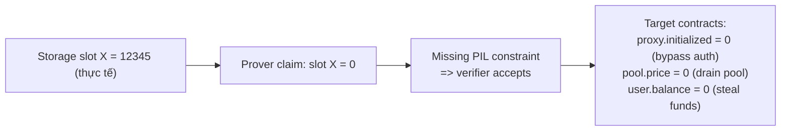

> **Prerequisites**: [[01-intro-taxonomy-zk-exploits|01. Taxonomy]], [[02-under-constrained-dark-forest-bigint|02. Under-constrained Circuits]], kiến trúc zkEVM cơ bản, Halo2 gadget model
> **Objectives**:
> - Hiểu tại sao zkEVM circuits đặc biệt phức tạp và dễ có lỗi
> - Phân tích chi tiết bug modulo overflow trong PSE/Scroll zkEVM: `k*n + r ≡ a (mod 2^256)` không đủ
> - Trace qua Polygon zkEVM: missing remainder constraint trong `divARITH`, storage machine PIL bugs
> - Nắm pattern: missing overflow constraint là lớp lỗi thường gặp nhất trong zkEVM gadgets

---

## Tại sao zkEVM đặc biệt khó bảo mật?

zkEVM phải prove rằng toàn bộ EVM execution trace là đúng — bao gồm hàng trăm opcodes, mỗi opcode có semantics riêng trong 256-bit arithmetic. Mọi opcode đều được triển khai thành một **circuit gadget**, và bất kỳ gadget nào thiếu constraint đều có thể cho phép prover forge state transitions.

PSE & Scroll zkEVM dùng **Halo2** (Zcash fork), viết ~34.000 dòng Rust. Polygon zkEVM dùng **zkASM** (ZK Assembly Language). Cả hai đều là mục tiêu audit chuyên sâu và đều có lỗi được tìm thấy.

> [!definition] Definition 9.1 — zkEVM Gadget Model
> Trong Halo2, một **gadget** là một tập constraints triển khai một phép toán cụ thể (ví dụ: `AddWords`, `MulAddWords`, `ModGadget`). Gadgets có thể **compose** với nhau — output của gadget A làm input của gadget B.
>
> Vấn đề: nếu gadget A có output không được constrain đúng, gadget B nhận input sai nhưng không biết. Lỗi "propagate" qua cả stack.

---

## Case Study 1: PSE & Scroll zkEVM — Modulo Overflow Bug

### Background: MulAddWords Gadget

Để prove `r = a mod n`, circuit PSE/Scroll dùng equation:

$$k \cdot n + r = a$$

với $k$ là quotient. Gadget `MulAddWords` constrain:

$$k \cdot n + r \equiv a \pmod{2^{256}}$$

Vì tất cả values là 256-bit unsigned integers, constraint này kiểm tra phép tính trong $\mathbb{Z}_{2^{256}}$ (arithmetic modulo $2^{256}$).

### Root Cause: Thiếu Overflow Constraint

> [!danger] Vulnerability 9.2 — Modulo Overflow Bug
> Constraint $k \cdot n + r \equiv a \pmod{2^{256}}$ **không đủ** để prove $r = a \bmod n$.
>
> Lý do: nếu $k \cdot n + r > 2^{256}$, phép tính sẽ **overflow** và wrap quanh. Kẻ tấn công có thể chọn $k$ lớn hơn cần thiết sao cho:
>
> $$k \cdot n + r = a + j \cdot 2^{256} \quad \text{(với } j \geq 1\text{)}$$
>
> Lúc đó $k \cdot n + r \equiv a \pmod{2^{256}}$ vẫn đúng, nhưng $r \neq a \bmod n$.

### Ví dụ Cụ thể

Xét statement: `r = 2^255 mod 3`. Thực tế $2^{255} \bmod 3 = 2$ (không phải 0).

Tuy nhiên kẻ tấn công có thể claim `r = 0` và tìm `k` sao cho:
$$k \cdot 3 + 0 \equiv 2^{255} \pmod{2^{256}}$$

$$k \equiv 2^{255} \cdot 3^{-1} \pmod{2^{256}}$$

```python
TWO_256 = 2**256

def modinv(a, m): return pow(a, -1, m)

a = 2**255
n = 3
r_evil = 0  # claimed (false!)
k_evil = (a * modinv(n, TWO_256)) % TWO_256

# Verify: k_evil * n + r_evil ≡ a (mod 2^256)
assert (k_evil * n + r_evil) % TWO_256 == a % TWO_256  # True!

# But actual product overflows:
actual = k_evil * n + r_evil
print(f"k*n+r = {actual}")
print(f"< 2^256? {actual < TWO_256}")   # False — overflow!

# Missing constraint: k*n + r < 2^256 would catch this
```

**Output**: `k*n+r > 2^256` → overflow! Constraint thiếu không bắt được.

### Impact

`MOD` opcode là building block cơ bản của EVM — được dùng trong token balance checks, address derivation, hash functions, và hàng chục opcodes khác. Kẻ tấn công có thể prove sai bất kỳ operation nào có modular arithmetic.



### Fix

```rust
// BUGGY: chỉ check mod 2^256
cs.enforce(|| "k*n+r == a (mod 2^256)",
    |lc| lc + &k_times_n + &r,
    |lc| lc + CS::one(),
    |lc| lc + &a_256,
);

// FIXED: thêm constraint k*n + r < 2^256
// Decompose k*n + r thành high_128 và low_128:
let (high, low) = decompose_256(k * n + r);
cs.enforce(|| "no overflow: high == 0",
    |lc| lc + &high,
    |lc| lc + CS::one(),
    |lc| lc,  // == 0
);
```

---

## Case Study 2: PSE & Scroll zkEVM — SHL/SHR Opcode Bug

Cùng pattern, bài khác: circuit `SHL` (shift left) và `SHR` (shift right) cũng thiếu constraint tương tự. Prover có thể prove sai kết quả của `a << b` hoặc `a >> b` khi intermediate values overflow 256 bits.

> [!warning] Warning 9.3 — Pattern Lặp Lại
> Sau khi fix bug MOD, team phát hiện cùng pattern xuất hiện trong SHL/SHR. Điều này chỉ ra rằng đây là **systematic design issue** — thiếu một invariant quan trọng trong gadget design guidelines, không phải lỗi đơn lẻ.

---

## Case Study 3: Polygon zkEVM — divARITH Missing Remainder Constraint

### Background

Polygon zkEVM dùng `zkASM` (ZK Assembly Language) với các **subroutines**. Subroutine `divARITH` chứng minh phép chia:

```text
divARITH:
  ; Prove: E = A * B + C  (where B = divisor, A = quotient, C = remainder)
  ; A, B, C are free inputs from prover
  A * B + C === E    ; <-- this IS constrained
  ; MISSING: C < B   ; <-- remainder must be less than divisor!
```

> [!danger] Vulnerability 9.4 — divARITH Missing C < B
> Không có constraint `C < B`. Prover có thể dùng:
>
> - $A = q - 1$ (quotient giảm 1)
> - $C = r + B$ (remainder tăng thêm $B$)
>
> Verify: $(q-1) \cdot B + (r+B) = qB + r = E$ ✓
>
> Nhưng $C = r + B \geq B$ → vi phạm "remainder < divisor" invariant.

Chính xác cùng pattern với **BigMod circom-ecdsa trong Lesson 02** nhưng ở context zkEVM.

### Impact

Division và modulo là hai trong số các opcodes phức tạp nhất của EVM. Fake division → fake opcode results → arbitrary wrong state transitions trong zkEVM.

### Fix

```text
divARITH:
  A * B + C === E
  C < B               ; ADD THIS: enforce remainder < divisor
```

---

## Case Study 4: Polygon zkEVM — Storage Machine PIL Bugs (Hexens Audit 2023)

### PIL (Polynomial Identity Language)

Polygon zkEVM dùng PIL để define polynomial constraints cho các state machines. Hexens audit năm 2023 phát hiện 3 lỗi nghiêm trọng liên quan đến storage:

**Bug 1 — Missing constraint trong PIL → Storage value forced to 0**

Storage machine prove việc đọc/ghi storage slots. Một constraint bị thiếu cho phép prover claim **bất kỳ storage slot nào có giá trị 0**, bất kể giá trị thực tế.



**Bug 2 — CTX assignation → Add random ETH to sequencer**

Một lỗi trong context (CTX) assignation của circuit cho phép prover thêm ETH vào sequencer balance mà không cần deposit tương ứng.

**Bug 3 — Missing constraint → Execution flow hijack**

Thiếu constraint trong execution flow proof cho phép prover skip một số opcodes hoặc nhảy đến arbitrary code location.

> [!warning] Khai thác điều kiện
> Tất cả các bugs này yêu cầu **trusted aggregator role** — một role permissioned do Polygon Labs kiểm soát. Tương tự zkSync Era, "training wheels" bảo vệ tạm thời. Bugs được fix trước khi decentralize.

---

## So sánh và Pattern Tổng quát

| Bug | Project | Missing Constraint | Impact |
|-----|---------|-------------------|--------|
| MOD overflow | PSE/Scroll | `k*n+r < 2^256` | Fake modulo results |
| SHL/SHR overflow | PSE/Scroll | Intermediate < 2^256 | Fake shift results |
| divARITH | Polygon | `remainder < divisor` | Fake division results |
| Storage PIL | Polygon | Various PIL constraints | Fake storage reads |
| CTX assignation | Polygon | Context integrity | Inflate sequencer balance |

**Pattern chung**: tất cả đều là **arithmetic overflow constraints bị thiếu** — circuit check phép tính đúng modulo một số lớn nhưng không enforce rằng intermediate values không overflow.

> [!tip] Audit Pattern 9.5 — zkEVM Gadget Audit Checklist
>
> Khi audit một zkEVM gadget:
>
> 1. **Multiplication check**: nếu circuit prove `a * b + c == d`, có thêm constraint `a*b+c < field_size` không?
> 2. **Division check**: nếu prove `a = b*q + r`, có constraint `r < b` (remainder < divisor) không?
> 3. **Shift check**: nếu prove `a << n == result`, có constraint `result < 2^256` không?
> 4. **Composition**: khi gadget A output đưa vào gadget B, đảm bảo output của A là "proper representation" trước khi B nhận.
> 5. **Cross-layer**: PIL, zkASM, Halo2 — tất cả cần review, không chỉ high-level logic.

---

## Bug Bounty Takeaway — Áp dụng vào zkVerify

zkVerify verify proof từ nhiều proof systems, bao gồm các proof liên quan đến EVM state transitions. Khi audit:

1. **Tìm mọi `MulAdd`-style gadgets**: bất cứ đâu có constraint `a*b + c == d`, check xem overflow được handle không.
2. **Modular arithmetic**: với mọi `mod`, `div`, `shl`, `shr` trong circuits — check remainder constraints.
3. **Intermediate value bounds**: trong recursive circuits, check rằng mỗi layer enforce proper bounds trước khi truyền sang layer kế.
4. **Fuzz with overflow inputs**: tạo inputs lớn gần `2^128`, `2^256` và check xem circuit reject không.

---

## Summary / Key Takeaways

- **PSE/Scroll zkEVM**: `MulAddWords` gadget check `k*n+r ≡ a (mod 2^256)` nhưng thiếu `k*n+r < 2^256` → prover prove false modulo results (e.g., claim `0 = 2^255 mod 3`).
- **Polygon zkEVM divARITH**: thiếu `C < B` (remainder < divisor) → fake division results.
- **Polygon zkEVM Storage PIL**: nhiều missing PIL constraints → fake storage reads, inflate balances, execution hijack.
- **Pattern chung**: arithmetic overflow constraints là điểm yếu hệ thống của zkEVM gadgets — không thể chỉ check "phép tính đúng", phải check "không overflow".
- **Training wheels**: cả hai protocol đều có permissioned prover role và withdrawal delays bảo vệ tạm thời — nhưng đây không phải giải pháp lâu dài.

---

## References

- PSE/Scroll zkEVM modulo bug — GitHub Issue #996 — https://github.com/privacy-scaling-explorations/zkevm-circuits/issues/996
- 0xPARC ZK Bug Tracker — #15, #16 PSE/Scroll — https://github.com/0xPARC/zk-bug-tracker
- Hexens Polygon zkEVM audit — 0xPARC Bug Tracker #20, #21, #22
- Verichains: Discovering and Fixing a Critical Vulnerability in Polygon zkEVM — https://blog.verichains.io/p/discovering-and-fixing-a-critical
- Overflow vulnerability in Polygon's zkEVM Storage machine (Georg Wiese) — https://hackmd.io/@georgwiese/SyNgFpCC6
