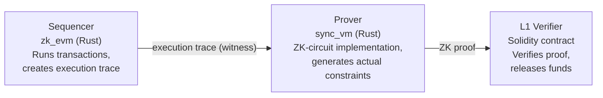
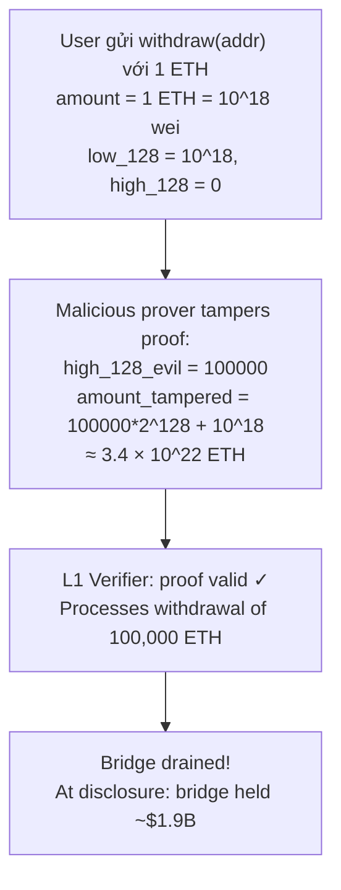

> **Prerequisites**: [[09-zkevm-circuit-bugs-pse-polygon|09. zkEVM Circuit Bugs]], [[05-assigned-not-constrained-tornadocash-maci|05. Assigned but Not Constrained]], kiến trúc zkSync Era EraVM
> **Objectives**:
> - Hiểu cách EraVM (zkSync Era) store và verify 256-bit values qua memory queries
> - Phân tích bug `LinearCombination` trong `sync_vm` — computed nhưng không enforced
> - Trace exploit path từ high bits manipulation đến drain ETH bridge
> - Đánh giá "training wheels" defense và tại sao không đủ lâu dài

---

## Bối cảnh: zkSync Era và EraVM

zkSync Era là zkEVM rollup của Matter Labs. Điểm khác biệt so với PSE/Scroll là zkSync dùng **EraVM** — một VM tùy chỉnh (không phải EVM thuần túy) có một số tối ưu hóa riêng.

EraVM được triển khai trong **hai codebase song song**:



> [!definition] Definition 10.1 — Memory Query trong EraVM
> EraVM represent mọi memory operation (read/write) như **memory queries** — các bản ghi (địa chỉ, giá trị, timestamp). Sau khi execution hoàn tất, circuit verify consistency của tất cả queries: mọi giá trị được đọc phải match giá trị được viết trước đó.
>
> 256-bit values được split thành **high 128 bits** và **low 128 bits** để xử lý trong circuit. Đây là điểm bug.

---

## Root Cause: LinearCombination Không Được Enforce

### LinearCombination Pattern trong Rust Circuits

`sync_vm` dùng một abstraction gọi là `LinearCombination` để build constraints dần dần:

```rust
// Pattern trong sync_vm
let mut lc = LinearCombination::zero();
lc.add_assign(Scalar::one(), high_word_variable);
lc.add_assign(two_to_128_scalar, low_word_variable);
// lc = high * 2^128 + low
// ... nhưng KHÔNG có dòng nào enforce lc vào R1CS!
```

> [!danger] Vulnerability 10.2 — LinearCombination: Computed but Not Enforced
> `LinearCombination` là một **builder object** — nó accumulates terms nhưng chỉ tạo constraint khi được explicitly **finalized** bằng một `cs.enforce(...)` call.
>
> Trong bug này, circuit build `lc = high * 2^128 + low` nhưng **không bao giờ gọi** `cs.enforce_lc_zero(&lc - &stored_value)`. Constraint `high * 2^128 + low == stored_value` không tồn tại trong R1CS.
>
> Hệ quả: prover có thể cung cấp `high` và `low` với **bất kỳ giá trị nào cho high bits**, trong khi vẫn pass tất cả constraints thực sự được enforce.

Đây là biểu hiện của **"Assigned but Not Constrained"** (Lesson 05) nhưng ở tầng Rust circuit library thay vì Circom DSL.

### So sánh với Circom

| | Circom (Lesson 05) | zkSync Era sync_vm |
|-|-------------------|-------------------|
| **Bug** | `=` thay vì `<==` | `lc.add_assign(...)` không có `cs.enforce(...)` |
| **Language** | Circom DSL | Rust + bellman/plonky2 |
| **Consequence** | Output signal unconstrained | LinearCombination unconstrained |
| **Prover freedom** | Set hash output tùy ý | Set high 128 bits tùy ý |

---

## Exploit Path: Từ High Bits đến $1.9B

### Bước 1: Memory Write Tamper

EraVM lưu 256-bit value $V$ vào storage:

```text
V = high_128 * 2^128 + low_128
```

Vì constraint `lc == stored_value` bị thiếu cho high bits, prover có thể tạo proof với:

$$V_{\text{tampered}} = \text{high\_evil} \times 2^{128} + \text{low\_legit}$$

Circuit không phát hiện sự thay đổi ở high 128 bits.

### Bước 2: Target L2EthToken Contract

zkSync Era có một system contract `L2EthToken` xử lý ETH withdrawals:

```solidity
// L2EthToken.sol (simplified)
function withdraw(address _l1Receiver) external payable {
    uint256 amount = msg.value;  // 256-bit value stored in EraVM storage
    // ... emit withdrawal event with amount
    emit Withdrawal(_l1Receiver, amount);
}
```

`amount` được lưu trong EraVM storage như một 256-bit value.

### Bước 3: Inflate Withdrawal Amount



### PoC Python (Minh họa)

```python
WORD_SIZE = 2**128

# Legitimate withdrawal
high_legit, low_legit = 0, 10**18  # 1 ETH
amount_legit = high_legit * WORD_SIZE + low_legit
print(f"Legitimate withdrawal: {amount_legit} wei = 1 ETH")

# Tampered proof: change high bits
high_evil = 100_000  # arbitrary large value
amount_tampered = high_evil * WORD_SIZE + low_legit

print(f"Tampered withdrawal: {amount_tampered} wei")
print(f"≈ {amount_tampered / 10**18:.2e} ETH")
print(f"High bits NOT constrained => circuit accepts tampered proof")
# Output: ≈ 3.40e+22 ETH — impossibly large
```

ChainLight thực sự tạo một PoC proof claim 100,000 ETH withdrawal từ 1 ETH deposit và verify rằng L1 contract sẽ accept nó (trên mainnet fork trước khi patch).

---

## "Training Wheels": Tại sao Bug Không Bị Khai thác

Tại thời điểm disclosure, zkSync Era có ba lớp bảo vệ bổ sung:

> [!warning] Warning 10.3 — Training Wheels Không Phải Giải Pháp Vĩnh Viễn
>
> **Layer 1 — Permissioned prover**: Chỉ Matter Labs mới có thể submit proofs lên L1. Kẻ tấn công cần private key của validator.
>
> **Layer 2 — 21-hour withdrawal delay**: Sau khi proof được submit, có 21 giờ trước khi withdrawal finalized. Đủ thời gian để Matter Labs phát hiện và pause contract.
>
> **Layer 3 — Active monitoring**: Matter Labs monitor bridge transactions.
>
> ChainLight researcher Tim Becker: *"Training wheels are not something that can be relied upon in perpetuity because they compromise a protocol and its ambitions in other ways."*
>
> Khi zkSync decentralize prover role (điều kiện tất yếu để đạt trustless), Layer 1 sẽ bị bỏ. Bug phải được fix trước đó.

### Timeline

| Ngày | Sự kiện |
|------|---------|
| Sep 15, 2023 | ChainLight phát hiện bug |
| Sep 19, 2023 | Report tới Matter Labs |
| Sep ~20, 2023 | Fix deployed (nhanh!) |
| Nov 3, 2023 | Public disclosure |
| Nov 3, 2023 | ChainLight nhận 50K USDC bounty |

First bug bounty được claim cho ZK-circuit bug trong zkSync Era.

---

## Fix

```rust
// BUGGY sync_vm code:
let mut lc = LinearCombination::zero();
lc.add_assign(Scalar::one(), high_word);
lc.add_assign(two_128_scalar, low_word);
// lc chứa: high * 2^128 + low
// ... nhưng KHÔNG enforce!

// FIXED:
let mut lc = LinearCombination::zero();
lc.add_assign(Scalar::one(), high_word);
lc.add_assign(two_128_scalar, low_word);
// Thêm enforcement:
cs.enforce(
    || "high * 2^128 + low == stored_value",
    |lc| lc.clone(),
    |lc| lc + CS::one(),
    |lc| lc + &stored_value,
);
// Bây giờ: high * 2^128 + low == stored_value trong R1CS
```

---

## ChainLight's Discovery Method

ChainLight có background xây dựng **Relic Protocol** — một ZK protocol dùng circuit libraries của Matter Labs. Khi implement circuits riêng, họ đã gặp cùng `LinearCombination` footgun này.

Khi bắt đầu review zkSync Era circuits, **đây là pattern đầu tiên họ tìm kiếm**. Điều này minh họa tầm quan trọng của:

1. **Security researcher specialization**: hiểu sâu một framework → phát hiện nhanh pattern lỗi
2. **Cross-project knowledge transfer**: bug trong Relic Protocol → alert khi review zkSync Era

---

## Liên hệ với zkVerify

zkVerify verify Groth16 và các proofs từ EraVM-compatible chains. Khi audit:

1. **LinearCombination pattern**: trong bất kỳ Rust circuit library nào (bellman, arkworks, halo2), tìm các nơi build `LinearCombination` hoặc tương tự mà không có `enforce()` call tương ứng.
2. **256-bit value splitting**: bất cứ đâu 256-bit value được split thành hai 128-bit halves, đảm bảo constraint `high * 2^128 + low == original` được enforce.
3. **Withdrawal path**: trace toàn bộ withdrawal flow từ L2 state đến L1 verification — mọi giá trị phải được constrain end-to-end.
4. **"Builder pattern" footgun**: trong bất kỳ circuit library nào dùng builder pattern (không chỉ Rust), mọi "accumulated computation" phải được finalized thành constraint.

---

## Summary / Key Takeaways

- **zkSync Era bug**: `LinearCombination` trong `sync_vm` accumulate `high * 2^128 + low` nhưng **không finalize thành R1CS constraint** → prover tự do set high 128 bits của mọi stored value.
- **Exploit**: tamper high bits của `amount` trong ETH withdrawal → claim 100,000 ETH từ 1 ETH deposit → proof accepted by L1 verifier.
- **$1.9B at risk**: zkSync bridge held ~$1.9B ETH tại thời điểm disclosure.
- **Training wheels**: permissioned prover + 21h delay + monitoring bảo vệ tạm thời, nhưng không phải giải pháp lâu dài.
- **Fix**: thêm `cs.enforce(...)` call để finalize LinearCombination thành R1CS constraint.
- **Discovery**: ChainLight biết pattern này từ kinh nghiệm xây dựng Relic Protocol → đây là **pattern đầu tiên** họ check khi review zkSync Era.
- **Pattern**: đây là "Assigned but Not Constrained" (Lesson 05) ở tầng Rust circuit library — không phải chỉ trong Circom DSL.

---

## References

- ChainLight blog: Uncovering a ZK-EVM Soundness Bug in zkSync Era — https://medium.com/chainlight/uncovering-a-zk-evm-soundness-bug-in-zksync-era-f3bc1b2a66d8
- ChainLight PoC repo — https://github.com/chainlight-io/zksync-era-write-query-poc
- Blockworks coverage — https://blockworks.co/news/exploit-bug-zksync-matter-labs
- Immunefi: zkSync Lite separate bug (LonelySloth, $200K) — https://medium.com/immunefi/zksync-insufficient-proof-verification-bugfix-review-dcd57944d0e2
- A Practical Guide to Finding Soundness Bugs in ZK Circuits (Bernhard Mueller) — https://muellerberndt.medium.com/finding-soundness-bugs-in-zk-circuits-ea23387a0e1e
