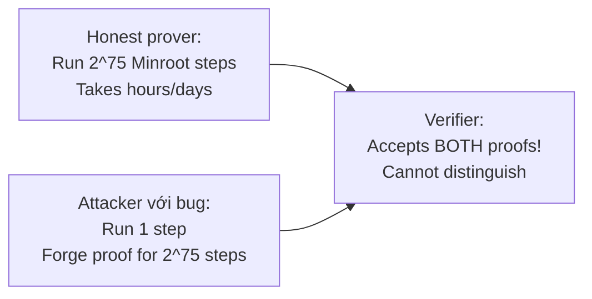
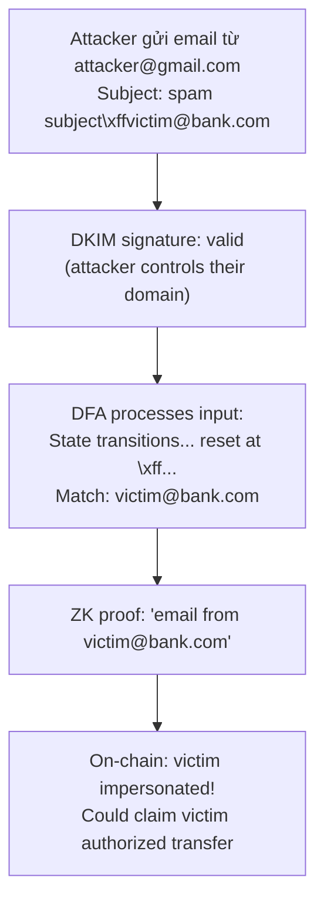
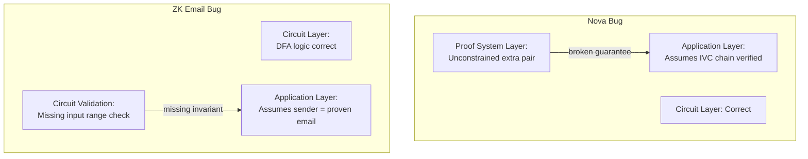

> **Prerequisites**: [[01-intro-taxonomy-zk-exploits|01. Taxonomy]], [[09-zkevm-circuit-bugs-pse-polygon|09. zkEVM Circuit Bugs]], khái niệm IVC (Incrementally Verifiable Computation), folding schemes sơ bộ
> **Objectives**:
> - Hiểu mô hình IVC và tại sao 2-cycle Nova implementation có extra unconstrained R1CS instance
> - Trace qua exploit: forge proof cho $2^{75}$ Minroot VDF steps trong 1.46 giây
> - Phân tích ZK Email DFA bypass: inject `\xff` để reset regex state machine
> - Nắm pattern "cross-layer attack" — bug ở một layer phá vỡ security ở layer khác

---

## Giới thiệu: Cross-layer Attack Patterns

Series này đã đi qua nhiều lớp bugs: circuit-level (Lessons 02–05), verifier-level (Lesson 06), Fiat-Shamir (Lesson 07), trusted setup (Lesson 08), zkEVM gadgets (Lessons 09–10). Một pattern nguy hiểm đặc biệt là khi **lỗi ở một layer vô hiệu hóa security của toàn bộ stack**, dù các layer khác được implement đúng.

Bài này phân tích hai ví dụ: **Nova folding bug** (lỗi ở proof system layer tác động lên IVC chain) và **ZK Email DFA bypass** (lỗi ở circuit validation layer tác động lên application-level identity claims).

---

## Case Study 1: Nova Folding Bug (Nguyen, Boneh, Setty 2023)

### Background: Nova IVC và 2-Cycle

**Nova** (Kothapalli, Setty, Tzialla, CRYPTO'22) là recursive proof system dựa trên **folding scheme** — thay vì dùng SNARK để verify SNARK recursively, Nova "fold" hai R1CS instances thành một.

> [!definition] Definition 11.1 — Folding Scheme
> Cho hai R1CS instance-witness pairs $(u_1, w_1)$ và $(u_2, w_2)$, một **folding scheme** tạo ra một pair $(u, w)$ sao cho:
>
> $$\text{checking}(u_1, w_1) \text{ AND } (u_2, w_2) \equiv \text{checking}(u, w)$$
>
> **IVC** dùng folding để chứng minh $y = F^{(n)}(x)$ — áp dụng hàm $F$ đúng $n$ lần — bằng cách fold mỗi bước vào accumulated instance.

Paper gốc của Nova dùng **single elliptic curve**. Tuy nhiên, implementation của Microsoft dùng **2-cycle of curves** (Pallas + Vesta) để tối ưu performance — vì elliptic curve operations trong circuit $F$ trên curve 1 có thể được compute efficiently trên curve 2.

> [!danger] Vulnerability 11.2 — Extra Unconstrained R1CS Instance
> 2-cycle Nova IVC proof $\pi_i$ chứa một **extra R1CS instance-witness pair** $(u^{(2)}, w^{(2)})$ không được verifier **sufficiently constrain**.
>
> Specifically: pair này tồn tại để "close the loop" giữa hai curves, nhưng khi thiếu constraint, prover có thể cung cấp bất kỳ $(u^{(2)}, w^{(2)})$ hợp lệ nào — kể cả pair "trivial" không encode bất kỳ computation nào.
>
> Hậu quả: prover có thể claim đã run $n$ steps của IVC nhưng thực ra chỉ run $1$ step, và verifier không phát hiện.

### Exploit: Minroot VDF Forgery

Nhóm tác giả đã demonstrate attack bằng **Minroot VDF** (Verifiable Delay Function) — một primitive yêu cầu sequential computation $2^{75}$ steps:



**Kết quả thực nghiệm**: forged proof cho $2^{75}$ Minroot rounds trong **1.46 giây** trên laptop thông thường — trong khi honest prover cần hàng giờ.

### Root Cause Chi Tiết

Trong 2-cycle Nova, IVC proof $\pi_{i+1}$ bao gồm:
1. Folded instance $u_{\text{fold}}$ (trên curve 1) — **được constrain đúng**
2. Extra instance $u^{(2)}$ (trên curve 2) — **không đủ constraint**

Prover có thể đặt $u^{(2)}$ thành "trivial" instance (all-zero witness) mà vẫn pass verification. Điều này cho phép skip toàn bộ IVC chain.

### Fix

> [!tip] Fix 11.3 — Modified 2-Cycle Nova
> Nguyen, Boneh, Setty trình bày hệ thống modified: **loại bỏ hoàn toàn extra R1CS instance** khỏi IVC proof.
>
> Điều thú vị: modified system không chỉ **bảo mật hơn** mà còn **hiệu quả hơn** — ít constraints hơn, proof nhỏ hơn. Microsoft Nova repo đã update theo paper này.

---

## Case Study 2: ZK Email — DFA State Machine Bypass

### Background: ZK Email và DKIM

ZK Email cho phép prove properties của email (sender, subject, content) on-chain mà không reveal toàn bộ nội dung. Cơ chế:

1. Email có **DKIM signature** — digital signature bởi sender's domain trên email headers
2. ZK circuit verify DKIM signature + extract desired fields qua **regex matching**
3. Regex được compile thành **DFA circuit** trong Circom

### ZK Regex DFA: Cách Hoạt Động

DFA (Deterministic Finite Automaton) được encode thành constraints: mỗi character input drive một state transition. Nếu DFA kết thúc ở **accept state**, regex match thành công.

ZK regex compiler inject `255` (decimal, tức `\xff` byte) làm **sentinel character** đánh dấu start of string:

```text
in[0] = 255  (sentinel — marks beginning)
in[1] = msg[0]  (first real character)
in[2] = msg[1]
...
```

### Root Cause: Input Range Không Được Constrain

> [!danger] Vulnerability 11.4 — ZK Email DFA Bypass
> Circuit không constrain rằng `msg[i] < 255`. Kẻ tấn công có thể inject `\xff` (= 255) ở bất kỳ vị trí nào trong input.
>
> Khi DFA gặp `\xff` giữa chuỗi, nó **reset về start state** (vì `\xff` là "start of string" sentinel). Mọi characters sau `\xff` được process như thể là đầu chuỗi mới.
>
> Regex bypass: attacker craft chuỗi `[garbage]\xff[target_email]` — DFA cuối cùng match trên `[target_email]` mà ignore phần `[garbage]` trước đó.

### Exploit: Email Spoofing



**Impact thực tế**: Bất kỳ application nào dùng ZK Email để verify "email từ địa chỉ X" có thể bị bypass — kẻ tấn công giả mạo danh tính bất kỳ email address.

### PoC Attack String

```python
# Attacker muốn impersonate victim@bank.com
# Gửi email từ attacker@gmail.com với subject:
attack_subject = "normal content" + "\xff" + "victim@bank.com"
#                                    ^---  DFA reset here!

# DFA sẽ process:
# ... (match fails) ...
# gặp \xff  =>  reset to start state
# "victim@bank.com"  =>  match thành công!

# Circuit không check: msg[i] < 255 cho mọi i
# => \xff có thể xuất hiện bất kỳ đâu trong input
```

### Fix

```circom
// FIX: Thêm range check cho tất cả input characters
signal in_range_checks[msg_bytes];
in[0] <== 255;  // sentinel vẫn ở đầu
for (var i = 0; i < msg_bytes; i++) {
    // Enforce msg[i] < 255 (không phải sentinel)
    in_range_checks[i] <== LessThan(8)([msg[i], 255]);
    in_range_checks[i] === 1;
    in[i+1] <== msg[i];
}
```

---

## Pattern Tổng quát: Cross-layer Security

Cả hai bugs minh họa một principle quan trọng:

> [!definition] Definition 11.5 — Cross-layer Security Invariant
> Mỗi layer trong ZK stack phải **không chỉ đúng về logic mà còn phải enforce các invariants** mà các layer khác phụ thuộc vào.
>
> **Nova case**: IVC chain giả định extra pair được constrain bởi proof system — nhưng proof system layer không enforce điều này.
>
> **ZK Email case**: Application layer giả định `\xff` không xuất hiện trong user input — nhưng circuit layer không constrain điều này.



### Audit Checklist — Cross-layer

> [!tip] Audit Pattern 11.6 — Cross-layer Security Checklist
>
> **Cho mỗi security property P mà application cần**:
>
> 1. **Identify which layer enforces P**: circuit, proof system, smart contract?
> 2. **Verify the enforcement is explicit**: có constraint/check tường minh không hay chỉ là assumption?
> 3. **Trace P from application back to circuit**: end-to-end, không gap?
> 4. **Check implicit contracts**: layers nào assume gì từ layers khác? Assumption có được enforce không?
>
> Với IVC/recursive systems đặc biệt:
> 5. **Verify base case**: IVC chain bắt đầu đúng không?
> 6. **Verify inductive step**: mỗi fold step có preserve invariant không?
> 7. **Verify extra elements**: nếu proof chứa multiple instances, tất cả đều được constrain?

---

## Bug Bounty Takeaway — Áp dụng vào zkVerify

zkVerify verify proofs từ nhiều systems, bao gồm recursive/IVC proofs (Plonky2, Nova). Khi audit:

1. **Với recursive circuits**: đảm bảo tất cả "accumulated state" hay "running instance" đều được explicitly constrain, không chỉ được tạo ra.
2. **Với regex/parser circuits**: tất cả input characters phải được range-checked trước khi feed vào DFA/parser.
3. **Với ZK Email patterns**: check `msg[i] < 255` invariant là mandatory, không optional.
4. **Với Nova/folding**: check xem extra R1CS instances có được constrain đủ không — dùng bản codebase đã fix (sau paper 2023/969).

---

## Summary / Key Takeaways

- **Nova 2-cycle bug**: extra R1CS instance-witness pair trong IVC proof không được sufficiently constrain → prover forge proof cho $2^{75}$ steps trong 1.46s. Fix: loại bỏ extra pair, formal proof of modified system.
- **ZK Email DFA bypass**: input không constrained `< 255` → attacker inject `\xff` để reset DFA → spoof email identity. Fix: explicit `LessThan(8)` range check cho mọi character.
- **Cross-layer pattern**: bug ở một layer phá vỡ security assumptions của layer khác. Phòng ngừa: trace security properties end-to-end, không chỉ verify từng layer độc lập.
- **Responsible disclosure**: cả hai bug được tìm và fix trước khi exploit (Nova) hoặc có mức độ tác động giới hạn (ZK Email).

---

## References

- Nguyen, Boneh, Setty: Revisiting the Nova Proof System on a Cycle of Curves (IACR 2023/969) — https://eprint.iacr.org/2023/969
- Microsoft Nova GitHub — https://github.com/microsoft/Nova
- 0xPARC ZK Bug Tracker — #27 ZK Email — https://github.com/0xPARC/zk-bug-tracker
- ZK Email audit (zkSecurity) — https://zk.email/blog-media/zkemail-audit/zksecurity-audit-report.pdf
